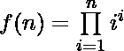

# 计算(1^1)*(2^2)*(3^3)*(4^4)*)中尾随零的数量..

> 原文:[https://www . geesforgeks . org/count-11223344 中尾随零的数量/](https://www.geeksforgeeks.org/count-number-of-trailing-zeros-in-11223344/)

给定一个整数 **n** ，任务是在函数中找到尾随零的个数，即**f(n)= 1<sup>1</sup>* 2<sup>2</sup>* 3<sup>3</sup>*……* n<sup>n</sup>**。

**示例:**

> **输入:** n = 5
> **输出:**5
> f(5)= 1<sup>1</sup>* 2<sup>2</sup>* 3<sup>3</sup>* 4<sup>4</sup>* 5<sup>5</sup>= 1 * 4 * 27 * 256 * 3125 = 86400000
> 
> **输入:**n = 12
> T3】输出: 15

**方法:**我们知道 **5 * 2 = 10** 即 1 尾随零是单个 5 和单个 2 相乘的结果。所以，如果我们有 **x** 数量的 **5** 和 **y** 数量的 **2** ，那么尾随零的数量将是 **min(x，y)** 。
现在，对于系列中的每一个数字 **i** ，我们需要统计其因子中的 **2** 和 **5** 表示 **x** 和 **y** 但是 **2s** 和 **5s** 的数量将分别为 **x * i** 和 **y * i** ，因为在系列【T33 统计完整系列中 **2s** 和 **5s** 的数量，并打印出其中最少的一个，即所需答案。

下面是上述方法的实现:

## C++

```
// C++ implementation of the approach
#include <bits/stdc++.h>
using namespace std;

// Function to return the number of
// trailing zeros
int trailing_zeros(int N)
{

    // To store the number of 2s and 5s
    int count_of_two = 0, count_of_five = 0;

    for (int i = 1; i <= N; i++) {

        int val = i;

        while (val % 2 == 0 && val > 0) {
            val /= 2;

            // If we get a factor 2 then we
            // have i number of 2s because
            // the power of the number is
            // raised to i
            count_of_two += i;
        }

        while (val % 5 == 0 && val > 0) {
            val /= 5;

            // If we get a factor 5 then
            // we have i number of 5s
            // because the power of the
            // number is raised to i
            count_of_five += i;
        }
    }

    // Take the minimum of them
    int ans = min(count_of_two, count_of_five);

    return ans;
}

// Driver code
int main()
{
    int N = 12;

    cout << trailing_zeros(N);

    return 0;
}
```

## Java 语言(一种计算机语言，尤用于创建网站)

```
// Java implementation of the approach

class GFG
{

// Function to return the number of
// trailing zeros
static int trailing_zeros(int N)
{

    // To store the number of 2s and 5s
    int count_of_two = 0, count_of_five = 0;

    for (int i = 1; i <= N; i++)
    {
        int val = i;
        while (val % 2 == 0 && val > 0)
        {
            val /= 2;

            // If we get a factor 2 then we
            // have i number of 2s because
            // the power of the number is
            // raised to i
            count_of_two += i;
        }

        while (val % 5 == 0 && val > 0)
        {
            val /= 5;

            // If we get a factor 5 then
            // we have i number of 5s
            // because the power of the
            // number is raised to i
            count_of_five += i;
        }
    }

    // Take the minimum of them
    int ans = Math.min(count_of_two, count_of_five);

    return ans;
}

// Driver code
public static void main (String[] args)
{
    int N = 12;
    System.out.println(trailing_zeros(N));
}
}

// This code is contributed by chandan_jnu
```

## 蟒蛇 3

```
# Python 3 implementation of the approach

# Function to return the number of
# trailing zeros
def trailing_zeros(N):

    # To store the number of 2s and 5s
    count_of_two = 0
    count_of_five = 0

    for i in range(1, N + 1, 1):
        val = i

        while (val % 2 == 0 and val > 0):
            val /= 2

            # If we get a factor 2 then we
            # have i number of 2s because
            # the power of the number is
            # raised to i
            count_of_two += i

        while (val % 5 == 0 and val > 0):
            val /= 5

            # If we get a factor 5 then we
            # have i number of 5s because
            # the power of the number is
            # raised to i
            count_of_five += i

    # Take the minimum of them
    ans = min(count_of_two, count_of_five)

    return ans

# Driver code
if __name__ == '__main__':
    N = 12

    print(trailing_zeros(N))

# This code is contributed by
# Sanjit_Prasad
```

## C#

```
// C# implementation of the above approach
using System;

class GFG
{

    // Function to return the number of
    // trailing zeros
    static int trailing_zeros(int N)
    {

        // To store the number of 2s and 5s
        int count_of_two = 0, count_of_five = 0;

        for (int i = 1; i <= N; i++)
        {
            int val = i;
            while (val % 2 == 0 && val > 0)
            {
                val /= 2;

                // If we get a factor 2 then we
                // have i number of 2s because
                // the power of the number is
                // raised to i
                count_of_two += i;
            }

            while (val % 5 == 0 && val > 0)
            {
                val /= 5;

                // If we get a factor 5 then
                // we have i number of 5s
                // because the power of the
                // number is raised to i
                count_of_five += i;
            }
        }

        // Take the minimum of them
        int ans = Math.Min(count_of_two, count_of_five);

        return ans;
    }

    // Driver code
    public static void Main()
    {
        int N = 12;
        Console.WriteLine(trailing_zeros(N));
    }
}

// This code is contributed by Ryuga
```

## 服务器端编程语言（Professional Hypertext Preprocessor 的缩写）

```
<?php
// PHP implementation of the approach

// Function to return the number of
// trailing zeros
function trailing_zeros($N)
{

    // To store the number of 2s and 5s
    $count_of_two = 0;
    $count_of_five = 0;

    for ($i = 1; $i <= $N; $i++)
    {
        $val = $i;

        while ($val % 2 == 0 && $val > 0)
        {
            $val /= 2;

            // If we get a factor 2 then we
            // have i number of 2s because
            // the power of the number is
            // raised to i
            $count_of_two += $i;
        }

        while ($val % 5 == 0 && $val > 0)
        {
            $val /= 5;

            // If we get a factor 5 then
            // we have i number of 5s
            // because the power of the
            // number is raised to i
            $count_of_five += $i;
        }
    }

    // Take the minimum of them
    $ans = min($count_of_two, $count_of_five);

    return $ans;
}

// Driver code
$N = 12;
echo trailing_zeros($N);

// This code is contributed by ita_c
?>
```

## java 描述语言

```
<script>

// Javascript implementation of the approach

// Function to return the number of
// trailing zeros
function trailing_zeros(N)
{

    // To store the number of 2s and 5s
    let count_of_two = 0, count_of_five = 0;

    for(let i = 1; i <= N; i++)
    {
        let val = i;

        while (val % 2 == 0 && val > 0)
        {
            val = parseInt(val / 2);

            // If we get a factor 2 then we
            // have i number of 2s because
            // the power of the number is
            // raised to i
            count_of_two += i;
        }

        while (val % 5 == 0 && val > 0)
        {
            val = parseInt(val / 5);

            // If we get a factor 5 then
            // we have i number of 5s
            // because the power of the
            // number is raised to i
            count_of_five += i;
        }
    }

    // Take the minimum of them
    let ans = Math.min(count_of_two,
                       count_of_five);

    return ans;
}

// Driver code
let N = 12;

document.write(trailing_zeros(N));

// This code is contributed by subhammahato348

</script>
```

**Output:** 

```
15
```

**时间复杂度:**O(N *(log<sub>2</sub>N+log<sub>5</sub>N))

**辅助空间:** O(1)