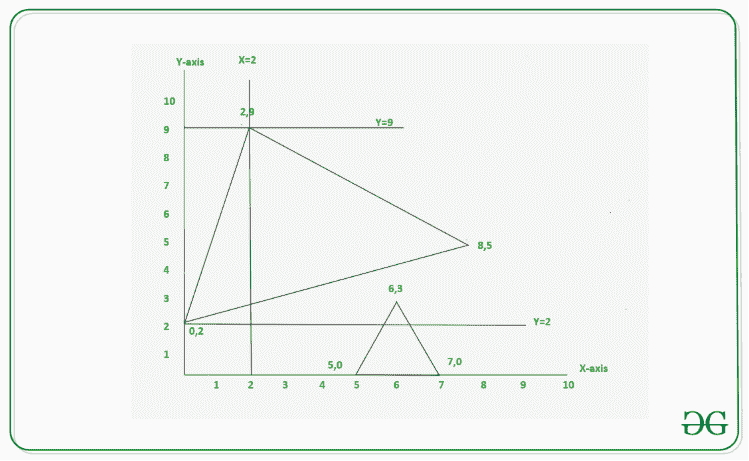

# 计算由给定的水平和垂直线段切割的三角形数量

> 原文:[https://www . geesforgeks . org/count-三角形数量-按给定的水平和垂直线段切割/](https://www.geeksforgeeks.org/count-number-of-triangles-cut-by-the-given-horizontal-and-vertical-line-segments/)

给定由形式为 **{x1，y1，x2，y2，x3，y3}** 的 **N** 个三角形组成的[个](https://www.geeksforgeeks.org/introduction-to-arrays/) **三角形数组[][]** ，以及由形式为**“X = X”**或**“Y = Y”**的 **M** 条水平线和垂直线组成的表示线段方程式的**个**。任务是打印每个切口相交的三角形数量，使三角形的左右部分的面积大于零。

**示例:**

> **输入:** N = 2，三角形[][] = {{0，2，2，9，8，5}，{5，0，6，3，7，0}}，M = 3，切割[]= {“X = 2”，“Y=2”，“Y = 9”}
> **输出:** 1 1 0
> **解释:**
> X = 2 处的切割将具有顶点(0，2)、(2，9)和(8，5)
> 的第一个三角形分开
> 
> [](https://media.geeksforgeeks.org/wp-content/uploads/20201022123241/UntitledDiagram5.png)
> 
> **输入:** N = 2，三角形[][] = {{0，2，2，9，8，5}}，M = 3，切割[]= {“X = 7”，“Y=7”，“X = 9”}
> **输出:** 1 1 0
> **解释:**
> X = 2 处的切割分割具有顶点(0，2)、(2，9)和(8，5)
> Y = 2 处的切割分割具有顶点(5，5)的第二个三角形

**方法:**下面是线段将三角形分成两个面积非零的部分的条件:

*   如果在 **X 轴**上进行切割，并且该切割严格地位于三角形的最小和最大 **X 坐标**之间，则该切割以这样的方式分割三角形，即左和右部分的面积应该大于零。
*   类似地，如果在 **Y 轴**上进行切割，并且该切割严格地位于三角形的最小和最大 **Y 坐标**之间，则该切割以这样的方式分割三角形，即左和右部分的面积应该大于零。

按照以下步骤解决问题:

1.  创建一个[结构](https://www.geeksforgeeks.org/structures-c/)来存储每个三角形的最大和最小 **X** 和 **Y** 坐标。
2.  [穿越阵](https://www.geeksforgeeks.org/c-program-to-traverse-an-array/)T2【切】阵超范围**【0，M–1】**。
3.  对于每次切割，用 **0** 初始化一个计数器**计数**，以存储当前切割的答案，并开始从 **j = 0 到 N–1**遍历**三角形【】**数组。
4.  检查每个三角形，**切口【I】**的形式为 **X=x** 即垂直切口， **x** 严格位于**I<sup>th</sup>T11】三角形的最大和最小 **X** 坐标之间，递增计数器**计数**否则继续检查每个切口的其他三角形。**
5.  计算**切割【I】**的答案后，打印**计数**。
6.  对每次切割重复上述步骤，并打印每条线切割的三角形数量。

下面是上述方法的实现:

## C++

```
// C++ program for the above approach

#include <bits/stdc++.h>
using namespace std;

// Store the minimum and maximum
// X and Y coordinates
struct Tri {
    int MinX, MaxX, MinY, MaxY;
};

// Function to convert string to int
int StringtoInt(string s)
{
    stringstream geek(s);

    int x;
    geek >> x;

    return x;
}

// Function to print the number of
// triangles cut by each line segment
int TriangleCuts(
    vector<vector<int> > Triangle,
    string Cuts[], int N, int M, int COL)
{

    // Initialize Structure
    Tri Minimized[N];

    // Find maximum and minimum X and Y
    // coordinates for each triangle
    for (int i = 0; i < N; i++) {
        int x1 = Triangle[i][0];
        int y1 = Triangle[i][1];
        int x2 = Triangle[i][2];
        int y2 = Triangle[i][3];
        int x3 = Triangle[i][4];
        int y3 = Triangle[i][5];

        // Minimum X
        Minimized[i].MinX
            = min({ x1, x2, x3 });

        // Maximum X
        Minimized[i].MaxX
            = max({ x1, x2, x3 });

        // Minimum Y
        Minimized[i].MinY
            = min({ y1, y2, y3 });

        // Maximum Y
        Minimized[i].MaxY
            = max({ y1, y2, y3 });
    }

    // Traverse each cut from 0 to M-1
    for (int i = 0; i < M; i++) {

        string Cut = Cuts[i];

        // Store number of triangles cut
        int CutCount = 0;

        // Extract value from the line
        // segment string
        int CutVal = StringtoInt(
            Cut.substr(2, Cut.size()));

        // If cut is made on X-axis
        if (Cut[0] == 'X') {

            // Check for each triangle
            // if x lies b/w max and
            // min X coordinates
            for (int j = 0; j < N; j++) {

                if ((Minimized[j].MinX)
                        < (CutVal)
                    && (Minimized[j].MaxX)
                           > (CutVal)) {
                    CutCount++;
                }
            }
        }

        // If cut is made on Y-axis
        else if (Cut[0] == 'Y') {

            // Check for each triangle
            // if y lies b/w max and
            // min Y coordinates
            for (int j = 0; j < N; j++) {
                if ((Minimized[j].MinY)
                        < (CutVal)
                    && (Minimized[j].MaxY)
                           > (CutVal)) {
                    CutCount++;
                }
            }
        }

        // Print answer for ith cut
        cout << CutCount << " ";
    }
}

// Driver Code
int main()
{
    // Given coordinates of triangles
    vector<vector<int> > Triangle
        = { { 0, 2, 2, 9, 8, 5 },
            { 5, 0, 6, 3, 7, 0 } };

    int N = Triangle.size();

    int COL = 6;

    // Given cuts of lines
    string Cuts[] = { "X=2", "Y=2", "Y=9" };
    int M = sizeof(Cuts) / sizeof(Cuts[0]);

    // Function Call
    TriangleCuts(Triangle, Cuts,
                 N, M, COL);

    return 0;
}
```

## Java 语言(一种计算机语言，尤用于创建网站)

```
// Java program for the above approach
import java.util.*;

class GFG{

// Store the minimum and maximum
// X and Y coordinates
static class Tri
{
    int MinX, MaxX, MinY, MaxY;
};

// Function to convert String to int
static int StringtoInt(String s)
{
    return Integer.valueOf(s);
}

static int min(int a, int b, int c)
{
    return Math.min(a, Math.min(b, c));
}

static int max(int a, int b, int c)
{
    return Math.max(a, Math.max(b, c));
}

// Function to print the number of
// triangles cut by each line segment
static void TriangleCuts(int[][] Triangle,
          String Cuts[], int N, int M, int COL)
{

    // Initialize Structure
    Tri []Minimized = new Tri[N];
    for(int i = 0; i < N; i++)
    {
        Minimized[i] = new Tri();
        Minimized[i].MaxX = 0;
        Minimized[i].MaxY = 0;
        Minimized[i].MinX = 0;
        Minimized[i].MinY = 0;
    }

    // Find maximum and minimum X and Y
    // coordinates for each triangle
    for(int i = 0; i < N; i++)
    {
        int x1 = Triangle[i][0];
        int y1 = Triangle[i][1];
        int x2 = Triangle[i][2];
        int y2 = Triangle[i][3];
        int x3 = Triangle[i][4];
        int y3 = Triangle[i][5];

        // Minimum X
        Minimized[i].MinX = min(x1, x2, x3);

        // Maximum X
        Minimized[i].MaxX = max(x1, x2, x3);

        // Minimum Y
        Minimized[i].MinY = min(y1, y2, y3);

        // Maximum Y
        Minimized[i].MaxY = max(y1, y2, y3);
    }

    // Traverse each cut from 0 to M-1
    for(int i = 0; i < M; i++)
    {
        String Cut = Cuts[i];

        // Store number of triangles cut
        int CutCount = 0;

        // Extract value from the line
        // segment String
        int CutVal = StringtoInt(
            Cut.substring(2, Cut.length()));

        // If cut is made on X-axis
        if (Cut.charAt(0) == 'X')
        {

            // Check for each triangle
            // if x lies b/w max and
            // min X coordinates
            for(int j = 0; j < N; j++)
            {

                if ((Minimized[j].MinX) < (CutVal) &&
                    (Minimized[j].MaxX) > (CutVal))
                {
                    CutCount++;
                }
            }
        }

        // If cut is made on Y-axis
        else if (Cut.charAt(0) == 'Y')
        {

            // Check for each triangle
            // if y lies b/w max and
            // min Y coordinates
            for(int j = 0; j < N; j++)
            {
                if ((Minimized[j].MinY) < (CutVal) &&
                    (Minimized[j].MaxY) > (CutVal))
                {
                    CutCount++;
                }
            }
        }

        // Print answer for ith cut
        System.out.print(CutCount + " ");
    }
}

// Driver Code
public static void main(String[] args)
{

    // Given coordinates of triangles
    int[][] Triangle = { { 0, 2, 2, 9, 8, 5 },
                         { 5, 0, 6, 3, 7, 0 } };

    int N = Triangle.length;

    int COL = 6;

    // Given cuts of lines
    String Cuts[] = { "X=2", "Y=2", "Y=9" };
    int M = Cuts.length;

    // Function Call
    TriangleCuts(Triangle, Cuts,
                 N, M, COL);
}
}

// This code is contributed by Princi Singh
```

## C#

```
// C# program for the above approach
using System;

class GFG{

// Store the minimum and maximum
// X and Y coordinates
public class Tri
{
    public int MinX, MaxX, MinY, MaxY;
};

// Function to convert String to int
static int StringtoInt(String s)
{
    return Int32.Parse(s);
}

static int min(int a, int b, int c)
{
    return Math.Min(a, Math.Min(b, c));
}

static int max(int a, int b, int c)
{
    return Math.Max(a, Math.Max(b, c));
}

// Function to print the number of
// triangles cut by each line segment
static void TriangleCuts(int[,] Triangle,
                         String []Cuts,
                         int N, int M,
                         int COL)
{

    // Initialize Structure
    Tri []Minimized = new Tri[N];
    for(int i = 0; i < N; i++)
    {
        Minimized[i] = new Tri();
        Minimized[i].MaxX = 0;
        Minimized[i].MaxY = 0;
        Minimized[i].MinX = 0;
        Minimized[i].MinY = 0;
    }

    // Find maximum and minimum X and Y
    // coordinates for each triangle
    for(int i = 0; i < N; i++)
    {
        int x1 = Triangle[i, 0];
        int y1 = Triangle[i, 1];
        int x2 = Triangle[i, 2];
        int y2 = Triangle[i, 3];
        int x3 = Triangle[i, 4];
        int y3 = Triangle[i, 5];

        // Minimum X
        Minimized[i].MinX = min(x1, x2, x3);

        // Maximum X
        Minimized[i].MaxX = max(x1, x2, x3);

        // Minimum Y
        Minimized[i].MinY = min(y1, y2, y3);

        // Maximum Y
        Minimized[i].MaxY = max(y1, y2, y3);
    }

    // Traverse each cut from 0 to M-1
    for(int i = 0; i < M; i++)
    {
        String Cut = Cuts[i];

        // Store number of triangles cut
        int CutCount = 0;

        // Extract value from the line
        // segment String
        int CutVal = StringtoInt(
            Cut.Substring(2, Cut.Length - 2));

        // If cut is made on X-axis
        if (Cut[0] == 'X')
        {

            // Check for each triangle
            // if x lies b/w max and
            // min X coordinates
            for(int j = 0; j < N; j++)
            {
                if ((Minimized[j].MinX) < (CutVal) &&
                    (Minimized[j].MaxX) > (CutVal))
                {
                    CutCount++;
                }
            }
        }

        // If cut is made on Y-axis
        else if (Cut[0] == 'Y')
        {

            // Check for each triangle
            // if y lies b/w max and
            // min Y coordinates
            for(int j = 0; j < N; j++)
            {
                if ((Minimized[j].MinY) < (CutVal) &&
                    (Minimized[j].MaxY) > (CutVal))
                {
                    CutCount++;
                }
            }
        }

        // Print answer for ith cut
        Console.Write(CutCount + " ");
    }
}

// Driver Code
public static void Main(String[] args)
{

    // Given coordinates of triangles
    int[,] Triangle = { { 0, 2, 2, 9, 8, 5 },
                        { 5, 0, 6, 3, 7, 0 } };

    int N = Triangle.GetLength(0);

    int COL = 6;

    // Given cuts of lines
    String []Cuts = { "X=2", "Y=2", "Y=9" };
    int M = Cuts.Length;

    // Function Call
    TriangleCuts(Triangle, Cuts,
                 N, M, COL);
}
}

// This code is contributed by Princi Singh
```

**Output:** 

```
1 1 0
```

***时间复杂度:** O(M*N)*
***辅助空间:** O(M+N)*