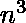

# 计数乘积等于给定数的三元组数量，允许重复

> 原文:[https://www . geeksforgeeks . org/count-三胞胎数量-带产品-等于给定数量-允许重复/](https://www.geeksforgeeks.org/count-number-of-triplets-with-product-equal-to-given-number-with-duplicates-allowed/)

给定一个正整数数组(可能包含**个重复的**，任务是找出乘积等于给定数 **t** 的三元组的个数。

**示例**:

```
Input: arr = [1, 31, 3, 1, 93, 3, 31, 1, 93]
        t = 93
Output: 18

Input: arr = [4, 2, 4, 2, 3, 1]
        t = 8
Output: 4  
[(4, 2, 1), (4, 2, 1), (2, 4, 1), (4, 2, 1)]
```

**天真方法:**解决这个问题最简单的方法是将每个可能的三元组与 **t** 进行比较，如果它们的乘积等于 **t** ，则递增计数。

下面是上述方法的实现:

## C++

```
// C++ program for above implementation
#include<iostream>

using namespace std ;

int main()
{
    // The target value for which
    // we have to find the solution
    int target = 93 ;

    int arr[] = {1, 31, 3, 1, 93,
                    3, 31, 1, 93};
    int length = sizeof(arr) /
                 sizeof(arr[0]) ;

    // This variable contains the total
    // count of triplets found
    int totalCount = 0 ;

    // Loop from the first to the third
    //last integer in the list
    for(int i = 0 ; i < length - 2; i++)
    {
        // Check if arr[i] is a factor
        // of target or not. If not,
        // skip to the next element
        if (target % arr[i] == 0)
        {
            for (int j = i + 1 ;
                     j < length - 1; j++)
            {
            // Check if the pair (arr[i], arr[j])
            // can be a part of triplet whose
            // product is equal to the target
            if (target % (arr[i] * arr[j]) == 0)
                {
                // Find the remaining
                // element of the triplet
                int toFind = target / (arr[i] * arr[j]) ;

                    for(int k = j + 1 ; k < length ; k++ )
                    {
                        // If element is found. increment
                        // the total count of the triplets
                        if (arr[k] == toFind)
                        {
                            totalCount ++ ;
                        }
                    }
                }
            }
        }
    }
cout << "Total number of triplets found : "
     << totalCount ;

return 0 ;
}

// This code is contributed by ANKITRAI1
```

## Java 语言(一种计算机语言，尤用于创建网站)

```
// Java program for above implementation
class GFG
{
public static void main(String[] args)
{
    // The target value for which
    // we have to find the solution
    int target = 93 ;

    int[] arr = {1, 31, 3, 1, 93,
                    3, 31, 1, 93};
    int length = arr.length;

    // This variable contains the total
    // count of triplets found
    int totalCount = 0 ;

    // Loop from the first to the third
    //last integer in the list
    for(int i = 0 ; i < length - 2; i++)
    {
        // Check if arr[i] is a factor
        // of target or not. If not,
        // skip to the next element
        if (target % arr[i] == 0)
        {
            for (int j = i + 1 ;
                    j < length - 1; j++)
            {
            // Check if the pair (arr[i], arr[j])
            // can be a part of triplet whose
            // product is equal to the target
            if (target % (arr[i] * arr[j]) == 0)
                {
                // Find the remaining
                // element of the triplet
                int toFind = target /
                             (arr[i] * arr[j]);

                    for(int k = j + 1 ;
                            k < length ; k++ )
                    {
                        // If element is found. increment
                        // the total count of the triplets
                        if (arr[k] == toFind)
                        {
                            totalCount ++ ;
                        }
                    }
                }
            }
        }
    }

System.out.println("Total number of triplets found : " +
                                            totalCount);
}
}

// This code is contributed by mits
```

## 蟒蛇 3

```
# Python program for above implementation

# The target value for which we have
# to find the solution
target = 93

arr = [1, 31, 3, 1, 93, 3, 31, 1, 93]
length = len(arr)

# This variable contains the total
# count of triplets found
totalCount = 0

# Loop from the first to the third
# last integer in the list
for i in range(length - 2):

    # Check if arr[i] is a factor of target
    # or not. If not, skip to the next element
    if target % arr[i] == 0:
        for j in range(i + 1, length - 1):

            # Check if the pair (arr[i], arr[j]) can be
            # a part of triplet whose product is equal
            # to the target
            if target % (arr[i] * arr[j]) == 0:

                # Find the remaining element of the triplet
                toFind = target // (arr[i] * arr[j])
                for k in range(j + 1, length):

                    # If element is found. increment the
                    # total count of the triplets
                    if arr[k] == toFind:
                        totalCount += 1

print ('Total number of triplets found: ', totalCount)

```

## C#

```
// C# program for above implementation

using System;
class GFG
{
public static void Main()
{
    // The target value for which
    // we have to find the solution
    int target = 93 ;

    int[] arr = {1, 31, 3, 1, 93,
                    3, 31, 1, 93};
    int length = arr.Length;

    // This variable contains the total
    // count of triplets found
    int totalCount = 0 ;

    // Loop from the first to the third
    //last integer in the list
    for(int i = 0 ; i < length - 2; i++)
    {
        // Check if arr[i] is a factor
        // of target or not. If not,
        // skip to the next element
        if (target % arr[i] == 0)
        {
            for (int j = i + 1 ;
                    j < length - 1; j++)
            {
            // Check if the pair (arr[i], arr[j])
            // can be a part of triplet whose
            // product is equal to the target
            if (target % (arr[i] * arr[j]) == 0)
                {
                // Find the remaining
                // element of the triplet
                int toFind = target /
                             (arr[i] * arr[j]);

                    for(int k = j + 1 ;
                            k < length ; k++ )
                    {
                        // If element is found. increment
                        // the total count of the triplets
                        if (arr[k] == toFind)
                        {
                            totalCount ++ ;
                        }
                    }
                }
            }
        }
    }

Console.Write("Total number of triplets found : " +
                                            totalCount);
}
}
```

## 服务器端编程语言（Professional Hypertext Preprocessor 的缩写）

```
<?php
// PHP program for above implementation

// The target value for which
// we have to find the solution
$target = 93 ;

$arr = array(1, 31, 3, 1, 93,
             3, 31, 1, 93);
$length = sizeof($arr);

// This variable contains the
// total count of triplets found
$totalCount = 0 ;

// Loop from the first to the
// third last integer in the list
for($i = 0 ; $i < $length - 2; $i++)
{
    // Check if arr[i] is a factor
    // of target or not. If not,
    // skip to the next element
    if ($target % $arr[$i] == 0)
    {
        for ($j = $i + 1 ;
                  $j < $length - 1; $j++)
        {

        // Check if the pair (arr[i], arr[j])
        // can be a part of triplet whose
        // product is equal to the target
        if ($target % ($arr[$i] * $arr[$j]) == 0)
        {
            // Find the remaining
            // element of the triplet
            $toFind = $target / ($arr[$i] * $arr[$j]) ;

                for($k = $j + 1 ; $k < $length ; $k++ )
                {
                    // If element is found. increment
                    // the total count of the triplets
                    if ($arr[$k] == $toFind)
                    {
                        $totalCount ++ ;
                    }
                }
            }
        }
    }
}
echo ("Total number of triplets found : ");
echo ($totalCount);

// This code is contributed
// by Shivi_Aggarwal
?>
```

## java 描述语言

```
<script>

// Javascript program for above implementation

// The target value for which
// we have to find the solution
var target = 93;

var arr = [ 1, 31, 3, 1, 93,
            3, 31, 1, 93 ];
var length = arr.length;

// This variable contains the total
// count of triplets found
var totalCount = 0;

// Loop from the first to the third
// last integer in the list
for(var i = 0; i < length - 2; i++)
{

    // Check if arr[i] is a factor
    // of target or not. If not,
    // skip to the next element
    if (target % arr[i] == 0)
    {
        for(var j = i + 1;
                j < length - 1; j++)
        {

            // Check if the pair (arr[i], arr[j])
            // can be a part of triplet whose
            // product is equal to the target
            if (target % (arr[i] * arr[j]) == 0)
            {

                // Find the remaining
                // element of the triplet
                var toFind = target / (arr[i] * arr[j]);

                for(var k = j + 1; k < length; k++)
                {

                    // If element is found. increment
                    // the total count of the triplets
                    if (arr[k] == toFind)
                    {
                        totalCount ++;
                    }
                }
            }
        }
    }
}

document.write("Total number of triplets found : " +
               totalCount);

// This code is contributed by rutvik_56

</script>
```

**Output:** 

```
Total number of triplets found:  18
```

**时间复杂度:** O( )

**有效方法:**

1.  从数组中删除不是 **t** 因子的数字。
2.  然后对数组进行排序，这样我们就不必验证每个数字的索引，以避免额外的对计数。
3.  然后将每个数字出现的次数存入字典**计数**。
4.  使用两个循环通过检查它们的乘积是否除以 **t** 来找到有效三元组的前两个数字
5.  找到三元组的第三个数字，检查我们是否已经看到了三元组，以避免重复计算
6.  计算该三元组的所有可能组合，使它们以相同的顺序出现(所有对都应遵循顺序(x，y，z)以避免重复)

## Java 语言(一种计算机语言，尤用于创建网站)

```
// java program for the above approach
import java.io.*;
import java.lang.*;
import java.util.*;

class GFG {

  // This function returns the total number of
  // combinations of the triplet (x, y, z) possible in the
  // given list
  static int Combinations(int x, int y, int z,
                          HashMap<Integer, Integer> count)
  {

    int valx = count.getOrDefault(x, 0);
    int valy = count.getOrDefault(y, 0);
    int valz = count.getOrDefault(z, 0);

    if (x == y) {
      if (y == z) {
        return (valx * (valy - 1) * (valz - 2)) / 6;
      }
      else {
        return ((((valy - 1) * valx) / 2) * valz);
      }
    }
    else if (y == z) {
      return valx * (((valz - 1) * valy) / 2);
    }
    else {
      return (valx * valy * valz);
    }
  }

  // Driver code
  public static void main(String[] args)
  {

    // Value for which solution has to be found
    int target = 93;
    int ar[] = { 1, 31, 3, 1, 93, 3, 31, 1, 93 };

    // length of the array
    int N = ar.length;

    // Create a list of integers from arr which
    // contains only factors of the target
    // Using list comprehension
    ArrayList<Integer> list = new ArrayList<>();
    for (int i = 0; i < N; i++)
      if (ar[i] != 0 && target % ar[i] == 0)
        list.add(ar[i]);

    // Sort the list
    Collections.sort(list);
    int length = list.size();

    // ArrayList to Array Conversion
    int[] arr
      = list.stream().mapToInt(i -> i).toArray();

    // Initialize the Map with the default value
    HashMap<Integer, Integer> count = new HashMap<>();
    HashSet<String> tripletSeen = new HashSet<>();

    // Count the number of times a value is present in
    // the list and store it in a Map for further
    // use
    for (int val : list)
      count.put(val, count.getOrDefault(val, 0) + 1);

    // Used to store the total number of triplets
    int totalCount = 0;

    for (int i = 0; i < length - 2; i++) {
      for (int j = i + 1; j < length - 1; j++) {

        // Check if the pair (arr[i], arr[j]) can be
        // a part of triplet whose product is equal
        // to the target
        if (target % (arr[i] * arr[j]) == 0) {

          int toFind = target / (arr[i] * arr[j]);

          // This condition makes sure that a
          // solution is not repeated
          int a[] = { arr[i], arr[j], toFind };
          Arrays.sort(a);
          String str
            = (a[0] + "#" + a[1] + "#" + a[2]);

          if (toFind >= arr[i] && toFind >= arr[j]
              && tripletSeen.contains(str)
              == false) {

            tripletSeen.add(str);
            totalCount += Combinations(
              arr[i], arr[j], toFind, count);
          }
        }
      }
    }

    System.out.println(
      "Total number of triplets found: "
      + totalCount);
  }
}

// This code is contributed by Kingash.
```

## 蟒蛇 3

```
# Python3 code to find the number of triplets
# whose product is equal to a given number
# in quadratic time

# This function is used to initialize
# a dictionary with a default value
from collections import defaultdict

# Value for which solution has to be found
target = 93
arr = [1, 31, 3, 1, 93, 3, 31, 1, 93]

# Create a list of integers from arr which
# contains only factors of the target
# Using list comprehension
arr = [x for x in arr if x != 0 and target % x == 0]

# Sort the list
arr.sort()
length = len(arr)

# Initialize the dictionary with the default value
tripletSeen = defaultdict(lambda : False)
count = defaultdict(lambda : 0)

# Count the number of times a value is present in
# the list and store it in a dictionary for further use
for key in arr:
    count[key] += 1

# Used to store the total number of triplets
totalCount = 0

# This function returns the total number of combinations
# of the triplet (x, y, z) possible in the given list
def Combinations(x, y, z):

    if x == y:
        if y == z:
            return (count[x]*(count[y]-1)*(count[z]-2)) // 6
        else:
            return ((((count[y]-1)*count[x]) // 2)*count[z])

    elif y == z:
        return count[x]*(((count[z]-1)*count[y]) // 2)

    else:
        return (count[x] * count[y] * count[z])

for i in range(length - 2):
    for j in range(i + 1, length - 1):

        # Check if the pair (arr[i], arr[j]) can be a
        # part of triplet whose product is equal to the target
        if target % (arr[i] * arr[j]) == 0:
            toFind = target // (arr[i] * arr[j])

            # This condition makes sure that a solution is not repeated
            if (toFind >= arr[i] and toFind >= arr[j] and
                tripletSeen[(arr[i], arr[j], toFind)] == False):

                tripletSeen[(arr[i], arr[j], toFind)] = True
                totalCount += Combinations(arr[i], arr[j], toFind)

print ('Total number of triplets found: ', totalCount)
```

**Output:** 

```
Total number of triplets found:  18
```

**时间复杂度:** O(  )