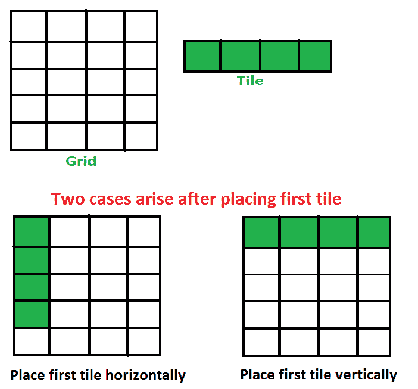

# 计算使用“1 x 4”瓷砖填充“n x 4”网格的方法数量

> 原文:[https://www . geesforgeks . org/count-填充方式数-a-n-x-4-grid-use-1-x-4-tiles/](https://www.geeksforgeeks.org/count-number-of-ways-to-fill-a-n-x-4-grid-using-1-x-4-tiles/)

给定一个数字 n，计算使用 1×4 块填充 n×4 网格的方法数。
示例:

```
Input : n = 1
Output : 1

Input : n = 2
Output : 1
We can only place both tiles horizontally

Input : n = 3
Output : 1
We can only place all tiles horizontally.

Input : n = 4
Output : 2
The two ways are : 
  1) Place all tiles horizontally 
  2) Place all tiles vertically.

Input : n = 5
Output : 3
We can fill a 5 x 4 grid in following ways : 
  1) Place all 5 tiles horizontally
  2) Place first 4 vertically and 1 horizontally.
  3) Place first 1 horizontally and 4 horizontally.
```

## [我们强烈建议您点击此处进行练习，然后再进入解决方案。](https://practice.geeksforgeeks.org/problems/number-of-ways2552/1)

这个问题主要是[这个平铺问题](https://www.geeksforgeeks.org/tiling-problem/)
的一个延伸，让**“count(n)”成为在一个“n×4”网格**上放置瓷砖的方式的计数，当我们放置第一个瓷砖时出现以下两种情况。

1.  **水平放置第一个平铺**:如果我们水平放置第一个平铺，问题就简化为“计数(n-1)”
2.  **垂直放置第一块瓷砖**:如果我们垂直放置第一块瓷砖，那么我们必须再垂直放置 3 块瓷砖。所以问题简化为“计数(n-4)”



因此，计数(n)可以写成如下形式。

```
   count(n) = 1 if n = 1 or n = 2 or n = 3   
   count(n) = 2 if n = 4
   count(n) = count(n-1) + count(n-4) 
```

这个递归类似于[斐波那契数](https://www.geeksforgeeks.org/program-for-nth-fibonacci-number/)，可以用动态规划求解。
T3】

## C++

```
// C++ program to count of ways to place 1 x 4 tiles
// on n x 4 grid.
#include<iostream>
using namespace std;

// Returns count of count of ways to place 1 x 4 tiles
// on n x 4 grid.
int count(int n)
{
    // Create a table to store results of subproblems
    // dp[i] stores count of ways for i x 4 grid.
    int dp[n+1];
    dp[0] = 0;

    // Fill the table from d[1] to dp[n]
    for (int i=1; i<=n; i++)
    {
        // Base cases
        if (i >= 1 && i <= 3)
            dp[i] = 1;
        else if (i==4)
            dp[i] = 2 ;

        else
            // dp(i-1) : Place first tile horizontally
            // dp(n-4) : Place first tile vertically
            //         which means 3 more tiles have
            //         to be placed vertically.
            dp[i] = dp[i-1] + dp[i-4];
    }

    return dp[n];
}

// Driver program to test above
int main()
{
    int n = 5;
    cout << "Count of ways is " << count(n);
    return 0;
}
```

## Java 语言(一种计算机语言，尤用于创建网站)

```
// Java program to count of ways to place 1 x 4 tiles
// on n x 4 grid
import java.io.*;

class Grid
{
    // Function that count the number of ways to place 1 x 4 tiles
    // on n x 4 grid.
    static int count(int n)
    {
        // Create a table to store results of sub-problems
        // dp[i] stores count of ways for i x 4 grid.
        int[] dp = new int[n+1];
        dp[0] = 0;
        // Fill the table from d[1] to dp[n]
        for(int i=1;i<=n;i++)
        {
            // Base cases
            if (i >= 1 && i <= 3)
                dp[i] = 1;
            else if (i==4)
                dp[i] = 2 ;

            else
            {
                    // dp(i-1) : Place first tile horizontally
                    // dp(i-4) : Place first tile vertically
                    //         which means 3 more tiles have
                    //         to be placed vertically.
                    dp[i] = dp[i-1] + dp[i-4];
            }
        }
        return dp[n];
    }

    // Driver program
    public static void main (String[] args)
    {
        int n = 5;
        System.out.println("Count of ways is: " + count(n));
    }
}

// Contributed by Pramod Kumar
```

## 计算机编程语言

```
# Python program to count of ways to place 1 x 4 tiles
# on n x 4 grid.

# Returns count of count of ways to place 1 x 4 tiles
# on n x 4 grid.
def count(n):

    # Create a table to store results of subproblems
    # dp[i] stores count of ways for i x 4 grid.
    dp = [0 for _ in range(n+1)]

    # Fill the table from d[1] to dp[n]
    for i in range(1,n+1):

        # Base cases
        if i <= 3:
            dp[i] = 1
        elif i == 4:
            dp[i] = 2
        else:
            # dp(i-1) : Place first tile horizontally
            # dp(n-4) : Place first tile vertically
            #           which means 3 more tiles have
            #           to be placed vertically.
            dp[i] = dp[i-1] + dp[i-4]

    return dp[n]

# Driver code to test above
n = 5
print ("Count of ways is"),
print (count(n))
```

## C#

```
// C# program to count of ways
// to place 1 x 4 tiles on
// n x 4 grid
using System;

class GFG
{

    // Function that count the number
    // of ways to place 1 x 4 tiles
    // on n x 4 grid.
    static int count(int n)
    {

        // Create a table to store results
        // of sub-problems dp[i] stores
        // count of ways for i x 4 grid.
        int[] dp = new int[n + 1];
        dp[0] = 0;

        // Fill the table from d[1]
        // to dp[n]
        for(int i = 1; i <= n; i++)
        {

            // Base cases
            if (i >= 1 && i <= 3)
                dp[i] = 1;
            else if (i == 4)
                dp[i] = 2 ;

            else
            {

                // dp(i-1) : Place first tile
                // horizontally dp(i-4) :
                // Place first tile vertically
                // which means 3 more tiles have
                // to be placed vertically.
                dp[i] = dp[i - 1] +
                        dp[i - 4];
            }
        }
        return dp[n];
    }

    // Driver Code
    public static void Main ()
    {
        int n = 5;
        Console.WriteLine("Count of ways is: "
                           + count(n));
    }
}

// This code is contributed by Sam007
```

## 服务器端编程语言（Professional Hypertext Preprocessor 的缩写）

```
<?php
// PHP program to count of ways to
// place 1 x 4 tiles on n x 4 grid.

// Returns count of count of ways
// to place 1 x 4 tiles
// on n x 4 grid.
function countt($n)
{

    // Create a table to store
    // results of subproblems
    // dp[i] stores count of
    // ways for i x 4 grid.
    $dp[$n + 1] = 0;
    $dp[0] = 0;

    // Fill the table
    // from d[1] to dp[n]
    for ($i = 1; $i <= $n; $i++)
    {

        // Base cases
        if ($i >= 1 && $i <= 3)
            $dp[$i] = 1;
        else if ($i == 4)
            $dp[$i] = 2 ;

        else
            // dp(i-1) : Place first tile horizontally
            // dp(n-4) : Place first tile vertically
            //             which means 3 more tiles have
            //             to be placed vertically.
            $dp[$i] = $dp[$i - 1] + $dp[$i - 4];
    }

    return $dp[$n];
}

    // Driver Code
    $n = 5;
    echo "Count of ways is " , countt($n);

// This code is contributed by nitin mittal.
?>
```

## java 描述语言

```
<script>

// JavaScript program to count of ways to place 1 x 4 tiles
// on n x 4 grid

    // Function that count the number of ways to place 1 x 4 tiles
    // on n x 4 grid.
    function count(n)
    {

        // Create a table to store results of sub-problems
        // dp[i] stores count of ways for i x 4 grid.
        let dp = [];
        dp[0] = 0;

        // Fill the table from d[1] to dp[n]
        for(let i = 1; i <= n; i++)
        {

            // Base cases
            if (i >= 1 && i <= 3)
                dp[i] = 1;
            else if (i == 4)
                dp[i] = 2 ;

            else
            {

                    // dp(i-1) : Place first tile horizontally
                    // dp(i-4) : Place first tile vertically
                    //         which means 3 more tiles have
                    //         to be placed vertically.
                    dp[i] = dp[i - 1] + dp[i - 4];
            }
        }
        return dp[n];
    }

// Driver Code
        let n = 5;
        document.write("Count of ways is: " + count(n));

    // This code is contributed by target_2.
</script>
```

输出:

```
Count of ways is 3
```

时间复杂度:O(n)
辅助空间:O(n)
本文由**拉杰特·贾**供稿。如果你发现任何不正确的地方，或者你想分享更多关于上面讨论的话题的信息，请写评论。