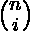

# 给定两位数与给定位数之和形成的计数

> 原文:[https://www . geesforgeks . org/count-numbers-formed-given-两位数-sum-given-digits/](https://www.geeksforgeeks.org/count-numbers-formed-given-two-digit-sum-given-digits/)

给定 a、b 和 N(1 至 10 <sup>6</sup> )。任务是计算由长度为 N 的数字 a 和 b 组成的数字，这样形成的数字的数字总和也只包含数字 a 和 b。由于计数可能非常大，请打印计数% 1000000007。

**示例:**

```
Input : a = 1 b = 3 n = 3 
Output : 1 
Explanation : The only number is 111 of length 3,
the sum of digits of 111 is 3, which is b. 

Input : a = 6 b = 9 n = 1
Output : 2
Explanation : The numbers of length 1 is 6 and 9,
whose sum of digits is 6 and 9 respectively which
is a and b respectively.

Input: a = 2 b = 3 n = 10
Output : 165   
```

**方法:**由于 N 非常大，所以我们不能对所有的数字进行迭代来逐个检查。由于数字长度为 N，由两位数 a 和 b 组成，a 将占据 I 位置，b 将占据 N–I 位置。因此数字的总和将是 **( a*i + (n-i)*b )** 。我们可以检查从 0 到 n 的所有 I 的数字总和是否由 a 和 b 组成。因此，形成的数字总数将是，这将对应于由 a 和 b 组成的所有数字组合，其数字总和也由 a 和 b 组成

**在计算中实现模运算:**
为满足给定条件的从 0 到 N 的所有 I 计算 %1000000007。

一个**简单的解决方案**将给出如下答案:

```
(factorial(n) * modInverse(n - i) * modInverse(i)) % mod
```

由于计算反相需要 O(对数 N)，如果所有的阶乘都是预先计算的，那么总的时间复杂度将是 O(对数 N)。

一个**有效的解决方案**将是预先计算所有的阶乘直到 N。计算 N 的反方向！在 O(对数 N)中，从(N–1)开始计算所有阶乘的方差！到 1！通过下面给出的公式。

> modi inverse(I！)= modInverse((i + 1)！)* (i + 1)

**以下是上述方法的实施:**

## C++

```
// C++ program to count the number
// of numbers formed by digits a
// and b exactly of a length N such
// that the sum of the digits of the
// number thus formed is of digits a and b.
#include <bits/stdc++.h>
using namespace std;

const int mod = 1e9 + 7;
const int N = 1000005;
int fact[N], invfact[N];

// function to check if sum of
// digits is made of a and b
int check(int x, int a, int b)
{
    // sum of digits is 0
    if (x == 0)
        return 0;

    while (x) {

        // if any of digits in sum is
        // other than a and b
        if (x % 10 != a and x % 10 != b)
            return 0;

        x /= 10;
    }

    return 1;
}

// calculate the modInverse V / of a number in O(log n)
int modInverse(int a, int m)
{
    int m0 = m;
    int y = 0, x = 1;

    if (m == 1)
        return 0;

    while (a > 1) {

        // q is quotient
        int q = a / m;
        int t = m;

        // m is remainder now, process
        // same as Euclid's algo
        m = a % m, a = t;
        t = y;

        // Update y and x
        y = x - q * y;
        x = t;
    }

    // Make x positive
    if (x < 0)
        x += m0;

    return x;
}

// function to pregenerate factorials
void pregenFact()
{
    fact[0] = fact[1] = 1;
    for (int i = 1; i <= 1000000; ++i)
        fact[i] = (long long)fact[i - 1] * i % mod;
}

// function to pre calculate the
// modInverse of factorials
void pregenInverse()
{
    invfact[0] = invfact[1] = 1;

    // calculates the modInverse of the last factorial
    invfact[1000000] = modInverse(fact[1000000], mod);

    // precalculates the modInverse of all factorials
    // by formulae
    for (int i = 999999; i > 1; --i)
        invfact[i] = ((long long)invfact[i + 1] *
                      (long long)(i + 1)) % mod;
}

// function that returns the value of nCi
int comb(int big, int small)
{
    return (long long)fact[big] * invfact[small] % mod *
                              invfact[big - small] % mod;
}

// function that returns the count of numbers
int count(int a, int b, int n)
{
    // function call to pre-calculate the
    // factorials and modInverse of factorials
    pregenFact();
    pregenInverse();

    // if a and b are same
    if (a == b)
        return (check(a * n, a, b));

    int ans = 0;
    for (int i = 0; i <= n; ++i)
        if (check(i * a + (n - i) * b, a, b))
            ans = (ans + comb(n, i)) % mod;
    return ans;
}

// Driver Code
int main()
{
    int a = 3, b = 4, n = 11028;
    cout << count(a, b, n);
    return 0;
}
```

## Java 语言(一种计算机语言，尤用于创建网站)

```
// Java program to count the number
// of numbers formed by digits a
// and b exactly of a length N such
// that the sum of the digits of the
// number thus formed is of digits a and b.

class GFG
{

    static int mod = (int) (1e9 + 7);
    static int N = 1000005;
    static int fact[] = new int[N], invfact[] = new int[N];

    // function to check if sum of
    // digits is made of a and b
    static int check(int x, int a, int b)
    {
        // sum of digits is 0
        if (x == 0)
        {
            return 0;
        }

        while (x > 0)
        {

            // if any of digits in sum is
            // other than a and b
            if (x % 10 != a & x % 10 != b)
            {
                return 0;
            }

            x /= 10;
        }

        return 1;
    }

    // calculate the modInverse V / of a number in O(log n)
    static int modInverse(int a, int m)
    {
        int m0 = m;
        int y = 0, x = 1;
        if (m == 1)
        {
            return 0;
        }

        while (a > 1)
        {

            // q is quotient
            int q = a / m;
            int t = m;

            // m is remainder now, process
            // same as Euclid's algo
            m = a % m;
            a = t;
            t = y;

            // Update y and x
            y = x - q * y;
            x = t;
        }

        // Make x positive
        if (x < 0)
        {
            x += m0;
        }

        return x;
    }

    // function to pregenerate factorials
    static void pregenFact()
    {
        fact[0] = fact[1] = 1;
        for (int i = 1; i <= 1000000; ++i)
        {
            fact[i] = (int) ((long) fact[i - 1] * i % mod);
        }
    }

    // function to pre calculate the
    // modInverse of factorials
    static void pregenInverse()
    {
        invfact[0] = invfact[1] = 1;

        // calculates the modInverse of
        // the last factorial
        invfact[1000000] = modInverse(fact[1000000], mod);

        // precalculates the modInverse of
        // all factorials by formulae
        for (int i = 999999; i > 1; --i)
        {
            invfact[i] = (int) (((long) invfact[i + 1]
                    * (long) (i + 1)) % mod);
        }
    }

    // function that returns the value of nCi
    static int comb(int big, int small)
    {
        return (int) ((long) fact[big] * invfact[small] % mod
                * invfact[big - small] % mod);
    }

    // function that returns the count of numbers
    static int count(int a, int b, int n)
    {

        // function call to pre-calculate the
        // factorials and modInverse of factorials
        pregenFact();
        pregenInverse();

        // if a and b are same
        if (a == b)
        {
            return (check(a * n, a, b));
        }

        int ans = 0;
        for (int i = 0; i <= n; ++i)
        {
            if (check(i * a + (n - i) * b, a, b) == 1)
            {
                ans = (ans + comb(n, i)) % mod;
            }
        }
        return ans;
    }

    // Driver Code
    public static void main(String[] args)
    {
        int a = 3, b = 4, n = 11028;
        System.out.println(count(a, b, n));
    }
}

// This code is contributed by PrinciRaj1992
```

## 蟒蛇 3

```
# Python 3 program to count the
# number of numbers formed by
# digits a and b exactly of a
# length N such that the sum of
# the digits of the number thus
# formed is of digits a and b.

mod = 1000000007
N = 1000005
fact = [0] * N
invfact = [0] * N

# function to check if sum of
# digits is made of a and b
def check(x, a, b):

    # sum of digits is 0
    if (x == 0):
        return 0

    while (x) :

        # if any of digits in sum
        # is other than a and b
        if (x % 10 != a and x % 10 != b):
            return 0

        x //= 10

    return 1

# calculate the modInverse V of
# a number in O(log n)
def modInverse(a, m):

    m0 = m
    y = 0
    x = 1

    if (m == 1):
        return 0

    while (a > 1) :

        # q is quotient
        q = a // m
        t = m

        # m is remainder now, process
        # same as Euclid's algo
        m = a % m
        a = t
        t = y

        # Update y and x
        y = x - q * y
        x = t

    # Make x positive
    if (x < 0):
        x += m0

    return x

# function to pregenerate factorials
def pregenFact():

    fact[0] = fact[1] = 1
    for i in range(1, 1000001):
        fact[i] = fact[i - 1] * i % mod

# function to pre calculate the
# modInverse of factorials
def pregenInverse():

    invfact[0] = invfact[1] = 1

    # calculates the modInverse of
    # the last factorial
    invfact[1000000] = modInverse(fact[1000000], mod)

    # precalculates the modInverse
    # of all factorials by formulae
    for i in range(999999, 0, -1):
        invfact[i] = ((invfact[i + 1] *
                      (i + 1)) % mod)

# function that returns
# the value of nCi
def comb(big, small):

    return (fact[big] * invfact[small] % mod *
                        invfact[big - small] % mod)

# function that returns the
# count of numbers
def count(a, b, n):

    # function call to pre-calculate
    # the factorials and modInverse
    # of factorials
    pregenFact()
    pregenInverse()

    # if a and b are same
    if (a == b) :
        return (check(a * n, a, b))

    ans = 0
    for i in range(n + 1) :
        if (check(i * a + (n - i) * b, a, b)) :
            ans = (ans + comb(n, i)) % mod
    return ans

# Driver Code
if __name__=="__main__":
    a = 3
    b = 4
    n = 11028
    print(count(a, b, n))

# This code is contributed
# by ChitraNayal
```

## C#

```
// C# program to count the number
// of numbers formed by digits a
// and b exactly of a length N such
// that the sum of the digits of the
// number thus formed is of digits a and b.
using System;

class GFG
{

    static int mod = (int) (1e9 + 7);
    static int N = 1000005;
    static int []fact = new int[N];
    static int []invfact = new int[N];

    // function to check if sum of
    // digits is made of a and b
    static int check(int x, int a, int b)
    {
        // sum of digits is 0
        if (x == 0)
        {
            return 0;
        }

        while (x > 0)
        {

            // if any of digits in sum is
            // other than a and b
            if (x % 10 != a & x % 10 != b)
            {
                return 0;
            }

            x /= 10;
        }

        return 1;
    }

    // calculate the modInverse V / of a number in O(log n)
    static int modInverse(int a, int m)
    {
        int m0 = m;
        int y = 0, x = 1;
        if (m == 1)
        {
            return 0;
        }

        while (a > 1)
        {

            // q is quotient
            int q = a / m;
            int t = m;

            // m is remainder now, process
            // same as Euclid's algo
            m = a % m;
            a = t;
            t = y;

            // Update y and x
            y = x - q * y;
            x = t;
        }

        // Make x positive
        if (x < 0)
        {
            x += m0;
        }

        return x;
    }

    // function to pregenerate factorials
    static void pregenFact()
    {
        fact[0] = fact[1] = 1;
        for (int i = 1; i <= 1000000; ++i)
        {
            fact[i] = (int) ((long) fact[i - 1] * i % mod);
        }
    }

    // function to pre calculate the
    // modInverse of factorials
    static void pregenInverse()
    {
        invfact[0] = invfact[1] = 1;

        // calculates the modInverse of
        // the last factorial
        invfact[1000000] = modInverse(fact[1000000], mod);

        // precalculates the modInverse of
        // all factorials by formulae
        for (int i = 999999; i > 1; --i)
        {
            invfact[i] = (int) (((long) invfact[i + 1]
                    * (long) (i + 1)) % mod);
        }
    }

    // function that returns the value of nCi
    static int comb(int big, int small)
    {
        return (int) ((long) fact[big] * invfact[small] % mod
                * invfact[big - small] % mod);
    }

    // function that returns the count of numbers
    static int count(int a, int b, int n)
    {

        // function call to pre-calculate the
        // factorials and modInverse of factorials
        pregenFact();
        pregenInverse();

        // if a and b are same
        if (a == b)
        {
            return (check(a * n, a, b));
        }

        int ans = 0;
        for (int i = 0; i <= n; ++i)
        {
            if (check(i * a + (n - i) * b, a, b) == 1)
            {
                ans = (ans + comb(n, i)) % mod;
            }
        }
        return ans;
    }

    // Driver Code
    public static void Main(String[] args)
    {
        int a = 3, b = 4, n = 11028;
        Console.WriteLine(count(a, b, n));
    }
}

// This code has been contributed by 29AjayKumar
```

**Output:** 

```
461668105
```