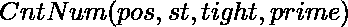
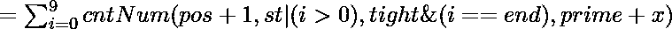

# 对给定范围内分别在质数和非质数位置有质数和非质数的数字进行计数

> 原文:[https://www . geesforgeks . org/count-给定范围内的数字-分别在质数和非质数位置具有质数和非质数数字-分别/](https://www.geeksforgeeks.org/count-numbers-in-a-given-range-having-prime-and-non-prime-digits-at-prime-and-non-prime-positions-respectively/)

给定两个整数 **L** 和 **R** ，任务是找到范围**【L，R】**内的数的计数，在素数位置有[个素数位](https://www.geeksforgeeks.org/c-program-to-check-whether-a-number-is-prime-or-not/)，在非素数位置有非素数位。

**示例:**

> **输入:** L = 5，R = 22
> **输出:** 7
> **说明:**数字 6、8、9、12、13、15、17 在质数位置有质数，在非质数位置有非质数。
> 
> **输入:** L = 20，R = 29
> **输出:** 0
> **说明:**没有素数位置有素数，非素数位置有非素数的数字。

**天真的方法:**解决问题最简单的方法就是迭代范围**【L，R】**。对于每个 **i <sup>th</sup>** 号码，检查该号码的数字在质数位置是否为质数，在非质数位置是否为非质数。如果发现为真，则增加计数。最后，打印获得的计数。

***时间复杂度:**O(R–L+1)* sqrt(R)* log<sub>10</sub>(R)*
*T8】辅助空间: O(1)*

**高效途径:**优化上述途径，思路是使用[数字 DP](https://www.geeksforgeeks.org/digit-dp-introduction/) 。以下是动态编程状态之间的递归关系:

> 
> 
> 如果 **i** 在素数位是素数或者在非素数位是非素数，那么**x = 1**
> 
> **pos:**存储位数的位置
> **素数:**检查素数位是否存在素数位，非素数位的非素数位是否存在。
> **st:** 检查一个数字是否包含任何前导 0。
> **结束:**当前位置最大可能位数

按照以下步骤解决问题:

*   初始化一个 4D 数组，说**DP[pos][ST][紧密][质数]** 。
*   使用[记忆](https://www.geeksforgeeks.org/tabulation-vs-memoization/)计算数字 **R** 的**DP【pos】【ST】【紧密】【质数】**的值，说 **cntR** 。
*   使用[记忆](https://www.geeksforgeeks.org/tabulation-vs-memoization/)计算数字**L–1**的 **dp【位置】【st】【紧密】【质数】**的值，比如 **cntL** 。
*   最后打印**(cntR–cntL)**的值。

下面是上述方法的实现:

## C++14

```
// C++ program for the above approach

#include <bits/stdc++.h>
using namespace std;

// Store digits of a number
vector<long long int> num;

// Store overlapping subproblems
long long int dp[19][2][2][19];

// Function to check if a
// number is prime or not
bool isPrime(long long int n)
{

    // If n is less than
    // or equal to 1
    if (n <= 1)
        return false;

    // If n is less than
    // or equal to 3
    if (n <= 3)
        return true;

    // If n is a multiple of 2 or 3
    if (n % 2 == 0 || n % 3 == 0)
        return false;

    // Iterate over the range [5, n]
    for (long long int i = 5; i * i <= n;
         i = i + 6) {

        // If n is a multiple of i or (i + 2)
        if (n % i == 0 || n % (i + 2) == 0)
            return false;
    }

    return true;
}

// Function to count the required
// numbers from the given range
long long cntNum(long long pos, long long st,
                 long long tight, long long prime)
{

    // Base Case
    if (pos == num.size())
        return 1;

    // If the subproblems already computed
    if (dp[pos][st][tight][prime] != -1)
        return dp[pos][st][tight][prime];

    long long int res = 0;

    // Stores maximum possible
    // at current digits
    long long end = (tight == 0) ? num[pos] : 9;

    // Iterate over all possible digits
    // at current position
    for (long long i = 0; i <= end; i++) {

        // Check if i is the maximum possible
        // digit at current position or not
        long long ntight = (i < end) ? 1 : tight;

        // Check if a number contains
        // leading 0s or not
        long long int nzero = (i != 0) ? 1 : st;

        // If number has only leading zeros
        // and digit is non-zero
        if ((nzero == 1) && isPrime(i) && isPrime(prime)) {

            // Prime digits at prime positions
            res += cntNum(pos + 1, nzero,
                          ntight, prime + 1);
        }

        if ((nzero == 1) && !isPrime(i) && !isPrime(prime)) {

            // Non-prime digits at
            // non-prime positions
            res += cntNum(pos + 1, nzero,
                          ntight, prime + 1);
        }

        // If the number has only leading zeros
        // and i is zero,
        if (nzero == 0)
            res += cntNum(pos + 1, nzero,
                          ntight, prime);
    }
    return dp[pos][st][tight][prime] = res;
}

// Function to find count of numbers in
// range [0, b] whose digits are prime
// at prime and non-prime at non-prime pos
long long int cntZeroRange(long long int b)
{

    num.clear();

    // Insert digits of a number, b
    while (b > 0) {
        num.push_back(b % 10);
        b /= 10;
    }

    // Reversing the digits in num
    reverse(num.begin(), num.end());

    // Initializing dp with -1
    memset(dp, -1, sizeof(dp));

    long long int res = cntNum(0, 0, 0, 1);

    // Returning the value
    return res;
}

// Driver Code
int main()
{

    // Given range, [L, R]
    long long int L = 5, R = 22;

    // Function Call
    long long int res
        = cntZeroRange(R) - cntZeroRange(L - 1);

    // Print answer
    cout << res << endl;
    return 0;
}
```

## Java 语言(一种计算机语言，尤用于创建网站)

```
// Java program for the above approach
import java.util.*;
class GFG
{

// Store digits of a number
static Vector<Integer> num = new Vector<>();

// Store overlapping subproblems
static int [][][][]dp = new int[19][2][2][19];

// Function to check if a
// number is prime or not
static boolean isPrime(int n)
{

    // If n is less than
    // or equal to 1
    if (n <= 1)
        return false;

    // If n is less than
    // or equal to 3
    if (n <= 3)
        return true;

    // If n is a multiple of 2 or 3
    if (n % 2 == 0 || n % 3 == 0)
        return false;

    // Iterate over the range [5, n]
    for (int i = 5; i * i <= n;
         i = i + 6) {

        // If n is a multiple of i or (i + 2)
        if (n % i == 0 || n % (i + 2) == 0)
            return false;
    }
    return true;
}

// Function to count the required
// numbers from the given range
static int cntNum(int pos, int st,
                 int tight, int prime)
{

    // Base Case
    if (pos == num.size())
        return 1;

    // If the subproblems already computed
    if (dp[pos][st][tight][prime] != -1)
        return dp[pos][st][tight][prime];
    int res = 0;

    // Stores maximum possible
    // at current digits
    int end = (tight == 0) ? num.get(pos) : 9;

    // Iterate over all possible digits
    // at current position
    for (int i = 0; i <= end; i++)
    {

        // Check if i is the maximum possible
        // digit at current position or not
        int ntight = (i < end) ? 1 : tight;

        // Check if a number contains
        // leading 0s or not
        int nzero = (i != 0) ? 1 : st;

        // If number has only leading zeros
        // and digit is non-zero
        if ((nzero == 1) && isPrime(i) && isPrime(prime)) {

            // Prime digits at prime positions
            res += cntNum(pos + 1, nzero,
                          ntight, prime + 1);
        }

        if ((nzero == 1) && !isPrime(i) && !isPrime(prime)) {

            // Non-prime digits at
            // non-prime positions
            res += cntNum(pos + 1, nzero,
                          ntight, prime + 1);
        }

        // If the number has only leading zeros
        // and i is zero,
        if (nzero == 0)
            res += cntNum(pos + 1, nzero,
                          ntight, prime);
    }
    return dp[pos][st][tight][prime] = res;
}

// Function to find count of numbers in
// range [0, b] whose digits are prime
// at prime and non-prime at non-prime pos
static int cntZeroRange(int b)
{

    num.clear();

    // Insert digits of a number, b
    while (b > 0) {
        num.add(b % 10);
        b /= 10;
    }

    // Reversing the digits in num
    Collections.reverse(num);

    // Initializing dp with -1
    for (int i = 0; i < 19; i++)
         for (int j = 0; j < 2; j++)
             for (int k = 0; k < 2; k++)
                 for (int l = 0; l < 19; l++)
                     dp[i][j][k][l] = -1;

    int res = cntNum(0, 0, 0, 1);

    // Returning the value
    return res;
}

// Driver Code
public static void main(String[] args)
{

    // Given range, [L, R]
    int L = 5, R = 22;

    // Function Call
    int res
        = cntZeroRange(R) - cntZeroRange(L - 1);

    // Print answer
    System.out.print(res +"\n");
}
}

// This code is contributed by 29AjayKumar
```

## 蟒蛇 3

```
# Python3 program for the above approach
from math import ceil, sqrt

# Function to check if a
# number is prime or not
def isPrime(n):

    # If n is less than
    # or equal to 1
    if (n <= 1):
        return False

    # If n is less than
    # or equal to 3
    if (n <= 3):
        return True

    # If n is a multiple of 2 or 3
    if (n % 2 == 0 or n % 3 == 0):
        return False

    # Iterate over the range [5, n]
    for i in range(5, ceil(sqrt(n)), 6):

        # If n is a multiple of i or (i + 2)
        if (n % i == 0 or n % (i + 2) == 0):
            return False

    return True

# Function to count the required
# numbers from the given range
def cntNum(pos, st, tight, prime):

    global dp, num

    if (pos == len(num)):
        return 1

    # If the subproblems already computed
    if (dp[pos][st][tight][prime] != -1):
        return dp[pos][st][tight][prime]

    res = 0

    # Stores maximum possible
    # at current digits
    end = num[pos] if (tight == 0) else  9

    # Iterate over all possible digits
    # at current position
    for i in range(end + 1):

        # Check if i is the maximum possible
        # digit at current position or not
        ntight = 1 if (i < end) else tight

        # Check if a number contains
        # leading 0s or not
        nzero = 1 if (i != 0) else st

        # If number has only leading zeros
        # and digit is non-zero
        if ((nzero == 1) and isPrime(i) and
                             isPrime(prime)):

            # Prime digits at prime positions
            res += cntNum(pos + 1, nzero, ntight,
                        prime + 1)

        if ((nzero == 1) and isPrime(i) == False and
                         isPrime(prime) == False):

            # Non-prime digits at
            # non-prime positions
            res += cntNum(pos + 1, nzero, ntight,
                        prime + 1)

        # If the number has only leading zeros
        # and i is zero,
        if (nzero == 0):
            res += cntNum(pos + 1, nzero,
                          ntight, prime)

    dp[pos][st][tight][prime] = res

    return dp[pos][st][tight][prime]

# Function to find count of numbers in
# range [0, b] whose digits are prime
# at prime and non-prime at non-prime pos
def cntZeroRange(b):

    global num, dp

    num.clear()

    while (b > 0):
        num.append(b % 10)
        b //= 10

    # Reversing the digits in num
    num = num[::-1]

    # print(num)
    dp = [[[[-1 for i in range(19)]
                for i in range(2)]
                for i in range(2)]
                for i in range(19)]

    res = cntNum(0, 0, 0, 1)

    # Returning the value
    return res

# Driver Code
if __name__ == '__main__':

    dp = [[[[-1 for i in range(19)]
                for i in range(2)]
                for i in range(2)]
                for i in range(19)]
    L, R, num = 5, 22, []

    # Function Call
    res = cntZeroRange(R) - cntZeroRange(L - 1)

    # Print answer
    print(res)

# This code is contributed by mohit kumar 29
```

## C#

```
// C# program for the above approach
using System;
using System.Collections.Generic;
class GFG
{

  // Store digits of a number
  static List<int> num = new List<int>();

  // Store overlapping subproblems
  static int[, , , ] dp = new int[19, 2, 2, 19];

  // Function to check if a
  // number is prime or not
  static bool isPrime(int n)
  {

    // If n is less than
    // or equal to 1
    if (n <= 1)
      return false;

    // If n is less than
    // or equal to 3
    if (n <= 3)
      return true;

    // If n is a multiple of 2 or 3
    if (n % 2 == 0 || n % 3 == 0)
      return false;

    // Iterate over the range [5, n]
    for (int i = 5; i * i <= n; i = i + 6) {

      // If n is a multiple of i or (i + 2)
      if (n % i == 0 || n % (i + 2) == 0)
        return false;
    }
    return true;
  }

  // Function to count the required
  // numbers from the given range
  static int cntNum(int pos, int st, int tight, int prime)
  {

    // Base Case
    if (pos == num.Count)
      return 1;

    // If the subproblems already computed
    if (dp[pos, st, tight, prime] != -1)
      return dp[pos, st, tight, prime];
    int res = 0;

    // Stores maximum possible
    // at current digits
    int end = (tight == 0) ? num[pos] : 9;

    // Iterate over all possible digits
    // at current position
    for (int i = 0; i <= end; i++) {

      // Check if i is the maximum possible
      // digit at current position or not
      int ntight = (i < end) ? 1 : tight;

      // Check if a number contains
      // leading 0s or not
      int nzero = (i != 0) ? 1 : st;

      // If number has only leading zeros
      // and digit is non-zero
      if ((nzero == 1) && isPrime(i)
          && isPrime(prime)) {

        // Prime digits at prime positions
        res += cntNum(pos + 1, nzero, ntight,
                      prime + 1);
      }

      if ((nzero == 1) && !isPrime(i)
          && !isPrime(prime)) {

        // Non-prime digits at
        // non-prime positions
        res += cntNum(pos + 1, nzero, ntight,
                      prime + 1);
      }

      // If the number has only leading zeros
      // and i is zero,
      if (nzero == 0)
        res += cntNum(pos + 1, nzero, ntight,
                      prime);
    }
    return dp[pos, st, tight, prime] = res;
  }

  // Function to find count of numbers in
  // range [0, b] whose digits are prime
  // at prime and non-prime at non-prime pos
  static int cntZeroRange(int b)
  {

    num.Clear();

    // Insert digits of a number, b
    while (b > 0) {
      num.Add(b % 10);
      b /= 10;
    }

    // Reversing the digits in num
    num.Reverse();

    // Initializing dp with -1
    for (int i = 0; i < 19; i++)
      for (int j = 0; j < 2; j++)
        for (int k = 0; k < 2; k++)
          for (int l = 0; l < 19; l++)
            dp[i, j, k, l] = -1;

    int res = cntNum(0, 0, 0, 1);

    // Returning the value
    return res;
  }

  // Driver Code
  public static void Main(string[] args)
  {

    // Given range, [L, R]
    int L = 5, R = 22;

    // Function Call
    int res = cntZeroRange(R) - cntZeroRange(L - 1);

    // Print answer
    Console.WriteLine(res + "\n");
  }
}

// This code is contributed by chitranayal.
```

## java 描述语言

```
<script>

// JavaScript program for the above approach

// Store digits of a number
let num = [];

// Store overlapping subproblems
let dp = new Array(19);

// Function to check if a
// number is prime or not
function isPrime(n)
{
    // If n is less than
    // or equal to 1
    if (n <= 1)
        return false;

    // If n is less than
    // or equal to 3
    if (n <= 3)
        return true;

    // If n is a multiple of 2 or 3
    if (n % 2 == 0 || n % 3 == 0)
        return false;

    // Iterate over the range [5, n]
    for (let i = 5; i * i <= n;
         i = i + 6) {

        // If n is a multiple of i or (i + 2)
        if (n % i == 0 || n % (i + 2) == 0)
            return false;
    }
    return true;
}

// Function to count the required
// numbers from the given range
function cntNum(pos,st,tight,prime)
{
    // Base Case
    if (pos == num.length)
        return 1;

    // If the subproblems already computed
    if (dp[pos][st][tight][prime] != -1)
        return dp[pos][st][tight][prime];
    let res = 0;

    // Stores maximum possible
    // at current digits
    let end = (tight == 0) ? num[pos] : 9;

    // Iterate over all possible digits
    // at current position
    for (let i = 0; i <= end; i++)
    {

        // Check if i is the maximum possible
        // digit at current position or not
        let ntight = (i < end) ? 1 : tight;

        // Check if a number contains
        // leading 0s or not
        let nzero = (i != 0) ? 1 : st;

        // If number has only leading zeros
        // and digit is non-zero
        if ((nzero == 1) && isPrime(i) && isPrime(prime)) {

            // Prime digits at prime positions
            res += cntNum(pos + 1, nzero,
                          ntight, prime + 1);
        }

        if ((nzero == 1) && !isPrime(i) && !isPrime(prime)) {

            // Non-prime digits at
            // non-prime positions
            res += cntNum(pos + 1, nzero,
                          ntight, prime + 1);
        }

        // If the number has only leading zeros
        // and i is zero,
        if (nzero == 0)
            res += cntNum(pos + 1, nzero,
                          ntight, prime);
    }
    return dp[pos][st][tight][prime] = res;
}

// Function to find count of numbers in
// range [0, b] whose digits are prime
// at prime and non-prime at non-prime pos
function cntZeroRange(b)
{
    num=[];

    // Insert digits of a number, b
    while (b > 0) {
        num.push(b % 10);
        b = Math.floor(b/10);
    }

    // Reversing the digits in num
    num.reverse();
     for(let i=0;i<19;i++)
{
    dp[i]=new Array(2);
    for(let j=0;j<2;j++)
    {
        dp[i][j]=new Array(2);
        for(let k=0;k<2;k++)
        {
            dp[i][j][k]=new Array(19);
            for(let l=0;l<19;l++)
            {
                dp[i][j][k][l]=-1;
            }
        }
    }
}

    let res = cntNum(0, 0, 0, 1);

    // Returning the value
    return res;
}

// Driver Code
// Given range, [L, R]
let L = 5, R = 22;

// Function Call
let res
= cntZeroRange(R) - cntZeroRange(L - 1);

// Print answer
document.write(res +"<br>");

// This code is contributed by avanitrachhadiya2155

</script>
```

**Output:** 

```
7
```

***时间复杂度:**O(log<sub>10</sub>(R)* log<sub>10</sub>(L)sqrt(log<sub>10</sub>(R))* 10 * 4)*
***辅助空间:**O(log<sub>10</sub>(R)* log<sub>10</sub>(L)* 4)*