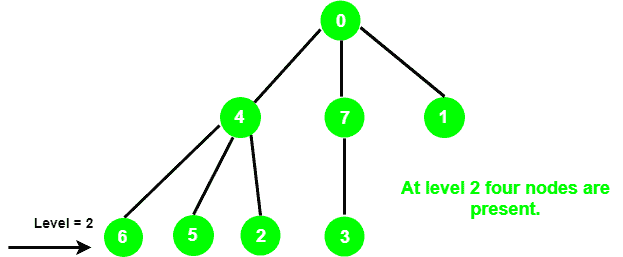

# 使用 DFS 对树中给定级别的节点数进行计数

> 原文： [https://www.geeksforgeeks.org/count-the-number-of-nodes-at-a-given-level-in-a-tree-using-dfs/](https://www.geeksforgeeks.org/count-the-number-of-nodes-at-a-given-level-in-a-tree-using-dfs/)

给定一个整数`l`和一棵树，该树表示为根于顶点 0 的无向图。任务是打印在`l`级存在的节点数。

**示例**：

> **输入**：l = 2
> 
> **输出**：4

我们已经讨论了 [BFS](https://www.geeksforgeeks.org/count-number-nodes-given-level-using-bfs/) 方法，在本文中，我们将使用 DFS 解决它。

**方法**：想法是以 [DFS](http://www.geeksforgeeks.org/depth-first-traversal-for-a-graph/) 方式遍历图形。 取两个变量，**计数**和 **curr_level** 。 每当 **curr_level = 1** 递增时，**计数**的值就会增加。

下面是上述方法的实现：

```

// C++ implementation of the approach 
#include <bits/stdc++.h> 
using namespace std; 

// Class to represent a graph 
class Graph { 

    // No. of vertices 
    int V; 

    // Pointer to an array containing 
    // adjacency lists 
    list<int>* adj; 

    // A function used by NumOfNodes 
    void DFS(vector<bool>& visited, int src, int& curr_level, 
             int level, int& NumberOfNodes); 

public: 
    // Constructor 
    Graph(int V); 

    // Function to add an edge to graph 
    void addEdge(int src, int des); 

    // Returns the no. of nodes 
    int NumOfNodes(int level); 
}; 

Graph::Graph(int V) 
{ 
    this->V = V; 
    adj = new list<int>[V]; 
} 

void Graph::addEdge(int src, int des) 
{ 
    adj[src].push_back(des); 
    adj[des].push_back(src); 
} 

// DFS function to keep track of 
// number of nodes 
void Graph::DFS(vector<bool>& visited, int src, int& curr_level, 
                int level, int& NumberOfNodes) 
{ 
    // Mark the current vertex as visited 
    visited[src] = true; 

    // If current level is equal 
    // to the given level, increment 
    // the no. of nodes 
    if (level == curr_level) { 
        NumberOfNodes++; 
    } 
    else if (level < curr_level) 
        return; 
    else { 
        list<int>::iterator i; 

        // Recur for the vertices 
        // adjacent to the current vertex 
        for (i = adj[src].begin(); i != adj[src].end(); i++) { 
            if (!visited[*i]) { 
                curr_level++; 
                DFS(visited, *i, curr_level, level, NumberOfNodes); 
            } 
        } 
    } 
    curr_level--; 
} 

// Function to return the number of nodes 
int Graph::NumOfNodes(int level) 
{ 
    // To keep track of current level 
    int curr_level = 0; 

    // For keeping track of visited 
    // nodes in DFS 
    vector<bool> visited(V, false); 

    // To store count of nodes at a 
    // given level 
    int NumberOfNodes = 0; 

    DFS(visited, 0, curr_level, level, NumberOfNodes); 

    return NumberOfNodes; 
} 

// Driver code 
int main() 
{ 
    int V = 8; 

    Graph g(8); 
    g.addEdge(0, 1); 
    g.addEdge(0, 4); 
    g.addEdge(0, 7); 
    g.addEdge(4, 6); 
    g.addEdge(4, 5); 
    g.addEdge(4, 2); 
    g.addEdge(7, 3); 

    int level = 2; 

    cout << g.NumOfNodes(level); 

    return 0; 
} 

```

**Output:**

```
4

```


* * *

* * *

如果您喜欢 GeeksforGeeks 并希望做出贡献，则还可以使用 [tribution.geeksforgeeks.org](https://contribute.geeksforgeeks.org/) 撰写文章，或将您的文章邮寄至 tribution@geeksforgeeks.org。 查看您的文章出现在 GeeksforGeeks 主页上，并帮助其他 Geeks。

如果您发现任何不正确的地方，请单击下面的“改进文章”按钮，以改进本文。