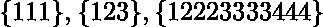
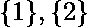
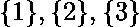
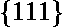
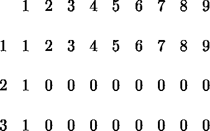
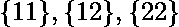
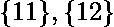
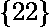
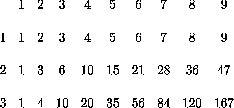

# 计算 n 个单调数字的个数

> 原文:[https://www . geesforgeks . org/counting-numbers-n-digits-单调/](https://www.geeksforgeeks.org/counting-numbers-n-digits-monotone/)

在下列情况下，将十进制数称为单调数:

![   D[\, i]\, \leqslant D[\, i+1]\, 0 \leqslant i \leqslant |D| ](img/925084ceede3784fb1c723e290677209.png "Rendered by QuickLaTeX.com")。

编写一个程序，在输入时取正数 n，并返回长度为 n 的单调十进制数。数字不能以 0 开头。
 **例:**

```
Input : 1
Output : 9
Numbers are 1, 2, 3, ... 9

Input : 2
Output : 45
Numbers are 11, 12, 13, .... 22, 23
...29, 33, 34, ... 39.
Count is 9 + 8 + 7 ... + 1 = 45

```

说明:先以单调数字为例:

所有这些数字都是单调的，因为较高位置的每个数字都比它之前的数字高。
长度为 1，数字为 1 或 2 的单调数字有哪些？一开始就问自己是个问题。我们可以看到，可能的数字有:


这很简单，现在让我们将问题扩展到数字 1、2 和 3:


现在不同的问题，只有 1 和长度 3 的单调数字有哪些？


现在让我们尝试在长度为 3 的二维数组中绘制这个非常简单的观察值，其中第一列是字符串的长度，第一行是可能的数字:


让我们尝试填充第三行第三列(由长度为 2 的数字 1 或 2 组成的单调数字的数目)。这应该是:
如果我们仔细看，我们已经有了这个集合的子集，即:
–长度为 2 且由 1 或 2 组成的单调数
–长度为 2 且由 2 组成的单调数

我们只需要添加以前的值来获得更长的值。
最终矩阵应该是这样的:



## C++

```
// CPP program to count numbers of n digits
// that are  monotone.
#include <cstring>
#include <iostream>

// Considering all possible digits as
// {1, 2, 3, ..9}
int static const DP_s = 9;

int getNumMonotone(int len)
{

    // DP[i][j] is going to store monotone
    // numbers of length i+1 considering
    // j+1 digits.
    int DP[len][DP_s];
    memset(DP, 0, sizeof(DP));

    // Unit length numbers
    for (int i = 0; i < DP_s; ++i)
        DP[0][i] = i + 1;

    // Single digit numbers
    for (int i = 0; i < len; ++i)
        DP[i][0] = 1;

    // Filling rest of the entries in bottom
    // up manner.
    for (int i = 1; i < len; ++i)
        for (int j = 1; j < DP_s; ++j)
            DP[i][j] = DP[i - 1][j] + DP[i][j - 1];

    return DP[len - 1][DP_s - 1];
}

// Driver code.
int main()
{
    std::cout << getNumMonotone(10);
    return 0;
}
```

## Java 语言(一种计算机语言，尤用于创建网站)

```
// Java program to count numbers 
// of n digits that are monotone.

class GFG 
{
    // Considering all possible 
    // digits as {1, 2, 3, ..9}
    static final int DP_s = 9;

    static int getNumMonotone(int len)
    {

        // DP[i][j] is going to store 
        // monotone numbers of length 
        // i+1 considering j+1 digits.
        int[][] DP = new int[len][DP_s];

        // Unit length numbers
        for (int i = 0; i < DP_s; ++i)
            DP[0][i] = i + 1;

        // Single digit numbers
        for (int i = 0; i < len; ++i)
            DP[i][0] = 1;

        // Filling rest of the entries 
        // in bottom up manner.
        for (int i = 1; i < len; ++i)
            for (int j = 1; j < DP_s; ++j)
                DP[i][j] = DP[i - 1][j] 
                           + DP[i][j - 1];

        return DP[len - 1][DP_s - 1];
    }

    // Driver code.
    public static void main (String[] args) 
    {
        System.out.println(getNumMonotone(10));
    }
}

// This code is contributed by Ansu Kumari.
```

## 蟒蛇 3

```
# Python3 program to count numbers of n 
# digits that are monotone.

# Considering all possible digits as
# {1, 2, 3, ..9}
DP_s = 9

def getNumMonotone(ln):

    # DP[i][j] is going to store monotone
    # numbers of length i+1 considering
    # j+1 digits.
    DP = [[0]*DP_s for i in range(ln)]

    # Unit length numbers
    for i in range(DP_s):
        DP[0][i] = i + 1

    # Single digit numbers
    for i in range(ln):
        DP[i][0] = 1

    # Filling rest of the entries  
    # in bottom up manner.
    for i in range(1, ln):

        for j in range(1, DP_s):
            DP[i][j] = DP[i - 1][j] + DP[i][j - 1]

    return DP[ln - 1][DP_s - 1]

# Driver code
print(getNumMonotone(10))

# This code is contributed by Ansu Kumari
```

## C#

```
// C# program to count numbers 
// of n digits that are monotone.
using System;

class GFG 
{
    // Considering all possible 
    // digits as {1, 2, 3, ..9}
    static int DP_s = 9;

    static int getNumMonotone(int len)
    {

        // DP[i][j] is going to store 
        // monotone numbers of length 
        // i+1 considering j+1 digits.
        int[,] DP = new int[len,DP_s];

        // Unit length numbers
        for (int i = 0; i < DP_s; ++i)
            DP[0,i] = i + 1;

        // Single digit numbers
        for (int i = 0; i < len; ++i)
            DP[i,0] = 1;

        // Filling rest of the entries 
        // in bottom up manner.
        for (int i = 1; i < len; ++i)
            for (int j = 1; j < DP_s; ++j)
                DP[i,j] = DP[i - 1,j] 
                        + DP[i,j - 1];

        return DP[len - 1,DP_s - 1];
    }

    // Driver code.
    public static void Main () 
    {
        Console.WriteLine(getNumMonotone(10));
    }
}

// This code is contributed by vt_m.
```

## 服务器端编程语言（Professional Hypertext Preprocessor 的缩写）

```
<?php
// PHP program to count numbers 
// of n digits that are monotone.
function getNumMonotone($len)
{
    // Considering all possible
    // digits as {1, 2, 3, ..9}
    $DP_s = 9;

    // DP[i][j] is going to store 
    // monotone numbers of length 
    // i+1 considering j+1 digits.
    $DP = array(array_fill(0, $len, 0),
                array_fill(0, $len, 0));

    // Unit length numbers
    for ($i = 0; $i < $DP_s; ++$i)
        $DP[0][$i] = $i + 1;

    // Single digit numbers
    for ($i = 0; $i < $len; ++$i)
        $DP[$i][0] = 1;

    // Filling rest of the entries 
    // in bottom up manner.
    for ($i = 1; $i < $len; ++$i)
        for ($j = 1; $j < $DP_s; ++$j)
            $DP[$i][$j] = $DP[$i - 1][$j] + 
                          $DP[$i][$j - 1];

    return $DP[$len - 1][$DP_s - 1];
}

// Driver code
echo getNumMonotone(10);

// This code is contributed by mits
?>
```

**Output :**

```
43758

```