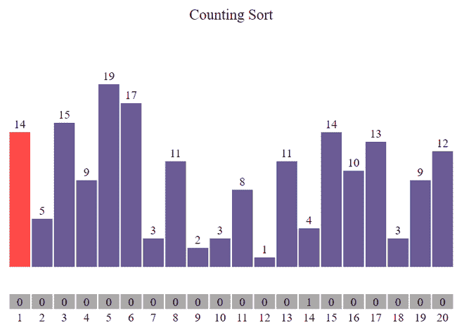
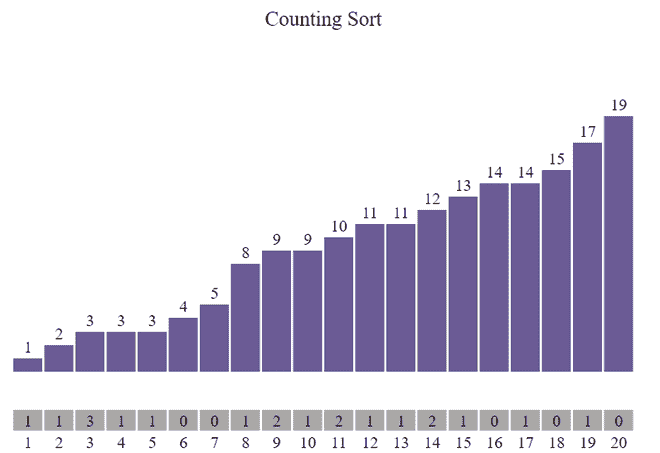

# 使用 JavaScript 计算排序可视化

> 原文:[https://www . geesforgeks . org/counting-sort-visualization-use-JavaScript/](https://www.geeksforgeeks.org/counting-sort-visualization-using-javascript/)

**图形用户界面**比程序更容易理解。在本文中，我们将使用 JavaScript 可视化计数排序。我们将看到元素的频率是如何存储的，以及我们如何得到最终的排序数组。我们还将可视化计数排序的时间复杂性。

**参考:**

*   [计数排序](https://www.geeksforgeeks.org/counting-sort/)
*   [JavaScript 中的异步函数](https://www.geeksforgeeks.org/how-to-create-an-asynchronous-function-in-javascript/)

**进场:**

*   首先，我们将使用[**math . random()**](https://www.geeksforgeeks.org/javascript-math-random-method/)**函数生成一个随机数组。**
*   **不同的颜色用于指示哪个元素正在被**遍历**。**
*   **另一个数组用于存储给定元素的**频率**。**
*   **由于算法执行运算速度非常快，**[**setTimeout()**](https://www.geeksforgeeks.org/java-script-settimeout-setinterval-method/)**功能已被用于减缓进程。******
*   ******按**“Ctrl+R”**键可生成新数组。******
*   ****使用**计数排序()**功能进行排序。****

******示例:******

****

排序前**** ****

排序后**** 

****下面是可视化[计数排序](https://www.geeksforgeeks.org/counting-sort/)算法的程序。所有的章节代码都一一覆盖。****

## ****index.html****

```
**<!DOCTYPE html>
<html lang="en">
  <head>
    <link rel="stylesheet" href="style.css" />
  </head>

  <body>
    <br />
    <p class="header">Counting Sort</p>

    <div id="array"></div>
    <br />
    <br />

    <div id="count"></div>

    <script src="script.js"></script>
  </body>
</html>**
```

## ****style.css****

```
*** {
  margin: 0px;
  padding: 0px;
  box-sizing: border-box;
}

.header {
  font-size: 20px;
  text-align: center;
}

#array {
  background-color: white;
  height: 265px;
  width: 598px;
  margin: auto;
  position: relative;
  margin-top: 64px;
}

.block {
  width: 28px;
  background-color: #6b5b95;
  position: absolute;
  bottom: 0px;
  transition: 0.2s all ease;
}

.block2 {
  width: 28px;
  background-color: darkgray;
  position: absolute;
  transition: 0.2s all ease;
}
.block_id {
  position: absolute;
  color: black;
  margin-top: -20px;
  width: 100%;
  text-align: center;
}
.block_id2 {
  position: absolute;
  color: black;
  margin-top: 22px;
  width: 100%;
  text-align: center;
}

.block_id3 {
  position: absolute;
  color: black;
  margin-top: 1px;
  width: 100%;
  text-align: center;
}

#count {
  height: 265px;
  width: 598px;
  margin: auto;
}**
```

## ****script.js****

```
**var container = document.getElementById("array");

// Function to generate the array of blocks
function generatearray() {
  for (var i = 0; i < 20; i++) {
    // Return a value from 1 to 100 (both inclusive)
    var value = Math.ceil(Math.random() * 20);

    // Creating element div
    var array_ele = document.createElement("div");

    // Adding class 'block' to div
    array_ele.classList.add("block");

    // Adding style to div
    array_ele.style.height = `${value * 13}px`;
    array_ele.style.transform = `translate(${i * 30}px)`;

    // Creating label element for displaying
    // size of particular block
    var array_ele_label = document.createElement("label");
    array_ele_label.classList.add("block_id");
    array_ele_label.innerText = value;

    // Appending created elements to index.html
    array_ele.appendChild(array_ele_label);
    container.appendChild(array_ele);
  }
}

// Function to generate the frequency array
var count_container = document.getElementById("count");
function generate_freq() {
  for (var i = 0; i < 20; i++) {
    // Creating element div
    var array_ele2 = document.createElement("div");

    // Adding class 'block2' to div
    array_ele2.classList.add("block2");

    // Adding style to div
    array_ele2.style.height = `${20}px`;
    array_ele2.style.transform = `translate(${i * 30}px)`;

    // index of freq array
    var array_ele_idx = document.createElement("label");
    array_ele_idx.classList.add("block_id2");
    array_ele_idx.innerText = i + 1;

    //giving initial freq to all blocks as 0
    var array_ele_label2 = document.createElement("label");
    array_ele_label2.classList.add("block_id3");
    array_ele_label2.innerText = 0;

    // Appending created elements to index.html
    array_ele2.appendChild(array_ele_label2);
    array_ele2.appendChild(array_ele_idx);
    count_container.appendChild(array_ele2);
  }
}

// Asynchronous CountingSort function
async function CountingSort(delay = 250) {
  var blocks = document.querySelectorAll(".block");

  // To store frequency of every block
  for (var i = 0; i < blocks.length; i += 1) {
    //To highlight the current traversed block
    blocks[i].style.backgroundColor = "#FF4949";

    //Extracting the value of current block
    var value = Number(blocks[i].childNodes[0].innerHTML);

    var freq_array = document.getElementsByClassName("block_id3");

    freq_array[value - 1].innerText++;

    // To wait for .1 sec
    await new Promise((resolve) =>
      setTimeout(() => {
        resolve();
      }, delay)
    );

    //Changing to previous color
    blocks[i].style.backgroundColor = "#6b5b95";
  }

  //Sorting by using frequency array
  var idx = 0;
  for (var i = 0; i < blocks.length; i += 1) {
    var freq = document.getElementsByClassName("block_id3");

    var temp = Number(freq[i].innerText);

    var freq_block = document.getElementsByClassName("block2");

    //changing color of freq block
    freq_block[i].style.backgroundColor = "#FF4949";

    // To wait for .1 sec
    await new Promise((resolve) =>
      setTimeout(() => {
        resolve();
      }, 2 * delay)
    );

    if (temp == 0) {
      //changing color of freq block to previous one
      freq_block[i].style.backgroundColor = "darkgray";
      continue;
    }

    var block_label = document.getElementsByClassName("block_id");

    //sorting the block array
    for (var j = 0; j < temp; j++) {
      blocks[idx].style.height = `${(i + 1) * 13}px`;
      block_label[idx].innerText = i + 1;
      idx++;
    }

    //changing color of freq block to previous one
    freq_block[i].style.backgroundColor = "darkgray";

    // To wait for .1 sec
    await new Promise((resolve) =>
      setTimeout(() => {
        resolve();
      }, 2 * delay)
    );
  }
}

// Calling generatearray function
generatearray();

// Calling generate_freq function
generate_freq();

// Calling CountingSort function
CountingSort();**
```

******输出:******

********