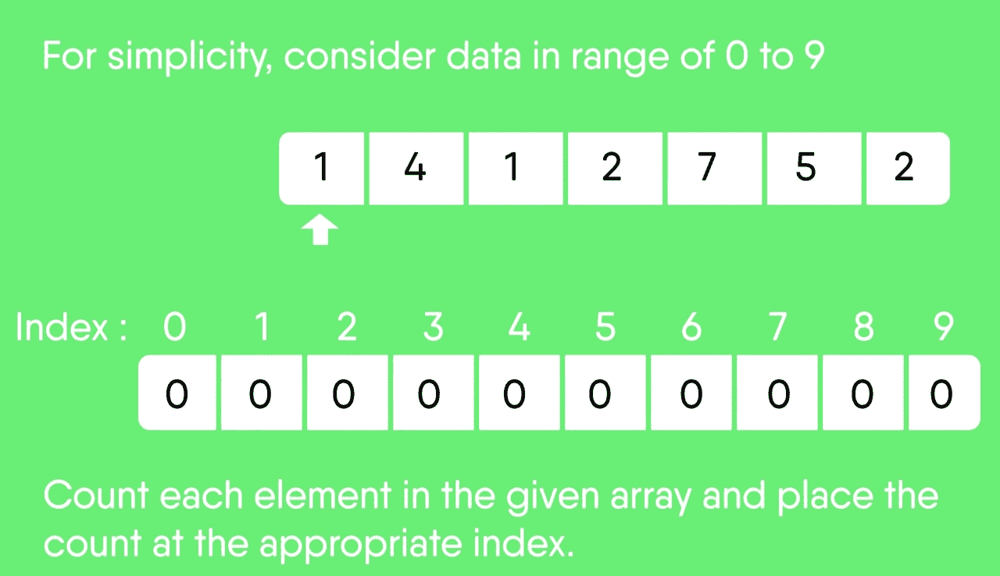
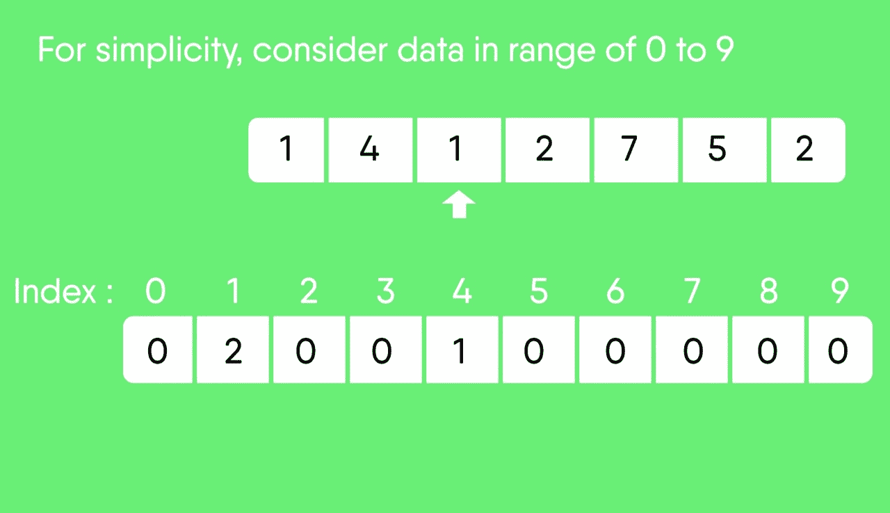
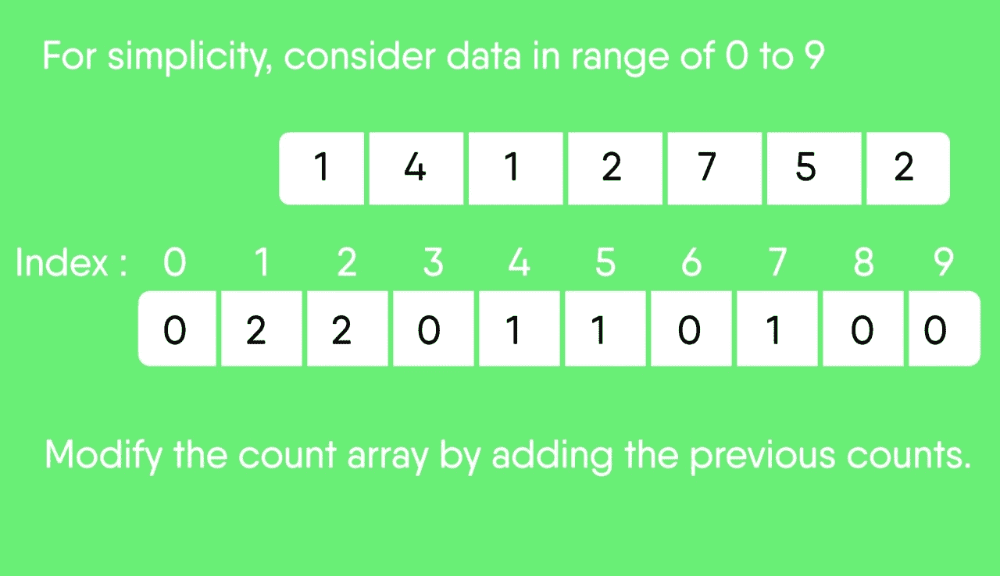
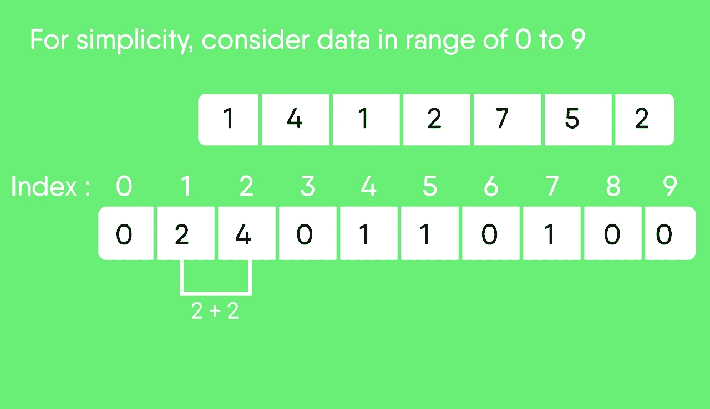
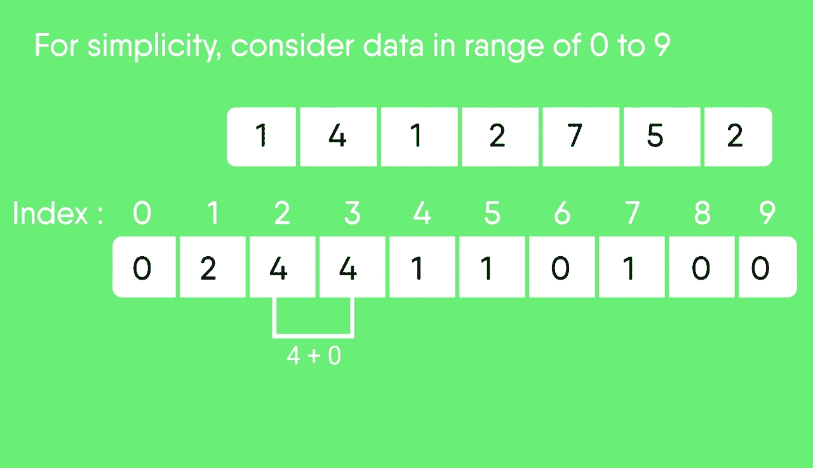
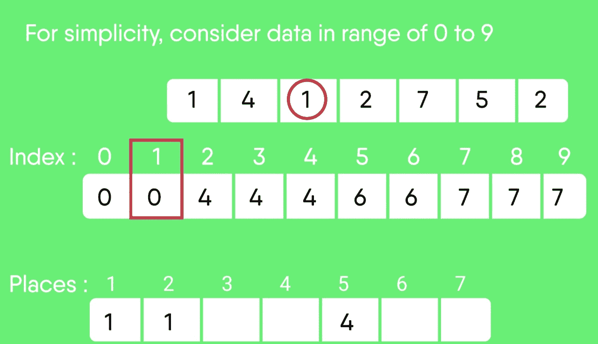
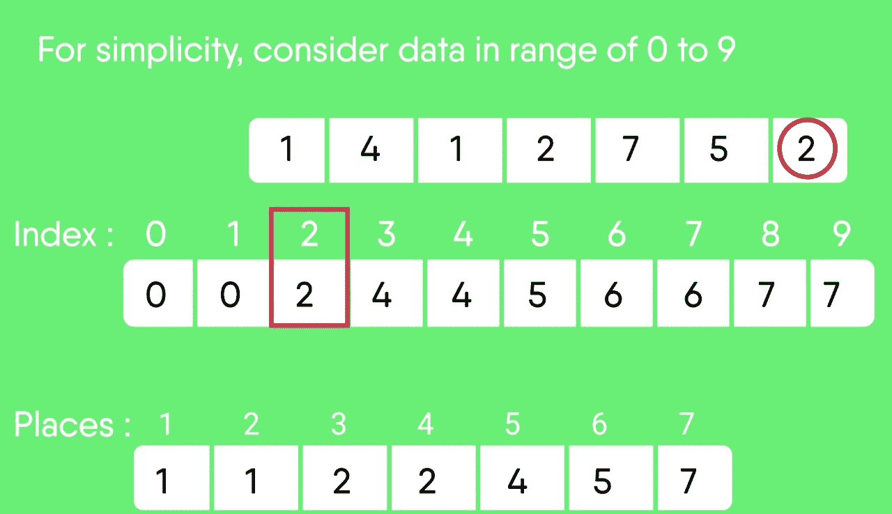

# 计数排序

> 原文:[https://www.geeksforgeeks.org/counting-sort/](https://www.geeksforgeeks.org/counting-sort/)

[计数排序](http://en.wikipedia.org/wiki/Counting_sort)是一种基于特定范围之间的键的排序技术。它的工作原理是计算具有不同键值的对象的数量(某种散列法)。然后做一些算术来计算输出序列中每个对象的位置。

让我们借助一个例子来理解它。

```
For simplicity, consider the data in the range 0 to 9\. 
Input data: 1, 4, 1, 2, 7, 5, 2
  1) Take a count array to store the count of each unique object.
  Index:     0  1  2  3  4  5  6  7  8  9
  Count:     0  2  2  0   1  1  0  1  0  0

  2) Modify the count array such that each element at each index 
  stores the sum of previous counts. 
  Index:     0  1  2  3  4  5  6  7  8  9
  Count:     0  2  4  4  5  6  6  7  7  7

The modified count array indicates the position of each object in 
the output sequence.

  3) Rotate the array clockwise for one time.
   Index:     0 1 2 3 4 5 6 7 8 9
   Count:     0 0 2 4 4 5 6 6 7 7

  4) Output each object from the input sequence followed by 
  increasing its count by 1.
  Process the input data: 1, 4, 1, 2, 7, 5, 2\. Position of 1 is 0.
  Put data 1 at index 0 in output. Increase count by 1 to place 
  next data 1 at an index 1 greater than this index.
```

下面是计数排序的实现。

## C++

```
// C++ Program for counting sort
#include <bits/stdc++.h>
#include <string.h>
using namespace std;
#define RANGE 255

// The main function that sort
// the given string arr[] in
// alphabetical order
void countSort(char arr[])
{
    // The output character array
    // that will have sorted arr
    char output[strlen(arr)];

    // Create a count array to store count of individual
    // characters and initialize count array as 0
    int count[RANGE + 1], i;
    memset(count, 0, sizeof(count));

    // Store count of each character
    for (i = 0; arr[i]; ++i)
        ++count[arr[i]];

    // Change count[i] so that count[i] now contains actual
    // position of this character in output array
    for (i = 1; i <= RANGE; ++i)
        count[i] += count[i - 1];

    // Build the output character array
    for (i = 0; arr[i]; ++i) {
        output[count[arr[i]] - 1] = arr[i];
        --count[arr[i]];
    }

    /*
    For Stable algorithm
    for (i = sizeof(arr)-1; i>=0; --i)
    {
        output[count[arr[i]]-1] = arr[i];
        --count[arr[i]];
    }

    For Logic : See implementation
    */

    // Copy the output array to arr, so that arr now
    // contains sorted characters
    for (i = 0; arr[i]; ++i)
        arr[i] = output[i];
}

// Driver  code
int main()
{
    char arr[] = "geeksforgeeks";

    countSort(arr);

    cout << "Sorted character array is " << arr;
    return 0;
}

// This code is contributed by rathbhupendra
```

## C

```
// C Program for counting sort
#include <stdio.h>
#include <string.h>
#define RANGE 255

// The main function that sort the given string arr[] in
// alphabetical order
void countSort(char arr[])
{
    // The output character array that will have sorted arr
    char output[strlen(arr)];

    // Create a count array to store count of individual
    // characters and initialize count array as 0
    int count[RANGE + 1], i;
    memset(count, 0, sizeof(count));

    // Store count of each character
    for (i = 0; arr[i]; ++i)
        ++count[arr[i]];

    // Change count[i] so that count[i] now contains actual
    // position of this character in output array
    for (i = 1; i <= RANGE; ++i)
        count[i] += count[i - 1];

    // Build the output character array
    for (i = 0; arr[i]; ++i) {
        output[count[arr[i]] - 1] = arr[i];
        --count[arr[i]];
    }

    /*
     For Stable algorithm
     for (i = sizeof(arr)-1; i>=0; --i)
    {
        output[count[arr[i]]-1] = arr[i];
        --count[arr[i]];
    }

    For Logic : See implementation
    */

    // Copy the output array to arr, so that arr now
    // contains sorted characters
    for (i = 0; arr[i]; ++i)
        arr[i] = output[i];
}

// Driver program to test above function
int main()
{
    char arr[] = "geeksforgeeks"; //"applepp";

    countSort(arr);

    printf("Sorted character array is %sn", arr);
    return 0;
}
```

## Java 语言(一种计算机语言，尤用于创建网站)

```
// Java implementation of Counting Sort
class CountingSort {
    void sort(char arr[])
    {
        int n = arr.length;

        // The output character array that will have sorted arr
        char output[] = new char[n];

        // Create a count array to store count of individual
        // characters and initialize count array as 0
        int count[] = new int[256];
        for (int i = 0; i < 256; ++i)
            count[i] = 0;

        // store count of each character
        for (int i = 0; i < n; ++i)
            ++count[arr[i]];

        // Change count[i] so that count[i] now contains actual
        // position of this character in output array
        for (int i = 1; i <= 255; ++i)
            count[i] += count[i - 1];

        // Build the output character array
        // To make it stable we are operating in reverse order.
        for (int i = n - 1; i >= 0; i--) {
            output[count[arr[i]] - 1] = arr[i];
            --count[arr[i]];
        }

        // Copy the output array to arr, so that arr now
        // contains sorted characters
        for (int i = 0; i < n; ++i)
            arr[i] = output[i];
    }

    // Driver method
    public static void main(String args[])
    {
        CountingSort ob = new CountingSort();
        char arr[] = { 'g', 'e', 'e', 'k', 's', 'f', 'o',
                       'r', 'g', 'e', 'e', 'k', 's' };

        ob.sort(arr);

        System.out.print("Sorted character array is ");
        for (int i = 0; i < arr.length; ++i)
            System.out.print(arr[i]);
    }
}
/*This code is contributed by Rajat Mishra */
```

## 蟒蛇 3

```
# Python program for counting sort

# The main function that sort the given string arr[] in
# alphabetical order
def countSort(arr):

    # The output character array that will have sorted arr
    output = [0 for i in range(len(arr))]

    # Create a count array to store count of individual
    # characters and initialize count array as 0
    count = [0 for i in range(256)]

    # For storing the resulting answer since the
    # string is immutable
    ans = ["" for _ in arr]

    # Store count of each character
    for i in arr:
        count[ord(i)] += 1

    # Change count[i] so that count[i] now contains actual
    # position of this character in output array
    for i in range(256):
        count[i] += count[i-1]

    # Build the output character array
    for i in range(len(arr)):
        output[count[ord(arr[i])]-1] = arr[i]
        count[ord(arr[i])] -= 1

    # Copy the output array to arr, so that arr now
    # contains sorted characters
    for i in range(len(arr)):
        ans[i] = output[i]
    return ans

# Driver program to test above function
arr = "geeksforgeeks"
ans = countSort(arr)
print("Sorted character array is % s" %("".join(ans)))

# This code is contributed by Nikhil Kumar Singh
```

## C#

```
// C# implementation of Counting Sort
using System;

class GFG {

    static void countsort(char[] arr)
    {
        int n = arr.Length;

        // The output character array that
        // will have sorted arr
        char[] output = new char[n];

        // Create a count array to store
        // count of individual characters
        // and initialize count array as 0
        int[] count = new int[256];

        for (int i = 0; i < 256; ++i)
            count[i] = 0;

        // store count of each character
        for (int i = 0; i < n; ++i)
            ++count[arr[i]];

        // Change count[i] so that count[i]
        // now contains actual position of
        // this character in output array
        for (int i = 1; i <= 255; ++i)
            count[i] += count[i - 1];

        // Build the output character array
        // To make it stable we are operating in reverse order.
        for (int i = n - 1; i >= 0; i--) {
            output[count[arr[i]] - 1] = arr[i];
            --count[arr[i]];
        }

        // Copy the output array to arr, so
        // that arr now contains sorted
        // characters
        for (int i = 0; i < n; ++i)
            arr[i] = output[i];
    }

    // Driver method
    public static void Main()
    {

        char[] arr = { 'g', 'e', 'e', 'k', 's', 'f', 'o',
                       'r', 'g', 'e', 'e', 'k', 's' };

        countsort(arr);

        Console.Write("Sorted character array is ");
        for (int i = 0; i < arr.Length; ++i)
            Console.Write(arr[i]);
    }
}

// This code is contributed by Sam007.
```

## 服务器端编程语言（Professional Hypertext Preprocessor 的缩写）

```
<?php
// PHP Program for counting sort

$RANGE = 255;

// The main function that sort
// the given string arr[] in
// alphabetical order
function countSort($arr)
{
    global $RANGE;

    // The output character array
    // that will have sorted arr
    $output = array(strlen($arr));
    $len = strlen($arr);

    // Create a count array to
    // store count of individual
    // characters and initialize
    // count array as 0
    $count = array_fill(0, $RANGE + 1, 0);

    // Store count of
    // each character
    for($i = 0; $i < $len; ++$i)
        ++$count[ord($arr[$i])];

    // Change count[i] so that
    // count[i] now contains
    // actual position of this
    // character in output array
    for ($i = 1; $i <= $RANGE; ++$i)
        $count[$i] += $count[$i - 1];

    // Build the output
    // character array
    // To make it stable we are operating
    // in reverse order.
    for ($i = $len-1; $i >= 0 ; $i--)
    {
        $output[$count[ord($arr[$i])] - 1] = $arr[$i];
        --$count[ord($arr[$i])];
    }

    // Copy the output array to
    // arr, so that arr now
    // contains sorted characters
    for ($i = 0; $i < $len; ++$i)
        $arr[$i] = $output[$i];
return $arr;
}

// Driver Code
$arr = "geeksforgeeks"; //"applepp";

$arr = countSort($arr);

echo "Sorted character array is " . $arr;

// This code is contributed by mits
?>
```

## java 描述语言

```
Javas<script>

// Javascript implementation of Counting Sort
function sort(arr)
{
    var n = arr.length;

    // The output character array that will have sorted arr
    var output = Array.from({length: n}, (_, i) => 0);

    // Create a count array to store count of individual
    // characters and initialize count array as 0
    var count = Array.from({length: 256}, (_, i) => 0);

    // store count of each character
    for (var i = 0; i < n; ++i)
        ++count[arr[i].charCodeAt(0)];
    // Change count[i] so that count[i] now contains actual
    // position of this character in output array
    for (var i = 1; i <= 255; ++i)
        count[i] += count[i - 1];

    // Build the output character array
    // To make it stable we are operating in reverse order.
    for (var i = n - 1; i >= 0; i--) {
        output[count[arr[i].charCodeAt(0)] - 1] = arr[i];
        --count[arr[i].charCodeAt(0)];
    }

    // Copy the output array to arr, so that arr now
    // contains sorted characters
    for (var i = 0; i < n; ++i)
        arr[i] = output[i];
     return arr;
}

// Driver method
    var arr = [ 'g', 'e', 'e', 'k', 's', 'f', 'o',
                   'r', 'g', 'e', 'e', 'k', 's' ];

    arr = sort(arr);
    document.write("Sorted character array is ");
    for (var i = 0; i < arr.length; ++i)
        document.write(arr[i]);

// This code is contributed by shikhasingrajput
</script>
cript
```

**输出:**

```
Sorted character array is eeeefggkkorss
```

**时间复杂度:** O(n+k)，其中 n 为输入数组中的元素个数，k 为输入的范围。
**辅助空间:** O(n+k)

以前计数排序的问题是，如果元素中有负数，我们就不能排序。因为没有负数组索引。所以我们要做的是，找到最小元素，然后将该最小元素的计数存储在零索引处。

## C++

```
// Counting sort which takes negative numbers as well
#include <algorithm>
#include <iostream>
#include <vector>
using namespace std;

void countSort(vector<int>& arr)
{
    int max = *max_element(arr.begin(), arr.end());
    int min = *min_element(arr.begin(), arr.end());
    int range = max - min + 1;

    vector<int> count(range), output(arr.size());
    for (int i = 0; i < arr.size(); i++)
        count[arr[i] - min]++;

    for (int i = 1; i < count.size(); i++)
        count[i] += count[i - 1];

    for (int i = arr.size() - 1; i >= 0; i--) {
        output[count[arr[i] - min] - 1] = arr[i];
        count[arr[i] - min]--;
    }

    for (int i = 0; i < arr.size(); i++)
        arr[i] = output[i];
}

void printArray(vector<int>& arr)
{
    for (int i = 0; i < arr.size(); i++)
        cout << arr[i] << " ";
    cout << "\n";
}

int main()
{
    vector<int> arr = { -5, -10, 0, -3, 8, 5, -1, 10 };
    countSort(arr);
    printArray(arr);
    return 0;
}
```

## Java 语言(一种计算机语言，尤用于创建网站)

```
// Counting sort which takes negative numbers as well
import java.util.*;

class GFG {

    static void countSort(int[] arr)
    {
        int max = Arrays.stream(arr).max().getAsInt();
        int min = Arrays.stream(arr).min().getAsInt();
        int range = max - min + 1;
        int count[] = new int[range];
        int output[] = new int[arr.length];
        for (int i = 0; i < arr.length; i++) {
            count[arr[i] - min]++;
        }

        for (int i = 1; i < count.length; i++) {
            count[i] += count[i - 1];
        }

        for (int i = arr.length - 1; i >= 0; i--) {
            output[count[arr[i] - min] - 1] = arr[i];
            count[arr[i] - min]--;
        }

        for (int i = 0; i < arr.length; i++) {
            arr[i] = output[i];
        }
    }

    static void printArray(int[] arr)
    {
        for (int i = 0; i < arr.length; i++) {
            System.out.print(arr[i] + " ");
        }
        System.out.println("");
    }

    // Driver code
    public static void main(String[] args)
    {
        int[] arr = { -5, -10, 0, -3, 8, 5, -1, 10 };
        countSort(arr);
        printArray(arr);
    }
}

// This code is contributed by princiRaj1992
```

## 蟒蛇 3

```
# Python program for counting sort
# which takes negative numbers as well

# The function that sorts the given arr[]
def count_sort(arr):
    max_element = int(max(arr))
    min_element = int(min(arr))
    range_of_elements = max_element - min_element + 1
    # Create a count array to store count of individual
    # elements and initialize count array as 0
    count_arr = [0 for _ in range(range_of_elements)]
    output_arr = [0 for _ in range(len(arr))]

    # Store count of each character
    for i in range(0, len(arr)):
        count_arr[arr[i]-min_element] += 1

    # Change count_arr[i] so that count_arr[i] now contains actual
    # position of this element in output array
    for i in range(1, len(count_arr)):
        count_arr[i] += count_arr[i-1]

    # Build the output character array
    for i in range(len(arr)-1, -1, -1):
        output_arr[count_arr[arr[i] - min_element] - 1] = arr[i]
        count_arr[arr[i] - min_element] -= 1

    # Copy the output array to arr, so that arr now
    # contains sorted characters
    for i in range(0, len(arr)):
        arr[i] = output_arr[i]

    return arr

# Driver program to test above function
arr = [-5, -10, 0, -3, 8, 5, -1, 10]
ans = count_sort(arr)
print("Sorted character array is " + str(ans))
```

## C#

```
// Counting sort which takes negative numbers as well
using System;
using System.Collections.Generic;
using System.Linq;
class GFG
{
  static void countSort(int[] arr)
  {
    int max = arr.Max();
    int min = arr.Min();
    int range = max - min + 1;
    int []count = new int[range];
    int []output = new int[arr.Length];
    for (int i = 0; i < arr.Length; i++) {
      count[arr[i] - min]++;
    }
    for (int i = 1; i < count.Length; i++) {
      count[i] += count[i - 1];
    }
    for (int i = arr.Length - 1; i >= 0; i--) {
      output[count[arr[i] - min] - 1] = arr[i];
      count[arr[i] - min]--;
    }
    for (int i = 0; i < arr.Length; i++) {
      arr[i] = output[i];
    }
  }
  static void printArray(int[] arr)
  {
    for (int i = 0; i < arr.Length; i++)
    {
      Console.Write(arr[i] + " ");
    }
    Console.WriteLine("");
  }

  // Driver code
  public static void Main(string[] args)
  {
    int[] arr = { -5, -10, 0, -3, 8, 5, -1, 10 };
    countSort(arr);
    printArray(arr);
  }
}

// This code is contributed by rutvik_56.
```

## java 描述语言

```
<script>
// Counting sort which takes negative numbers as well

    function countSort(arr)
    {
    var max = Math.max.apply(Math, arr);
    var min = Math.min.apply(Math, arr);

    var range = max - min + 1;
    var count = Array.from({length: range}, (_, i) => 0);
    var output = Array.from({length: arr.length}, (_, i) => 0);
    for (i = 0; i < arr.length; i++) {
        count[arr[i] - min]++;
    }

    for (i = 1; i < count.length; i++) {
        count[i] += count[i - 1];
    }

    for (i = arr.length - 1; i >= 0; i--) {
        output[count[arr[i] - min] - 1] = arr[i];
        count[arr[i] - min]--;
    }

    for (i = 0; i < arr.length; i++) {
        arr[i] = output[i];
    }
}

function printArray(arr)
{
    for (i = 0; i < arr.length; i++)
    {
        document.write(arr[i] + " ");
    }
document.write('<br>');
}

// Driver code
var arr = [ -5, -10, 0, -3, 8, 5, -1, 10 ];
countSort(arr);
printArray(arr);

// This code is contributed by Amit Katiyar
</script>
```

**输出:**

```
-10 -5 -3 -1 0 5 8 10 
```

**需注意的点:**
**1。**如果输入数据的范围没有明显大于要排序的对象的数量，计数排序是有效的。考虑输入序列在范围 1 到 10K 之间，数据为 10，5，10K，5K 的情况。
**2。**不是基于比较的排序。它的运行时间复杂度为 O(n)，空间与数据范围成正比。
**3。**经常被用作基数排序等另一种排序算法的子程序。
**4。**计数排序使用部分散列来计数数据对象在 O(1)中的出现。
**5。**计数排序也可以扩展到负输入。

**锻炼:**
**1。**修改以上代码，对输入数据进行排序，排序范围从 M 到 n。
**2。**计数排序稳定在线吗？
**3。**计数排序算法并行化的思考。

**快照:**

      

## [计数排序测验](http://geeksquiz.com/quiz-countingsort/)

## [分类编码练习](https://practice.geeksforgeeks.org/tag-page.php?tag=sorting&isCmp=0)

GeeksforGeeks 上的其他排序算法
[选择排序](http://geeksquiz.com/selection-sort/)、[冒泡排序](http://geeksquiz.com/bubble-sort/)、[插入排序](http://geeksquiz.com/insertion-sort/)、[合并排序](http://geeksquiz.com/merge-sort/)、[堆排序](http://geeksquiz.com/heap-sort/)、[快速排序](http://geeksquiz.com/quick-sort/)、[基数排序](https://www.geeksforgeeks.org/radix-sort/)、[计数排序](https://www.geeksforgeeks.org/counting-sort/)、[桶排序](https://www.geeksforgeeks.org/bucket-sort-2/)、[壳排序](http://geeksquiz.com/shellsort/)、[梳状排序【T22 如果你发现任何不正确的地方，或者你想分享更多关于上面讨论的话题的信息，请写评论。](https://www.geeksforgeeks.org/comb-sort/)