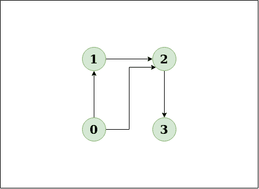
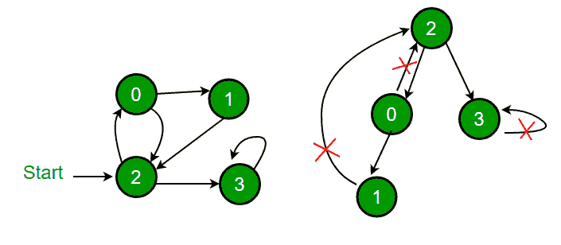

# 使用颜色

在有向图中检测循环

> 原文： [https://www.geeksforgeeks.org/detect-cycle-direct-graph-using-colors/](https://www.geeksforgeeks.org/detect-cycle-direct-graph-using-colors/)

给定有向图，请检查该图是否包含循环。 如果给定图包含至少一个循环，则函数应返回 true，否则返回 false。

**示例**：

> **输入**：n = 4，e = 6
> 0-> 1，0-> 2，1-> 2，2-> 0，2-> 3，3-> 3
> **输出**：`Yes`
> **说明**：
> 
> 该图清楚地显示了一个循环 0-> 2-> 0。
> 
> **输入**：n = 4，e = 3
> 0-> 1，0-> 2，1-> 2，2-> 3
> **输出**：`No`
> **说明**：
> 
> 该图清楚地表明没有循环。

<u>**解决方案**</u> 

**方法**：深度优先遍历可用于检测图形中的循环。 连接图的 DFS 生成一棵树。 仅当图形中存在[后沿](http://en.wikipedia.org/wiki/Depth-first_search#Output_of_a_depth-first_search)时，图形中才会存在一个循环。 后边是指从节点到其自身（自环）或 DFS 生成的树中其祖先之一的边。 在下图中，有 3 个后边，标有十字符号。 可以观察到，这三个后边指示图中存在 3 个循环。



对于断开连接的图，我们将 DFS 林作为输出。 为了检测循环，我们可以通过检查后边来检查单个树中的循环。

*图片来源： [http://www.cs.yale.edu/homes/aspnes/pinewiki/DepthFirstSearch.html](http://www.cs.yale.edu/homes/aspnes/pinewiki/DepthFirstSearch.html)*

在[先前的文章](https://www.geeksforgeeks.org/detect-cycle-in-a-graph/)中，我们讨论了一种将访问的顶点存储在单独的数组中的解决方案，该数组存储当前递归调用堆栈的顶点。

在这篇文章中，讨论了一个不同的解决方案。 解决方案来自 [CLRS 书](http://www.amazon.in/Introduction-Algorithms-Thomas-H-Cormen/dp/8120340078/ref=as_sl_pc_qf_sp_asin_til?tag=geeksforgeeks-21&linkCode=w00&linkId=ECBJHKOAMA4NJO33&creativeASIN=8120340078)。 想法是对给定图进行 DFS，并在遍历时为每个顶点分配以下三种颜色之一。

> **白色**：尚未处理顶点。 最初，所有顶点均为白色。
> 
> **灰色**：正在处理顶点（此顶点的 DFS 已启动，但尚未完成，这意味着该顶点的所有后代（在 DFS 树中）尚未处理（或此顶点在函数调用堆栈中） ）
> 
> **黑色**：处理顶点及其所有后代。 在执行 DFS 时，如果遇到从当前顶点到 GREY 顶点的边，则该边为后边，因此存在一个循环。

**算法**：

1.  创建一个采用 edge 和 color 数组的递归函数（也可以将其保留为全局变量）

2.  将当前节点标记为 GREY。

3.  遍历所有相邻节点，如果任何节点标记为 GREY，则由于存在循环而返回 true。

4.  如果任何相邻的顶点是 WHITE，则调用该节点的递归函数。 如果函数返回 true。 返回 true。

5.  如果没有相邻节点为灰色或未返回 true，则将当前 Node 标记为 BLACK 并返回 false。

**实施**：

## C++

```cpp

// A DFS based approach to find if there is a cycle 
// in a directed graph.  This approach strictly follows 
// the algorithm given in CLRS book. 
#include <bits/stdc++.h> 
using namespace std; 

enum Color {WHITE, GRAY, BLACK}; 

// Graph class represents a directed graph using 
// adjacency list representation 
class Graph 
{ 
    int V; // No. of vertices 
    list<int>* adj; // adjacency lists 

    // DFS traversal of the vertices reachable from v 
    bool DFSUtil(int v, int color[]); 
public: 
    Graph(int V);  // Constructor 

    // function to add an edge to graph 
    void addEdge(int v, int w); 

    bool isCyclic(); 
}; 

// Constructor 
Graph::Graph(int V) 
{ 
    this->V = V; 
    adj = new list<int>[V]; 
} 

// Utility function to add an edge 
void Graph::addEdge(int v, int w) 
{ 
    adj[v].push_back(w); // Add w to v's list. 
} 

// Recursive function to find if there is back edge 
// in DFS subtree tree rooted with 'u' 
bool Graph::DFSUtil(int u, int color[]) 
{ 
    // GRAY :  This vertex is being processed (DFS 
    //         for this vertex has started, but not 
    //         ended (or this vertex is in function 
    //         call stack) 
    color[u] = GRAY; 

    // Iterate through all adjacent vertices 
    list<int>::iterator i; 
    for (i = adj[u].begin(); i != adj[u].end(); ++i) 
    { 
        int v = *i;  // An adjacent of u 

        // If there is 
        if (color[v] == GRAY) 
          return true; 

        // If v is not processed and there is a back 
        // edge in subtree rooted with v 
        if (color[v] == WHITE && DFSUtil(v, color)) 
          return true; 
    } 

    // Mark this vertex as processed 
    color[u] = BLACK; 

    return false; 
} 

// Returns true if there is a cycle in graph 
bool Graph::isCyclic() 
{ 
    // Initialize color of all vertices as WHITE 
    int *color = new int[V]; 
    for (int i = 0; i < V; i++) 
        color[i] = WHITE; 

    // Do a DFS traversal beginning with all 
    // vertices 
    for (int i = 0; i < V; i++) 
        if (color[i] == WHITE) 
           if (DFSUtil(i, color) == true) 
              return true; 

    return false; 
} 

// Driver code to test above 
int main() 
{ 
    // Create a graph given in the above diagram 
    Graph g(4); 
    g.addEdge(0, 1); 
    g.addEdge(0, 2); 
    g.addEdge(1, 2); 
    g.addEdge(2, 0); 
    g.addEdge(2, 3); 
    g.addEdge(3, 3); 

    if (g.isCyclic()) 
        cout << "Graph contains cycle"; 
    else
        cout << "Graph doesn't contain cycle"; 

    return 0; 
} 

```