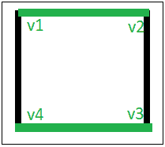

# 图形的边着色

> 原文： [https://www.geeksforgeeks.org/edge-coloring-of-a-graph/](https://www.geeksforgeeks.org/edge-coloring-of-a-graph/)

在图论中，图的边着色是将“颜色”分配给图的边，因此，没有两个相邻的边具有相同的颜色和最佳的颜色数。 如果两个边连接到相同的顶点，则它们称为相邻边。 没有已知的多项式时间算法可以对每个具有最佳颜色数的图形进行边着色。 但是，已经开发出许多算法来放松这些条件中的一个或多个条件，它们仅适用于图形的子集，或者它们并不总是使用最佳数量的颜色，或者它们并不总是在多项式时间内运行。

**范例**：

```
Input : u1 = 1, v1 = 4 
        u2 = 1, v2 = 2
        u3 = 2, v3 = 3
        u4 = 3, v4 = 4
Output : Edge 1 is of color 1
         Edge 2 is of color 2
         Edge 3 is of color 1
         Edge 4 is of color 2

The above input shows the pair of vertices(ui, vi)
who have an edge between them. The output shows the color 
assigned to the respective edges.

```



边着色是几种不同类型的图形着色问题之一。 图表的上图显示了绿色和黑色为图表的边着色，其中没有相邻的边具有相同的颜色。

以下是解决可能无法使用最佳颜色数量的边着色问题的算法：

**算法**：

1.  使用 BFS 遍历开始遍历图形。

2.  拾取任意一个顶点，并为其连接的所有边赋予不同的颜色，并将这些边标记为有色。

3.  遍历其边之一。

4.  重复步骤到一个新的顶点，直到所有边都着色为止。

下面是上述方法的实现：

```

// C++ program to illustrate Edge Coloring 
#include <bits/stdc++.h> 
using namespace std; 

// function to determine the edge colors 
void colorEdges(int ptr, vector<vector<pair<int, int> > >& gra, 
                vector<int>& edgeColors, bool isVisited[]) 
{ 
    queue<int> q; 
    int c = 0; 

    set<int> colored; 

    // return if isVisited[ptr] is true 
    if (isVisited[ptr]) 
        return; 

    // Mark the current node visited 
    isVisited[ptr] = 1; 

    // Traverse all edges of current vertex 
    for (int i = 0; i < gra[ptr].size(); i++) { 
        // if already colored, insert it into the set 
        if (edgeColors[gra[ptr][i].second] != -1) 
            colored.insert(edgeColors[gra[ptr][i].second]); 
    } 

    for (int i = 0; i < gra[ptr].size(); i++) { 
        // if not visited, inset into the queue 
        if (!isVisited[gra[ptr][i].first]) 
            q.push(gra[ptr][i].first); 

        if (edgeColors[gra[ptr][i].second] == -1) { 
            // if col vector -> negative 
            while (colored.find(c) != colored.end()) 

                // increment the color 
                c++; 

            // copy it in the vector 
            edgeColors[gra[ptr][i].second] = c; 

            // then add it to the set 
            colored.insert(c); 
            c++; 
        } 
    } 

    // while queue's not empty 
    while (!q.empty()) { 
        int temp = q.front(); 
        q.pop(); 

        colorEdges(temp, gra, edgeColors, isVisited); 
    } 

    return; 
} 

// Driver Function 
int main() 
{ 
    set<int> empty; 

    // declaring vector of vector of pairs, to define Graph 
    vector<vector<pair<int, int> > > gra; 

    vector<int> edgeColors; 

    bool isVisited[100000] = { 0 }; 

    // Enter the Number of Vertices 
    // and the number of edges 
    int ver = 4; 
    int edge = 4; 

    gra.resize(ver); 
    edgeColors.resize(edge, -1); 

    // Enter edge & vertices of edge 
    // x--; y--; 
    // Since graph is undirected, push both pairs 
    // (x, y) and (y, x) 
    // graph[x].push_back(make_pair(y, i)); 
    // graph[y].push_back(make_pair(x, i)); 
    gra[0].push_back(make_pair(1, 0)); 
    gra[1].push_back(make_pair(0, 0)); 

    gra[1].push_back(make_pair(2, 1)); 
    gra[2].push_back(make_pair(1, 1)); 

    gra[2].push_back(make_pair(3, 2)); 
    gra[3].push_back(make_pair(2, 2)); 

    gra[0].push_back(make_pair(3, 3)); 
    gra[3].push_back(make_pair(0, 3)); 

    colorEdges(0, gra, edgeColors, isVisited); 

    // printing all the edge colors 
    for (int i = 0; i < edge; i++) 
        cout << "Edge " << i + 1 << " is of color "
             << edgeColors[i] + 1 << "\n"; 

    return 0; 
} 

```

**Output:**

```
Edge 1 is of color 1
Edge 2 is of color 2
Edge 3 is of color 1
Edge 4 is of color 2

```

**参考**：[https://en.wikipedia.org/wiki/Edge_coloring](https://en.wikipedia.org/wiki/Edge_coloring)


* * *

* * *

如果您喜欢 GeeksforGeeks 并希望做出贡献，则还可以使用 [tribution.geeksforgeeks.org](https://contribute.geeksforgeeks.org/) 撰写文章，或将您的文章邮寄至 tribution@geeksforgeeks.org。 查看您的文章出现在 GeeksforGeeks 主页上，并帮助其他 Geeks。

如果您发现任何不正确的地方，请单击下面的“改进文章”按钮，以改进本文。