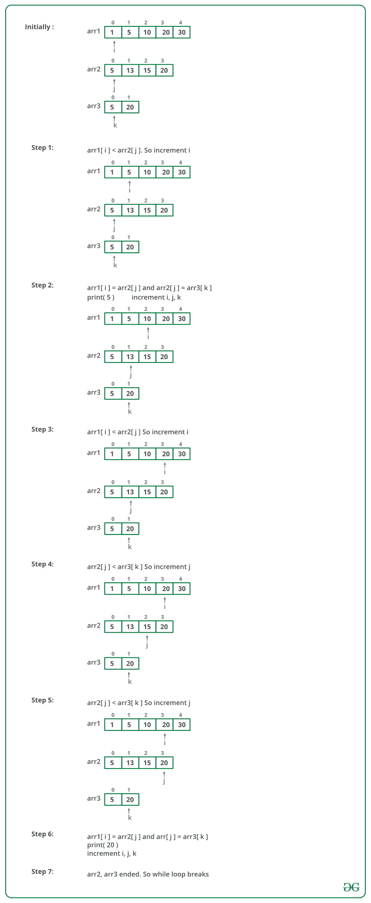

# 在三个排序的数组中查找共同的元素

> 原文： [https://www.geeksforgeeks.org/find-common-elements-three-sorted-arrays/](https://www.geeksforgeeks.org/find-common-elements-three-sorted-arrays/)

给定三个数组以非降序排列，请打印这些数组中的所有常见元素。

**示例**：

> 输入：
> 
> `ar1[] = {1, 5, 10, 20, 40, 80}`
> 
> `ar2[] = {6, 7, 20, 80, 100}`
> 
> `ar3[] = {3, 4, 15, 20, 30, 70, 80, 120}`
> 
> 输出：`20, 80`
> 
> 输入：
> 
> `ar1[] = {1, 5, 5}`
> 
> `ar2[] = {3, 4, 5, 5, 10}`
> 
> `ar3[] = {5, 5, 10, 20}`
> 
> 输出：`5, 5`


一个简单的解决方案是先找到两个数组的[交集](https://www.geeksforgeeks.org/union-and-intersection-of-two-sorted-arrays-2/)，然后将交集存储在一个临时数组中，然后找到第三个数组与临时数组的交集。

该解决方案的时间复杂度为`O(n1 + n2 + n3)`，其中`n1`，`n2`和`n3`分别为`ar1[]`，`ar2[]`和`ar3[]`的大小。

上面的解决方案需要额外的空间和两个循环，我们可以使用一个循环来查找公共元素，而无需额外的空间。 这个想法类似于两个数组的[交集](https://www.geeksforgeeks.org/union-and-intersection-of-two-sorted-arrays-2/)。 就像两个数组循环一样，我们运行一个循环并遍历三个数组。

令在`ar1[]`中遍历的当前元素为`x`，在`ar2[]`中为`y`，在`ar3[]`中为`z`。 我们可以在循环中包含以下几种情况。

*   如果`x`，`y`和`z`相同，我们可以简单地将它们中的任何一个打印为公共元素并在所有三个数组中向前移动。

*   否则，如果`x < y`，我们可以在`ar1[]`中继续前进，因为`x`不能是一个公共元素。

*   否则，如果`x > z`和`y > z`），我们可以简单地在`ar3[]`中向前移动，因为`z`不能成为公共元素。

下图是上述方法的模拟：



下面是上述方法的实现：

## C++ 

```cpp

// C++ program to print common elements in three arrays 
#include <bits/stdc++.h> 
using namespace std; 

// This function prints common elements in ar1 
void findCommon(int ar1[], int ar2[], int ar3[], int n1, int n2, int n3) 
{ 
    // Initialize starting indexes for ar1[], ar2[] and ar3[] 
    int i = 0, j = 0, k = 0; 

    // Iterate through three arrays while all arrays have elements 
    while (i < n1 && j < n2 && k < n3) 
    { 
         // If x = y and y = z, print any of them and move ahead  
         // in all arrays 
         if (ar1[i] == ar2[j] && ar2[j] == ar3[k]) 
         {   cout << ar1[i] << " ";   i++; j++; k++; } 

         // x < y 
         else if (ar1[i] < ar2[j]) 
             i++; 

         // y < z 
         else if (ar2[j] < ar3[k]) 
             j++; 

         // We reach here when x > y and z < y, i.e., z is smallest 
         else
             k++; 
    } 
} 

// Driver program to test above function 
int main() 
{ 
    int ar1[] = {1, 5, 10, 20, 40, 80}; 
    int ar2[] = {6, 7, 20, 80, 100}; 
    int ar3[] = {3, 4, 15, 20, 30, 70, 80, 120}; 
    int n1 = sizeof(ar1)/sizeof(ar1[0]); 
    int n2 = sizeof(ar2)/sizeof(ar2[0]); 
    int n3 = sizeof(ar3)/sizeof(ar3[0]); 

    cout << "Common Elements are "; 
    findCommon(ar1, ar2, ar3, n1, n2, n3); 
    return 0; 
} 

```

## Java

```java

// Java program to find common elements in three arrays 
class FindCommon 
{ 
    // This function prints common elements in ar1 
    void findCommon(int ar1[], int ar2[], int ar3[]) 
    { 
        // Initialize starting indexes for ar1[], ar2[] and ar3[] 
        int i = 0, j = 0, k = 0; 

        // Iterate through three arrays while all arrays have elements 
        while (i < ar1.length && j < ar2.length && k < ar3.length) 
        { 
             // If x = y and y = z, print any of them and move ahead 
             // in all arrays 
             if (ar1[i] == ar2[j] && ar2[j] == ar3[k]) 
             {   System.out.print(ar1[i]+" ");   i++; j++; k++; } 

             // x < y 
             else if (ar1[i] < ar2[j]) 
                 i++; 

             // y < z 
             else if (ar2[j] < ar3[k]) 
                 j++; 

             // We reach here when x > y and z < y, i.e., z is smallest 
             else
                 k++; 
        } 
    } 

    // Driver code to test above 
    public static void main(String args[]) 
    { 
        FindCommon ob = new FindCommon(); 

        int ar1[] = {1, 5, 10, 20, 40, 80}; 
        int ar2[] = {6, 7, 20, 80, 100}; 
        int ar3[] = {3, 4, 15, 20, 30, 70, 80, 120}; 

        System.out.print("Common elements are "); 
        ob.findCommon(ar1, ar2, ar3); 
    } 
} 

/*This code is contributed by Rajat Mishra */

```

## Python

```

# Python function to print common elements in three sorted arrays 
def findCommon(ar1, ar2, ar3, n1, n2, n3): 

    # Initialize starting indexes for ar1[], ar2[] and ar3[] 
    i, j, k = 0, 0, 0

    # Iterate through three arrays while all arrays have elements     
    while (i < n1 and j < n2 and k< n3): 

        # If x = y and y = z, print any of them and move ahead  
        # in all arrays 
        if (ar1[i] == ar2[j] and ar2[j] == ar3[k]): 
            print ar1[i], 
            i += 1
            j += 1
            k += 1

        # x < y     
        elif ar1[i] < ar2[j]: 
            i += 1

        # y < z     
        elif ar2[j] < ar3[k]: 
            j += 1

        # We reach here when x > y and z < y, i.e., z is smallest     
        else: 
            k += 1

# Driver program to check above function 
ar1 = [1, 5, 10, 20, 40, 80] 
ar2 = [6, 7, 20, 80, 100] 
ar3 = [3, 4, 15, 20, 30, 70, 80, 120] 
n1 = len(ar1) 
n2 = len(ar2) 
n3 = len(ar3) 
print "Common elements are", 
findCommon(ar1, ar2, ar3, n1, n2, n3) 

# This code is contributed by __Devesh Agrawal__ 

```

## C# 

```cs

// C# program to find common elements in 
// three arrays 
using System; 

class GFG { 

    // This function prints common element 
    // s in ar1 
    static void findCommon(int []ar1, int []ar2, 
                                      int []ar3) 
    { 

        // Initialize starting indexes for  
        // ar1[], ar2[] and ar3[] 
        int i = 0, j = 0, k = 0; 

        // Iterate through three arrays while  
        // all arrays have elements 
        while (i < ar1.Length && j < ar2.Length 
                              && k < ar3.Length) 
        { 

            // If x = y and y = z, print any of 
            // them and move ahead in all arrays 
            if (ar1[i] == ar2[j] &&  
                               ar2[j] == ar3[k]) 
            {  
                Console.Write(ar1[i] + " "); 
                i++; 
                j++; 
                k++; 
            } 

            // x < y 
            else if (ar1[i] < ar2[j]) 
                i++; 

            // y < z 
            else if (ar2[j] < ar3[k]) 
                j++; 

            // We reach here when x > y and 
            // z < y, i.e., z is smallest 
            else
                k++; 
        } 
    } 

    // Driver code to test above 
    public static void Main() 
    { 

        int []ar1 = {1, 5, 10, 20, 40, 80}; 
        int []ar2 = {6, 7, 20, 80, 100}; 
        int []ar3 = {3, 4, 15, 20, 30, 
                             70, 80, 120}; 

        Console.Write("Common elements are "); 

        findCommon(ar1, ar2, ar3); 
    } 
} 

// This code is contributed by Sam007\. 

```

## PHP

```php

<?php 
// PHP program to print common elements 
// in three arrays 

// This function prints common elements 
// in ar1 
function findCommon( $ar1, $ar2, $ar3, 
                         $n1, $n2, $n3) 
{ 

    // Initialize starting indexes for 
    // ar1[], ar2[] and ar3[] 
    $i = 0; $j = 0; $k = 0; 

    // Iterate through three arrays while 
    // all arrays have elements 
    while ($i < $n1 && $j < $n2 && $k < $n3) 
    { 

        // If x = y and y = z, print any 
        // of them and move ahead in all  
        // arrays 
        if ($ar1[$i] == $ar2[$j] && 
                      $ar2[$j] == $ar3[$k]) 
        { 
            echo $ar1[$i] , " "; 
            $i++; 
            $j++; 
            $k++;  
        } 

        // x < y 
        else if ($ar1[$i] < $ar2[$j]) 
            $i++; 

        // y < z 
        else if ($ar2[$j] < $ar3[$k]) 
            $j++; 

        // We reach here when x > y and 
        // z < y, i.e., z is smallest 
        else
            $k++; 
    } 
} 

// Driver program to test above function 
    $ar1 = array(1, 5, 10, 20, 40, 80); 
    $ar2 = array(6, 7, 20, 80, 100); 
    $ar3 = array(3, 4, 15, 20, 30, 70,  
                                80, 120); 
    $n1 = count($ar1); 
    $n2 = count($ar2); 
    $n3 = count($ar3); 

    echo "Common Elements are "; 

    findCommon($ar1, $ar2, $ar3,$n1, $n2, $n3); 

// This code is contributed by anuj_67\. 
?> 

```

Output:

```
Common Elements are 20 80
```

上述解决方案的时间复杂度为`O(n1 + n2 + n3)`。 在最坏的情况下，最大大小的数组可能包含所有小元素，而中等大小的数组可能包含所有中间元素。


