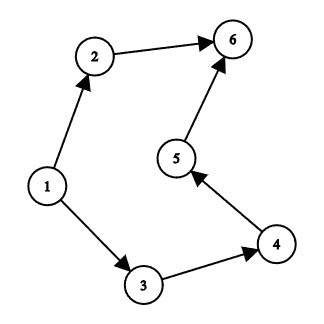

# 在有向图

中查找每个顶点的依赖性

> 原文： [https://www.geeksforgeeks.org/find-dependencies-of-each-vertex-in-a-directed-graph/](https://www.geeksforgeeks.org/find-dependencies-of-each-vertex-in-a-directed-graph/)

给定一个包含`N`个顶点和`M`边的有向图，任务是找到图中每个顶点的所有依赖关系以及具有最小依赖关系的顶点。

> 有向图（或有向图）是一组通过边连接的节点，其中边具有与之关联的方向。
> 
> 例如，圆弧（x，y）被视为从 x 指向 y，而圆弧（y，x）是反向链接。 Y 是 x 的直接后继，而 x 是 y 的直接前任。
> 
> 依赖关系是取决于当前顶点的不同顶点的连接数。

**示例**：

> **输入**：
> 
> 
> **输出**：
> 顶点 1 依赖性-> 2- > 3
> 顶点 2 依赖性-> 3- > 1
> 顶点 3 依赖性-> 1- > 2
> 节点 1 的最小依赖性为 2。
> **解释**：
> 顶点 1 取决于 2 和 3。
> 类似地，顶点 2 和 3 分别在（3，1）和（1，2）上。
> 因此，所有顶点之间的最小依赖性为 2。
> 
> **输入**：
> 
> 
> **输出**：
> 顶点 1 依赖性-> 2- > 3- > 4- > 5- > 6
> 顶点 2 依赖性-> 6
> 顶点 3 依赖性-> 4- > 5- > 6
> 顶点 4 依赖性-> 5- > 6
> 顶点 5 依赖性-> 6
> 顶点 6 不依赖于任何顶点。
> 节点 6 的最小相关性为 0
> **解释**：
> 顶点 1 依赖于（3、4、5、6、7）。 类似地，顶点（2）上的顶点 2，顶点（4、5、6）上的顶点 3，顶点（5、6）上的顶点 4，顶点（6）上的顶点 5 和顶点 6 都不依赖于任何顶点。
> 因此，所有顶点之间的最小依赖性为 0。

**方法**：的想法是使用[深度优先搜索](https://www.geeksforgeeks.org/depth-first-search-or-dfs-for-a-graph/)（DFS）解决此问题。

*   获取有向图作为输入。

*   在图上执行 DFS，并浏览图的所有节点。

*   在探索节点的邻居时，将 1 加到 count 上，最后返回 count，这表示依赖项的数量。

*   最后，找到具有最小依赖性的节点。

下面是上述方法的实现：

```

// C++ program to find the 
// dependency of each node 

#include <bits/stdc++.h> 
using namespace std; 

// Defining the graph 
class Graph { 

    // Variable to store the 
    // number of vertices 
    int V; 

    // Adjacency list 
    list<int>* adjList; 

    // Initializing the graph 
public: 
    Graph(int v) 
    { 
        V = v; 
        adjList = new list<int>[V]; 
    } 

    // Adding edges 
    void addEdge(int u, int v, 
                 bool bidir = true) 
    { 
        adjList[u].push_back(v); 
        if (bidir) { 
            adjList[u].push_back(v); 
        } 
    } 

    // Performing DFS on each node 
    int dfs(int src) 
    { 
        // Map is used to mark 
        // the current node as visited 
        map<int, bool> visited; 
        vector<int> dependent; 
        int count = 0; 

        stack<int> s; 

        // Push the current vertex 
        // to the stack which 
        // stores the result 
        s.push(src); 

        visited[src] = true; 

        // Traverse through the vertices 
        // until the stack is empty 
        while (!s.empty()) { 
            int n = s.top(); 
            s.pop(); 

            // Recur for all the vertices 
            // adjacent to this vertex 
            for (auto i : adjList[n]) { 

                // If the vertices are 
                // not visited 
                if (!visited[i]) { 
                    dependent.push_back(i + 1); 
                    count++; 

                    // Mark the vertex as 
                    // visited 
                    visited[i] = true; 

                    // Push the current vertex to 
                    // the stack which stores 
                    // the result 
                    s.push(i); 
                } 
            } 
        } 

        // If the vertex has 0 dependency 
        if (!count) { 
            cout << "Vertex " << src + 1 
                 << " is not dependent on any vertex.\n"; 
            return count; 
        } 

        cout << "Vertex " << src + 1 << " dependency "; 
        for (auto i : dependent) { 
            cout << "-> " << i; 
        } 
        cout << "\n"; 
        return count; 
    } 
}; 

// Function to find the 
// dependency of each node 
void operations(int arr[][2], 
                int n, int m) 
{ 
    // Creating a new graph 
    Graph g(n); 

    for (int i = 0; i < m; i++) { 
        g.addEdge(arr[i][0], 
                  arr[i][1], false); 
    } 

    int ans = INT_MAX; 
    int node = 0; 

    // Iterating through the graph 
    for (int i = 0; i < n; i++) { 
        int c = g.dfs(i); 

        // Finding the node with 
        // minimum number of 
        // dependency 
        if (c < ans) { 
            ans = c; 
            node = i + 1; 
        } 
    } 
    cout << "Node " << node 
         << "has minimum dependency of "
         << ans; 
} 

// Driver code 
int main() 
{ 
    int n, m; 

    n = 6, m = 6; 

    // Defining the edges of the 
    // graph 
    int arr[][2] = { { 0, 1 }, 
                     { 0, 2 }, 
                     { 2, 3 }, 
                     { 4, 5 }, 
                     { 3, 4 }, 
                     { 1, 5 } }; 

    operations(arr, n, m); 

    return 0; 
} 

```

**Output:**

```
Vertex 1 dependency -> 2-> 3-> 4-> 5-> 6
Vertex 2 dependency -> 6
Vertex 3 dependency -> 4-> 5-> 6
Vertex 4 dependency -> 5-> 6
Vertex 5 dependency -> 6
Vertex 6 is not dependent on any vertex.
Node 6has minimum dependency of 0

```


* * *

* * *

如果您喜欢 GeeksforGeeks 并希望做出贡献，则还可以使用 [tribution.geeksforgeeks.org](https://contribute.geeksforgeeks.org/) 撰写文章，或将您的文章邮寄至 tribution@geeksforgeeks.org。 查看您的文章出现在 GeeksforGeeks 主页上，并帮助其他 Geeks。

如果您发现任何不正确的地方，请单击下面的“改进文章”按钮，以改进本文。