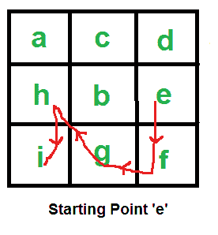

# 查找从给定起始字符开始的最长连续路径的长度

> 原文： [https://www.geeksforgeeks.org/find-length-of-the-longest-consecutive-path-in-a-character-matrix/](https://www.geeksforgeeks.org/find-length-of-the-longest-consecutive-path-in-a-character-matrix/)

给定字符矩阵。 查找给定字符中最长路径的长度，以使路径中的所有字符彼此连续，即，路径中的每个字符都按字母顺序紧挨着前一个。 允许从一个单元沿所有 8 个方向移动。



例

```
Input: mat[][] = { {a, c, d},
                   {h, b, e},
                   {i, g, f}}
      Starting Point = 'e'

Output: 5
If starting point is 'e', then longest path with consecutive 
characters is "e f g h i".

Input: mat[R][C] = { {b, e, f},
                     {h, d, a},
                     {i, c, a}};
      Starting Point = 'b'

Output: 1
'c' is not present in all adjacent cells of 'b'

```


这个想法是首先在给定的矩阵中搜索给定的起始字符。 对所有事件进行深度优先搜索（DFS）以查找所有连续路径。 在执行 DFS 时，我们可能会一次又一次遇到许多子问题。 因此，我们使用动态规划来存储子问题的结果。

以下是上述想法的实现。

## C++

```
// C++ program to find the longest consecutive path 
#include<bits/stdc++.h> 
#define R 3 
#define C 3 
using namespace std; 
  
// tool matrices to recur for adjacent cells. 
int x[] = {0, 1, 1, -1, 1, 0, -1, -1}; 
int y[] = {1, 0, 1, 1, -1, -1, 0, -1}; 
  
// dp[i][j] Stores length of longest consecutive path 
// starting at arr[i][j]. 
int dp[R][C]; 
  
// check whether mat[i][j] is a valid cell or not. 
bool isvalid(int i, int j) 
{ 
    if (i < 0 || j < 0 || i >= R || j >= C) 
      return false; 
    return true; 
} 
  
// Check whether current character is adjacent to previous 
// character (character processed in parent call) or not. 
bool isadjacent(char prev, char curr) 
{ 
    return ((curr - prev) == 1); 
} 
  
// i, j are the indices of the current cell and prev is the 
// character processed in the parent call.. also mat[i][j] 
// is our current character. 
int getLenUtil(char mat[R][C], int i, int j, char prev) 
{ 
     // If this cell is not valid or current character is not 
     // adjacent to previous one (e.g. d is not adjacent to b ) 
     // or if this cell is already included in the path than return 0. 
    if (!isvalid(i, j) || !isadjacent(prev, mat[i][j])) 
         return 0; 
  
    // If this subproblem is already solved , return the answer 
    if (dp[i][j] != -1) 
        return dp[i][j]; 
  
    int ans = 0;  // Initialize answer 
  
    // recur for paths with different adjacent cells and store 
    // the length of longest path. 
    for (int k=0; k<8; k++) 
      ans = max(ans, 1 + getLenUtil(mat, i + x[k], 
                                   j + y[k], mat[i][j])); 
  
    // save the answer and return 
    return dp[i][j] = ans; 
} 
  
// Returns length of the longest path with all characters consecutive 
// to each other.  This function first initializes dp array that 
// is used to store results of subproblems, then it calls 
// recursive DFS based function getLenUtil() to find max length path 
int getLen(char mat[R][C], char s) 
{ 
    memset(dp, -1, sizeof dp); 
    int ans = 0; 
  
    for (int i=0; i<R; i++) 
    { 
        for (int j=0; j<C; j++) 
        { 
            // check for each possible starting point 
            if (mat[i][j] == s) { 
  
                // recur for all eight adjacent cells 
                for (int k=0; k<8; k++) 
                  ans = max(ans, 1 + getLenUtil(mat, 
                                    i + x[k], j + y[k], s)); 
            } 
        } 
    } 
    return ans; 
} 
  
// Driver program 
int main() { 
  
    char mat[R][C] = { {'a','c','d'}, 
                     { 'h','b','a'}, 
                     { 'i','g','f'}}; 
  
    cout << getLen(mat, 'a') << endl; 
    cout << getLen(mat, 'e') << endl; 
    cout << getLen(mat, 'b') << endl; 
    cout << getLen(mat, 'f') << endl; 
    return 0; 
}
```

## Java

```
// Java program to find the longest consecutive path 
class path 
{ 
    // tool matrices to recur for adjacent cells. 
    static int x[] = {0, 1, 1, -1, 1, 0, -1, -1}; 
    static int y[] = {1, 0, 1, 1, -1, -1, 0, -1}; 
    static int R = 3; 
    static int C = 3; 
    // dp[i][j] Stores length of longest consecutive path 
    // starting at arr[i][j]. 
    static int dp[][] = new int[R][C]; 
       
    // check whether mat[i][j] is a valid cell or not. 
    static boolean isvalid(int i, int j) 
    { 
        if (i < 0 || j < 0 || i >= R || j >= C) 
          return false; 
        return true; 
    } 
       
    // Check whether current character is adjacent to previous 
    // character (character processed in parent call) or not. 
    static boolean isadjacent(char prev, char curr) 
    { 
        return ((curr - prev) == 1); 
    } 
       
    // i, j are the indices of the current cell and prev is the 
    // character processed in the parent call.. also mat[i][j] 
    // is our current character. 
    static int getLenUtil(char mat[][], int i, int j, char prev) 
    { 
         // If this cell is not valid or current character is not 
         // adjacent to previous one (e.g. d is not adjacent to b ) 
         // or if this cell is already included in the path than return 0. 
        if (!isvalid(i, j) || !isadjacent(prev, mat[i][j])) 
             return 0; 
       
        // If this subproblem is already solved , return the answer 
        if (dp[i][j] != -1) 
            return dp[i][j]; 
       
        int ans = 0;  // Initialize answer 
       
        // recur for paths with different adjacent cells and store 
        // the length of longest path. 
        for (int k=0; k<8; k++) 
          ans = Math.max(ans, 1 + getLenUtil(mat, i + x[k], 
                                       j + y[k], mat[i][j])); 
       
        // save the answer and return 
        return dp[i][j] = ans; 
    } 
       
    // Returns length of the longest path with all characters consecutive 
    // to each other.  This function first initializes dp array that 
    // is used to store results of subproblems, then it calls 
    // recursive DFS based function getLenUtil() to find max length path 
    static int getLen(char mat[][], char s) 
    { 
        //assigning all dp values to -1 
        for(int i = 0;i<R;++i) 
            for(int j = 0;j<C;++j) 
                dp[i][j] = -1; 
          
        int ans = 0; 
       
        for (int i=0; i<R; i++) 
        { 
            for (int j=0; j<C; j++) 
            { 
                // check for each possible starting point 
                if (mat[i][j] == s) { 
       
                    // recur for all eight adjacent cells 
                    for (int k=0; k<8; k++) 
                      ans = Math.max(ans, 1 + getLenUtil(mat, 
                                        i + x[k], j + y[k], s)); 
                } 
            } 
        } 
        return ans; 
    } 
    public static void main(String args[]) 
    { 
        char mat[][] = { {'a','c','d'}, 
                           { 'h','b','a'}, 
                           { 'i','g','f'}}; 
   
        System.out.println(getLen(mat, 'a') ); 
        System.out.println(getLen(mat, 'e') ); 
        System.out.println(getLen(mat, 'b') ); 
        System.out.println(getLen(mat, 'f') ); 
    } 
}/* This code is contributed by Rajat Mishra */
```

## Python3

```
# Python3 program to find the longest consecutive path   
R=3 
C=3 
    
# tool matrices to recur for adjacent cells.  
x = [0, 1, 1, -1, 1, 0, -1, -1]  
y = [1, 0, 1, 1, -1, -1, 0, -1]  
    
# dp[i][j] Stores length of longest consecutive path  
# starting at arr[i][j].  
dp=[[0 for i in range(C)]for i in range(R)]  
    
# check whether mat[i][j] is a valid cell or not.  
def isvalid( i, j): 
    if (i < 0 or j < 0 or i >= R or j >= C): 
        return False
    return True 
    
# Check whether current character is adjacent to previous  
# character (character processed in parent call) or not.  
def isadjacent( prev, curr):  
    if (ord(curr) -ord(prev)) == 1: 
        return True
    return False
    
# i, j are the indices of the current cell and prev is the  
# character processed in the parent call.. also mat[i][j]  
# is our current character.  
def getLenUtil(mat,i,j, prev):  
     # If this cell is not valid or current character is not  
     # adjacent to previous one (e.g. d is not adjacent to b )  
     # or if this cell is already included in the path than return 0.  
    if (isvalid(i, j)==False or isadjacent(prev, mat[i][j])==False):  
         return 0 
    
    # If this subproblem is already solved , return the answer  
    if (dp[i][j] != -1): 
        return dp[i][j]  
    
    ans = 0  # Initialize answer  
    
    # recur for paths with different adjacent cells and store  
    # the length of longest path.  
    for k in range(8): 
        ans = max(ans, 1 + getLenUtil(mat, i + x[k],j + y[k], mat[i][j])) 
    
    # save the answer and return  
    dp[i][j] = ans 
    return dp[i][j] 
    
# Returns length of the longest path with all characters consecutive  
# to each other.  This function first initializes dp array that  
# is used to store results of subproblems, then it calls  
# recursive DFS based function getLenUtil() to find max length path  
def getLen(mat, s): 
    for i in range(R): 
        for j in range(C): 
            dp[i][j]=-1 
    ans = 0
    for i in range(R): 
        for j in range(C): 
            # check for each possible starting po  
            if (mat[i][j] == s):   
                # recur for all eight adjacent cells  
                for k in range(8): 
                    ans = max(ans, 1 + getLenUtil(mat,i + x[k], j + y[k], s));  
    return ans 
    
# Driver program  
mat = [['a','c','d'],  
       [ 'h','b','a'],  
       [ 'i','g','f']]  
  
print (getLen(mat, 'a'))  
print (getLen(mat, 'e'))  
print (getLen(mat, 'b'))  
print (getLen(mat, 'f'))  
#code is contributed by sahilshelangia
```

## C#

```
// C# program to find the longest consecutive path 
using System; 
  
class GFG { 
      
    // tool matrices to recur for adjacent cells. 
    static int []x = {0, 1, 1, -1, 1, 0, -1, -1}; 
    static int []y = {1, 0, 1, 1, -1, -1, 0, -1}; 
    static int R = 3; 
    static int C = 3; 
      
    // dp[i][j] Stores length of longest  
    // consecutive path starting at arr[i][j]. 
    static int [,]dp = new int[R,C]; 
      
    // check whether mat[i][j] is a valid 
    // cell or not. 
    static bool isvalid(int i, int j) 
    { 
        if (i < 0 || j < 0 || i >= R || j >= C) 
            return false; 
        return true; 
    } 
      
    // Check whether current character is  
    // adjacent to previous character  
    // (character processed in parent call) 
    // or not. 
    static bool isadjacent(char prev, char curr) 
    { 
        return ((curr - prev) == 1); 
    } 
      
    // i, j are the indices of the current 
    // cell and prev is the character processed 
    // in the parent call.. also mat[i][j] 
    // is our current character. 
    static int getLenUtil(char [,]mat, int i, 
                                int j, char prev) 
    { 
          
        // If this cell is not valid or current 
        // character is not adjacent to previous 
        // one (e.g. d is not adjacent to b ) 
        // or if this cell is already included 
        // in the path than return 0. 
        if (!isvalid(i, j) || !isadjacent(prev,  
                                       mat[i,j])) 
            return 0; 
      
        // If this subproblem is already solved, 
        // return the answer 
        if (dp[i,j] != -1) 
            return dp[i,j]; 
      
        int ans = 0; // Initialize answer 
      
        // recur for paths with different adjacent 
        // cells and store the length of  
        // longest path. 
        for (int k = 0; k < 8; k++) 
        ans = Math.Max(ans, 1 + getLenUtil(mat, 
                   i + x[k], j + y[k], mat[i,j])); 
      
        // save the answer and return 
        return dp[i,j] = ans; 
    } 
      
    // Returns length of the longest path 
    // with all characters consecutive to 
    // each other. This function first  
    // initializes dp array that is used 
    // to store results of subproblems,  
    // then it calls recursive DFS based 
    // function getLenUtil() to find max 
    // length path 
    static int getLen(char [,]mat, char s) 
    { 
          
        //assigning all dp values to -1 
        for(int i = 0; i < R; ++i) 
            for(int j = 0; j < C; ++j) 
                dp[i,j] = -1; 
          
        int ans = 0; 
      
        for (int i=0; i<R; i++) 
        { 
            for (int j=0; j<C; j++) 
            { 
                  
                // check for each possible 
                // starting point 
                if (mat[i,j] == s) { 
      
                    // recur for all eight  
                    // adjacent cells 
                    for (int k = 0; k < 8; k++) 
                        ans = Math.Max(ans, 1 +  
                             getLenUtil(mat, i +  
                             x[k], j + y[k], s)); 
                } 
            } 
        } 
        return ans; 
    } 
      
    // Driver code` 
    public static void Main() 
    { 
        char [,]mat = { {'a','c','d'}, 
                        { 'h','b','a'}, 
                        { 'i','g','f'}}; 
  
        Console.WriteLine(getLen(mat, 'a') ); 
        Console.WriteLine(getLen(mat, 'e') ); 
        Console.WriteLine(getLen(mat, 'b') ); 
        Console.WriteLine(getLen(mat, 'f') ); 
    } 
} 
  
// This code is contributed by nitin mittal.
```

## PHP

```
<?php 
// PHP program to find the longest consecutive path 
$R = 3; 
$C = 3; 
  
// tool matrices to recur for adjacent cells. 
$x = array(0, 1, 1, -1, 1, 0, -1, -1); 
$y = array(1, 0, 1, 1, -1, -1, 0, -1); 
  
// dp[i][j] Stores length of longest consecutive path 
// starting at arr[i][j]. 
$dp=array_fill(0, $R, array_fill(0, $C, -1)); 
  
// check whether mat[i][j] is a valid cell or not. 
function isvalid($i, $j) 
{ 
    global $R, $C; 
    if ($i < 0 || $j < 0 || $i >= $R || $j >= $C) 
    return false; 
    return true; 
} 
  
// Check whether current character is adjacent to previous 
// character (character processed in parent call) or not. 
function isadjacent($prev, $curr) 
{ 
    return ((ord($curr) - ord($prev)) == 1); 
} 
  
// i, j are the indices of the current cell and prev is the 
// character processed in the parent call.. also mat[i][j] 
// is our current character. 
function getLenUtil($mat, $i, $j,$prev) 
{ 
    global $x, $y, $dp; 
      
    // If this cell is not valid or current character is not 
    // adjacent to previous one (e.g. d is not adjacent to b ) 
    // or if this cell is already included in the path than return 0. 
    if (!isvalid($i, $j) || !isadjacent($prev, $mat[$i][$j])) 
        return 0; 
  
    // If this subproblem is already solved , return the answer 
    if ($dp[$i][$j] != -1) 
        return $dp[$i][$j]; 
  
    $ans = 0; // Initialize answer 
  
    // recur for paths with different adjacent cells and store 
    // the length of longest path. 
    for ($k=0; $k<8; $k++) 
    $ans = max($ans, 1 + getLenUtil($mat, $i + $x[$k], 
                                $j + $y[$k], $mat[$i][$j])); 
  
    // save the answer and return 
    $dp[$i][$j] = $ans; 
    return $ans; 
} 
  
// Returns length of the longest path  
// with all characters consecutive to 
// each other. This function first  
// initializes dp array that is used 
// to store results of subproblems,  
// then it calls recursive DFS based  
// function getLenUtil() to find max length path 
function getLen($mat, $s) 
{ 
    global $R, $C, $x, $y; 
    $ans = 0; 
  
    for ($i = 0; $i < $R; $i++) 
    { 
        for ($j = 0; $j < $C; $j++) 
        { 
            // check for each possible starting point 
            if ($mat[$i][$j] == $s)  
            { 
  
                // recur for all eight adjacent cells 
                for ($k = 0; $k < 8; $k++) 
                $ans = max($ans, 1 + getLenUtil($mat, 
                                    $i + $x[$k], $j + $y[$k], $s)); 
            } 
        } 
    } 
    return $ans; 
} 
  
    // Driver code 
    $mat = array(array('a','c','d'), 
                    array( 'h','b','a'), 
                    array( 'i','g','f')); 
  
    print(getLen($mat, 'a')."\n"); 
    print(getLen($mat, 'e')."\n" ); 
    print(getLen($mat, 'b') ."\n"); 
    print(getLen($mat, 'f') ."\n"); 
      
// This code is contributed by chandan_jnu 
?>
```

输出：

```
4
0
3
4
```

