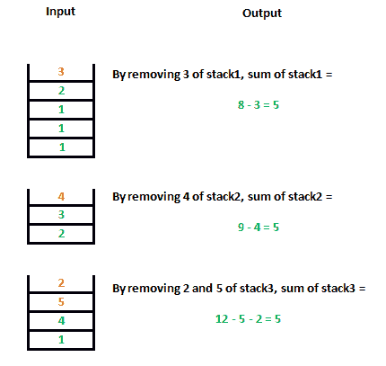

# 求每三叠最大相等和

> 原文:[https://www . geesforgeks . org/find-最大可能和-等和-三栈/](https://www.geeksforgeeks.org/find-maximum-sum-possible-equal-sum-three-stacks/)

给定三个正数堆栈，任务是在允许移除顶部元素的情况下，找到可能相等的最大堆栈总和。堆栈表示为数组，数组的第一个索引表示堆栈的顶部元素。

示例:

```
Input : stack1[] = { 3, 10}
  stack2[] = { 4, 5 }
  stack3[] = { 2, 1 }
Output : 0
Sum can only be equal after removing all elements 
from all stacks.
```



其思想是比较每个堆栈的总和，如果它们不相同，则移除具有最大总和的堆栈顶部元素。
解决该问题的算法:

1.  求单个栈中所有元素的和。
2.  如果所有三个堆栈的总和相同，那么这就是最大总和。
3.  否则，移除三个堆栈中具有最大总和的堆栈顶部元素。重复步骤 1 和步骤 2。

这种方法之所以有效，是因为元素是积极的。为了使和相等，我们必须从堆栈中移除一些具有更多和的元素，并且我们只能从顶部移除。

下面是该方法的实现:

## C++

```
// C++ program to calculate maximum sum with equal
// stack sum.
#include <bits/stdc++.h>
using namespace std;

// Returns maximum possible equal sum of three stacks
// with removal of top elements allowed
int maxSum(int stack1[], int stack2[], int stack3[], int n1,
           int n2, int n3)
{
    int sum1 = 0, sum2 = 0, sum3 = 0;

    // Finding the initial sum of stack1.
    for (int i = 0; i < n1; i++)
        sum1 += stack1[i];

    // Finding the initial sum of stack2.
    for (int i = 0; i < n2; i++)
        sum2 += stack2[i];

    // Finding the initial sum of stack3.
    for (int i = 0; i < n3; i++)
        sum3 += stack3[i];

    // As given in question, first element is top
    // of stack..
    int top1 = 0, top2 = 0, top3 = 0;
    while (1) {
        // If any stack is empty
        if (top1 == n1 || top2 == n2 || top3 == n3)
            return 0;

        // If sum of all three stack are equal.
        if (sum1 == sum2 && sum2 == sum3)
            return sum1;

        // Finding the stack with maximum sum and
        // removing its top element.
        if (sum1 >= sum2 && sum1 >= sum3)
            sum1 -= stack1[top1++];
        else if (sum2 >= sum1 && sum2 >= sum3)
            sum2 -= stack2[top2++];
        else if (sum3 >= sum2 && sum3 >= sum1)
            sum3 -= stack3[top3++];
    }
}

// Driven Program
int main()
{
    int stack1[] = { 3, 2, 1, 1, 1 };
    int stack2[] = { 4, 3, 2 };
    int stack3[] = { 1, 1, 4, 1 };

    int n1 = sizeof(stack1) / sizeof(stack1[0]);
    int n2 = sizeof(stack2) / sizeof(stack2[0]);
    int n3 = sizeof(stack3) / sizeof(stack3[0]);

    cout << maxSum(stack1, stack2, stack3, n1, n2, n3)
         << endl;
    return 0;
}
```

## Java 语言(一种计算机语言，尤用于创建网站)

```
// JAVA Code for Find maximum sum possible
// equal sum of three stacks
class GFG {

    // Returns maximum possible equal sum of three
    // stacks with removal of top elements allowed
    public static int maxSum(int stack1[], int stack2[],
                            int stack3[], int n1, int n2,
                                               int n3)
    {
      int sum1 = 0, sum2 = 0, sum3 = 0;

      // Finding the initial sum of stack1.
      for (int i=0; i < n1; i++)
          sum1 += stack1[i];

      // Finding the initial sum of stack2.
      for (int i=0; i < n2; i++)
          sum2 += stack2[i];

      // Finding the initial sum of stack3.
      for (int i=0; i < n3; i++)
          sum3 += stack3[i];

      // As given in question, first element is top
      // of stack..
      int top1 =0, top2 = 0, top3 = 0;
      int ans = 0;
      while (true)
      {
          // If any stack is empty
          if (top1 == n1 || top2 == n2 || top3 == n3)
             return 0;

          // If sum of all three stack are equal.
          if (sum1 == sum2 && sum2 == sum3)
             return sum1;

          // Finding the stack with maximum sum and
          // removing its top element.
          if (sum1 >= sum2 && sum1 >= sum3)
             sum1 -= stack1[top1++];
          else if (sum2 >= sum1 && sum2 >= sum3)
             sum2 -= stack2[top2++];
          else if (sum3 >= sum2 && sum3 >= sum1)
             sum3 -= stack3[top3++];
       }
    }

    /* Driver program to test above function */
    public static void main(String[] args)
    {
          int stack1[] = { 3, 2, 1, 1, 1 };
          int stack2[] = { 4, 3, 2 };
          int stack3[] = { 1, 1, 4, 1 };

          int n1 = stack1.length;
          int n2 = stack2.length;
          int n3 = stack3.length;

          System.out.println(maxSum(stack1, stack2,
                               stack3, n1, n2, n3));
    }
  }
// This code is contributed by Arnav Kr. Mandal.
```

## 计算机编程语言

```
# Python program to calculate maximum sum with equal
# stack sum.
# Returns maximum possible equal sum of three stacks
# with removal of top elements allowed
def maxSum(stack1, stack2, stack3, n1, n2, n3):
    sum1, sum2, sum3 = 0, 0, 0

  # Finding the initial sum of stack1.
    for i in range(n1):
        sum1 += stack1[i]

  # Finding the initial sum of stack2.
    for i in range(n2):
        sum2 += stack2[i]

  # Finding the initial sum of stack3.
    for i in range(n3):
        sum3 += stack3[i]

  # As given in question, first element is top
  # of stack..
    top1, top2, top3 = 0, 0, 0
    ans = 0
    while (1):
      # If any stack is empty
        if (top1 == n1 or top2 == n2 or top3 == n3):
            return 0

      # If sum of all three stack are equal.
        if (sum1 == sum2 and sum2 == sum3):
            return sum1

      # Finding the stack with maximum sum and
      # removing its top element.
        if (sum1 >= sum2 and sum1 >= sum3):
            sum1 -= stack1[top1]
            top1=top1+1
        elif (sum2 >= sum1 and sum2 >= sum3):
            sum2 -= stack2[top2]
            top2=top2+1
        elif (sum3 >= sum2 and sum3 >= sum1):
            sum3 -= stack3[top3]
            top3=top3+1

# Driven Program
stack1 = [ 3, 2, 1, 1, 1 ]
stack2 = [ 4, 3, 2 ]
stack3 = [ 1, 1, 4, 1 ]

n1 = len(stack1)
n2 = len(stack2)
n3 = len(stack3)

print maxSum(stack1, stack2, stack3, n1, n2, n3)

#This code is contributed by Afzal Ansari
```

## C#

```
// C# Code for Find maximum sum with
// equal sum of three stacks
using System;

class GFG {

    // Returns maximum possible equal
    // sum of three stacks with removal
    // of top elements allowed
    public static int maxSum(int[] stack1,
               int[] stack2, int[] stack3,
                   int n1, int n2, int n3)
    {

        int sum1 = 0, sum2 = 0, sum3 = 0;

        // Finding the initial sum of
        // stack1.
        for (int i = 0; i < n1; i++)
            sum1 += stack1[i];

        // Finding the initial sum of
        // stack2.
        for (int i = 0; i < n2; i++)
            sum2 += stack2[i];

        // Finding the initial sum of
        // stack3.
        for (int i = 0; i < n3; i++)
            sum3 += stack3[i];

        // As given in question, first
        // element is top of stack..
        int top1 = 0, top2 = 0, top3 = 0;

        while (true) {

            // If any stack is empty
            if (top1 == n1 || top2 == n2
                            || top3 == n3)
                return 0;

            // If sum of all three stack
            // are equal.
            if (sum1 == sum2 && sum2 == sum3)
                return sum1;

            // Finding the stack with maximum
            // sum and removing its top element.
            if (sum1 >= sum2 && sum1 >= sum3)
                sum1 -= stack1[top1++];
            else if (sum2 >= sum1 && sum2 >= sum3)
                sum2 -= stack2[top2++];
            else if (sum3 >= sum2 && sum3 >= sum1)
                sum3 -= stack3[top3++];
        }
    }

    /* Driver program to test above function */
    public static void Main()
    {
        int[] stack1 = { 3, 2, 1, 1, 1 };
        int[] stack2 = { 4, 3, 2 };
        int[] stack3 = { 1, 1, 4, 1 };

        int n1 = stack1.Length;
        int n2 = stack2.Length;
        int n3 = stack3.Length;

        Console.Write(maxSum(stack1, stack2,
                        stack3, n1, n2, n3));
    }
}

// This code is contributed by nitin mittal.
```

## 服务器端编程语言（Professional Hypertext Preprocessor 的缩写）

```
<?php
// PHP program to calculate maximum
// sum with equal stack sum.

// Returns maximum possible
// equal sum of three stacks
// with removal of top elements
// allowed
function maxSum($stack1, $stack2, $stack3,
                            $n1, $n2, $n3)
{
    $sum1 = 0; $sum2 = 0; $sum3 = 0;

    // Finding the initial sum of stack1.
    for ($i = 0; $i < $n1; $i++)
        $sum1 += $stack1[$i];

    // Finding the initial sum of stack2.
    for ($i = 0; $i < $n2; $i++)
        $sum2 += $stack2[$i];

    // Finding the initial sum of stack3.
    for ($i = 0; $i < $n3; $i++)
        $sum3 += $stack3[$i];

    // As given in question,
    // first element is top
    // of stack..
    $top1 =0;
    $top2 = 0;
    $top3 = 0;
    $ans = 0;
    while (1)
    {

        // If any stack is empty
        if ($top1 == $n1 || $top2 == $n2 ||
                              $top3 == $n3)
            return 0;

        // If sum of all three stack are equal.
        if ($sum1 == $sum2 && $sum2 == $sum3)
            return $sum1;

        // Finding the stack with
        // maximum sum and
        // removing its top element.
        if ($sum1 >= $sum2 && $sum1 >= $sum3)
                $sum1 -= $stack1[$top1++];

        else if ($sum2 >= $sum1 && $sum2 >=$sum3)
                $sum2 -= $stack2[$top2++];

        else if ($sum3 >= $sum2 && $sum3 >= $sum1)
                $sum3 -= $stack3[$top3++];
    }
}

// Driver Code
$stack1 = array(3, 2, 1, 1, 1);
$stack2 = array(4, 3, 2);
$stack3 = array(1, 1, 4, 1);

$n1 = sizeof($stack1);
$n2 = sizeof($stack2);
$n3 = sizeof($stack3);
echo maxSum($stack1, $stack2,
            $stack3, $n1,
            $n2, $n3) ;

// This code is contributed by nitin mittal
?>
```

## java 描述语言

```
<script>

// JavaScript program to calculate maximum
// sum with equal stack sum.

// Returns maximum possible equal sum of three
// stacks with removal of top elements allowed
function maxSum(stack1, stack2,
                stack3, n1, n2, n3)
{
    let sum1 = 0, sum2 = 0, sum3 = 0;

    // Finding the initial sum of stack1.
    for(let i = 0; i < n1; i++)
        sum1 += stack1[i];

    // Finding the initial sum of stack2.
    for(let i = 0; i < n2; i++)
        sum2 += stack2[i];

    // Finding the initial sum of stack3.
    for(let i = 0; i < n3; i++)
        sum3 += stack3[i];

    // As given in question, first element
    // is top of stack.
    let top1 = 0, top2 = 0, top3 = 0;
    let ans = 0;

    while (true)
    {

        // If any stack is empty
        if (top1 == n1 || top2 == n2 ||
            top3 == n3)
            return 0;

        // If sum of all three stack are equal.
        if (sum1 == sum2 && sum2 == sum3)
            return sum1;

        // Finding the stack with maximum sum and
        // removing its top element.
        if (sum1 >= sum2 && sum1 >= sum3)
            sum1 -= stack1[top1++];
        else if (sum2 >= sum1 && sum2 >= sum3)
            sum2 -= stack2[top2++];
        else if (sum3 >= sum2 && sum3 >= sum1)
            sum3 -= stack3[top3++];
    }
}

// Driver Code
let stack1 = [ 3, 2, 1, 1, 1 ];
let stack2 = [ 4, 3, 2 ];
let stack3 = [ 1, 1, 4, 1 ];

let n1 = stack1.length;
let n2 = stack2.length;
let n3 = stack3.length;

document.write(maxSum(stack1, stack2,
                      stack3, n1, n2, n3));

// This code is contributed by souravghosh0416

</script>
```

**Output**

```
5
```

**时间复杂度:** O(n1 + n2 + n3)，其中 n1、n2 和 n3 是三个栈的大小。

https://youtu.be/PZ

-tngvx-0？list = plqm 7 alhxfysf 7 lap-wi 5 qlad 8 oebx 9 rmv

本文由 **Anuj Chauhan(anuj0503)** 投稿。如果你喜欢 GeeksforGeeks 并想投稿，你也可以使用[write.geeksforgeeks.org](https://write.geeksforgeeks.org)写一篇文章或者把你的文章邮寄到 review-team@geeksforgeeks.org。看到你的文章出现在极客博客主页上，帮助其他极客。
如果你发现任何不正确的地方，或者你想分享更多关于上面讨论的话题的信息，请写评论。