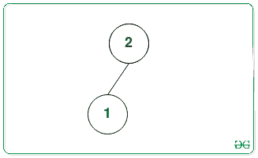
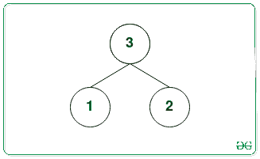
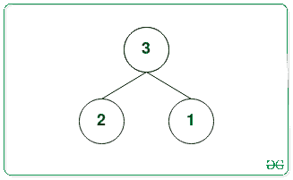

# 从所有可能的二进制最大堆中找到所有最大叶节点的最小值和最大值

> 原文:[https://www . geeksforgeeks . org/find-min-and-max-values-in-all-maximum-leaf-nodes-from-all-可能-binary-max-heap/](https://www.geeksforgeeks.org/find-min-and-max-values-among-all-maximum-leaf-nodes-from-all-possible-binary-max-heap/)

给定一个正整数 **N** ，任务是从每个可能的[二进制最大堆](https://www.geeksforgeeks.org/binary-heap/)的最大叶节点中找到最大和最小的元素，该最大堆是以第一个**N**T6】自然数作为二进制最大堆的节点值而形成的。

**示例:**

> **输入:** N = 2
> **输出:** 1 1
> **解释:**
> 节点{1，2}只有一个最大二进制堆:
> 
> 
> 
> 在上面的树中，最大叶节点值= 1。
> 所以最大的元素是 1，最小的元素也是 1。
> 
> **输入:** N = 3
> **输出:** 2 2
> **解释:**
> 有两种可能的最大二进制堆，节点为{1，2，3}:
> 
>  
> 
> 第一堆和第二堆的最大叶节点分别是 2 和 2。
> 所以最大的元素是 2，最小的元素也是 2。

**天真方法:**最简单的方法是[生成所有可能的最大二进制堆](https://www.geeksforgeeks.org/number-ways-form-heap-n-distinct-integers/)，该堆可以首先由**N**T6】自然数形成，并跟踪所有堆中所有最大叶节点中最小和最大的叶节点值。

***时间复杂度:** O(N*N！)*
***辅助空间:** O(1)*

**高效方法:**上述方法可以基于以下观察进行优化:

1.  [最大堆](https://www.geeksforgeeks.org/binary-heap/)是一个[完全二叉树](https://www.geeksforgeeks.org/binary-tree-set-3-types-of-binary-tree/)，因此叶节点的高度和个数是固定的。
2.  在最大堆中，节点的值总是大于或等于该节点的子节点。
3.  最大叶节点值始终大于或等于树中的叶数。因此，如果将最小的数字放在叶节点上，则叶节点的最大值将最小化。并且将等于叶节点的数量。
4.  最大堆的另一个属性是，当一个堆沿着树向下移动时，节点的值会减少。因此，如果将一个数字放在具有最小可能深度的叶节点上，则节点的最大值将最大化。因此，如果 **D** 是该节点的深度，那么该节点的最大可能值将等于**N-D**
5.  如果 **D** 是最大堆的深度，那么叶节点的可能深度只有 **D** 和 **D-1** ，因为堆是完整的二叉树。
6.  如果 **V** 是叶节点，那么 **(2*V)** 必须大于 **N** 。因此，叶节点数等于，**(N–N/2)。**

按照以下步骤解决问题:

*   如上所述，计算最大堆 N 个节点中叶节点的[计数，并将其存储在一个变量中，比如**叶节点数**。](https://www.geeksforgeeks.org/height-complete-binary-tree-heap-n-nodes/)

```
numberOfleaves = (N- N/2).
```

*   [找到最大堆的深度](https://www.geeksforgeeks.org/height-complete-binary-tree-heap-n-nodes/)并将其存储在一个变量中，比如 **D** 。

```
D = ceil(log<sub>2(N+1))-1</sub>
```

*   [如果 N+1 不是 2 的幂](https://www.geeksforgeeks.org/program-to-find-whether-a-no-is-power-of-two/)**D**大于 **1** ，那么在深度 **D-1** 处必须存在一个叶节点。因此，然后将 **D** 减 **1。**
*   最后，完成上述步骤后，将最大值打印为 **(N-D)** ，最小值打印为**房数**。

下面是上述方法的实现:

## C++

```
// C++ program for the above approach
#include <bits/stdc++.h>
using namespace std;

// Function to find largest and smallest
// elements from the maximum leaf nodes
// values from all possible binary max heap
void leafNodeValues(int N)
{
    // Stores count of leaf nodes
    int numberOfLeaves = (N - N / 2);

    // Stores minDepth with N
    int minDepth = ceil(log2(N + 1)) - 1;

    // Increment N by 1
    N++;
    // If N is not power of 2 and minDepth
    // is greater than 1
    if (minDepth > 1 && (N & (N - 1)))
        minDepth--;

    // Print the smallest and largest possible
    // value of a leaf node
    cout << numberOfLeaves << ' '
         << N - minDepth - 1;
}

// Driver Code
int main()
{
    // Given Input
    int N = 2;

    // Function Call
    leafNodeValues(N);

    return 0;
}
```

## Java 语言(一种计算机语言，尤用于创建网站)

```
// Java program for the above approach
class GFG{

// Function to find largest and smallest
// elements from the maximum leaf nodes
// values from all possible binary max heap
static void leafNodeValues(int N)
{

    // Stores count of leaf nodes
    int numberOfLeaves = (N - N / 2);

    // Stores minDepth with N
    int minDepth = (int)Math.ceil(Math.log(N + 1) /
                                  Math.log(2)) - 1;

    // Increment N by 1
    N++;

    // If N is not power of 2 and minDepth
    // is greater than 1
    if (minDepth > 1 && (N & (N - 1)) != 0)
        minDepth--;

    // Print the smallest and largest possible
    // value of a leaf node
    System.out.println(numberOfLeaves + " " +
                      (N - minDepth - 1));
}

// Driver code
public static void main(String[] args)
{

    // Given Input
    int N = 2;

    // Function Call
    leafNodeValues(N);
}
}

// This code is contributed by divyesh072019
```

## 蟒蛇 3

```
# Python 3 program for the above approach
from math import ceil,log2

# Function to find largest and smallest
# elements from the maximum leaf nodes
# values from all possible binary max heap
def leafNodeValues(N):

    # Stores count of leaf nodes
    numberOfLeaves = (N - N // 2)

    # Stores minDepth with N
    minDepth = ceil(log2(N + 1)) - 1;

    # Increment N by 1
    N += 1

    # If N is not power of 2 and minDepth
    # is greater than 1
    if (minDepth > 1 and (N & (N - 1))):
        minDepth -= 1

    # Print the smallest and largest possible
    # value of a leaf node
    print(numberOfLeaves, N - minDepth - 1)

# Driver Code
if __name__ == '__main__':
    # Given Input
    N = 2

    # Function Call
    leafNodeValues(N)

    # This code is contributed by SURENDRA_GANGWAR.
```

## C#

```
// C# program for the above approach
using System;
class GFG {

    // Function to find largest and smallest
    // elements from the maximum leaf nodes
    // values from all possible binary max heap
    static void leafNodeValues(int N)
    {

        // Stores count of leaf nodes
        int numberOfLeaves = (N - N / 2);

        // Stores minDepth with N
        int minDepth = (int)Math.Ceiling(Math.Log(N + 1) /
                                      Math.Log(2)) - 1;

        // Increment N by 1
        N++;

        // If N is not power of 2 and minDepth
        // is greater than 1
        if (minDepth > 1 && (N & (N - 1)) != 0)
            minDepth--;

        // Print the smallest and largest possible
        // value of a leaf node
        Console.WriteLine(numberOfLeaves + " " +
                          (N - minDepth - 1));
    }

  static void Main()
  {

    // Given Input
    int N = 2;

    // Function Call
    leafNodeValues(N);
  }
}

// This code is contributed by decode2207.
```

## java 描述语言

```
<script>

// JavaScript program for the above approach

// Function to find largest and smallest
// elements from the maximum leaf nodes
// values from all possible binary max heap
function log2(n)
 {
   return (Math.log(n)/Math.log(2));
 }
function leafNodeValues(N)
{
    // Stores count of leaf nodes
    let numberOfLeaves = parseInt((N - N / 2));

    // Stores minDepth with N
    let minDepth = Math.ceil(log2(N + 1)) - 1;

    // Increment N by 1
    N++;
    // If N is not power of 2 and minDepth
    // is greater than 1
    if ((minDepth > 1) && (N & (N - 1)))
        minDepth--;

    // Print the smallest and largest possible
    // value of a leaf node
    document.write(numberOfLeaves);
    document.write(' ');
    document.write( N - minDepth - 1);
}

// Driver Code

    // Given Input
    var N = 2;

    // Function Call
    leafNodeValues(N);

// This code is contributed by Potta Lokesh

</script>
```

**Output:** 

```
1 1
```

***时间复杂度:** O(log(N))*
***辅助空间:** O(1)*