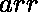

# 用给定的坐标组求矩形的最小面积

> 原文:[https://www . geesforgeks . org/find-给定坐标集的最小矩形面积/](https://www.geeksforgeeks.org/find-minimum-area-of-rectangle-with-given-set-of-coordinates/)

给定一组位于 **X-Y 平面**的点的数组。任务是找到由这些点形成的矩形的最小面积。矩形的边应该平行于 X 轴和 Y 轴。如果给定点不能形成矩形，则打印。
**例:**

> **输入:** arr[][] = [[1，1]，[1，3]，[3，1]，[3，3]，[2，2]]
> **输出:** 4
> 唯一可能的矩形将由点(1，1)、(1，3)、(3，1)和(3，3)
> **构成输入:** arr[][] = [[1，1]，[1，3]，[3，1]，[3，3]，

****方法:**用坐标将点分组，这样垂直直线上的点就分组在一起了。然后，对于组中的每一对点，例如坐标(X，Y1)和(X，Y2)，我们检查最小的矩形，这一对点作为要形成的矩形的最右边。我们可以通过跟踪我们以前访问过的所有其他点对来做到这一点。最后返回得到的矩形的最小可能面积。
以下是上述办法的实施:** 

## **卡片打印处理机（Card Print Processor 的缩写）**

```
// C++ Implementation of above approach
#include <bits/stdc++.h>
using namespace std;

// function to find minimum area of Rectangle
int minAreaRect(vector<vector<int>> A){

    // creating empty columns
    map<int,vector<int>> columns;

    // fill columns with coordinates
    for(auto i:A)
        columns[i[0]].push_back(i[1]);

    map<pair<int,int>,int > lastx;

    int ans = INT_MAX;

    for (auto x:columns)
    {
        vector<int> column = x.second;
        sort(column.begin(), column.end());
        for (int j = 0; j < column.size(); j++)
        {
            for (int i = 0; i < j; i++)
            {
                int y1 = column[i];

                // check if rectangle can be formed
                if (lastx.find({y1, column[j]}) != lastx.end())
                {
                    ans = min(ans, (x.first - lastx[{y1, column[j]}]) *
                            (column[j] - column[i]));
                }
                lastx[{y1, column[j]}] = x.first;
            }
            }
        }

    if (ans < INT_MAX)
        return ans;
    else
        return 0;
}

// Driver code
int main()
{
    vector<vector<int>> A = {{1, 1}, {1, 3}, {3, 1}, {3, 3}, {2, 2}};
    cout << (minAreaRect(A));
    return 0;
}

// This code is contributed by mohit kumar 29
```

## **Java 语言(一种计算机语言，尤用于创建网站)**

```
/*package whatever //do not write package name here */
// Java Implementation of above approach
import java.io.*;
import java.util.*;

class GFG {

  //# function to find minimum area of Rectangle
  public static int minAreaRect(int[][] points)
  {

    // creating empty columns
    @SuppressWarnings("unchecked")
    Set<Integer> columns = new HashSet();

    // fill columns with coordinates
    for (int[] point : points)
      columns.add(40001 * point[0] + point[1]);

    int ans = Integer.MAX_VALUE;
    for (int i = 0; i < points.length; ++i)
      for (int j = i + 1; j < points.length; ++j) {
        if (points[i][0] != points[j][0]
            && points[i][1] != points[j][1]) {
          if (columns.contains(40001
                               * points[i][0]
                               + points[j][1])
              && columns.contains(
                40001 * points[j][0]
                + points[i][1])) {
            ans = Math.min( ans, Math.abs(points[j][0]
                            - points[i][0])
              * Math.abs(points[j][1]
                         - points[i][1]));
          }
        }
      }

    return ans < Integer.MAX_VALUE ? ans : 0;
  }

  // Driver code
  public static void main(String[] args)
  {

    int[][] A = {{1, 1}, {1, 3}, {3, 1}, {3, 3}, {2, 2}};
    System.out.println(minAreaRect(A));
  }
}

// This code is contributed by maheshwaripiyush9
```

## **计算机编程语言**

```
# Python Implementation of above approach
import collections

# function to find minimum area of Rectangle
def minAreaRect(A):

    # creating empty columns
    columns = collections.defaultdict(list)

    # fill columns with coordinates
    for x, y in A:
        columns[x].append(y)

    lastx = {}
    ans = float('inf')

    for x in sorted(columns):
        column = columns[x]
        column.sort()
        for j, y2 in enumerate(column):
            for i in range(j):
                y1 = column[i]

                # check if rectangle can be formed
                if (y1, y2) in lastx:
                    ans = min(ans, (x - lastx[y1, y2]) * (y2 - y1))
                lastx[y1, y2] = x

    if ans < float('inf'):
        return ans
    else:
        return 0

# Driver code
A = [[1, 1], [1, 3], [3, 1], [3, 3], [2, 2]]
print(minAreaRect(A))
```

## **java 描述语言**

```
<script>
/*package whatever //do not write package name here */
// Javascript Implementation of above approach

    //# function to find minimum area of Rectangle
    function minAreaRect(points)
    {
        // creating empty columns
    let columns = new Set();

    // fill columns with coordinates
    for (let point=0;point<points.length;point++)
      columns.add(40001 * points[point][0] + points[point][1]);

    let ans = Number.MAX_VALUE;
    for (let i = 0; i < points.length; ++i)
      for (let j = i + 1; j < points.length; ++j) {
        if (points[i][0] != points[j][0]
            && points[i][1] != points[j][1]) {
          if (columns.has(40001
                               * points[i][0]
                               + points[j][1])
              && columns.has(
                40001 * points[j][0]
                + points[i][1])) {
            ans = Math.min( ans, Math.abs(points[j][0]
                            - points[i][0])
              * Math.abs(points[j][1]
                         - points[i][1]));
          }
        }
      }

    return ans < Number.MAX_VALUE ? ans : 0;
    }

    // Driver code
    let A = [[1, 1], [1, 3], [3, 1], [3, 3], [2, 2]];
    document.write(minAreaRect(A));

// This code is contributed by patel2127
</script>
```

****Output:** 

```
4
```**