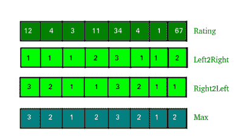

# 找到购买所有书籍的最低成本

> 原文:[https://www.geeksforgeeks.org/find-minimum-cost-buy-books/](https://www.geeksforgeeks.org/find-minimum-cost-buy-books/)

给定 n 本书的一系列评分。在以下条件下找到购买所有书籍的最低成本:

1.  每本书的成本至少是 1 美元。
2.  如果一本书的价格高于相邻的书(左或右)，则该书的价格高于相邻的书。

**例:**

```
Input : Ratings[] = {1, 3, 4, 3, 7, 1}
Output : 10
Exp :- 1 + 2 + 3 + 1 + 2 + 1 = 10

Input : ratings[] = {1, 6, 8, 3, 4, 1, 5, 7}
Output : 15
Exp :- 1 + 2 + 3 + 1 + 2 + 1 + 2 + 3 = 15 
```

1.  制作两个左 2 右 2 左的数组，并在两个数组中填入 1。
2.  从左向右遍历并填充左 2 右数组，并通过查看给定数组的先前评级来更新它。不要在意给定数组的下一个等级。
3.  从右向左遍历并填充右 2 列数组，并通过查看给定数组的下一个等级来更新它。不要在意给定数组的先前评级。
4.  找到两个数组中第一个位置的最大值(左 2 右 2 左)并将其添加到结果中



## C++

```
// C++ program to find minimum cost to buy
// n books.
#include <bits/stdc++.h>
using namespace std;

int minCost(int ratings[], int n)
{
    int res = 0;
    int left2right[n];
    int right2left[n];

    // fill 1 in both array
    fill_n(left2right, n, 1);
    fill_n(right2left, n, 1);

    // Traverse from left to right and assign
    // minimum possible rating considering only
    // left adjacent
    for (int i = 1; i < n; i++)
        if (ratings[i] > ratings[i - 1])
            left2right[i] = left2right[i - 1] + 1;    

    // Traverse from right to left and assign
    // minimum possible rating considering only
    // right adjacent
    for (int i = n - 2; i >= 0; i--)
        if (ratings[i] > ratings[i + 1])
            right2left[i] = right2left[i + 1] + 1;      

    // Since we need to follow rating rule for
    // both adjacent, we pick maximum of two
    for (int i = 0; i < n; i++)
        res += max(left2right[i], right2left[i]);

    return res;
}

// Driver function
int main()
{
    int ratings[] = { 1, 6, 8, 3, 4, 1, 5, 7 };
    int n = sizeof(ratings) / sizeof(ratings[0]);
    cout << minCost(ratings, n);
    return 0;
}
```

## Java 语言(一种计算机语言，尤用于创建网站)

```
// JAVA Code For Find minimum cost to
// buy all books
import java.util.*;

class GFG {

    public static int minCost(int ratings[], int n)
    {
        int res = 0;
        int left2right[] = new int[n];
        int right2left[] = new int[n];;

        // fill 1 in both array
        Arrays.fill(left2right,  1);
        Arrays.fill(right2left, 1);

        // Traverse from left to right and assign
        // minimum possible rating considering
        // only left adjacent
        for (int i = 1; i < n; i++)
            if (ratings[i] > ratings[i - 1])
                left2right[i] = left2right[i - 1] + 1;    

        // Traverse from right to left and assign
        // minimum possible rating considering only
        // right adjacent
        for (int i = n - 2; i >= 0; i--)
            if (ratings[i] > ratings[i + 1])
                right2left[i] = right2left[i + 1] + 1;      

        // Since we need to follow rating rule for
        // both adjacent, we pick maximum of two
        for (int i = 0; i < n; i++)
            res += Math.max(left2right[i],
                            right2left[i]);

        return res;
    }

    /* Driver program to test above function */
    public static void main(String[] args)
    {
        int ratings[] = { 1, 6, 8, 3, 4, 1, 5, 7 };
        int n = ratings.length;
        System.out.print(minCost(ratings, n));

    }
}

// This code is contributed by Arnav Kr. Mandal.
```

## 计算机编程语言

```
# Python program to find minimum cost to buy
# n books.

def minCost(ratings, n):
    res = 0

    # fill 1 in both array
    left2right = [1 for i in range(n)]
    right2left = [1 for i in range(n)]

    # Traverse from left to right and assign
    # minimum possible rating considering only
    # left adjacent
    for i in range(1, n):
        if (ratings[i] > ratings[i - 1]):
            left2right[i] = left2right[i - 1] + 1

    # Traverse from right to left and assign
    # minimum possible rating considering only
    # right adjacent
    i = n - 2
    while(i >= 0):
        if (ratings[i] > ratings[i + 1]):
            right2left[i] = right2left[i + 1] + 1
        i -= 1

    # Since we need to follow rating rule for
    # both adjacent, we pick maximum of two
    for i in range(n):

        res += max(left2right[i], right2left[i])

    return res

# Driver function
ratings = [ 1, 6, 8, 3, 4, 1, 5, 7 ]
n = len(ratings)
print minCost(ratings, n)

# This code is contributed by Sachin Bisht
```

## C#

```
// C# code For Finding minimum
// cost to buy all books
using System;

class GFG {

    public static int minCost(int []ratings, int n)
    {
        int res = 0;
        int []left2right = new int[n];
        int []right2left = new int[n];

        // fill 1 in both array
        for(int i = 0; i < n; i++)
        left2right[i] = 1;

        for(int i = 0; i < n; i++)
        right2left[i] = 1;

        // Traverse from left to right and assign
        // minimum possible rating considering
        // only left adjacent
        for (int i = 1; i < n; i++)
            if (ratings[i] > ratings[i - 1])
                left2right[i] = left2right[i - 1] + 1;    

        // Traverse from right to left and assign
        // minimum possible rating considering only
        // right adjacent
        for (int i = n - 2; i >= 0; i--)
            if (ratings[i] > ratings[i + 1])
                right2left[i] = right2left[i + 1] + 1;    

        // Since we need to follow rating rule for
        // both adjacent, we pick maximum of two
        for (int i = 0; i < n; i++)
            res += Math.Max(left2right[i],
                            right2left[i]);

        return res;
    }

    /* Driver program to test above function */
    public static void Main()
    {
        int []ratings = {1, 6, 8, 3, 4, 1, 5, 7};
        int n = ratings.Length;
        Console.Write(minCost(ratings, n));
    }
}

// This code is contributed by nitin mittal.
```

## java 描述语言

```
<script>

// JavaScript program to find minimum cost to buy
// n books.

function minCost(ratings, n) {
    let res = 0;
    let left2right = new Array(n).fill(1);
    let right2left = new Array(n).fill(1);

    // Traverse from left to right and assign
    // minimum possible rating considering only
    // left adjacent
    for (let i = 1; i < n; i++)
        if (ratings[i] > ratings[i - 1])
            left2right[i] = left2right[i - 1] + 1;

    // Traverse from right to left and assign
    // minimum possible rating considering only
    // right adjacent
    for (let i = n - 2; i >= 0; i--)
        if (ratings[i] > ratings[i + 1])
            right2left[i] = right2left[i + 1] + 1;

    // Since we need to follow rating rule for
    // both adjacent, we pick maximum of two
    for (let i = 0; i < n; i++)
        res += Math.max(left2right[i], right2left[i]);

    return res;
}

// Driver function

let ratings = [1, 6, 8, 3, 4, 1, 5, 7];
let n = ratings.length;
document.write(minCost(ratings, n));

</script>
```

**输出:**

```
15
```

时间复杂度–O(n)
辅助空间–O(n)
本文由**哈什特·阿格沃尔**供稿。如果你喜欢 GeeksforGeeks 并想投稿，你也可以使用[write.geeksforgeeks.org](https://write.geeksforgeeks.org)写一篇文章或者把你的文章邮寄到 review-team@geeksforgeeks.org。看到你的文章出现在极客博客主页上，帮助其他极客。
如果发现有不正确的地方，或者想分享更多关于上述话题的信息，请写评论。