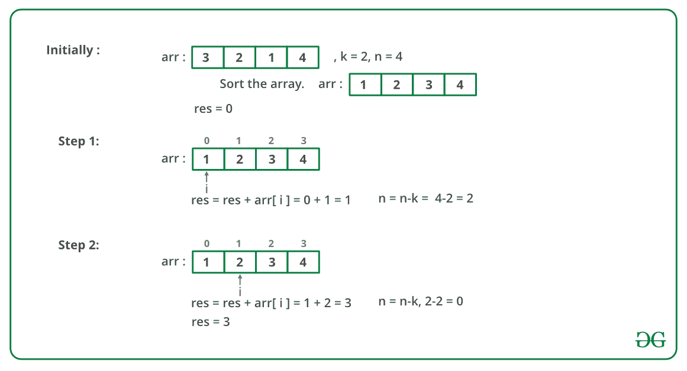
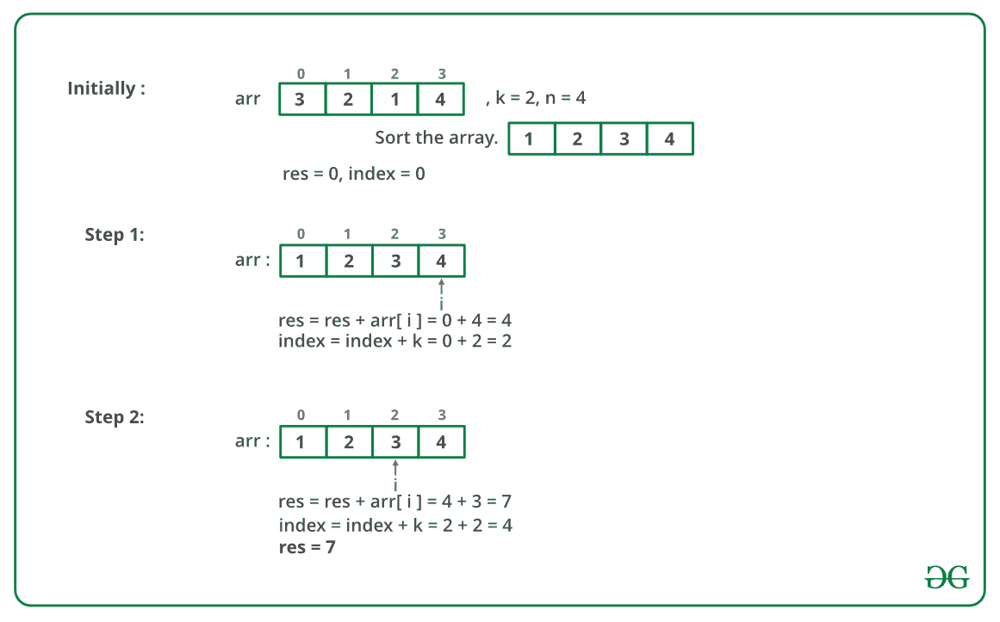

# 找到购买所有 N 颗糖果的最小和最大金额

> 原文:[https://www . geesforgeks . org/find-mini-maximum-amount-buy-n-candes/](https://www.geeksforgeeks.org/find-minimum-maximum-amount-buy-n-candies/)

在一家糖果店，有 N 种不同类型的糖果可供选择，所有 N 种不同类型糖果的价格都有提供。糖果店也有诱人的优惠。我们可以从商店买一颗糖果，最多免费得到 K 颗其他糖果(都是不同类型的)。

1.  找出我们购买所有 N 种不同糖果所必须花费的最低金额。
2.  找出我们购买所有 N 种不同糖果的最大花费。

在这两种情况下，我们都必须利用这个机会，尽可能多的拿回糖果。如果有 k 或更多的糖果，我们每次购买糖果都必须带 k 糖果。如果可用的糖果少于 k 颗，我们必须购买所有糖果。

**示例:**

```
Input :  
price[] = {3, 2, 1, 4}
k = 2
Output :  
Min = 3, Max = 7
Explanation :
Since k is 2, if we buy one candy we can take 
atmost two more for free.
So in the first case we buy the candy which 
costs 1 and take candies worth 3 and 4 for 
free, also you buy candy worth 2 as well.
So min cost = 1 + 2 = 3.
In the second case we buy the candy which 
costs 4 and take candies worth 1 and 2 for 
free, also We buy candy worth 3 as well.
So max cost = 3 + 4 = 7.
```

需要注意的一件重要的事情是，我们必须使用该优惠，并在每次购买糖果时获得最多的糖果。因此，如果我们想把钱减到最少，我们必须以最低的成本购买糖果，并免费获得最高成本的糖果。为了最大化资金，我们必须反其道而行之。下面是一个基于此的算法。

```
First Sort the price array.

For finding minimum amount :
  Start purchasing candies from starting 
  and reduce k free candies from last with
  every single purchase.

For finding maximum amount : 
   Start purchasing candies from the end 
   and reduce k free candies from starting 
   in every single purchase.
```

下图说明了上述方法:

最低金额:



最大金额:



下面是上述方法的实现:

## C++

```
// C++ implementation to find the minimum
// and maximum amount
#include <bits/stdc++.h>
using namespace std;

// Function to find the minimum amount
// to buy all candies
int findMinimum(int arr[], int n, int k)
{
    int res = 0;
    for (int i = 0; i < n; i++) {
        // Buy current candy
        res += arr[i];

        // And take k candies for free
        // from the last
        n = n - k;
    }
    return res;
}

// Function to find the maximum amount
// to buy all candies
int findMaximum(int arr[], int n, int k)
{
    int res = 0, index = 0;

    for (int i = n - 1; i >= index; i--) 
    {
        // Buy candy with maximum amount
        res += arr[i];

        // And get k candies for free from
        // the starting
        index += k;
    }
    return res;
}

// Driver code
int main()
{
    int arr[] = { 3, 2, 1, 4 };
    int n = sizeof(arr) / sizeof(arr[0]);
    int k = 2;
    sort(arr, arr + n);

    // Function call
    cout << findMinimum(arr, n, k) << " "
         << findMaximum(arr, n, k) << endl;
    return 0;
}
```

## Java 语言(一种计算机语言，尤用于创建网站)

```
// Java implementation to find the
// minimum and maximum amount
import java.util.*;

class GFG {

    // Function to find the minimum
    // amount to buy all candies
    static int findMinimum(int arr[], int n, int k)
    {
        int res = 0;
        for (int i = 0; i < n; i++) {
            // Buy current candy
            res += arr[i];

            // And take k candies for free
            // from the last
            n = n - k;
        }
        return res;
    }

    // Function to find the maximum
    // amount to buy all candies
    static int findMaximum(int arr[], int n, int k)
    {
        int res = 0, index = 0;

        for (int i = n - 1; i >= index; i--) 
        {
            // Buy candy with maximum amount
            res += arr[i];

            // And get k candies for free from
            // the starting
            index += k;
        }
        return res;
    }

    // Driver code
    public static void main(String[] args)
    {
        int arr[] = { 3, 2, 1, 4 };
        int n = arr.length;
        int k = 2;
        Arrays.sort(arr);

        // Function call
        System.out.println(findMinimum(arr, n, k) + " "
                           + findMaximum(arr, n, k));
    }
}

// This code is contributed by prerna saini
```

## 蟒蛇 3

```
# Python implementation
# to find the minimum
# and maximum amount

# Function to find
# the minimum amount
# to buy all candies

def findMinimum(arr, n, k):

    res = 0
    i = 0
    while(n):

        # Buy current candy
        res += arr[i]

        # And take k
        # candies for free
        # from the last
        n = n-k
        i += 1
    return res

# Function to find
# the maximum amount
# to buy all candies

def findMaximum(arr, n, k):

    res = 0
    index = 0
    i = n-1
    while(i >= index):

        # Buy candy with
        # maximum amount
        res += arr[i]

        # And get k candies
        # for free from
        # the starting
        index += k
        i -= 1

    return res

# Driver code
arr = [3, 2, 1, 4]
n = len(arr)
k = 2

arr.sort()

# Function call
print(findMinimum(arr, n, k), " ",
      findMaximum(arr, n, k))

# This code is contributed
# by Anant Agarwal.
```

## C#

```
// C# implementation to find the
// minimum and maximum amount
using System;

public class GFG {

    // Function to find the minimum
    // amount to buy all candies
    static int findMinimum(int[] arr, int n, int k)
    {
        int res = 0;
        for (int i = 0; i < n; i++) 
        {

            // Buy current candy
            res += arr[i];

            // And take k candies for
            // free from the last
            n = n - k;
        }

        return res;
    }

    // Function to find the maximum
    // amount to buy all candies
    static int findMaximum(int[] arr, int n, int k)
    {
        int res = 0, index = 0;

        for (int i = n - 1; i >= index; i--) 
        {
            // Buy candy with maximum
            // amount
            res += arr[i];

            // And get k candies for free
            // from the starting
            index += k;
        }

        return res;
    }

    // Driver code
    public static void Main()
    {
        int[] arr = { 3, 2, 1, 4 };
        int n = arr.Length;
        int k = 2;
        Array.Sort(arr);

        // Function call
        Console.WriteLine(findMinimum(arr, n, k) + " "
                          + findMaximum(arr, n, k));
    }
}

// This code is contributed by Sam007.
```

## 服务器端编程语言（Professional Hypertext Preprocessor 的缩写）

```
<?php
// PHP implementation to find the minimum
// and maximum amount

// Function to find the minimum amount
// to buy all candies
function findMinimum($arr, $n,$k)
{
    $res = 0;
    for ($i = 0; $i < $n ; $i++)
    {

        // Buy current candy
        $res += $arr[$i];

        // And take k candies for free
        // from the last
        $n = $n - $k;
    }
    return $res;
}

// Function to find the maximum amount
// to buy all candies
function findMaximum($arr, $n, $k)
{
    $res = 0; 
    $index = 0;

    for ($i = $n - 1; $i >= $index; $i--)
    {

        // Buy candy with maximum amount
        $res += $arr[$i];

        // And get k candies
        // for free from
        // the starting
        $index += $k;
    }
    return $res;
}

    // Driver Code
    $arr = array(3, 2, 1, 4);
    $n = sizeof($arr);
    $k = 2;
    sort($arr); sort($arr,$n);

    // Function call
    echo findMinimum($arr, $n, $k)," "
            ,findMaximum($arr, $n, $k);
    return 0;

// This code is contributed by nitin mittal.
?>
```

## java 描述语言

```
<script>

// Javascript implementation to find the
// minimum and maximum amount

// Function to find the minimum
// amount to buy all candies
function findMinimum(arr,n,k)
{
    let res = 0;

    for(let i = 0; i < n; i++)
    {

        // Buy current candy
        res += arr[i];

        // And take k candies for free
        // from the last
        n = n - k;
    }
    return res;
}

// Function to find the maximum
// amount to buy all candies
function findMaximum(arr,n,k)
{
    let res = 0, index = 0;

    for(let i = n - 1; i >= index; i--)
    {

        // Buy candy with maximum amount
        res += arr[i];

        // And get k candies for free from
        // the starting
        index += k;
    }
    return res;
}

// Driver code
let arr = [ 3, 2, 1, 4 ];
let  n = arr.length;
let  k = 2;
arr.sort(function(a, b){return a - b;});

// Function call
document.write(findMinimum(arr, n, k) + " " + 
               findMaximum(arr, n, k));

// This code is contributed by patel2127

</script>
```

**Output**

```
3 7
```

**时间复杂度:** O(n log n)

**另一个实现:**
我们可以借助最小整数函数(天花板函数)使用内置的天花板()函数来实现:

下面是 Python 中的实现:

## C++

```
// C++ implementation
// to find the minimum
// and maximum amount
#include <bits/stdc++.h>
using namespace std;

// function to find the maximum
// and the minimum cost required
void find(vector<int> arr, int n, int k)
{

    // Sort the array
    sort(arr.begin(), arr.end());
    int b = ceil(n / k * 1.0);
    int min_sum = 0, max_sum = 0;

    for(int i = 0; i < b; i++) 
      min_sum += arr[i];
    for(int i = 2; i < arr.size(); i++)
      max_sum += arr[i];

    // print the minimum cost
    cout << "minimum " << min_sum << endl;

    // print the maximum cost
    cout << "maximum " << max_sum << endl;

}

// Driver code
int main()
{
  vector<int> arr = {3, 2, 1, 4};
  int n = arr.size();
  int k = 2;

  // Function call
  find(arr,n,k);
}

// This code is contributed by mohit kumar 29.
```

## Java 语言(一种计算机语言，尤用于创建网站)

```
// Java implementation to find the minimum
// and maximum amount
import java.io.*;
import java.util.Arrays;
import java.lang.Math;

class GFG{

// Function to find the maximum
// and the minimum cost required
static void find(int[] arr, int n, int k)
{

    // Sort the array
    Arrays.sort(arr);
    int b = (int)Math.ceil(n / k * 1.0);
    int min_sum = 0, max_sum = 0;

    for(int i = 0; i < b; i++)
        min_sum += arr[i];
    for(int i = 2; i < arr.length; i++)
        max_sum += arr[i];

    // Print the minimum cost
    System.out.println("minimum " + min_sum);

    // Print the maximum cost
    System.out.println("maximum " + max_sum);
}

// Driver code
public static void main (String[] args)
{
    int[] arr = { 3, 2, 1, 4 };
    int n = arr.length;
    int k = 2;

    // Function call
    find(arr, n, k);
}
}

// This code is contributed by shivanisinghss2110
```

## 蟒蛇 3

```
# Python implementation
# to find the minimum
# and maximum amount

#import ceil function
from math import ceil

# function to find the maximum
# and the minimum cost required
def find(arr,n,k): 

    # Sort the array
    arr.sort()
    b = int(ceil(n/k))

    # print the minimum cost
    print("minimum ",sum(arr[:b]))

    # print the maximum cost
    print("maximum ", sum(arr[-b:]))

# Driver Code
arr = [3, 2, 1, 4]
n = len(arr)
k = 2 

# Function call
find(arr,n,k)
```

## C#

```
// C# implementation to find the minimum
// and maximum amount
using System;

class GFG{

// Function to find the maximum
// and the minimum cost required
static void find(int[] arr, int n, int k)
{

    // Sort the array
    Array.Sort(arr);
    int b = (int)Math.Ceiling(n / k * 1.0);
    int min_sum = 0, max_sum = 0;

    for(int i = 0; i < b; i++)
        min_sum += arr[i];
    for(int i = 2; i < arr.Length; i++)
        max_sum += arr[i];

    // Print the minimum cost
    Console.WriteLine("minimum " + min_sum);

    // Print the maximum cost
    Console.WriteLine("maximum " + max_sum);
}

// Driver code
public static void Main()
{
    int[] arr = { 3, 2, 1, 4 };
    int n = arr.Length;
    int k = 2;

    // Function call
    find(arr, n, k);
}
}

// This code is contributed by ukasp
```

## java 描述语言

```
<script>

// JavaScript implementation
// to find the minimum
// and maximum amount

    // function to find the maximum
// and the minimum cost required
    function find(arr,n,k)
    {
        // Sort the array
    arr.sort(function(a,b){return a-b;});
    let b = Math.floor(Math.ceil(n/k));

    let min_sum = 0, max_sum = 0;

    for(let i = 0; i < b; i++)
      min_sum += arr[i];
    for(let i = 2; i < arr.length; i++)
      max_sum += arr[i];

    // print the minimum cost
    document.write("minimum "+min_sum+"<br>");

    // print the maximum cost
    document.write("maximum "+ max_sum+"<br>");
    }

    // Driver Code
let arr = [3, 2, 1, 4];
let n = arr.length;
let k = 2;

// Function call
find(arr,n,k);

// This code is contributed by unknown2108

</script>
```

**Output**

```
('minimum ', 3)
('maximum ', 7)
```

本文由 [**萨哈布拉**](https://www.facebook.com/sahil.chhabra.965) 供稿。如果你喜欢 GeeksforGeeks 并想投稿，你也可以使用[write.geeksforgeeks.org](http://www.write.geeksforgeeks.org)写一篇文章或者把你的文章邮寄到 contribute@geeksforgeeks.org。看到你的文章出现在极客博客主页上，帮助其他极客。
如果发现有不正确的地方，或者想分享更多关于上述话题的信息，请写评论。