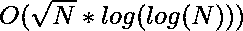

# 找到计算对数所需的最小对数数值

> 原文:[https://www . geesforgeks . org/find-需要计算的最小日志值数-log-up-n/](https://www.geeksforgeeks.org/find-minimum-number-of-log-value-needed-to-calculate-log-upto-n/)

给定一个整数 N。任务是使用对数的属性，找到从 1 到 N 计算所有日志值所需的最小日志值数。
**例** :

```
Input : N = 6
Output : 3
Value of log1 is already know, i.e. 0.
Except this the three log values needed are,
log2, log3, log5.

Input : N = 4
Output : 2
```

对数函数的属性之一是:

```
log(x.y) = log(x) + log(y)
```

因此，为了计算对数(x.y)，我们必须知道 x 和 y 的对数值。让*和*表示从 1 到 6 查找所有日志值所需的日志值数量。

*   log(1)=0(隐式)。
*   要计算 log(2)，我们必须事先知道它的值，我们不能用 property .所以，ans 变成 1。
*   要计算 log(3)，我们必须事先知道它的值，我们不能用 property .所以，ans 变成 2。
*   要计算 log(4)，我们可以使用 property，log(4)=log(2.2)=log(2)+log(2)。因为我们已经找到了 log(2)，所以 ans 仍然是 2。
*   要计算 log(5)，我们必须事先知道它的值，我们不能用 property .所以，ans 变成 3。
*   要计算 log(6)，我们可以使用 property，log(6)=log(2.3)=log(2)+log(3)。因为我们已经找到了 log(2)和 log(3)，所以 ans 仍然是 3。

这个想法很简单，仔细观察你会发现你不能计算素数的对数值，因为它没有除数(除了 1 和它本身)。于是，任务简化为[寻找从 1 到 N 的所有质数](https://www.geeksforgeeks.org/print-all-prime-numbers-less-than-or-equal-to-n/)。
以下是上述办法的实施情况:

## C++

```
// C++ program to find number of log values
// needed to calculate all the log values
// from 1 to N

#include <bits/stdc++.h>
using namespace std;

#define MAX 1000005

// In this vector prime[i] will store true
// if prime[i] is prime, else store false
vector<bool> prime(MAX, true);

// Using sieve of Eratosthenes to find
// all prime upto N
void sieve(int N)
{
    prime[0] = prime[1] = false;

    for (int i = 2; i <= N; i++) {
        if (prime[i]) {
            for (int j = 2; i * j <= N; j++)
                prime[i * j] = false;
        }
    }
}

// Function to find number of log values needed
// to calculate all the log values from 1 to N
int countLogNeeded(int N)
{
    int count = 0;

    // calculate primes upto N
    sieve(N);

    for (int i = 1; i <= N; i++) {
        if (prime[i])
            count++;
    }

    return count;
}

// Driver code
int main()
{
    int N = 6;

    cout<<countLogNeeded(N)<<endl;

    return 0;
}
```

## Java 语言(一种计算机语言，尤用于创建网站)

```
// Java program to find number of log values
// needed to calculate all the log values
// from 1 to N
import java.util.*;

class GFG
{

    static int MAX = 1000005;

    // In this vector prime[i] will store true
    // if prime[i] is prime, else store false
    static Vector<Boolean> prime = new Vector<>(MAX);

    static void vecIni()
    {
        for (int i = 0; i < MAX; i++)
        {
            prime.add(i, true);
        }
    }

    // Using sieve of Eratosthenes to find
    // all prime upto N
    static void sieve(int N)
    {
        prime.add(0, false);
        prime.add(1, false);

        for (int i = 2; i <= N; i++)
        {
            if (prime.get(i))
            {
                for (int j = 2; i * j <= N; j++)
                {
                    prime.add(i * j, false);
                }
            }
        }
    }

    // Function to find number of log values needed
    // to calculate all the log values from 1 to N
    static int countLogNeeded(int N)
    {
        int count = 0;

        // calculate primes upto N
        sieve(N);

        for (int i = 1; i <= N; i++)
        {
            if (prime.get(i))
            {
                count++;
            }
        }

        return count;
    }

    // Driver code
    public static void main(String[] args)
    {
        vecIni();
        int N = 6;
        System.out.println(countLogNeeded(N));
    }
}

/* This code contributed by PrinciRaj1992 */
```

## 蟒蛇 3

```
# Python3 program to find number of log values
# needed to calculate all the log values
# from 1 to N

MAX = 1000005

# In this list prime[i] will store true
# if prime[i] is prime, else store false
prime = [True for i in range(MAX)]

# Using sieve of Eratosthenes to find
# all prime upto N
def sieve(N):

    prime[0], prime[1] = False, False

    for i in range(2, N + 1):
        if(prime[i]):
            for j in range(2, N + 1):
                if(i * j > N):
                    break
                prime[i * j] = False

# Function to find number of log values needed
# to calculate all the log values from 1 to N
def countLogNeeded(N):

    count = 0

    # calculate primes upto N
    sieve(N)

    for i in range(1, N + 1):
        if(prime[i]):
            count = count + 1

    return count

# Driver code
if __name__=='__main__':
    N = 6
    print(countLogNeeded(N))

# This code is contributed by
# Sanjit_Prasad
```

## C#

```
// C# program to find number of log values
// needed to calculate all the log values
// from 1 to N
using System;
using System.Collections.Generic;
using System.Linq;

class GFG
{

    static int MAX = 1000005;

    // In this vector prime[i] will store true
    // if prime[i] is prime, else store false
    static List<Boolean> prime = new List<Boolean>(MAX);

    static void vecIni()
    {
        for (int i = 0; i < MAX; i++)
        {
            prime.Add(true);
        }
    }

    // Using sieve of Eratosthenes to find
    // all prime upto N
    static void sieve(int N)
    {
        prime.Insert(0, false);
        prime.Insert(1, false);

        for (int i = 2; i <= N; i++)
        {
            if (prime[i])
            {
                for (int j = 2; i * j <= N; j++)
                {
                    prime.Insert(i * j, false);
                }
            }
        }
    }

    // Function to find number of log values needed
    // to calculate all the log values from 1 to N
    static int countLogNeeded(int N)
    {
        int count = 0;

        // calculate primes upto N
        sieve(N);

        for (int i = 1; i <= N; i++)
        {
            if (prime[i])
            {
                count++;
            }
        }

        return count;
    }

    // Driver code
    public static void Main()
    {
        vecIni();
        int N = 6;
        Console.Write(countLogNeeded(N));
    }
}

/* This code contributed by Mohit kumar */
```

## java 描述语言

```
<script>

// Javascript program to find number of log values
// needed to calculate all the log values
// from 1 to N

MAX = 1000005

// In this vector prime[i] will store true
// if prime[i] is prime, else store false
var prime = Array(MAX).fill(true);

// Using sieve of Eratosthenes to find
// all prime upto N
function sieve(N)
{
    prime[0] = prime[1] = false;

    for (var i = 2; i <= N; i++) {
        if (prime[i]) {
            for (var j = 2; i * j <= N; j++)
                prime[i * j] = false;
        }
    }
}

// Function to find number of log values needed
// to calculate all the log values from 1 to N
function countLogNeeded(N)
{
    var count = 0;

    // calculate primes upto N
    sieve(N);

    for (var i = 1; i <= N; i++) {
        if (prime[i])
            count++;
    }

    return count;
}

// Driver code
var N = 6;

document.write( countLogNeeded(N));

</script>
```

**Output:** 

```
3
```

**时间复杂度:** 
**辅助空间:** O(N)