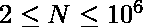

# 找到使阵列美观所需的最少操作

> 原文:[https://www . geeksforgeeks . org/find-最小操作-制作阵列所需-美观/](https://www.geeksforgeeks.org/find-minimum-operations-needed-to-make-an-array-beautiful/)

给定一个长度为 N 的二进制数组(将其视为循环数组，起点和终点连在一起)，其中只有 1 和 0。任务是找到使阵列美观所需的最小操作。
如果一个数组没有连续的 1 或 0，则称其为**美丽的**。如果不可能，则打印-1。
一次操作，可以做到以下几点:

1.  将数组分成两部分。
2.  颠倒这两个部分中的一个。
3.  连接这两个部分的对应端点，再次创建一个完整的数组。

找到要在数组上执行的上述操作的最小数量，使其美观，从而不包含任何连续的 1 或 0。
**例** :

```
Input : A[] = { 1, 1, 0, 0 }
Output : 1
Explanation: 
Make first cut between A[0] and A[1]
and second cut between A[2] and A[3].
Reverse array A[1] to A[2] and tie both array together.
Thus new array is A = [1, 0, 1, 0] which is beautiful.

Input : A[] = { 1, 1, 0, 0, 0 }
Output : -1
```

**方法:**目标是使数组的形式为 A1[] = { 1，0，1，…，0，1，0 }或 A2[] = { 0，1，0，…，1 }。

*   如果我们有奇数个元素，那么不可能使数组变得漂亮，因为我们总是比其他的多一个二进制数。因此我们返回-1。
*   如果我们有偶数个元素，那么只有当我们的二进制 0 和 1 的数量相等时，我们才能生成数组 A1 或 A2 中的任何一个。
*   此外，所需的最小切割是我们拥有的并且将相等的连续 0 或 1 的数量。
*   因此，我们迭代数组并保持 0 和 1 以及连续 0 的计数。
*   如果零= 1，则返回连续零的计数，否则返回-1。

**注**:一种特殊情况是数组中只有一个元素。如果数组中只有 1 个元素，那么数组已经很漂亮了，所以答案是零。
以下是上述办法的实施:

## C++

```
// CPP implementation of above approach

#include <bits/stdc++.h>
using namespace std;

// Function to find minimum operations
// required to make array beautiful
int minOperations(int A[], int n)
{
    if (n & 1)
        return -1;

    int zeros = 0, consZeros = 0, ones = 0;

    for (int i = 0; i < n; ++i) {
        A[i] == 0 ? zeros++ : ones++;

        // counting consecutive zeros.
        if (i + 1 < n) {
            if (A[i] == 0 && A[i + 1] == 0)
                consZeros++;
        }
    }

    // check that start and end are same
    if (A[0] == A[n - 1] && A[0] == 0)
        consZeros++;

    // check is zero and one are equal
    if (zeros == ones)
        return consZeros;
    else
        return -1;
}

// Driver program
int main()
{
    int A[] = { 1, 1, 0, 0 };
    int n = sizeof(A) / sizeof(A[0]);

    cout << minOperations(A, n);

    return 0;
}
```

## Java 语言(一种计算机语言，尤用于创建网站)

```
// Java implementation of above approach

class GFG{
// Function to find minimum operations
// required to make array beautiful
static int minOperations(int[] A, int n)
{
    if ((n & 1)>0)
        return -1;

    int zeros = 0, consZeros = 0, ones = 0;

    for (int i = 0; i < n; ++i) {
        if(A[i] == 0) zeros++; else  ones++;

        // counting consecutive zeros.
        if (i + 1 < n) {
            if (A[i] == 0 && A[i + 1] == 0)
                consZeros++;
        }
    }

    // check that start and end are same
    if (A[0] == A[n - 1] && A[0] == 0)
        consZeros++;

    // check is zero and one are equal
    if (zeros == ones)
        return consZeros;
    else
        return -1;
}

// Driver program
public static void main(String[] args)
{
    int[] A =new int[] { 1, 1, 0, 0 };
    int n = A.length;

    System.out.println(minOperations(A, n));

}
}
// This code is contributed by mits
```

## 蟒蛇 3

```
# Python 3 implementation of
# above approach

# Function to find minimum operations
# required to make array beautiful
def minOperations(A, n) :

    if n & 1 :
        return -1

    zeros, consZeros, ones = 0, 0, 0

    for i in range(n) :

        if A[i] :
            zeros += 1
        else :
            ones += 1

        # counting consecutive zeros.
        if( i + 1 < n) :

            if A[i] == 0 and A[i + 1] == 0 :
                consZeros += 1

    # check that start and end are same
    if A[0] == A[n - 1] and A[0] == 0 :
        consZeros += 1

    # check is zero and one are equal
    if zeros == ones :
        return consZeros
    else :
        return -1

# Driver code
if __name__ == "__main__" :

    A = [1, 1, 0, 0]
    n = len(A)

    print(minOperations(A, n))

# This code is contributed by ANKITRAI1
```

## C#

```
// C# implementation of above approach

class GFG{
// Function to find minimum operations
// required to make array beautiful
static int minOperations(int[] A, int n)
{
    if ((n & 1)>0)
        return -1;

    int zeros = 0, consZeros = 0, ones = 0;

    for (int i = 0; i < n; ++i) {
        if(A[i] == 0) zeros++; else ones++;

        // counting consecutive zeros.
        if (i + 1 < n) {
            if (A[i] == 0 && A[i + 1] == 0)
                consZeros++;
        }
    }

    // check that start and end are same
    if (A[0] == A[n - 1] && A[0] == 0)
        consZeros++;

    // check is zero and one are equal
    if (zeros == ones)
        return consZeros;
    else
        return -1;
}

// Driver program
static void Main()
{
    int[] A =new int[] { 1, 1, 0, 0 };
    int n = A.Length;

    System.Console.WriteLine(minOperations(A, n));

}
}
// This code is contributed by mits
```

## 服务器端编程语言（Professional Hypertext Preprocessor 的缩写）

```
<?php
// PHP implementation of above approach

// Function to find minimum operations
// required to make array beautiful
function minOperations($A, $n)
{
    if ($n & 1)
        return -1;

    $zeros = 0;
    $consZeros = 0;
    $ones = 0;

    for ($i = 0; $i < $n; ++$i)
    {
        $A[$i] == 0 ? $zeros++ : $ones++;

        // counting consecutive zeros.
        if (($i + 1) < $n)
        {
            if ($A[$i] == 0 &&
                $A[$i + 1] == 0)
                $consZeros++;
        }
    }

    // check that start and
    // end are same
    if ($A[0] == $A[$n - 1] &&
        $A[0] == 0)
        $consZeros++;

    // check is zero and one are equal
    if ($zeros == $ones)
        return $consZeros;
    else
        return -1;
}

// Driver Code
$A = array( 1, 1, 0, 0 );
$n = sizeof($A);

echo minOperations($A, $n);

// This code is contributed
// by akt_mit
?>
```

## java 描述语言

```
<script>
    // Javascript implementation of above approach

    // Function to find minimum operations
    // required to make array beautiful
    function minOperations(A, n)
    {
        if ((n & 1)>0)
            return -1;

        let zeros = 0, consZeros = 0, ones = 0;

        for (let i = 0; i < n; ++i) {
            if(A[i] == 0) zeros++; else ones++;

            // counting consecutive zeros.
            if (i + 1 < n) {
                if (A[i] == 0 && A[i + 1] == 0)
                    consZeros++;
            }
        }

        // check that start and end are same
        if (A[0] == A[n - 1] && A[0] == 0)
            consZeros++;

        // check is zero and one are equal
        if (zeros == ones)
            return consZeros;
        else
            return -1;
    }

    let A = [ 1, 1, 0, 0 ];
    let n = A.length;

    document.write(minOperations(A, n));

</script>
```

**Output:** 

```
1
```

**时间复杂度:** O(N)