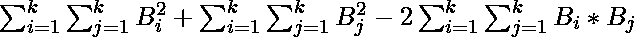
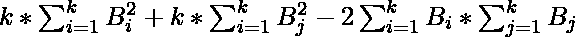
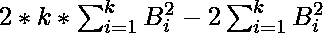
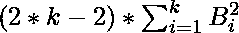

# 从给定数组中选择 K 个元素求表达式的最小值

> 原文:[https://www . geeksforgeeks . org/通过从给定数组中选择 k 个元素来查找表达式的最小值/](https://www.geeksforgeeks.org/find-minimum-value-of-the-expression-by-choosing-k-elements-from-given-array/)

给定一个大小为 **N** 的整数数组 **arr** ，任务是通过从给定数组 **arr** 中精确选择 **K(≤ N)** 整数来找到表达式的最小可能值。假设所选元素存储在数组 **B** **(B <sub>1</sub> 、B <sub>2</sub> 、B <sub>3</sub> …..B <sub>k</sub> )** 那么表达式的值:
T21】

**示例:**

> **输入:** arr[] = {2，0，9，5}，k = 2
> **输出:** 8
> 假设选择的元素是{2，0}，那么 x = 8，这是最小可能值
> 
> **输入:** arr[] = {4，21，5，3，8}，k = 3
> T3】输出: 200

**进场:**
以上表述可简化为:

*   
*   
*   
*   
*   

所以，我们需要做的就是从数组中选择 **k** 个最小的元素，求解表达式。

下面是上述方法的实现:

## C++

```
// CPP program to find the minimum possible of the expression
// by choosing exactly K(? N) integers form given array arr
#include <bits/stdc++.h>
using namespace std;

// Function to find the minimum possible of the expression
// by choosing exactly K(? N) integers form given array arr
int minimumValue(int arr[], int n, int k)
{

    // Sorting the array for least k element selection
    sort(arr, arr + n);

    int answer = 0;

    // Select first k elements from sorted array
    for (int i = 0; i < k; i++)
        answer += arr[i] * arr[i];

    // Return value of solved expression
    return answer * (2 * k - 2);
}

// Driver code
int main()
{
    int arr[] = { 4, 21, 5, 3, 8 }, k = 3;

    int n = sizeof(arr) / sizeof(arr[0]);

    // Function call
    cout << minimumValue(arr, n, k);

    return 0;
}
```

## Java 语言(一种计算机语言，尤用于创建网站)

```
// JAVA program to find the minimum possible of the expression
// by choosing exactly K(? N) integers form given array arr 
import java.util.*;

class GFG{

// Function to find the minimum possible of the expression
// by choosing exactly K(? N) integers form given array arr
static int minimumValue(int arr[], int n, int k)
{

    // Sorting the array for least k element selection
    Arrays.sort(arr);

    int answer = 0;

    // Select first k elements from sorted array
    for (int i = 0; i < k; i++)
        answer += arr[i] * arr[i];

    // Return value of solved expression
    return answer * (2 * k - 2);
}

// Driver code
public static void main(String[] args)
{
    int arr[] = { 4, 21, 5, 3, 8 }, k = 3;

    int n = arr.length;

    // Function call
    System.out.print(minimumValue(arr, n, k));    
}
}

// This code is contributed by Rajput-Ji
```

## 蟒蛇 3

```
# Python program to find the minimum
# possible of the expression by choosing
# exactly K(? N) integers form given array arr

# Function to find the minimum
# possible of the expression by
# choosing exactly K(? N) integers
# form given array arr
def minimumValue(arr, n, k):

    # Sorting the array for least k element selection
    arr.sort();

    answer = 0;

    # Select first k elements from sorted array
    for i in range(k):
        answer += arr[i] * arr[i];

    # Return value of solved expression
    return answer * (2 * k - 2);

# Driver code
if __name__ == '__main__':
    arr = [ 4, 21, 5, 3, 8 ];
    k = 3;

    n = len(arr);

    # Function call
    print(minimumValue(arr, n, k));

# This code is contributed by Rajput-Ji
```

## C#

```
// C# program to find the minimum possible of the expression
// by choosing exactly K(? N) integers form given array arr 
using System;

class GFG{

// Function to find the minimum possible of the expression
// by choosing exactly K(? N) integers form given array arr
static int minimumValue(int []arr, int n, int k)
{

    // Sorting the array for least k element selection
    Array.Sort(arr);

    int answer = 0;

    // Select first k elements from sorted array
    for (int i = 0; i < k; i++)
        answer += arr[i] * arr[i];

    // Return value of solved expression
    return answer * (2 * k - 2);
}

// Driver code
public static void Main(String[] args)
{
    int []arr = { 4, 21, 5, 3, 8 };
    int k = 3;

    int n = arr.Length;

    // Function call
    Console.Write(minimumValue(arr, n, k));    
}
}

// This code is contributed by 29AjayKumar
```

## java 描述语言

```
<script>

// JavaScript program to find the minimum possible of the expression
// by choosing exactly K(? N) integers form given array arr

// Function to find the minimum possible of the expression
// by choosing exactly K(? N) integers form given array arr
function minimumValue(arr, n, k)
{

    // Sorting the array for least k element selection
    arr.sort((a, b) => a - b);

    let answer = 0;

    // Select first k elements from sorted array
    for (let i = 0; i < k; i++)
        answer += arr[i] * arr[i];

    // Return value of solved expression
    return answer * (2 * k - 2);
}

// Driver code

    let arr = [ 4, 21, 5, 3, 8 ], k = 3;

    let n = arr.length;

    // Function call
    document.write(minimumValue(arr, n, k));

// This code is contributed by Surbhi Tyagi.

</script>
```

**Output:** 

```
200
```

时间复杂度:O(n * log n)

辅助空间:0(1)