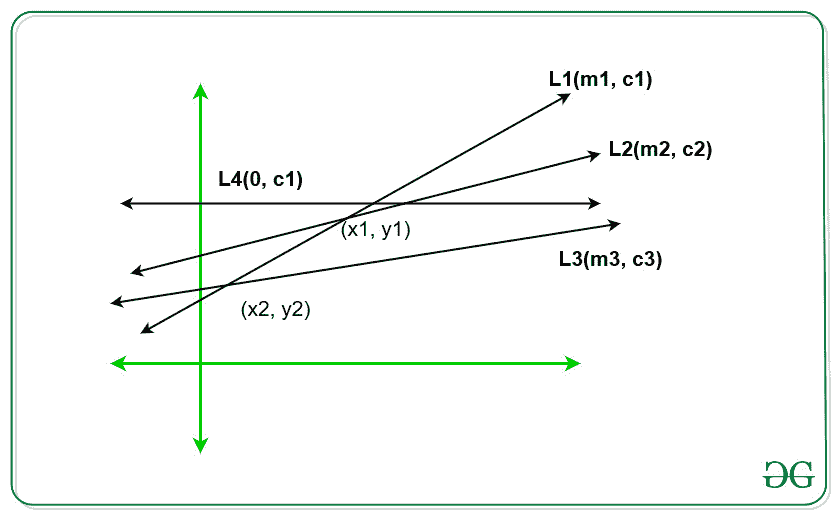

# 从一个平面内的 N 条线的集合中找出最小 y 坐标

> 原文:[https://www . geesforgeks . org/find-minimum-y-coordinates-from-set-n-line-in-a-plane/](https://www.geeksforgeeks.org/find-minimum-y-coordinates-from-set-of-n-lines-in-a-plane/)

以 2D [阵列](https://www.geeksforgeeks.org/introduction-to-arrays/)**arr【】【】**的形式给定平面中的 **N** 条直线，使得每行由 2 个整数组成(比如说 **m & c** )，其中 **m** 是直线的斜率， **c** 是该直线的 **y 截距**。给你的 **Q** 查询各由 **x 坐标**组成。任务是为每个查询找到每一行对应的最小可能 **y 坐标**。
**例:**

> **输入:** arr[][] = { { 4，0 }、{ -3，0 }、{ 5，1 }、{ 3，-1 }、{ 2，3 }、{ 1，4 } }和 Q[] = {-6，3，100}
> **输出:**
> -29
> -9
> -300
> **解释:**
> 给定一组行中 x = -6 的最小值为-29。
> 给定行集合中 x = 3 的最小值为-9。
> 给定行集合中 x = -100 的最小值为-300。

**天真法:**天真法是找出每条线的 y 坐标，所有 y 坐标中的最小值将给出最小 y 坐标值。对所有的查询重复上面的操作，给出了 **O(N*Q)** 的时间复杂度。
**高效方法:**
**<u>观察</u>**



1.  **L1** 和 **L2** 是两条线，相交于 **(x1，y1)** ，如果 **L1** 比**前低 x = x1** ，那么 **L2** 会比**后的 **L1** 低 x = x1** 。这意味着对于某些连续范围，线条给出了较低的值。
2.  **L4** 是平行于 x 轴的直线，不变为 **y = c4** 且不给出所有直线对应的最小值。
3.  因此，斜率较高的直线在较低的 x 坐标下给出最小值，在较高的 x 坐标下给出最大值。例如，如果坡度 **(L1)** >坡度 **(L2)** 与 **(x1，y1)** 相交，那么对于 **x < x1** 线 **L1** 给出最小值，对于 **x > x1** 线 **L2** 给出最小值。
4.  对于线 **L1、L2 和 L3，**如果**斜率(L1) >斜率(L2) >斜率(L3)** 并且如果 **L1 和 L3** 的交点低于 **L1 和 L2** ，那么我们可以忽略线 **L2** ，因为它不能给出任何 x 坐标的最小值。

基于上述观察，以下是步骤:

1.  [按照斜率递减的顺序排序](https://www.geeksforgeeks.org/sorting-algorithms/)斜率。
2.  从一组具有相同斜率的线中，保留具有最小 **y 截距**值的线，并丢弃所有剩余的具有相同斜率的线。
3.  将前两条线加入到有效线集合中，找到交点(比如 **(a，b)** )。
4.  对于下一组剩余行，请执行以下操作:
    *   求倒数第二行与当前行的交点(说 **(c，d)** )。
    *   如果 **(c，d)** 低于 **(a，b)** ，则删除从有效行插入的最后一行，因为它由于当前行而不再有效。
5.  重复以上步骤，生成所有有效的行集。
6.  现在我们有了有效线集，并且有效线集中的每一条线在连续范围内以递增的顺序形成最小值，即 **L1** 在范围内最小**【a，b】**并且 L2 在范围内**【b，c】**。
7.  在范围[]上执行[二分搜索法](http://www.geeksforgeeks.org/binary-search/)，为每次查询 **x 坐标**找到最小 **y 坐标**。

以下是上述方法的实现:

## 卡片打印处理机（Card Print Processor 的缩写）

```
// C++ program for the above approach
#include <bits/stdc++.h>
using namespace std;

// To store the valid lines
vector<pair<int, int> > lines;

// To store the distinct lines
vector<pair<int, int> > distinct;

// To store the ranges of intersection
// points
vector<pair<int, int> > ranges;

// Function that returns the intersection
// points
pair<int, int> intersection(pair<int, int> a,
                            pair<int, int> b)
{
    int x = a.second - b.second;
    int y = b.first - a.first;
    return { x, y };
}

// Function to see if a line is eligible
// or not.
// L3 is the current line being added and
// we check eligibility of L2
bool isleft(pair<int, int> l1,
            pair<int, int> l2,
            pair<int, int> l3)
{
    pair<int, int> x1, x2;

    // Find intersections
    x1 = intersection(l1, l3);
    x2 = intersection(l1, l2);

    // Returns true if x1 is left of x2
    return (x1.first * x2.second
            < x2.first * x1.second);
}

// Comparator function to sort the line[]
bool cmp(pair<int, int> a, pair<int, int> b)
{
    if (a.first != b.first)
        return a.first > b.first;
    else
        return a.second < b.second;
}

// Find x-coordinate of intersection
// of 2 lines
int xintersect(pair<int, int> a,
               pair<int, int> b)
{

    int A = a.second - b.second;
    int B = b.first - a.first;

    // Find the x coordinate
    int x = A / B;

    if (A * B < 0)
        x -= 1;

    return x;
}

// Function to returns the minimum
// possible value for y
int findy(vector<pair<int, int> >& ranges,
          int pt)
{
    int lo = 0, hi = ranges.size() - 1;
    int mid = 0;

    // Binary search to find the minimum
    // value
    while (lo <= hi) {

        // Find middle element
        mid = (lo + hi) / 2;

        if (ranges[mid].first <= pt
            && ranges[mid].second >= pt) {
            break;
        }
        else if (ranges[mid].first > pt) {
            hi = mid - 1;
        }
        else {
            lo = mid + 1;
        }
    }

    // Returns the minimum value
    return lines[mid].first * pt + lines[mid].second;
}

// Function to add a valid line and
// remove the invalid lines
void add(pair<int, int> x)
{
    // Add the current line
    lines.push_back(x);

    // While Loop
    while (lines.size() >= 3
           && isleft(lines[lines.size() - 3],
                     lines[lines.size() - 2],
                     lines[lines.size() - 1])) {

        // Erase invalid lines
        lines.erase(lines.end() - 2);
    }
}

// Function to updateLines on the
// basis of distinct slopes
void updateLines(pair<int, int> line[],
                 int n)
{

    // Sort the line according to
    // decreasing order of slope
    sort(line, line + n, cmp);

    // To track for last slope
    int lastslope = INT_MIN;

    // Traverse the line[] and find
    // set of distinct lines
    for (int i = 0; i < n; i++) {

        if (line[i].first == lastslope)
            continue;

        // Push the current line in
        // array distinct[]
        distinct.push_back(line[i]);

        // Update the last slope
        lastslope = line[i].first;
    }

    // Traverse the distinct[] and
    // update the valid lines to lines[]
    for (int i = 0; i < distinct.size(); i++)
        add(distinct[i]);

    int left = INT_MIN;
    int i, right = 0;

    // Traverse the valid lines array
    for (i = 0; i < lines.size() - 1; i++) {

        // Find the intersection point
        int right = xintersect(lines[i],
                               lines[i + 1]);

        // Insert the current intersection
        // points in ranges[]
        ranges.push_back({ left, right });

        left = right + 1;
    }

    ranges.push_back({ left, INT_MAX });
}

// Driver Code
int main()
{
    int n = 6;

    // Set of lines of slopes and y intercept
    pair<int, int> line[] = { { 4, 0 }, { -3, 0 },
                              { 5, 1 }, { 3, -1 },
                              { 2, 3 }, { 1, 4 } };

    // Function Call
    updateLines(line, n);

    // Queries for x-coordinates
    int Q[] = { -6, 3, 100 };

    // Traverse Queries to find minimum
    // y-coordinates
    for (int i = 0; i < 3; i++) {

        // Use Binary Search in ranges
        // to find the minimum y-coordinates
        cout << findy(ranges, Q[i])
             << endl;
    }
    return 0;
}
```

## 蟒蛇 3

```
# Python 3 program for the above approach

# To store the valid lines
lines = []

# To store the distinct lines
distinct = []

# To store the ranges of intersection
# points
ranges = []

# Function that returns the intersection
# points

def intersection(a, b):
    x = a[1] - b[1]
    y = b[0] - a[0]
    return x, y

# Function to see if a line is eligible
# or not.
# L3 is the current line being added and
# we check eligibility of L2
def isleft(l1, l2, l3):
    # Find intersections
    x1 = intersection(l1, l3)
    x2 = intersection(l1, l2)

    # Returns true if x1 is left of x2
    return ((x1[0] * x2[1]) < (x2[0] * x1[1]))

# Find x-coordinate of intersection
# of 2 lines

def xintersect(a, b):

    A = a[1] - b[1]
    B = b[0] - a[0]

    # Find the x coordinate
    x = A / B

    if (A * B < 0):
        x -= 1

    return x

# Function to returns the minimum
# possible value for y
def findy(ranges, pt):
    lo = 0
    hi = len(ranges)-1
    mid = 0

    # Binary search to find the minimum
    # value
    while (lo <= hi):

        # Find middle element
        mid = (lo + hi) // 2

        if (ranges[mid][0] <= pt
                and ranges[mid][1] >= pt):
            break

        elif (ranges[mid][0] > pt):
            hi = mid - 1

        else:
            lo = mid + 1

    # Returns the minimum value
    return lines[mid][0] * pt + lines[mid][1]

# Function to add a valid line and
# remove the invalid lines
def add(x):
    # Add the current line
    lines.append(x)

    # While Loop
    while (len(lines) >= 3
           and isleft(lines[len(lines) - 3],
                      lines[len(lines) - 2],
                      lines[len(lines) - 1])):

        # Erase invalid lines
        lines.pop(-2)

# Function to updateLines on the
# basis of distinct slopes
def updateLines(line, n):

    # Sort the line according to
    # decreasing order of slope
    line.sort(reverse=True)

    # To track for last slope
    lastslope = -float('inf')

    # Traverse the line[] and find
    # set of distinct lines
    for i in range(n):

        if (line[i][0] == lastslope):
            continue

        # Push the current line in
        # array distinct[]
        distinct.append(line[i])

        # Update the last slope
        lastslope = line[i][0]

    # Traverse the distinct[] and
    # update the valid lines to lines[]
    for i in range(len(distinct)):
        add(distinct[i])

    left = -float('inf')
    right = 0

    # Traverse the valid lines array
    for i in range(len(lines)-1):

        # Find the intersection point
        right = xintersect(lines[i], lines[i + 1])

        # Insert the current intersection
        # points in ranges[]
        ranges.append((left, right))

        left = right + 1

    ranges.append((left, float('inf')))

# Driver Code
if __name__ == '__main__':
    n = 6

    # Set of lines of slopes and y intercept
    line = [(4, 0), (-3, 0),
            (5, 1), (3, -1),
            (2, 3), (1, 4)]

    # Function Call
    updateLines(line, n)

    # Queries for x-coordinates
    Q = [ -6, 3, 100]

    # Traverse Queries to find minimum
    # y-coordinates
    for i in range(3):

        # Use Binary Search in ranges
        # to find the minimum y-coordinates
        print(findy(ranges, Q[i]))
```

**Output:** 

```
-29
-9
-300
```

**时间复杂度:** *O(N + Q*log N)* ，其中 N 为行数，Q 为查询数
T5】辅助空间: O(N)