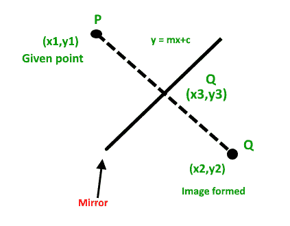

# 在二维平面上找到一个点的镜像

> 原文:[https://www . geesforgeks . org/find-mirror-image-point-2-d-plane/](https://www.geeksforgeeks.org/find-mirror-image-point-2-d-plane/)

给定二维平面上的点 P 和反射镜方程，任务是找到由于反射镜而形成的点 Q 的图像。
镜像方程形式为 ax + by + c =
**例:**

```
Input : P = (1, 0), a = -1, b = 1, c = 0
Output : Q = (0, 1)

Input : P = (3, 3), a = 0, b = 1, c = -2
Output : Q = (3, 1)
```

## 解决方案:



```
Let coordinate of P(given point) be (x1, y1)
Let coordinate of Q(image point) be (x2, y2)
Let coordinate of R(point on mirror) be (x3, y3)
```

由于物体和图像与镜子等距，R 必须是 P 和 Q 的中点
因为镜子的方程是:ax + by + c = 0。穿过 P 和 Q 的直线方程垂直于镜面。因此，通过 P 和 Q 的直线方程变成 ay–bx+d = 0，P 也通过通过 P 和 Q 的直线，所以我们把 P 的坐标放在上面的方程中，
a * y1–b * x1+d = 0
d = b * x1–a * y1
R 也是镜子和通过 P 和 Q 的直线的交点，所以我们找到了
ax +乘+c = 0
ay -bx + d = 0
由于 a，b，c，d 都是已知的，所以我们可以找到因为坐标现在是已知的..x3、y3 现在都知道了。
由于 R 是 PQ 的中点，
(x3，y3) = ((x1+x2)/2，(y1+y2)/2)
由于 x1，y1，x3，y3 是已知的，我们得到下面的等式，其中(x，y)是 Q(像点)
的坐标


我们用上面的公式求出点 P(x1，y1)相对于方程 ax + by + c 的镜像

## C++

```
// C++ code to find mirror image
#include <iostream>
using namespace std;

// C++ function which finds coordinates
// of mirror image.
// This function return a pair of double
pair<double, double> mirrorImage(
    double a, double b, double c,
    double x1, double y1)
{
    double temp = -2 * (a * x1 + b * y1 + c) /
                              (a * a + b * b);
    double x = temp * a + x1;
    double y = temp * b + y1;
    return make_pair(x, y);
}

// Driver code to test above function
int main()
{
    double a = -1.0;
    double b = 1.0;
    double c = 0.0;
    double x1 = 1.0;
    double y1 = 0.0;

    pair<double, double> image = mirrorImage(a, b, c, x1, y1);
    cout << "Image of point (" << x1 << ", " << y1 << ") ";
    cout << "by mirror (" << a << ")x + (" << b
         << ")y + (" << c << ") = 0, is :";
    cout << "(" << image.first << ", " << image.second
         << ")" << endl;

    return 0;
}
```

## Java 语言(一种计算机语言，尤用于创建网站)

```
// Java code to find mirror image
class GFG
{
static class pair
{ 
    double first, second; 
    public pair(double first, double second) 
    { 
        this.first = first; 
        this.second = second; 
    } 
} 

// function which finds coordinates
// of mirror image.
// This function return a pair of double
static pair mirrorImage(double a, double b, 
                        double c, double x1, 
                        double y1)
{
    double temp = -2 * (a * x1 + b * y1 + c) /
                       (a * a + b * b);
    double x = temp * a + x1;
    double y = temp * b + y1;
    return new pair(x, y);
}

// Driver code
public static void main(String []args)
{
    double a = -1.0;
    double b = 1.0;
    double c = 0.0;
    double x1 = 1.0;
    double y1 = 0.0;

    pair image = mirrorImage(a, b, c, x1, y1);
    System.out.print("Image of point (" + x1 + 
                                   ", " + y1 + ") ");
    System.out.print("by mirror (" + a + 
                          ")x + (" + b + 
                          ")y + (" + c + ") = 0, is :");
    System.out.println("(" + image.first + 
                       ", " + image.second + ")");
}
}

// This code is contributed by 29AjayKumar
```

## 蟒蛇 3

```
# Python 3 code to find mirror image 

# Python function which finds coordinates 
# of mirror image. 
# This function return a pair of double 
def mirrorImage( a, b, c, x1, y1):
    temp = -2 * (a * x1 + b * y1 + c) /(a * a + b * b)
    x = temp * a + x1
    y = temp * b + y1 
    return (x, y)

# Driver code to test above function 
a = -1.0
b = 1.0
c = 0.0
x1 = 1.0
y1 = 0.0

x, y = mirrorImage(a, b, c, x1, y1); 
print("Image of point (" + str (x1) + ", " + str( y1) + ") ")
print("by mirror (" + str (a) + ")x + (" + str( b) + ")y + (" +str(c) + ") = 0, is :") 
print( "(" + str(x) + ", " + str(y) + ")" ) 

# This code is contributed by ApurvaRaj
```

## C#

```
// C# code to find mirror image
using System;

class GFG
{
class pair
{ 
    public double first, second; 
    public pair(double first, double second) 
    { 
        this.first = first; 
        this.second = second; 
    } 
} 

// function which finds coordinates
// of mirror image.
// This function return a pair of double
static pair mirrorImage(double a, double b, 
                        double c, double x1, 
                        double y1)
{
    double temp = -2 * (a * x1 + b * y1 + c) /
                       (a * a + b * b);
    double x = temp * a + x1;
    double y = temp * b + y1;
    return new pair(x, y);
}

// Driver code
public static void Main(String []args)
{
    double a = -1.0;
    double b = 1.0;
    double c = 0.0;
    double x1 = 1.0;
    double y1 = 0.0;

    pair image = mirrorImage(a, b, c, x1, y1);
    Console.Write("Image of point (" + x1 + 
                                ", " + y1 + ") ");
    Console.Write("by mirror (" + a + 
                       ")x + (" + b + 
                       ")y + (" + c + ") = 0, is :");
    Console.WriteLine("(" + image.first + 
                     ", " + image.second + ")");
}
}

// This code is contributed by PrinciRaj1992
```

## java 描述语言

```
<script>
      // JavaScript code to find mirror image

      // JavaScript function which finds coordinates
      // of mirror image.
      // This function return a pair of double
      function mirrorImage(a, b, c, x1, y1) {
        var temp = (-2 * (a * x1 + b * y1 + c)) / (a * a + b * b);
        var x = temp * a + x1;
        var y = temp * b + y1;
        return [x, y];
      }

      // Driver code to test above function
      var a = -1.0;
      var b = 1.0;
      var c = 0.0;
      var x1 = 1.0;
      var y1 = 0.0;

      var [x, y] = mirrorImage(a, b, c, x1, y1);
      document.write("Image of point (" + x1 + ", " + y1 + ") ");
      document.write(
        "by mirror <br> (" + a + ")x + (" + b + ")y + (" + c + ") = 0, is :"
      );
      document.write("(" + x + ", " + y + ")");
    </script>
```

**输出:**

```
Image of point (1, 0) by mirror 
(-1)x + (1)y + (0) = 0, is :(0, 1)
```

本文由 [**普拉蒂克·查哈尔**](https://github.com/pratik-chhajer) 供稿。如果你喜欢 GeeksforGeeks 并想投稿，你也可以使用[write.geeksforgeeks.org](http://www.write.geeksforgeeks.org)写一篇文章或者把你的文章邮寄到 review-team@geeksforgeeks.org。看到你的文章出现在极客博客主页上，帮助其他极客。
如果发现有不正确的地方，或者想分享更多关于上述话题的信息，请写评论。