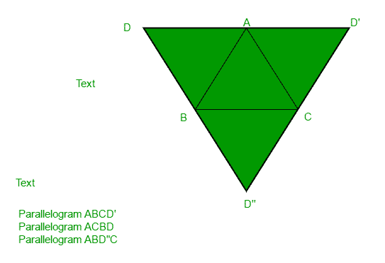
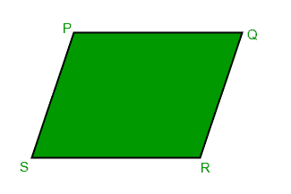
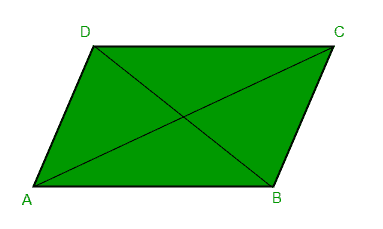

# 找到平行四边形的缺失点

> 原文:[https://www . geesforgeks . org/find-缺失点-平行四边形/](https://www.geeksforgeeks.org/find-missing-point-parallelogram/)

给定三个坐标点 A、B 和 C，求缺失点 D，这样 ABCD 可以是平行四边形。
**例:**

```
Input : A = (1, 0)
        B = (1, 1)
        C = (0, 1)
Output : 0, 0
Explanation:
The three input points form a unit
square with the point (0, 0)

Input : A = (5, 0)
        B = (1, 1)
        C = (2, 5)
Output : 6, 4
```

如下图所示，可以有多个可能的输出，我们需要打印其中的任何一个。



如果四边形的对边平行且长度相等，则称其为平行四边形。



给我们平行四边形的三个点，我们可以找到缺失边的斜率以及它们的长度。
算法可以解释如下
让 R 为缺失点。现在从定义上来说，我们有

*   PR 的长度= QS 的长度= L1(两边相等)
*   PR 的斜率= QS 的斜率= M1(对边平行)
*   PQ 长度= RS 长度= L2(两边相等)
*   PQ 的斜率= RS 的斜率= M2(对边平行)

因此，我们可以找到距离 L1 P 有斜率 M1 的点，如下文所述:
[在给定斜率的直线上找到给定距离的点](https://www.geeksforgeeks.org/find-points-at-a-given-distance-on-a-line-of-given-slope/)。
现在其中一个点将满足上述条件，这些条件很容易检查(使用条件 3 或 4)

下面是上述方法的实现:

## C++

```
// C++ program to find missing point of a
// parallelogram
#include <bits/stdc++.h>
using namespace std;

// struct to represent a co-ordinate point
struct Point {
    float x, y;
    Point()
    {
        x = y = 0;
    }
    Point(float a, float b)
    {
        x = a, y = b;
    }
};

// given a source point, slope(m) of line
// passing through it this function calculates
// and return two points at a distance l away
// from the source
pair<Point, Point> findPoints(Point source,
                              float m, float l)
{
    Point a, b;

    // slope is 0
    if (m == 0) {
        a.x = source.x + l;
        a.y = source.y;

        b.x = source.x - l;
        b.y = source.y;
    }

    // slope if infinity
    else if (m == std::numeric_limits<float>::max()) {
        a.x = source.x;
        a.y = source.y + l;

        b.x = source.x;
        b.y = source.y - l;
    }

    // normal case
    else {
        float dx = (l / sqrt(1 + (m * m)));
        float dy = m * dx;
        a.x = source.x + dx, a.y = source.y + dy;
        b.x = source.x - dx, b.y = source.y - dy;
    }

    return pair<Point, Point>(a, b);
}

// given two points, this function calculates
// the slope of the line/ passing through the
// points
float findSlope(Point p, Point q)
{
    if (p.y == q.y)
        return 0;
    if (p.x == q.x)
        return std::numeric_limits<float>::max();
    return (q.y - p.y) / (q.x - p.x);
}

// calculates the distance between two points
float findDistance(Point p, Point q)
{
    return sqrt(pow((q.x - p.x), 2) + pow((q.y - p.y), 2));
}

// given three points, it prints a point such
// that a parallelogram is formed
void findMissingPoint(Point a, Point b, Point c)
{
    // calculate points originating from a
    pair<Point, Point> d = findPoints(a, findSlope(b, c),
                                      findDistance(b, c));

    // now check which of the two points satisfy
    // the conditions
    if (findDistance(d.first, c) == findDistance(a, b))
        cout << d.first.x << ", " << d.first.y << endl;
    else
        cout << d.second.x << ", " << d.second.y << endl;
}

// Driver code
int main()
{
    findMissingPoint(Point(1, 0), Point(1, 1), Point(0, 1));
    findMissingPoint(Point(5, 0), Point(1, 1), Point(2, 5));
    return 0;
}
```

**输出:**

```
0, 0
6, 4
```

**替代方法:**



由于对边相等，AD = BC，AB = CD，我们可以将缺失点(D)的坐标计算为:

```
AD = BC
(Dx - Ax, Dy - Ay) = (Cx - Bx, Cy - By)
Dx = Ax + Cx - Bx 
Dy = Ay + Cy - By
```

**参考文献:**[https://math . stackexchange . com/questions/887095/find-第四个平行四边形的顶点](https://math.stackexchange.com/questions/887095/find-the-4th-vertex-of-the-parallelogram)
以下是上述方法的实现:

## C++

```
// C++ program to find missing point
// of a parallelogram
#include <bits/stdc++.h>
using namespace std;

// main method
int main()
{
   int ax = 5, ay = 0; //coordinates of A
   int bx = 1, by = 1; //coordinates of B
   int cx = 2, cy = 5; //coordinates of C
    cout << ax + cx - bx << ", "
         << ay + cy - by;
    return 0;
}
```

## Java 语言(一种计算机语言，尤用于创建网站)

```
// Java program to 
// find missing point
// of a parallelogram
import java.io.*;

class GFG 
{
public static void main (String[] args) 
{

    int ax = 5, ay = 0; //coordinates of A
    int bx = 1, by = 1; //coordinates of B
    int cx = 2, cy = 5; //coordinates of C
    System.out.println(ax + (cx - bx) + ", " +
                       ay + (cy - by));
}
}

// This code is contributed by m_kit
```

## 蟒蛇 3

```
# Python 3 program to find missing point
# of a parallelogram

# Main method
if __name__ == "__main__":

    # coordinates of A

    ax, ay = 5, 0

    # coordinates of B

    bx ,by = 1, 1

    # coordinates of C

    cx ,cy = 2, 5

    print(ax + cx - bx , ",", ay + cy - by)

# This code is contributed by Smitha
```

## C#

```
// C# program to 
// find missing point
// of a parallelogram
using System;

class GFG
{
    static public void Main ()
    {
        int ax = 5, ay = 0; //coordinates of A
        int bx = 1, by = 1; //coordinates of B
        int cx = 2, cy = 5; //coordinates of C
        Console.WriteLine(ax + (cx - bx) + ", " +
                             ay + (cy - by));
    }
}

// This code is contributed by ajit
```

## 服务器端编程语言（Professional Hypertext Preprocessor 的缩写）

```
<?php
// PHP program to find missing
// point of a parallelogram

// Driver Code
$ax = 5;
$ay = 0; //coordinates of A
$bx = 1;
$by = 1; //coordinates of B
$cx = 2;
$cy = 5; //coordinates of C
echo $ax + $cx - $bx , ", ",
     $ay + $cy - $by;

// This code is contributed by aj_36
?>
```

## java 描述语言

```
<script>
    // Javascript program to find missing point of a parallelogram

    let ax = 5, ay = 0; //coordinates of A
    let bx = 1, by = 1; //coordinates of B
    let cx = 2, cy = 5; //coordinates of C
    document.write((ax + (cx - bx)) + ", " + (ay + (cy - by)));

</script>
```

**输出:**

```
6, 4
```

本文由 [**阿舒托什·库马尔**](https://in.linkedin.com/in/ashutosh-kumar-9527a7105) 供稿😀和**阿比舍克·夏尔马**。如果你喜欢 GeeksforGeeks 并想投稿，你也可以使用[write.geeksforgeeks.org](https://write.geeksforgeeks.org)写一篇文章或者把你的文章邮寄到 review-team@geeksforgeeks.org。看到你的文章出现在极客博客主页上，帮助其他极客。
如果发现有不正确的地方，或者想分享更多关于上述话题的信息，请写评论。