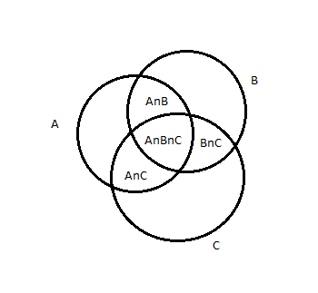

# 求小于等于 N 的 2 或 3 或 5 的倍数

> 原文:[https://www . geesforgeks . org/find-2 或 3 或 5 的倍数小于或等于 n/](https://www.geeksforgeeks.org/find-multiples-of-2-or-3-or-5-less-than-or-equal-to-n/)

给定一个整数。任务是计算所有小于或等于能被 2、3 或 5 整除的数。
**注**:如果一个小于 N 的数可以被 2 或 3 整除，或者被 3 或 5 整除，或者被 2、3 和 5 整除，那么它也应该只被计数一次。
**例** :

```
Input : N = 5
Output : 4

Input : N = 10
Output : 8
```

**简单的方法:**简单的方法是从 1 遍历到 N，计数小于等于 N 的 2、3、5 的倍数，为此，迭代到 N，只需检查一个数是否可被 2 或 3 或 5 整除。如果它是可分的，递增计数器，达到 N 后，打印结果。
*时间复杂度* : O(N)。
**有效方法:**一种有效方法是使用集合论的概念。因为我们必须找到能被 2、3 或 5 整除的数。



![\begin{document} \begin{itemize} \item Let $n(a) \colon $ count of numbers divisible by 2\. \item Let $n(b) \colon $ count of numbers divisible by 3\. \item Let $n(c) \colon $ count of numbers divisible by 5\. \item $n(a \bigcap b) \colon $ count of numbers divisible by 2 and 3\. \item $n(a \bigcap c) \colon $ count of numbers divisible by 2 and 5\. \item $n(b \bigcap c) \colon $ count of numbers divisible by 3 and 5\. \item $n(a \bigcap b \bigcap c) \colon $ count of numbers divisible by 2 and 3 and 5\. \end{itemize} According to set theory, $n\left( a \bigcup b \bigcup c \right)=n(a)+n(b)+n(c)-n(a \bigcap b)-n(b \bigcap c)-n(a \bigcap c)+n(a \bigcap b \bigcap c)$ \end{document}   ](img/7868c3ddeeae57d945d2e4f07878a167.png "Rendered by QuickLaTeX.com")
现在的任务是找到 n(a)、n(b)、n(c)、n(a  b)、n(b  c)、n(a  c)和 n(a  b  c)。所有这些项都可以使用[位屏蔽](https://www.geeksforgeeks.org/bitmasking-and-dynamic-programming-set-1-count-ways-to-assign-unique-cap-to-every-person/)来计算。在这个问题中，我们取了三个数字 2、3 和 5。因此，位掩码应该是 2^3 位，即 8，以生成 2、3 和 5 的所有组合。
现在根据集合并的公式，所有包含奇数(2，3，5)的项将被加到结果中，包含偶数(2，3，5)的项将被减去。
以下是上述方法的实施:

## C++

```
// CPP program to count number of multiples
// of 2 or 3 or 5 less than or equal to N

#include <bits/stdc++.h>

using namespace std;

// Function to count number of multiples
// of 2 or 3 or 5 less than or equal to N
int countMultiples(int n)
{
    // As we have to check divisibility
    // by three numbers, So we can implement
    // bit masking
    int multiple[] = { 2, 3, 5 };

    int count = 0, mask = pow(2, 3);

    for (int i = 1; i < mask; i++) {

        // we check whether jth bit
        // is set or not, if jth bit
        // is set, simply multiply
        // to prod
        int prod = 1;

        for (int j = 0; j < 3; j++) {

            // check for set bit
            if (i & 1 << j)
                prod = prod * multiple[j];
        }

        // check multiple of product
        if (__builtin_popcount(i) % 2 == 1)
            count = count + n / prod;
        else
            count = count - n / prod;
    }

    return count;
}

// Driver code
int main()
{
    int n = 10;

    cout << countMultiples(n) << endl;

    return 0;
}
```

## Java 语言(一种计算机语言，尤用于创建网站)

```
// Java program to count number of multiples
// of 2 or 3 or 5 less than or equal to N

class GFG{
static int count_setbits(int N)
{
    int cnt=0;
    while(N>0)
    {
        cnt+=(N&1);
        N=N>>1;
    }
    return cnt;
}

// Function to count number of multiples
// of 2 or 3 or 5 less than or equal to N
static int countMultiples(int n)
{
    // As we have to check divisibility
    // by three numbers, So we can implement
    // bit masking
    int multiple[] = { 2, 3, 5 };

    int count = 0, mask = (int)Math.pow(2, 3);

    for (int i = 1; i < mask; i++) {

        // we check whether jth bit
        // is set or not, if jth bit
        // is set, simply multiply
        // to prod
        int prod = 1;

        for (int j = 0; j < 3; j++) {

            // check for set bit
            if ((i & 1 << j)>0)
                prod = prod * multiple[j];
        }

        // check multiple of product
        if (count_setbits(i) % 2 == 1)
            count = count + n / prod;
        else
            count = count - n / prod;
    }

    return count;
}

// Driver code
public static void main(String[] args)
{
    int n = 10;

    System.out.println(countMultiples(n));
}
}
// this code is contributed by mits
```

## 蟒蛇 3

```
# Python3 program to count number of multiples
# of 2 or 3 or 5 less than or equal to N

# Function to count number of multiples
# of 2 or 3 or 5 less than or equal to N
def countMultiples( n):

    # As we have to check divisibility
    # by three numbers, So we can implement
    # bit masking
    multiple = [ 2, 3, 5 ]

    count = 0
    mask = int(pow(2, 3))
    for i in range(1,mask):
        # we check whether jth bit
        # is set or not, if jth bit
        # is set, simply multiply
        # to prod
        prod = 1
        for j in range(3):

            # check for set bit
            if (i & (1 << j)):
                prod = prod * multiple[j]

        # check multiple of product
        if (bin(i).count('1') % 2 == 1):
            count = count + n // prod
        else:
            count = count - n // prod

    return count

# Driver code
if __name__=='__main__':
    n = 10
    print(countMultiples(n))

# This code is contributed by ash264
```

## C#

```
// C#  program to count number of multiples
// of 2 or 3 or 5 less than or equal to N

using System;

public class GFG{
    static int count_setbits(int N)
{
    int cnt=0;
    while(N>0)
    {
        cnt+=(N&1);
        N=N>>1;
    }
    return cnt;
}

// Function to count number of multiples
// of 2 or 3 or 5 less than or equal to N
static int countMultiples(int n)
{
    // As we have to check divisibility
    // by three numbers, So we can implement
    // bit masking
    int []multiple = { 2, 3, 5 };

    int count = 0, mask = (int)Math.Pow(2, 3);

    for (int i = 1; i < mask; i++) {

        // we check whether jth bit
        // is set or not, if jth bit
        // is set, simply multiply
        // to prod
        int prod = 1;

        for (int j = 0; j < 3; j++) {

            // check for set bit
            if ((i & 1 << j)>0)
                prod = prod * multiple[j];
        }

        // check multiple of product
        if (count_setbits(i) % 2 == 1)
            count = count + n / prod;
        else
            count = count - n / prod;
    }

    return count;
}

// Driver code
    static public void Main (){

    int n = 10;

    Console.WriteLine(countMultiples(n));
}
}
//This code is contributed by ajit.
```

## 服务器端编程语言（Professional Hypertext Preprocessor 的缩写）

```
<?php
// PHP program to count number
// of multiples of 2 or 3 or 5
// less than or equal to N

// Bit count function
function popcount($value)
{
    $count = 0;
    while($value)
    {
        $count += ($value & 1);
        $value = $value >> 1;
    }

    return $count;
}

// Function to count number of 
// multiples of 2 or 3 or 5 less
// than or equal to N
function countMultiples($n)
{
    // As we have to check divisibility
    // by three numbers, So we can
    // implement bit masking
    $multiple = array(2, 3, 5);

    $count = 0;
    $mask = pow(2, 3);

    for ($i = 1; $i < $mask; $i++)
    {

        // we check whether jth bit
        // is set or not, if jth bit
        // is set, simply multiply
        // to prod
        $prod = 1;

        for ($j = 0; $j < 3; $j++)
        {

            // check for set bit
            if ($i & 1 << $j)
                $prod = $prod * $multiple[$j];
        }

        // check multiple of product
        if (popcount($i) % 2 == 1)
            $count = $count + (int)($n / $prod);

        else
            $count = $count - (int)($n / $prod);

    }

    return $count;
}

// Driver code
$n = 10;

echo countMultiples($n);

// This code is contributed by ash264
?>
```

## java 描述语言

```
<script>

// javascript program to count number of multiples
// of 2 or 3 or 5 less than or equal to N
function count_setbits(N)
{
    var cnt=0;
    while(N>0)
    {
        cnt+=(N&1);
        N=N>>1;
    }
    return cnt;
}

// Function to count number of multiples
// of 2 or 3 or 5 less than or equal to N
function countMultiples(n)
{
    // As we have to check divisibility
    // by three numbers, So we can implement
    // bit masking
    var multiple = [ 2, 3, 5 ];

    var count = 0, mask = parseInt(Math.pow(2, 3));

    for (i = 1; i < mask; i++) {

        // we check whether jth bit
        // is set or not, if jth bit
        // is set, simply multiply
        // to prod
        var prod = 1;

        for (j = 0; j < 3; j++) {

            // check for set bit
            if ((i & 1 << j)>0)
                prod = prod * multiple[j];
        }

        // check multiple of product
        if (count_setbits(i) % 2 == 1)
            count = count + parseInt(n / prod);
        else
            count = count - parseInt(n / prod);
    }

    return count;
}

// Driver code
var n = 10;

document.write(countMultiples(n));

// This code is contributed by 29AjayKumar

</script>
```

**Output:** 

```
8
```