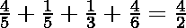
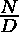

# 找出 N 个分数相加得出给定分数 N/D

> 原文:[https://www . geesforgeks . org/find-n-fractions-the-sum-up-a-给定分数-n-d/](https://www.geeksforgeeks.org/find-n-fractions-that-sum-upto-a-given-fraction-n-d/)

给定一个分数 **N/D** ，任务是将这个分数拆分成 N 个部分，使得它们的和等于分数 N/D，即

**注:**用分数而不是浮点数来表示术语。

> **输入:** N = 4，D = 2
> **输出:** 4/5，1/5，1/3，4/6
> **解释:**
> 
> 因此，它们的和为是一组有效的分数
> 
> **输入:** N = 3，D = 4
> **输出:** 1/2，1/10，3/20
> **解释:**
> 
> 因此，这是一组有效的分数，它们的和为

**方法:**问题中的关键观察是，第一个分数分子可以是，然后进一步的分母可以使用下面的递推关系。

下面是上述方法的实现:

## C++

```
// C++ implementation to split the
// fraction into N parts
#include<bits/stdc++.h>
using namespace std;

// Function to split the fraction
// into the N parts
void splitFraction(int n, int d)
{
    int ar[n];
    int first = d + n - 1;
    ar[0] = first;

    // Loop to find the N - 1
    // fraction
    for(int i = 1; i < n; i++)
    {
       int temp = --first;
       first++;

       ar[i] = first * temp;
       --first;
    }

    // Loop to print the Fractions
    for(int i = 0; i < n; i++)
    {
       if (ar[i] % n == 0)
       {
           cout << "1/" << ar[i] / n << ", ";
       }
       else
       {
           cout << n << "/" << ar[i] << ", ";
       }
    }
}

// Driver Code
int main()
{
    int N = 4;
    int D = 2;

    // Function Call
    splitFraction(N, D);
}

// This code is contributed by Bhupendra_Singh
```

## Java 语言(一种计算机语言，尤用于创建网站)

```
// Java implementation to split the
// fraction into N parts

import java.util.Scanner;

class Solution {

    // Function to split the fraction
    // into the N parts
    public static void
    splitFraction(int n, int d)
    {

        long ar[] = new long[n];
        long first = d + n - 1;
        ar[0] = first;

        // Loop to find the N - 1
        // fraction
        for (int i = 1; i < n; i++) {
            ar[i] = first * (--first);
        }

        // Loop to print the Fractions
        for (int i = 0; i < n; i++) {
            if (ar[i] % n == 0) {
                System.out.print(
                    "1/" + ar[i] / n
                    + ", ");
            }
            else {
                System.out.print(
                    n + "/" + ar[i]
                    + ", ");
            }
        }
    }

    // Driver Code
    public static void main(
        String[] args) throws Exception
    {
        int N = 4;
        int D = 2;

        // Function Call
        splitFraction(N, D);
    }
}
```

## 蟒蛇 3

```
# Python3 implementation to split the
# fraction into N parts

# Function to split the fraction
# into the N parts
def splitFraction(n, d):

    ar = []
    for i in range(0, n):
        ar.append(0)

    first = d + n - 1
    ar[0] = first

    # Loop to find the N - 1
    # fraction
    for i in range(1, n):
        temp = first - 1
        ar[i] = first * temp
        first -= 1

    # Loop to print the Fractions
    for i in range(0, n):
        if ar[i] % n == 0:
            print("1/", int(ar[i] / n),
                  "," , end = " ")

        else:
            print(n, "/", ar[i], ",", end = " ")

# Driver Code
N = 4
D = 2

# Function Call
splitFraction(N, D)

# This code is contributed by ishayadav181
```

## C#

```
// C# implementation to split the
// fraction into N parts
using System;

class GFG{

// Function to split the fraction
// into the N parts
public static void splitFraction(int n, int d)
{
    long []ar = new long[n];
    long first = d + n - 1;
    ar[0] = first;

    // Loop to find the N - 1
    // fraction
    for(int i = 1; i < n; i++)
    {
       ar[i] = first * (--first);
    }

    // Loop to print the Fractions
    for(int i = 0; i < n; i++)
    {
       if (ar[i] % n == 0)
       {
           Console.Write("1/" + ar[i] / n + ", ");
       }
       else
       {
           Console.Write(n + "/" + ar[i] + ", ");
       }
    }
}

// Driver Code
public static void Main(String[] args)
{
    int N = 4;
    int D = 2;

    // Function Call
    splitFraction(N, D);
}
}

// This code is contributed by SoumikMondal
```

## java 描述语言

```
<script>
      // JavaScript implementation to split the
      // fraction into N parts
      // Function to split the fraction
      // into the N parts
      function splitFraction(n, d) {
        var ar = new Array(n);
        var first = d + n - 1;
        ar[0] = first;

        // Loop to find the N - 1
        // fraction
        for (var i = 1; i < n; i++) {
          ar[i] = first * --first;
        }

        // Loop to print the Fractions
        for (var i = 0; i < n; i++) {
          if (ar[i] % n === 0) {
            document.write("1/" + ar[i] / n + ", ");
          } else {
            document.write(n + "/" + ar[i] + ", ");
          }
        }
      }

      // Driver Code
      var N = 4;
      var D = 2;

      // Function Call
      splitFraction(N, D);
    </script>
```

**Output:** 

```
4/5, 1/5, 1/3, 4/6,
```