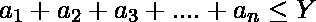

# 用给定的不等式方程求“N”个解

> 原文:[https://www . geeksforgeeks . org/find-n-给定不等式方程的解个数/](https://www.geeksforgeeks.org/find-n-number-of-solutions-with-the-given-inequality-equations/)

找出**a<sub>1</sub>a<sub>2</sub>a<sub>3</sub>的值，…a <sub>n</sub>** 满足以下两个条件。


打印 **a <sub>1</sub> 、a <sub>2</sub> 、…、a <sub>n</sub>** 的值，否则为“无解”。
**注:**可能有一个几个方案，打印其中任意一个。
**举例:**

```
Input: n = 5, x = 15, y = 15
Output:
11
1
1
1
1
Input: n = 4, x = 324, y = 77
Output: 
74
1
1
1
```

**方法:**下面是解决这个问题的分步算法:

1.  初始化元素的数量以及 x 和 y 的值。
2.  如果 y 小于 n 或者 x 大于 n，则没有<sub>1</sub>…一个 <sub>2</sub> 的解。
3.  将第一个解打印为 y–n+1，将 1 打印为其余元素的解。

以下是上述方法的实现:

## C++

```
// C++ implementation of above approach
#include <bits/stdc++.h>
using namespace std;
#define ll long long

// Function to calculate all the solutions
void findsolution(ll n, ll x, ll y)
{
    // there is no solutions
    if ((y - n + 1) * (y - n + 1) + n - 1 < x || y < n) {
        cout << "No solution";
        return;
    }

    // print first element as y-n+1
    cout << y - n + 1;

    // print rest n-1 elements as 1
    while (n-- > 1)
        cout << endl
             << 1;
}

// Driver code
int main()
{
    // initialize the number of elements
    // and the value of x an y
    ll n, x, y;
    n = 5, x = 15, y = 15;

    findsolution(n, x, y);

    return 0;
}
```

## Java 语言(一种计算机语言，尤用于创建网站)

```
// java implementation of above approach
import java.io.*;

class GFG {

// Function to calculate all the solutions
static void findsolution(long n, long x, long y)
{
    // there is no solutions
    if ((y - n + 1) * (y - n + 1) + n - 1 < x || y < n) {
        System.out.println( "No solution");
        return;
    }

    // print first element as y-n+1
    System.out.println( y - n + 1);

    // print rest n-1 elements as 1
    while (n-- > 1)
            System.out.println( "1");
}

// Driver code

    public static void main (String[] args) {
            // initialize the number of elements
    // and the value of x an y
    long n, x, y;
    n = 5; x = 15; y = 15;

    findsolution(n, x, y);
    }
}
// This code is contributed
// by ajit
```

## 蟒蛇 3

```
# Python3 implementation of above approach

# Function to calculate all the solutions
def findsolution(n, x, y):

    # there is no solutions
    if ((y - n + 1) * (y - n + 1) +
              n - 1 < x or y < n):
        print("No solution");
        return;

    # print first element as y-n+1
    print(y - n + 1);

    # print rest n-1 elements as 1
    while (n > 1):
        print(1);
        n -= 1;

# Driver code

# initialize the number of elements
# and the value of x an y
n = 5;
x = 15;
y = 15;

findsolution(n, x, y);

# This code is contributed by mits
```

## C#

```
// C# implementation of above approach
using System;

class GFG
{

// Function to calculate all the solutions
static void findsolution(long n,
                         long x, long y)
{
    // there is no solutions
    if ((y - n + 1) * (y - n + 1) +
         n - 1 < x || y < n)
    {
        Console.WriteLine( "No solution");
        return;
    }

    // print first element as y-n+1
    Console.WriteLine( y - n + 1);

    // print rest n-1 elements as 1
    while (n-- > 1)
        Console.WriteLine( "1");
}

// Driver code
static public void Main ()
{
    // initialize the number of elements
    // and the value of x an y
    long n, x, y;
    n = 5; x = 15; y = 15;

    findsolution(n, x, y);
}
}

// This code is contributed
// by ajit
```

## 服务器端编程语言（Professional Hypertext Preprocessor 的缩写）

```
<?php
// PHP implementation of above approach

// Function to calculate all the solutions
function findsolution($n, $x, $y)
{
    // there is no solutions
    if (($y - $n + 1) * ($y - $n + 1) +
         $n - 1 < $x || $y < $n)
    {
        echo "No solution";
        return;
    }

    // print first element as y-n+1
    echo $y - $n + 1;

    // print rest n-1 elements as 1
    while ($n-- > 1)
    echo "\n" . 1;
}

// Driver code

// initialize the number of elements
// and the value of x an y
$n = 5; $x = 15; $y = 15;

findsolution($n, $x, $y);

// This code is contributed
// by Akanksha Rai(Abby_akku)
```

## java 描述语言

```
<script>

// Javascript  implementation of above approach

// Function to calculate all the solutions
function findsolution(n, x, y)
{
    // there is no solutions
    if ((y - n + 1) * (y - n + 1) +
        n - 1 < x || y < n)
    {
        document.write( "No solution");
        return;
    }

    // print first element as y-n+1
    document.write( y - n + 1);

    // print rest n-1 elements as 1
    while (n-- > 1)
    document.write( "<br>" + 1);
}

// Driver code

// initialize the number of elements
// and the value of x an y
let n = 5;
let x = 15;
let y = 15;

findsolution(n, x, y);

// This code is contributed
// by bobby

</script>
```

**Output:** 

```
11
1
1
1
1
```