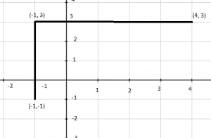
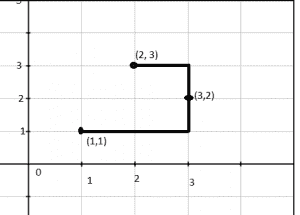

# 连接 3 个点的水平或垂直线段数

> 原文:[https://www.geeksforgeeks.org/find-no-segments-polyline/](https://www.geeksforgeeks.org/find-no-segments-polyline/)

给定 x-y 坐标平面上的三个点。你需要找到穿过这些点的折线形成的线段数。(线段可与坐标轴垂直或水平对齐)
**例:**

```
Input : A  = {-1, -1}, B = {-1, 3}, C = {4, 3}
Output :   2
Expantaion:
```



```
There are two segments in this polyline.       
Input :A = {1, 1}, B = {2, 3} C = {3, 2}
Output : 3
```



如果所有的点都在 x 轴或 y 轴上，结果是 1。结果是 2 个如果点可以形成 L 形。如果三个点中的任何一个可以用作连接点，就形成了 l 形。否则答案是 3。

## C++

```
// CPP program to find number of horizontal (or vertical
// line segments needed to connect three points.
#include <iostream>
using namespace std;

// Function to check if the third point forms a 
// rectangle with other two points at corners
bool isBetween(int a, int b, int c) 
{
    return min(a, b) <= c && c <= max(a, b);
}

// Returns true if point k can be used as a joining
// point to connect using two line segments
bool canJoin(int x[], int y[], int i, int j, int k) 
{
    // Check for the valid polyline with two segments
    return (x[k] == x[i] || x[k] == x[j]) && 
                isBetween(y[i], y[j], y[k]) ||
        (y[k] == y[i] || y[k] == y[j]) && 
                isBetween(x[i], x[j], x[k]);
}

int countLineSegments(int x[], int y[])
{
    // Check whether the X-coordinates or 
    // Y-cocordinates are same. 
    if ((x[0] == x[1] && x[1] == x[2]) ||
        (y[0] == y[1] && y[1] == y[2]))
        return 1;

    // Iterate over all pairs to check for two
    // line segments
    else if (canJoin(x, y, 0, 1, 2) ||
            canJoin(x, y, 0, 2, 1) || 
            canJoin(x, y, 1, 2, 0))
        return 2;

    // Otherwise answer is three.
    else
        return 3;
}

// Driver code
int main()
{
    int x[3], y[3];
    x[0] = -1; y[0] = -1;
    x[1] = -1; y[1] = 3;
    x[2] = 4; y[2] = 3;
    cout << countLineSegments(x, y);
    return 0;
}
```

## Java 语言(一种计算机语言，尤用于创建网站)

```
// Java program to find number of horizontal
// (or vertical line segments needed to
// connect three points.
import java.io.*;

class GFG {

// Function to check if the third
// point forms a rectangle with 
// other two points at corners
static boolean isBetween(int a, int b, int c) 
{
    return (Math.min(a, b) <= c &&
                    c <= Math.max(a, b));
}

// Returns true if point k can be 
// used as a joining point to connect
// using two line segments
static boolean canJoin(int x[], int y[],
                        int i, int j, int k) 
{
    // Check for the valid polyline 
    // with two segments
    return (x[k] == x[i] || x[k] == x[j]) && 
                isBetween(y[i], y[j], y[k]) ||
                (y[k] == y[i] || y[k] == y[j]) && 
                isBetween(x[i], x[j], x[k]);
}

static int countLineSegments(int x[], int y[])
{
    // Check whether the X-coordinates or 
    // Y-cocordinates are same. 
    if ((x[0] == x[1] && x[1] == x[2]) ||
        (y[0] == y[1] && y[1] == y[2]))
        return 1;

    // Iterate over all pairs to check for two
    // line segments
    else if (canJoin(x, y, 0, 1, 2) ||
            canJoin(x, y, 0, 2, 1) || 
            canJoin(x, y, 1, 2, 0))
        return 2;

    // Otherwise answer is three.
    else
        return 3;
}

// Driver code
public static void main (String[] args) {

    int x[]=new int[3], y[]=new int[3];

    x[0] = -1; y[0] = -1;
    x[1] = -1; y[1] = 3;
    x[2] = 4; y[2] = 3;

    System.out.println(countLineSegments(x, y));
    }

}

// This code is contributed by vt_m
```

## 蟒蛇 3

```
# Python program to find number
# of horizontal (or vertical
# line segments needed to
# connect three points.

import math

# Function to check if the
# third point forms a 
# rectangle with other
# two points at corners
def isBetween(a, b, c) :

    return min(a, b) <= c and c <= max(a, b)

# Returns true if point k
# can be used as a joining
# point to connect using
# two line segments
def canJoin( x, y, i, j, k) :

    # Check for the valid polyline
    # with two segments
    return (x[k] == x[i] or x[k] == x[j]) and isBetween(y[i], y[j], y[k]) or (y[k] == y[i] or y[k] == y[j]) and isBetween(x[i], x[j], x[k])

def countLineSegments( x, y):

    # Check whether the X-coordinates or 
    # Y-cocordinates are same. 
    if ((x[0] == x[1] and x[1] == x[2]) or
        (y[0] == y[1] and y[1] == y[2])):
        return 1

    # Iterate over all pairs to check for two
    # line segments
    elif (canJoin(x, y, 0, 1, 2) or
            canJoin(x, y, 0, 2, 1) or 
            canJoin(x, y, 1, 2, 0)):
        return 2

    # Otherwise answer is three.
    else:
        return 3
#driver code
x= [-1,-1, 4]
y= [-1, 3, 3]

print(countLineSegments(x, y))

# This code is contributed by Gitanjali.
```

## C#

```
// C# program to find number of horizontal
// (or vertical) line segments needed to
// connect three points.
using System;

class GFG {

    // Function to check if the third
    // point forms a rectangle with
    // other two points at corners
    static bool isBetween(int a, int b, int c)
    {
        return (Math.Min(a, b) <= c && 
                          c <= Math.Max(a, b));
    }

    // Returns true if point k can be
    // used as a joining point to connect
    // using two line segments
    static bool canJoin(int[] x, int[] y,
                        int i, int j, int k)
    {

        // Check for the valid polyline
        // with two segments
        return (x[k] == x[i] || x[k] == x[j]) 
               && isBetween(y[i], y[j], y[k]) 
               || (y[k] == y[i] || y[k] == y[j]) 
               && isBetween(x[i], x[j], x[k]);
    }

    static int countLineSegments(int[] x, int[] y)
    {

        // Check whether the X-coordinates or
        // Y-cocordinates are same.
        if ((x[0] == x[1] && x[1] == x[2]) ||
                  (y[0] == y[1] && y[1] == y[2]))
            return 1;

        // Iterate over all pairs to check for two
        // line segments
        else if (canJoin(x, y, 0, 1, 2) 
                      || canJoin(x, y, 0, 2, 1) 
                      || canJoin(x, y, 1, 2, 0))
            return 2;

        // Otherwise answer is three.
        else
            return 3;
    }

    // Driver code
    public static void Main()
    {

        int[] x = new int[3];
        int[] y = new int[3];

        x[0] = -1;
        y[0] = -1;
        x[1] = -1;
        y[1] = 3;
        x[2] = 4;
        y[2] = 3;

        Console.WriteLine(countLineSegments(x, y));
    }
}

// This code is contributed by vt_m.
```

## 服务器端编程语言（Professional Hypertext Preprocessor 的缩写）

```
<?php
// PHP program to find number 
// of horizontal (or vertical
// line segments needed to 
// connect three points.

// Function to check if the 
// third point forms a 
// rectangle with other
// two points at corners
function isBetween( $a, $b, $c) 
{
    return min($a, $b) <= $c and 
                    $c <= max($a, $b);
}

// Returns true if point k 
// can be used as a joining
// point to connect using
// two line segments
function canJoin($x, $y, $i, $j, $k) 
{
    // Check for the valid 
    // polyline with two segments
    return ($x[$k] == $x[$i] or 
            $x[$k] == $x[$j]) and
              isBetween($y[$i], $y[$j], $y[$k]) or
                              ($y[$k] == $y[$i] or 
                              $y[$k] == $y[$j]) and
                 isBetween($x[$i], $x[$j], $x[$k]);
}

function countLineSegments( $x, $y)
{
    // Check whether the X-coordinates  
    // or Y-cocordinates are same. 
    if (($x[0] == $x[1] and $x[1] == $x[2]) or
        ($y[0] == $y[1] and $y[1] == $y[2]))
        return 1;

    // Iterate over all pairs to 
    // check for two line segments
    else if (canJoin($x, $y, 0, 1, 2) or
              canJoin($x, $y, 0, 2, 1) || 
             canJoin($x, $y, 1, 2, 0))
        return 2;

    // Otherwise answer is three.
    else
        return 3;
}

// Driver code
$x = array(); 
$y = array();
$x[0] = -1; $y[0] = -1;
$x[1] = -1; $y[1] = 3;
$x[2] = 4; $y[2] = 3;
echo countLineSegments($x, $y);

// This code is contributed by anuj_67.
?>
```

## java 描述语言

```
<script>

// JavaScript program to find number of horizontal
// (or vertical line segments needed to
// connect three points.

// Function to check if the third
// point forms a rectangle with 
// other two points at corners
function isBetween(a, b, c) 
{
    return (Math.min(a, b) <= c &&
                    c <= Math.max(a, b));
}

// Returns true if point k can be 
// used as a joining point to connect
// using two line segments
function canJoin(x, y,
                        i, j, k) 
{
    // Check for the valid polyline 
    // with two segments
    return (x[k] == x[i] || x[k] == x[j]) && 
                isBetween(y[i], y[j], y[k]) ||
                (y[k] == y[i] || y[k] == y[j]) && 
                isBetween(x[i], x[j], x[k]);
}

function countLineSegments(x, y)
{
    // Check whether the X-coordinates or 
    // Y-cocordinates are same. 
    if ((x[0] == x[1] && x[1] == x[2]) ||
        (y[0] == y[1] && y[1] == y[2]))
        return 1;

    // Iterate over all pairs to check for two
    // line segments
    else if (canJoin(x, y, 0, 1, 2) ||
            canJoin(x, y, 0, 2, 1) || 
            canJoin(x, y, 1, 2, 0))
        return 2;

    // Otherwise answer is three.
    else
        return 3;
}
// Driver code

        let x = [], y = [];

    x[0] = -1; y[0] = -1;
    x[1] = -1; y[1] = 3;
    x[2] = 4; y[2] = 3;

    document.write(countLineSegments(x, y));

</script>
```

**输出:**

```
  2
```