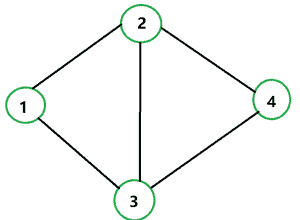

# 查找具有给定节点 K 的最大公共节点数的节点

> 原文:[https://www . geeksforgeeks . org/find-node-having-给定节点的最大公共节点数-k/](https://www.geeksforgeeks.org/find-node-having-maximum-number-of-common-nodes-with-a-given-node-k/)

给定一个由 **N 个**节点和一个表示从**边【I】【0】**到**边【I】【1】**的边的数组**边【】【】**组成的图。给定一个节点 **K** ，任务是找到与 **K** 共有节点数最多的节点。

**示例:**

> **输入:** K = 1，N = 4，边= {{1，2}、{1，3}、{2，3}、{3，4}、{2，4}}
> **输出:** 4
> **说明:**给定边形成的图形如下。
> 给定 K = 1，所有节点的相邻节点低于
> 1: 2，3
> 2: 1，3，4
> 3: 1，2，4
> 4: 2，3
> 显然，节点 4 与节点 1 具有最大的公共节点。所以，4 就是答案。
> 
> 
> 
> **输入:** K = 2，N = 3，边= {{1，2}，{1，3}，{2，3 } }
> T3】输出: 3

**方法:**这个问题可以用[广度优先搜索](https://www.geeksforgeeks.org/breadth-first-search-or-bfs-for-a-graph/)解决。按照以下步骤解决给定的问题。

*   其思想是将 BFS 源用作给定的节点(级别 0)。
*   将给定节点的所有邻居存储在一个列表中，比如 **al1** (级别 1)
*   现在维护另一个列表 **al2** ，将每一级存储在 BFS，用 **al2** 统计 **al1** 的常用元素。
*   维护变量 **max** 维护最大共同好友数，另一个变量**mostapnode**存储给定问题的答案。
*   返回**芥末节点**。

下面是上述方法的实现:

## Java 语言(一种计算机语言，尤用于创建网站)

```
// Java implementation of above approach
import java.io.*;
import java.util.*;

class Graph {

    // No. of nodes
    private int V;

    // Adjacency Lists
    private ArrayList<ArrayList<Integer> > adj;

    // Neighbours of given node stored in al1
    ArrayList<Integer> al1 = new ArrayList<>();

    // Constructor
    Graph(int v)
    {
        V = v;
        adj = new ArrayList<>();

        for (int i = 0; i < v; ++i)
            adj.add(new ArrayList<Integer>());
    }

    // Function to add an edge into the graph
    void addEdge(int v, int w)
    {
        adj.get(v - 1).add(w - 1);
        adj.get(w - 1).add(v - 1);
    }
    private int BFS(int s)
    {
        // Mark all the vertices as not visited
        // (By default set as false)
        boolean visited[] = new boolean[V];

        // Create a queue for BFS
        LinkedList<Integer> queue
            = new LinkedList<Integer>();

        // Mark the current node
        // as visited and enqueue it
        visited[s] = true;

        queue.add(s);
        int c = 0;

        // Max common nodes with given node
        int max = 0;

        int mostAppnode = 0;

        // To store common nodes
        int count = 0;
        while (queue.size() != 0) {

            // Dequeue a vertex from queue
            s = queue.poll();

            // Get all adjacent nodes
            // of the dequeued node
            // If a adjacent has
            // not been visited, then
            // mark it visited and enqueue it
            c++;

            ArrayList<Integer> al2
                = new ArrayList<>();
            Iterator<Integer> i
                = adj.get(s).listIterator();
            while (i.hasNext()) {
                int n = i.next();
                if (c == 1)
                    al1.add(n);
                else
                    al2.add(n);

                // If node is not
                // visited and also not
                // present in queue.
                if (!visited[n]
                    && !queue.contains(n)) {
                    visited[n] = true;
                    queue.add(n);
                }
            }
            if (al2.size() != 0) {
                for (int frnd : al2) {
                    if (al1.contains(frnd))
                        count++;
                }
                if (count > max) {
                    max = count;
                    mostAppnode = s;
                }
            }
        }
        if (max != 0)
            return mostAppnode + 1;
        else
            return -1;
    }

    // Driver Code
    public static void main(String[] args)
    {
        int N = 4;
        Graph g = new Graph(4);

        g.addEdge(1, 2);
        g.addEdge(1, 3);
        g.addEdge(2, 3);
        g.addEdge(3, 4);
        g.addEdge(2, 4);
        int K = 1;
        System.out.println(g.BFS(K - 1));
    }
}
```

**Output**

```
4
```

**时间复杂度:** O (V*V)，BFS 需要 O(V+E)时间，但是寻找 al1 和 al2 之间的公共元素需要 O (V*V)时间。

**辅助空间:** O(V)