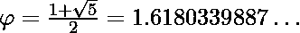

# 用黄金分割比

求第 n 个斐波那契数

> 原文:[https://www . geesforgeks . org/find-n th-Fibonacci-number-using-golden-ratio/](https://www.geeksforgeeks.org/find-nth-fibonacci-number-using-golden-ratio/)

斐波那契数列= 0，1，1，2，3，5，8，13，21，34，…..
[寻找第 n 个斐波那契数](https://www.geeksforgeeks.org/program-for-nth-fibonacci-number/)的不同方法已经讨论过了。找到第 n 个斐波那契数的另一个简单方法是使用黄金分割比，因为斐波那契数保持近似黄金分割比直到无穷大。
[**黄金比例:**](https://en.wikipedia.org/wiki/Golden_ratio)

例:

```
Input : n = 9
Output : 34

Input : n = 7
Output : 13
```

**进场:**
黄金比例可能会给我们[不正确的答案。](https://www.geeksforgeeks.org/g-fact-18-2/)
如果我们把每个点的结果四舍五入，就可以得到正确的结果。

```
nth fibonacci number = round(n-1th Fibonacci number X golden ratio)
                  fn = round(fn-1 * )
```

直到第四学期，这一比率都不太接近黄金比率(因为 3/2 = 1.5，2/1 = 2，…)。所以，我们将考虑从第五项开始，得到下一个斐波那契数。要找出第 9 个斐波那契数 f9 (n = 9) :

```
     f6 = round(f5 * ) = 8
f7 = round(f6 * ) = 13
f8 = round(f7 * ) = 21
f9 = round(f8 * ) = 34
```

**注:**该方法可以正确计算前 34 个斐波那契数。之后可能会与正确值有差异。
以下是上述办法的实施:

## 卡片打印处理机（Card Print Processor 的缩写）

```
// CPP program to find n-th Fibonacci number
#include <bits/stdc++.h>
using namespace std;

// Approximate value of golden ratio
double PHI = 1.6180339;

// Fibonacci numbers upto n = 5
int f[6] = { 0, 1, 1, 2, 3, 5 };

// Function to find nth
// Fibonacci number
int fib (int n)
{
    // Fibonacci numbers for n < 6
    if (n < 6)
        return f[n];

    // Else start counting from
    // 5th term
    int t = 5, fn = 5;

    while (t < n) {
         fn = round(fn * PHI);
         t++;
    }

    return fn;  
}

// driver code
int main()
{
    int n = 9;

    cout << n << "th Fibonacci Number = "
         << fib(n) << endl;

    return 0;
}
```

## Java 语言(一种计算机语言，尤用于创建网站)

```
// Java program to find n-th Fibonacci number

class GFG
{
    // Approximate value of golden ratio
    static double PHI = 1.6180339;

    // Fibonacci numbers upto n = 5
    static int f[] = { 0, 1, 1, 2, 3, 5 };

    // Function to find nth
    // Fibonacci number
    static int fib (int n)
    {
        // Fibonacci numbers for n < 6
        if (n < 6)
            return f[n];

        // Else start counting from
        // 5th term
        int t = 5;
        int fn = 5;

        while (t < n) {
            fn = (int)Math.round(fn * PHI);
            t++;
        }

        return fn;
    }

    // Driver code
    public static void main (String[] args)
    {
        int n = 9;
        System.out.println(n + "th Fibonacci Number = "
                                                +fib(n));
    }
}

// This code is contributed by Anant Agarwal.
```

## 蟒蛇 3

```
# Python3 code to find n-th Fibonacci number

# Approximate value of golden ratio
PHI = 1.6180339

# Fibonacci numbers upto n = 5
f = [ 0, 1, 1, 2, 3, 5 ]

# Function to find nth
# Fibonacci number
def fib ( n ):

    # Fibonacci numbers for n < 6
    if n < 6:
        return f[n]

    # Else start counting from
    # 5th term
    t = 5
    fn = 5

    while t < n:
        fn = round(fn * PHI)
        t+=1

    return fn

# driver code
n = 9
print(n, "th Fibonacci Number =", fib(n))

# This code is contributed by "Sharad_Bhardwaj".
```

## C#

```
// C# program to find n-th Fibonacci
// number
using System;

class GFG {

    // Approximate value of golden ratio
    static double PHI = 1.6180339;

    // Fibonacci numbers upto n = 5
    static int []f = { 0, 1, 1, 2, 3, 5 };

    // Function to find nth
    // Fibonacci number
    static int fib (int n)
    {

        // Fibonacci numbers for n < 6
        if (n < 6)
            return f[n];

        // Else start counting from
        // 5th term
        int t = 5;
        int fn = 5;

        while (t < n) {
            fn = (int)Math.Round(fn * PHI);
            t++;
        }

        return fn;
    }

    // Driver code
    public static void Main ()
    {
        int n = 9;

        Console.WriteLine(n + "th Fibonacci"
                    + " Number = " + fib(n));
    }
}

// This code is contributed by vt_m.
```

## 服务器端编程语言（Professional Hypertext Preprocessor 的缩写）

```
<?php
// PHP program to find n-th
// Fibonacci number Approximate
// value of golden ratio
$PHI = 1.6180339;

// Fibonacci numbers
// upto n = 5

// Function to find nth
// Fibonacci number
function fib ($n)
{
    global $PHI;
    $f = array(0, 1, 1, 2, 3, 5);

    // Fibonacci numbers
    // for n < 6
    if ($n < 6)
        return $f[$n];

    // Else start counting
    // from 5th term
    $t = 5;
    $fn = 5;

    while ($t < $n)
    {
        $fn = round($fn * $PHI);
        $t++;
    }

    return $fn;
}

    // Driver Code
    $n = 9;
    echo $n, "th Fibonacci Number = ",
        fib($n), "\n";

// This code is contributed by aj_36
?>
```

## java 描述语言

```
<script>

// JavaScript program to find n-th Fibonacci number

  // Approximate value of golden ratio
    let PHI = 1.6180339;

    // Fibonacci numbers upto n = 5
    let f = [ 0, 1, 1, 2, 3, 5 ];

    // Function to find nth
    // Fibonacci number
    function fib (n)
    {
        // Fibonacci numbers for n < 6
        if (n < 6)
            return f[n];

        // Else start counting from 
        // 5th term
        let t = 5, fn = 5;

        while (t < n) {
             fn = Math.round(fn * PHI);
             t++;
        }

        return fn;   
    }

    // driver code

    let n = 9;
     document.write(n + "th Fibonacci Number = " + fib(n) + "<br>");

// This code is contributed by Mayank Tyagi

</script>
```

输出:

```
9th Fibonacci Number = 34
```

我们可以通过使用[高效方法计算功率](https://www.geeksforgeeks.org/write-a-c-program-to-calculate-powxn/)来优化上述 O(Log n)中的求解工作。
由于涉及浮点计算，上述方法可能不总是产生正确的结果。这就是原因，这种方法实际上没有被使用，即使它可以被优化以在 O(Log n)中工作。详情请参考下面麻省理工学院视频。
https://www.youtube.com/watch?v=-EQTVuAhSFY