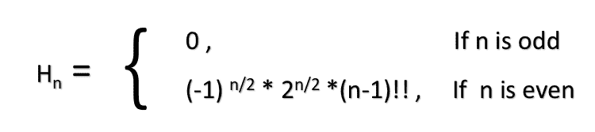

# 找到第 n 个埃尔米特数

> 原文:[https://www.geeksforgeeks.org/find-nth-hermite-number/](https://www.geeksforgeeks.org/find-nth-hermite-number/)

给定一个正整数 **n** ，任务是打印**第 n 个**埃尔米特数。
[**埃尔米特数**](https://en.wikipedia.org/wiki/Hermite_number) :在数学中，埃尔米特数是零自变量的[埃尔米特多项式](https://en.wikipedia.org/wiki/Hermite_polynomials)的值。
厄米多项式在 **x = 0** 的递推关系由
给出

> H<sub>n</sub>=-2 *(n–1)* H<sub>n–2</sub>
> 其中 H <sub>0</sub> = 1，H <sub>1</sub> = 0

埃尔米特数列的前几项是:

> 1，0，-2，0，12，0，-120，0，1680，0，-30240

**例:**

> **输入:** n = 6
> **输出:** -120
> **输入:** n = 8
> **输出:** 1680

**天真方法:**编写实现上述递归关系的递归函数。
以下是上述办法的实施情况:

## C++

```
// C++ program to find nth Hermite number
#include <bits/stdc++.h>
using namespace std;

// Function to return nth Hermite number
int getHermiteNumber(int n)
{

    // Base conditions
    if (n == 0)
        return 1;
    if (n == 1)
        return 0;

    else
        return -2 * (n - 1) * getHermiteNumber(n - 2);
}

// Driver Code
int main()
{
    int n = 6;

    // Print nth Hermite number
    cout << getHermiteNumber(n);
    return 0;
}
```

## Java 语言(一种计算机语言，尤用于创建网站)

```
// Java program to find nth Hermite number
import java.util.*;

class GFG {

    // Function to return nth Hermite number
    static int getHermiteNumber(int n)
    {

        // Base condition
        if (n == 0)
            return 1;

        else if (n == 1)
            return 1;

        else
            return -2 * (n - 1) * getHermiteNumber(n - 2);
    }

    // Driver Code
    public static void main(String[] args)
    {
        int n = 6;

        // Print nth Hermite number
        System.out.println(getHermiteNumber(n));
    }
}
```

## 蟒蛇 3

```
# Python3 program to find nth Hermite number

# Function to return nth Hermite number
def getHermiteNumber( n):

    # Base conditions
    if n == 0 :
        return 1
    if n == 1 :
        return 0

    else :
        return (-2 * (n - 1) *
                getHermiteNumber(n - 2))

# Driver Code
n = 6

# Print nth Hermite number
print(getHermiteNumber(n));

# This code is contributed
# by Arnab Kundu
```

## C#

```
// C# program to find nth Hermite number
using System;

class GFG {

    // Function to return nth Hermite number
    static int getHermiteNumber(int n)
    {

        // Base condition
        if (n == 0)
            return 1;

        else if (n == 1)
            return 1;

        else
            return -2 * (n - 1) * getHermiteNumber(n - 2);
    }

    // Driver Code
    public static void Main()
    {
        int n = 6;

        // Print nth Hermite number
        Console.WriteLine(getHermiteNumber(n));
    }
}
```

## 服务器端编程语言（Professional Hypertext Preprocessor 的缩写）

```
<?php
// PHP program to find nth Hermite number

// Function to return nth Hermite number
function getHermiteNumber($n)
{

    // Base conditions
    if ($n == 0)
        return 1;
    if ($n == 1)
        return 0;

    else
        return -2 * ($n - 1) *
                getHermiteNumber($n - 2);
}

// Driver Code
$n = 6;

// Print nth Hermite number
echo getHermiteNumber($n);

// This code is contributed by ajit.
?>
```

## java 描述语言

```
<script>

    // Javascript program to
    // find nth Hermite number

    // Function to return nth Hermite number
    function getHermiteNumber(n)
    {

        // Base condition
        if (n == 0)
            return 1;

        else if (n == 1)
            return 1;

        else
            return -2 * (n - 1) * getHermiteNumber(n - 2);
    }

    let n = 6;

    // Print nth Hermite number
    document.write(getHermiteNumber(n));

</script>
```

**Output:** 

```
-120
```

**有效方法:**从 Hermite 序列可以明显看出，如果 **n** 为**奇数**，那么**第 n 个 Hermite 数**将为 **0** 。现在，可以使用
找到第 n 个埃尔米特数



其中**(n–1)！！= 1 * 3 * 5 *(n–1)**即**(n–1)**
的[双因子](https://www.geeksforgeeks.org/double-factorial/)以下是上述方法的实现:

## C++

```
// C++ program to find nth Hermite number
#include <bits/stdc++.h>
using namespace std;

// Utility function to calculate
// double factorial of a number
int doubleFactorial(int n)
{

    int fact = 1;

    for (int i = 1; i <= n; i = i + 2) {

        fact = fact * i;
    }

    return fact;
}

// Function to return nth Hermite number
int hermiteNumber(int n)
{

    // If n is even then return 0
    if (n % 2 == 1)
        return 0;

    // If n is odd
    else {

        // Calculate double factorial of (n-1)
        // and multiply it with 2^(n/2)
        int number = (pow(2, n / 2)) * doubleFactorial(n - 1);

        // If n/2 is odd then
        // nth Hermite number will be negative
        if ((n / 2) % 2 == 1)
            number = number * -1;

        // Return nth Hermite number
        return number;
    }
}

// Driver Code
int main()
{
    int n = 6;

    // Print nth Hermite number
    cout << hermiteNumber(n);
    return 0;
}
```

## Java 语言(一种计算机语言，尤用于创建网站)

```
// Java program to find nth Hermite number
import java.util.*;

class GFG {

    // Utility function to calculate
    // double factorial of a number
    static int doubleFactorial(int n)
    {

        int fact = 1;

        for (int i = 1; i <= n; i = i + 2) {

            fact = fact * i;
        }

        return fact;
    }

    // Function to return nth Hermite number
    static int hermiteNumber(int n)
    {

        // If n is even then return 0
        if (n % 2 == 1)
            return 0;

        // If n is odd
        else {

            // Calculate double factorial of (n-1)
            // and multiply it with 2^(n/2)
            int number = (int)(Math.pow(2, n / 2)) * doubleFactorial(n - 1);

            // If n/2 is odd then
            // nth Hermite number will be negative
            if ((n / 2) % 2 == 1)
                number = number * -1;

            // Return nth Hermite number
            return number;
        }
    }

    // Driver Code
    public static void main(String[] args)
    {
        int n = 6;

        // Print nth Hermite number
        System.out.println(hermiteNumber(n));
    }
}
```

## 蟒蛇 3

```
# Python 3 program to find nth
# Hermite number
from math import pow

# Utility function to calculate
# double factorial of a number
def doubleFactorial(n):
    fact = 1

    for i in range(1, n + 1, 2):
        fact = fact * i

    return fact

# Function to return nth Hermite number
def hermiteNumber(n):

    # If n is even then return 0
    if (n % 2 == 1):
        return 0

    # If n is odd
    else:

        # Calculate double factorial of (n-1)
        # and multiply it with 2^(n/2)
        number = ((pow(2, n / 2)) *
                   doubleFactorial(n - 1))

        # If n/2 is odd then nth Hermite
        # number will be negative
        if ((n / 2) % 2 == 1):
            number = number * -1

        # Return nth Hermite number
        return number

# Driver Code
if __name__ == '__main__':
    n = 6

    # Print nth Hermite number
    print(int(hermiteNumber(n)))

# This code is contributed by
# Surendra_Gangwar
```

## C#

```
// C# program to find nth Hermite number
using System;

class GFG {

    // Utility function to calculate
    // double factorial of a number
    static int doubleFactorial(int n)
    {

        int fact = 1;

        for (int i = 1; i <= n; i = i + 2) {

            fact = fact * i;
        }

        return fact;
    }

    // Function to return nth Hermite number
    static int hermiteNumber(int n)
    {

        // If n is even then return 0
        if (n % 2 == 1)
            return 0;

        // If n is odd
        else {

            // Calculate double factorial of (n-1)
            // and multiply it with 2^(n/2)
            int number = (int)(Math.Pow(2, n / 2)) * doubleFactorial(n - 1);

            // If n/2 is odd then
            // nth Hermite number will be negative
            if ((n / 2) % 2 == 1)
                number = number * -1;

            // Return nth Hermite number
            return number;
        }
    }

    // Driver Code
    public static void Main()
    {
        int n = 6;

        // Print nth Hermite number
        Console.WriteLine(hermiteNumber(n));
    }
}
```

## 服务器端编程语言（Professional Hypertext Preprocessor 的缩写）

```
<?php
// PHP program to find nth Hermite number

// Utility function to calculate double
// factorial of a number
function doubleFactorial($n)
{
    $fact = 1;

    for ($i = 1; $i <= $n; $i = $i + 2)
    {
        $fact = $fact * $i;
    }

    return $fact;
}

// Function to return nth Hermite number
function hermiteNumber($n)
{

    // If n is even then return 0
    if ($n % 2 == 1)
        return 0;

    // If n is odd
    else
    {

        // Calculate double factorial of (n-1)
        // and multiply it with 2^(n/2)
        $number = (pow(2, $n / 2)) *
                   doubleFactorial($n - 1);

        // If n/2 is odd then nth Hermite
        // number will be negative
        if (($n / 2) % 2 == 1)
            $number = $number * -1;

        // Return nth Hermite number
        return $number;
    }
}

// Driver Code
$n = 6;

// Print nth Hermite number
echo hermiteNumber($n);

// This code is contributed by akt_mit
?>
```

## java 描述语言

```
<script>

// Javascript program to find nth Hermite number

// Utility function to calculate
// double factorial of a number
function doubleFactorial(n)
{

    var fact = 1;

    for (var i = 1; i <= n; i = i + 2) {

        fact = fact * i;
    }

    return fact;
}

// Function to return nth Hermite number
function hermiteNumber(n)
{

    // If n is even then return 0
    if (n % 2 == 1)
        return 0;

    // If n is odd
    else {

        // Calculate double factorial of (n-1)
        // and multiply it with 2^(n/2)
        var number = (Math.pow(2, n / 2)) *
        doubleFactorial(n - 1);

        // If n/2 is odd then
        // nth Hermite number will be negative
        if ((n / 2) % 2 == 1)
            number = number * -1;

        // Return nth Hermite number
        return number;
    }
}

// Driver Code
var n = 6;

// Print nth Hermite number
document.write( hermiteNumber(n));

</script>
```

**Output:** 

```
-120
```