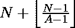
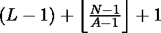

# 找出序列中不是给定数倍数的第 n 个数

> 原文:[https://www . geesforgeks . org/find-n-number-in-a-sequence-不是给定数字的倍数/](https://www.geeksforgeeks.org/find-nth-number-in-a-sequence-which-is-not-a-multiple-of-a-given-number/)

给定四个整数 **A** 、 **N** 、 **L** 和 **R** ，任务是在从 **L** 到 **R** 的连续整数序列中找到第 **N** 个数，该数不是 **A** 的倍数。给定序列至少包含 **N** 个不能被 **A** 整除的数字，整数 **A** 始终大于 1。

**示例:**

> **输入:** A = 2，N = 3，L = 1，R = 10
> **输出:** 5
> **解释:**
> 顺序为 *1* ，2， *3* ，4， *5* ，6， *7* ，8， *9* 和 10。这里 5 是序列中不是 2 的倍数的第三个数字。
> 
> **输入:** A = 3，N = 6，L = 4，R = 20
> **输出:** 11
> **说明:**
> 11 是序列中不是 3 倍数的第 6 个数字。

**天真法:**天真法是循环迭代**【L，R】**的范围，找到 **N <sup>th</sup>** 号。步骤如下:

1.  将非倍数数和当前数的计数初始化为 0。
2.  迭代范围**【L，R】**，直到非倍数计数不等于 **N** 。
3.  如果**当前数字不能被 A** 整除，则将非倍数的计数增加 1。

下面是上述方法的实现:

## C++

```
// C++ program for the above approach
#include <bits/stdc++.h>
using namespace std;

// Function to find Nth number not a
// multiple of A in the range [L, R]
void count_no (int A, int N, int L, int R)
{

    // To store the count
    int count = 0;
    int i = 0;

    // To check all the nos in range
    for(i = L; i < R + 1; i++)
    {
    if (i % A != 0)
        count += 1;

    if (count == N)
        break;
    }
    cout << i;
}

// Driver code
int main()
{

    // Given values of A, N, L, R
    int A = 3, N = 6, L = 4, R = 20;

    // Function Call
    count_no (A, N, L, R);
    return 0;
}

// This code is contributed by mohit kumar 29
```

## Java 语言(一种计算机语言，尤用于创建网站)

```
// Java program for the above approach
import java.util.*;
import java.io.*;

class GFG{

// Function to find Nth number not a
// multiple of A in the range [L, R]
static void count_no (int A, int N,
                      int L, int R)
{

    // To store the count
    int count = 0;
    int i = 0;

    // To check all the nos in range
    for(i = L; i < R + 1; i++)
    {
        if (i % A != 0)
            count += 1;

        if (count == N)
            break;
    }
    System.out.println(i);
}

// Driver code
public static void main(String[] args)
{

    // Given values of A, N, L, R
    int A = 3, N = 6, L = 4, R = 20;

    // Function call
    count_no (A, N, L, R);
}
}

// This code is contributed by sanjoy_62
```

## 蟒蛇 3

```
# Python3 program for the above approach

# Function to find Nth number not a
# multiple of A in the range [L, R]
def count_no (A, N, L, R):

    # To store the count
    count = 0

    # To check all the nos in range
    for i in range ( L, R + 1 ):
        if ( i % A != 0 ):
            count += 1

        if ( count == N ):
            break
    print ( i )

# Given values of A, N, L, R
A, N, L, R = 3, 6, 4, 20

# Function Call
count_no (A, N, L, R)
```

## C#

```
// C# program for the above approach
using System;

class GFG{

// Function to find Nth number not a
// multiple of A in the range [L, R]
static void count_no (int A, int N,
                      int L, int R)
{

    // To store the count
    int count = 0;
    int i = 0;

    // To check all the nos in range
    for(i = L; i < R + 1; i++)
    {
        if (i % A != 0)
            count += 1;

        if (count == N)
            break;
    }
    Console.WriteLine(i);
}

// Driver code
public static void Main()
{

    // Given values of A, N, L, R
    int A = 3, N = 6, L = 4, R = 20;

    // Function call
    count_no (A, N, L, R);
}
}

// This code is contributed by sanjoy_62
```

## java 描述语言

```
<script>

// Javascript Program to implement
// the above approach

// Function to find Nth number not a
// multiple of A in the range [L, R]
function count_no (A, N, L, R)
{

    // To store the count
    let count = 0;
    let i = 0;

    // To check all the nos in range
    for(i = L; i < R + 1; i++)
    {
        if (i % A != 0)
            count += 1;

        if (count == N)
            break;
    }
   document.write(i);
}

// Driver Code

    // Given values of A, N, L, R
    let A = 3, N = 6, L = 4, R = 20;

    // Function call
    count_no (A, N, L, R);

    // This code is contributed by chinmoy1997pal.
</script>
```

**Output:** 

```
11
```

**时间复杂度:***O(R–L)*
T5】辅助空间: *O(1)*

**高效进场:**
关键观察是**【1，A–1】**范围内有**A–1**数不能被 **A** 整除。同样，在**【A+1，2 * A–1】、【2 * A + 1，3 * A–1】**等范围内，也有**A–1**不能被 **A** 整除的数字。
借助这个观察，不可被 **A** 整除的 **N <sup>第</sup>** 数将是:

> 

要找到范围[ **L，R** 内的值，我们需要将原点从‘0’移动到‘L–1’，这样我们就可以说范围内不能被 A 整除的第 N <sup>个</sup>数将是:

> 

但是有一种边缘情况，当**(L–1)+N+floor((N–1)/(A–1))**本身的值是一个**‘A’**的倍数时，在这种情况下，第 N 个数字将是:

> 

下面是上述方法的实现:

## C++

```
// C++ program for the above approach
#include <bits/stdc++.h>
using namespace std;

// Function to find Nth number
// not a multiple of A in range [L, R]
void countNo(int A, int N, int L, int R)
{

    // Calculate the Nth no
    int ans = L - 1 + N + floor((N - 1) /
                                (A - 1));

    // Check for the edge case
    if (ans % A == 0)
    {
        ans = ans + 1;
    }
    cout << ans << endl;
}

// Driver Code
int main()
{

    // Input parameters
    int A = 5, N = 10, L = 4, R = 20;

    // Function Call
    countNo(A, N, L, R);

    return 0;
}

// This code is contributed by avanitrachhadiya2155
```

## Java 语言(一种计算机语言，尤用于创建网站)

```
// Java program for the above approach
import java.io.*;

class GFG
{

  // Function to find Nth number
  // not a multiple of A in range [L, R]
  static void countNo(int A, int N, int L, int R)
  {

    // Calculate the Nth no
    int ans = L - 1 + N + (int)Math.floor((N - 1) / (A - 1));

    // Check for the edge case
    if (ans % A == 0)
    {
      ans = ans + 1;
    }
    System.out.println(ans);   
  }

  // Driver Code
  public static void main (String[] args)
  {

    // Input parameters
    int A = 5, N = 10, L = 4, R = 20;

    // Function Call
    countNo(A, N, L, R);   
  }
}

//  This code is contributed by rag2127
```

## 蟒蛇 3

```
# Python3 program for the above approach
import math

# Function to find Nth number
# not a multiple of A in range [L, R]
def countNo (A, N, L, R):

    # Calculate the Nth no
    ans = L - 1 + N \
          + math.floor( ( N - 1 ) / ( A - 1 ) )

    # Check for the edge case
    if ans % A == 0:
        ans = ans + 1;
    print(ans)

# Input parameters
A, N, L, R = 5, 10, 4, 20

# Function Call
countNo(A, N, L, R)
```

## C#

```
// C# program for the above approach
using System;
class GFG {

  // Function to find Nth number
  // not a multiple of A in range [L, R]
  static void countNo(int A, int N, int L, int R)
  {

    // Calculate the Nth no
    int ans = L - 1 + N + ((N - 1) / (A - 1));

    // Check for the edge case
    if (ans % A == 0)
    {
      ans = ans + 1;
    }
    Console.WriteLine(ans);
  }

  // Driver code
  static void Main()
  {

    // Input parameters
    int A = 5, N = 10, L = 4, R = 20;

    // Function Call
    countNo(A, N, L, R);
  }
}

// This code is contributed by divyesh072019.
```

## java 描述语言

```
<script>

// Javascript program for
// the above approach

// Function to find Nth number
// not a multiple of A in range [L, R]
function countNo(A, N, L, R)
{

    // Calculate the Nth no
    var ans = L - 1 + N +
      Math.floor((N - 1) / (A - 1));

    // Check for the edge case
    if (ans % A == 0)
    {
        ans = ans + 1;
    }
    document.write(ans);   
}

// Driver code

// Input parameters
var A = 5, N = 10, L = 4, R = 20;

// Function Call
countNo(A, N, L, R); 

// This code is contributed by Khushboogoyal499

</script>
```

**Output:** 

```
16
```

**时间复杂度:***O(1)*
T5】辅助空间: *O(1)*