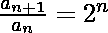
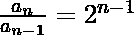
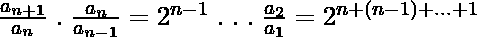
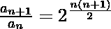
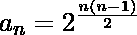

# 求给定递推关系的第 n 项

> 原文:[https://www . geeksforgeeks . org/find-第 n 个给定重复项关系/](https://www.geeksforgeeks.org/find-nth-term-of-a-given-recurrence-relation/)

设 **a <sub>n</sub>** 为一个数列，由递推关系 **a <sub>1</sub> =1** 和**a<sub>n+1</sub>/a<sub>n</sub>= 2<sup>n</sup>**定义。任务是为给定的 **n** 找到**日志 <sub>2</sub> (a <sub>n</sub> )** 的值。
**举例:**

```
Input: 5
Output: 10
Explanation: 
log2(an) = (n * (n - 1)) / 2
= (5*(5-1))/2
= 10

Input: 100
Output: 4950
```





，我们将以上所有相乘，以达到


自起。然后
。
用 n+1 代替 n: 
所以，
以下是上述方法的实施。

## C++

```
// C++ program to find nth term of
// a given recurrence relation

#include <bits/stdc++.h>
using namespace std;

// function to return required value
int sum(int n)
{

    // Get the answer
    int ans = (n * (n - 1)) / 2;

    // Return the answer
    return ans;
}

// Driver program
int main()
{

    // Get the value of n
    int n = 5;

    // function call to print result
    cout << sum(n);

    return 0;
}
```

## Java 语言(一种计算机语言，尤用于创建网站)

```
// Java program to find nth term
// of a given recurrence relation
import java.util.*;

class solution
{
static int sum(int n)
{
    // Get the answer
    int ans = (n * (n - 1)) / 2;

    // Return the answer
    return ans;
}

// Driver code
public static void main(String arr[])
{

    // Get the value of n
    int n = 5;

    // function call to print result
    System.out.println(sum(n));
}
}
//This code is contributed byte
//Surendra_Gangwar
```

## 蟒蛇 3

```
# Python3 program to find nth
# term of a given recurrence
# relation

# function to return
# required value
def sum(n):

    # Get the answer
    ans = (n * (n - 1)) / 2;

    # Return the answer
    return ans

# Driver Code

# Get the value of n
n = 5

# function call to prresult
print(int(sum(n)))

# This code is contributed by Raj
```

## C#

```
// C# program to find nth term
// of a given recurrence relation
using System;

class GFG
{
static int sum(int n)
{
    // Get the answer
    int ans = (n * (n - 1)) / 2;

    // Return the answer
    return ans;
}

// Driver code
public static void Main()
{

    // Get the value of n
    int n = 5;

    // function call to print result
    Console.WriteLine(sum(n));
}
}

// This code is contributed byte
// inder_verma
```

## 服务器端编程语言（Professional Hypertext Preprocessor 的缩写）

```
<?php
// PHP program to find nth term of
// a given recurrence relation

// function to return required value
function sum($n)
{

    // Get the answer
    $ans = ($n * ($n - 1)) / 2;

    // Return the answer
    return $ans;
}

// Driver Code

// Get the value of n
$n = 5;

// function call to print result
echo sum($n);

// This code is contributed by
// inder_verma
?>
```

## java 描述语言

```
<script>
// Javascript program to find nth term of
// a given recurrence relation

// function to return required value
function sum(n)
{

    // Get the answer
    let ans = parseInt((n * (n - 1)) / 2);

    // Return the answer
    return ans;
}

// Driver program

// Get the value of n
let n = 5;

// function call to print result
document.write(sum(n));

// This code is contributed by subham348.
</script>
```

**Output:** 

```
10
```

**时间复杂度:O(1)**