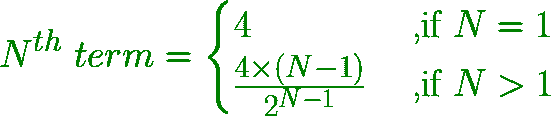

# 求数列 4、2、2、3、6 的第 n 项，…

> 原文:[https://www . geesforgeks . org/find-n 系列术语-4-2-2-3-6/](https://www.geeksforgeeks.org/find-nth-term-of-the-series-4-2-2-3-6/)

给定一个数字 **N** ，任务是找到系列 **4、2、2、3、6、……**
**中的**第 N 个**术语示例:**

```
Input: N = 2
Output: 2

Input: N = 5
Output: 6
```

**进场:**

*   级数的第 n 个数由下式得到
    1.  将前一个数字乘以前一个数字本身的位置。
    2.  将得到的数除以 2。
*   由于系列的起始号码是 4

```
1st term = 4
2nd term = (4 * 1) / 2 = 2
3rd term = (2 * 2) / 2 = 2
4th term = (2 * 3) / 2 = 3
5th term = (3 * 4) / 2 = 6
And, so on....
```

*   一般来说，第 n 个数字由公式获得:



以下是上述方法的实现:

## C++

```
// C++ program to find Nth term
// of the series 4, 2, 2, 3, 6, ...

#include <bits/stdc++.h>
using namespace std;

// Function to find Nth term
int nthTerm(int N)
{
    int nth = 0, first_term = 4;

    int pi = 1, po = 1;
    int n = N;
    while (n > 1) {
        pi *= n - 1;
        n--;
        po *= 2;
    }

    // Nth term
    nth = (first_term * pi) / po;

    return nth;
}

// Driver code
int main()
{
    int N = 5;

    cout << nthTerm(N) << endl;

    return 0;
}
```

## Java 语言(一种计算机语言，尤用于创建网站)

```
// Java program to find Nth term
// of the series 4, 2, 2, 3, 6, ...
class GFG
{

// Function to find Nth term
static int nthTerm(int N)
{
    int nth = 0, first_term = 4;

    int pi = 1, po = 1;
    int n = N;
    while (n > 1)
    {
        pi *= n - 1;
        n--;
        po *= 2;
    }

    // Nth term
    nth = (first_term * pi) / po;

    return nth;
}

// Driver code
public static void main(String[] args)
{
    int N = 5;

    System.out.print(nthTerm(N) +"\n");
}
}

// This code is contributed by Rajput-Ji
```

## 蟒蛇 3

```
# Python3 program to find Nth term
# of the series 4, 2, 2, 3, 6, ...

# Function to find Nth term
def nthTerm(N) :

    nth = 0; first_term = 4;

    pi = 1; po = 1;
    n = N;
    while (n > 1) :
        pi *= n - 1;
        n -= 1;
        po *= 2;

    # Nth term
    nth = (first_term * pi) // po;

    return nth;

# Driver code
if __name__ == "__main__" :
    N = 5;
    print(nthTerm(N)) ;

# This code is contributed by AnkitRai01
```

## C#

```
// C# program to find Nth term
// of the series 4, 2, 2, 3, 6, ...
using System;

class GFG
{

// Function to find Nth term
static int nthTerm(int N)
{
    int nth = 0, first_term = 4;

    int pi = 1, po = 1;
    int n = N;
    while (n > 1)
    {
        pi *= n - 1;
        n--;
        po *= 2;
    }

    // Nth term
    nth = (first_term * pi) / po;

    return nth;
}

// Driver code
public static void Main(String[] args)
{
    int N = 5;

    Console.Write(nthTerm(N) +"\n");
}
}

// This code is contributed by PrinciRaj1992
```

## java 描述语言

```
<script>
    // Javascript program to find Nth term
    // of the series 4, 2, 2, 3, 6, ...

    // Function to find Nth term
    function nthTerm(N)
    {
        let nth = 0, first_term = 4;

        let pi = 1, po = 1;
        let n = N;
        while (n > 1) {
            pi *= n - 1;
            n--;
            po *= 2;
        }

        // Nth term
        nth = (first_term * pi) / po;

        return nth;
    }

      let N = 5;
    document.write(nthTerm(N));

// This code is contributed by divyeshrabadiya07.
</script>
```

**Output:** 

```
6
```