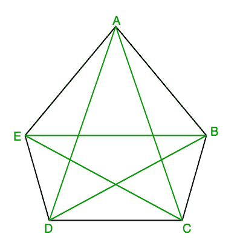

# 求 n 边凸多边形的对角线数

> 原文:[https://www . geesforgeks . org/find-number-对角线-n 边-凸-多边形/](https://www.geeksforgeeks.org/find-number-diagonals-n-sided-convex-polygon/)

给定 n > 3，求 n 边凸多边形的对角线数。
根据[维基百科](https://en.wikipedia.org/wiki/Diagonal)的说法，在几何学中，当多边形或多面体的两个顶点不在同一条边上时，对角线是连接这两个顶点的线段。非正式地说，任何斜线都称为对角线。

**示例:**

```
Input : 5
Output : 5
```

说明:五种可能的对角线为:AC、AD、BD、BE、CE



## 解决方案:

因为对于 n 边凸多边形，从每个顶点，我们可以画出 n-3 条对角线，留下两个相邻的顶点和它自己。按照这种方式，对于 n 个顶点，将有 n*(n-3)条对角线，但是我们将计算每条对角线两次，因此对角线总数变为 n*(n-3)/2
这里是上述公式的代码。

## C++

```
#include <iostream>
using namespace std;

// C++ function to find number of diagonals
// in n sided convex polygon
int numberOfDiagonals(int n)
{
    return n * (n - 3) / 2;
}

// driver code to test above function
int main()
{
    int n = 5;
    cout << n << " sided convex polygon have ";
    cout << numberOfDiagonals(n) << " diagonals";
    return 0;
}
```

## Java 语言(一种计算机语言，尤用于创建网站)

```
// Java function to find number of diagonals
// in n sided convex polygon

public class Diagonals {

    static int numberOfDiagonals(int n)
    {
        return n * (n - 3) / 2;
    }

    // driver code to test above function
    public static void main(String[] args)
    {
        int n = 5;
        System.out.print(n + " sided convex polygon have ");
        System.out.println(numberOfDiagonals(n) + " diagonals");
    }
}

// This code is contributed by Saket Kumar
```

## 蟒蛇 3

```
# Python3 program to find number of diagonals
# in n sided convex polygon
def numberOfDiagonals(n):
    return n * (n - 3) / 2

# driver code to test above function
def main():
    n = 5
    print(n , " sided convex polygon have ")
    print(numberOfDiagonals(n) , " diagonals")

if __name__ == '__main__':
    main()

#this code contributed by 29AjayKumar
```

## C#

```
// C# function to find number of diagonals
// in n sided convex polygon
using System;

class GFG {

    static int numberOfDiagonals(int n)
    {
        return n * (n - 3) / 2;
    }

    // driver code to test above function
    public static void Main()
    {
        int n = 5;
        Console.Write(n + " sided convex polygon have ");

        Console.WriteLine(numberOfDiagonals(n) +
                                  " diagonals");
    }
}

// This code is contributed by Sam007
```

## 服务器端编程语言（Professional Hypertext Preprocessor 的缩写）

```
<?php
// PHP function to find number
// of diagonals in n sided
// convex polygon
function numberOfDiagonals($n)
{
    return $n * ($n - 3) / 2;
}

// Driver Code
$n = 5;
echo $n , " sided convex polygon have ";
echo numberOfDiagonals($n) , 
               " diagonals";

// This code is contributed by aj_36
?>
```

## java 描述语言

```
<script>

// Javascript function to find number of 
// diagonals in n sided convex polygon
function numberOfDiagonals(n)
{
    return n * (n - 3) / 2;
}

// Driver code
var n = 5;
document.write(n + " sided convex polygon have ");
document.write(numberOfDiagonals(n) + " diagonals");

// This code is contributed by Ankita saini

</script>
```

**输出:**

```
5 sided convex polygon have 5 diagonals
```

本文由 [**普拉蒂克·查哈尔**](https://github.com/pratik-chhajer) 供稿。如果你喜欢 GeeksforGeeks 并想投稿，你也可以使用[write.geeksforgeeks.org](http://www.write.geeksforgeeks.org)写一篇文章或者把你的文章邮寄到 review-team@geeksforgeeks.org。看到你的文章出现在极客博客主页上，帮助其他极客。
如果发现有不正确的地方，或者想分享更多关于上述话题的信息，请写评论。