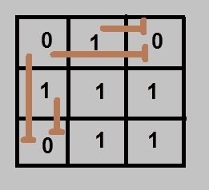
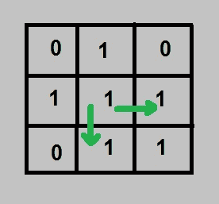

# 求无穷点数

> 原文:[https://www.geeksforgeeks.org/find-number-endless-points/](https://www.geeksforgeeks.org/find-number-endless-points/)

给定一个二进制 N×N 矩阵，我们需要找到有一条无尽路径的矩阵位置的总数。当且仅当位置(I，j)的值为 1，并且其行(I)和列(j)中的所有下一个位置的值都应该为 1 时，任何位置(I，j)都被称为具有无限路径。如果行(I)或列(j)中(I，j)旁边的任何位置都为 0，则位置(I，j)没有任何循环路径。

**示例:**

```
Input :  0 1 0
         1 1 1
         0 1 1
Output : 4
Endless points are (1, 1), (1, 2),
(2, 1) and (2, 2). For all other
points path to some corner is 
blocked at some point.

Input :  0 1 1
         1 1 0
         0 1 0
Output : 1
Endless point is (0, 1).
```

**天真方法:**
我们遍历所有位置，对于每个位置，我们检查这个位置是否有一条无尽的路径。如果是，那么计算它，否则忽略它。但和往常一样，它的时间复杂度似乎很高。
**时间复杂度:** O(n <sup>3</sup>

**advanced Approach(动态规划):**
我们可以很容易地说，如果在任何位置都有一个零，那么它将为它所剩的所有位置以及它上面的位置阻塞路径。



此外，我们可以说，如果(I，j+1)将有一个无限行，并且(I，j)的值为 1，则任何位置(I，j)都将有一个无限行。
同样，我们可以说，如果(i+1，j)将有一个无穷无尽的列，并且(I，j)的值为 1，那么任何位置(I，j)都将有一个无穷无尽的列。



所以我们应该维护两个矩阵，一个用于行，一个用于列。始终从行的最右边位置和列的最底部位置开始，并且只检查下一个位置是否有无限的路径。
最后，如果任何位置在行矩阵和列矩阵中都有一条无止境的路径，那么该位置被称为有一条无止境的路径。

## C++

```
// C++ program to find count of endless points
#include<bits/stdc++.h>
using namespace std;

const int MAX = 100;

// Returns count of endless points
int countEndless(bool input[][MAX], int n)
{
    bool row[n][n], col[n][n];

    // Fills column matrix. For every column, start
    // from every last row and fill every entry as
    // blockage after a 0 is found.
    for (int j=0; j<n; j++)
    {
        // flag which will be zero once we get a '0'
        // and it will be 1 otherwise
        bool isEndless = 1;
        for (int i=n-1; i>=0; i--)
        {
            // encountered a '0', set the isEndless
            // variable to false
            if (input[i][j] == 0)
                isEndless = 0;
            col[i][j] = isEndless;
        }
    }

    // Similarly, fill row matrix
    for (int i=0; i<n; i++)
    {
        bool isEndless = 1;
        for (int j= n-1; j>=0; j--)
        {
            if (input[i][j] == 0)
                isEndless = 0;
            row[i][j] = isEndless;
        }
    }

    // Calculate total count of endless points
    int ans = 0;
    for (int i=0; i<n; i++)
        for (int j=1; j<n; j++)

            // If there is NO blockage in row
            // or column after this point,
            // increment result.
            if (row[i][j] && col[i][j])
                ans++;

    return ans;
}

// Driver code
int main()
{
    bool input[][MAX] = { {1, 0, 1, 1},
                         {0, 1, 1, 1},
                         {1, 1, 1, 1},
                         {0, 1, 1, 0}};
    int n = 4;

    cout << countEndless(input, n);
    return 0;
}
```

## Java 语言(一种计算机语言，尤用于创建网站)

```
// Java program to find count of endless points
class GFG {

    static final int MAX = 100;

    // Returns count of endless points
    static int countEndless(boolean input[][], int n)
    {

        boolean row[][] = new boolean[n][n];
        boolean col[][] = new boolean[n][n];

        // Fills column matrix. For every column,
        // start from every last row and fill every
        // entry as blockage after a 0 is found.
        for (int j = 0; j < n; j++)
        {

            // flag which will be zero once we get
            // a '0' and it will be 1 otherwise
            boolean isEndless = true;
            for (int i = n-1; i >= 0; i--)
            {

                // encountered a '0', set the
                // isEndless variable to false
                if (input[i][j] == false)
                    isEndless = false;

                col[i][j] = isEndless;
            }
        }

        // Similarly, fill row matrix
        for (int i = 0; i < n; i++)
        {
            boolean isEndless = true;
            for (int j = n-1; j >= 0; j--)
            {
                if (input[i][j] == false)
                    isEndless = false;
                row[i][j] = isEndless;
            }
        }

        // Calculate total count of endless points
        int ans = 0;
        for (int i = 0; i < n; i++)
            for (int j = 1; j < n; j++)

                // If there is NO blockage in row
                // or column after this point,
                // increment result.
                if (row[i][j] && col[i][j])
                    ans++;

        return ans;
    }

    //driver code
    public static void main(String arg[])
    {
        boolean input[][] = {
                    {true, false, true, true},
                    {false, true, true, true},
                    {true, true, true, true},
                    {false, true, true, false}};
        int n = 4;

        System.out.print(countEndless(input, n));
    }
}

// This code is contributed by Anant Agarwal.
```

## 蟒蛇 3

```
# Python3 program to find count of
# endless points
import numpy as np

# Returns count of endless points
def countEndless(input_mat, n) :

    row = np.zeros((n, n))
    col = np.zeros((n, n))

    # Fills column matrix. For every column,
    # start from every last row and fill
    # every entry as blockage after a 0 is found.
    for j in range(n) :

        # flag which will be zero once we
        # get a '0' and it will be 1 otherwise
        isEndless = 1

        for i in range(n - 1, -1, -1) :

            # encountered a '0', set the
            # isEndless variable to false
            if (input_mat[i][j] == 0) :
                isEndless = 0

            col[i][j] = isEndless

    # Similarly, fill row matrix
    for i in range(n) :

        isEndless = 1
        for j in range(n - 1, -1, -1) :

            if (input_mat[i][j] == 0) :
                isEndless = 0

            row[i][j] = isEndless

    # Calculate total count of endless points
    ans = 0
    for i in range(n) :
        for j in range(1, n) :

            # If there is NO blockage in row
            # or column after this point,
            # increment result.
            #print(row[i][j] , col[i][j])
            if (row[i][j] and col[i][j]) :
                ans += 1
            #print(ans)

    return ans

# Driver code
if __name__ == "__main__" :

    input_mat = [[1, 0, 1, 1],
                 [0, 1, 1, 1],
                 [1, 1, 1, 1],
                 [0, 1, 1, 0]]
    n = 4

    print(countEndless(input_mat, n))

# This code is contributed by Ryuga
```

## C#

```
// C# program to find count of
// endless points
using System;

public class GFG {

    // Returns count of endless points
    static int countEndless(bool [,]input, int n)
    {

        bool [,]row = new bool[n,n];
        bool [,]col = new bool[n,n];

        // Fills column matrix. For every
        // column, start from every last
        // row and fill every entry as
        // blockage after a 0 is found.
        for (int j = 0; j < n; j++)
        {

            // flag which will be zero
            // once we get a '0' and it
            // will be 1 otherwise
            bool isEndless = true;
            for (int i = n - 1; i >= 0; i--)
            {

                // encountered a '0', set
                // the isEndless variable
                // to false
                if (input[i,j] == false)
                    isEndless = false;

                col[i,j] = isEndless;
            }
        }

        // Similarly, fill row matrix
        for (int i = 0; i < n; i++)
        {
            bool isEndless = true;
            for (int j = n - 1; j >= 0; j--)
            {
                if (input[i,j] == false)
                    isEndless = false;
                row[i,j] = isEndless;
            }
        }

        // Calculate total count of
        // endless points
        int ans = 0;
        for (int i = 0; i < n; i++)
            for (int j = 1; j < n; j++)

                // If there is NO blockage
                // in row or column after
                // this point, increment
                // result.
                if (row[i,j] && col[i,j])
                    ans++;

        return ans;
    }

    //Driver code
    public static void Main()
    {
        bool [,]input = {
                {true, false, true, true},
                {false, true, true, true},
                {true, true, true, true},
                {false, true, true, false}};
        int n = 4;

        Console.Write(countEndless(input, n));
    }
}

// This code is contributed by Sam007.
```

## 服务器端编程语言（Professional Hypertext Preprocessor 的缩写）

```
<?php
// PHP program to find
// count of endless points

// Returns count of
// endless points
function countEndless($input, $n)
{

    // Fills column matrix. For
    // every column, start from
    // every last row and fill
    // every entry as blockage
    // after a 0 is found.
    for ($j = 0; $j < $n; $j++)
    {
        // flag which will be zero
        // once we get a '0' and
        // it will be 1 otherwise
        $isEndless = 1;
        for ($i = $n - 1; $i >= 0; $i--)
        {
            // encountered a '0',
            // set the isEndless
            // variable to false
            if ($input[$i][$j] == 0)
                $isEndless = 0;
            $col[$i][$j] = $isEndless;
        }
    }

    // Similarly, fill row matrix
    for ($i = 0; $i < $n; $i++)
    {
        $isEndless = 1;
        for ($j = $n - 1; $j >= 0; $j--)
        {
            if ($input[$i][$j] == 0)
                $isEndless = 0;
            $row[$i][$j] = $isEndless;
        }
    }

    // Calculate total count
    // of endless points
    $ans = 0;
    for ($i = 0; $i < $n; $i++)
        for ($j = 1; $j < $n; $j++)

            // If there is NO blockage
            // or column after this point,
            // increment result.
            if ($row[$i][$j] &&
                $col[$i][$j])
                $ans++;

    return $ans;
}

// Driver code
$input = array(array(1, 0, 1, 1),
               array(0, 1, 1, 1),
               array(1, 1, 1, 1),
               array(0, 1, 1, 0));
$n = 4;

echo countEndless($input, $n);

// This code is contributed
// by shiv_bhakt.
?>
```

## java 描述语言

```
<script>
    // Javascript program to find count of endless points

    let MAX = 100;

    // Returns count of endless points
    function countEndless(input, n)
    {

        let row = new Array(n);
        for (let i = 0; i < n; i++)
        {
            row[i] = new Array(n);
            for (let j = 0; j < n; j++)
            {
                row[i][j] = false;
            }
        }
        let col = new Array(n);
        for (let i = 0; i < n; i++)
        {
            col[i] = new Array(n);
            for (let j = 0; j < n; j++)
            {
                col[i][j] = false;
            }
        }

        // Fills column matrix. For every column,
        // start from every last row and fill every
        // entry as blockage after a 0 is found.
        for (let j = 0; j < n; j++)
        {

            // flag which will be zero once we get
            // a '0' and it will be 1 otherwise
            let isEndless = true;
            for (let i = n-1; i >= 0; i--)
            {

                // encountered a '0', set the
                // isEndless variable to false
                if (input[i][j] == false)
                    isEndless = false;

                col[i][j] = isEndless;
            }
        }

        // Similarly, fill row matrix
        for (let i = 0; i < n; i++)
        {
            let isEndless = true;
            for (let j = n-1; j >= 0; j--)
            {
                if (input[i][j] == false)
                    isEndless = false;
                row[i][j] = isEndless;
            }
        }

        // Calculate total count of endless points
        let ans = 0;
        for (let i = 0; i < n; i++)
            for (let j = 1; j < n; j++)

                // If there is NO blockage in row
                // or column after this point,
                // increment result.
                if (row[i][j] && col[i][j])
                    ans++;

        return ans;
    }

    let input = [
                  [true, false, true, true],
                  [false, true, true, true],
                  [true, true, true, true],
                  [false, true, true, false]];
    let n = 4;

    document.write(countEndless(input, n));

</script>
```

**输出:**

```
5
```

本文由[**Shivam Pradhan(anuj _ charm)**](https://www.facebook.com/anuj.charm)供稿。如果你喜欢 GeeksforGeeks 并想投稿，你也可以使用[write.geeksforgeeks.org](https://write.geeksforgeeks.org)写一篇文章或者把你的文章邮寄到 review-team@geeksforgeeks.org。看到你的文章出现在极客博客主页上，帮助其他极客。
如果发现有不正确的地方，或者想分享更多关于上述话题的信息，请写评论。