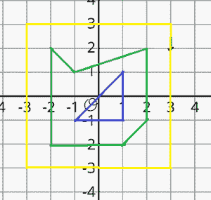

# 找出笛卡尔平面上每个给定多边形内部的多边形数量

> 原文:[https://www . geeksforgeeks . org/find-多边形数量-位于笛卡尔平面上每个给定多边形的内部/](https://www.geeksforgeeks.org/find-number-of-polygons-lying-inside-each-given-polygons-on-cartesian-plane/)

给定 **N 个**不相交的嵌套多边形和一个 [2D 数组](https://www.geeksforgeeks.org/multidimensional-arrays-in-java/)**arr[][]**[对](https://www.geeksforgeeks.org/pair-in-cpp-stl/)，其中数组的每个单元代表多边形顶点的坐标。任务是找出每个多边形内的多边形数。

**示例:**

> **输入:** N = 3，arr[[][]= { {-2，2}，{-1，1}，{2，2}，{2，-1}，{1，-2}，{-2，-2}}，{-1，-1}，{1，-1}，{1，1}}，{{3，3}，{-3，3}，{-3，-3}，{3，-3 } }
> **输出:** 1 0 2
> 
> ****
> 
>  **1.  索引 0 处表示的多边形是上图所示的绿色多边形。
> 2.  索引 1 处表示的多边形是上图中显示的蓝色多边形。
> 3.  索引 2 处表示的多边形是上图所示的黄色多边形。
> 
> 因此，索引 0 处的多边形内部有 1 个多边形，索引 1 处的多边形内部有 0 个多边形，索引 2 处的多边形内部有 2 个多边形。**

****方法:**上述问题可以根据以下观察结果解决:**

1.  **可以观察到，位于外部的多边形将具有最大的 **X 坐标**。多边形的最大 X 坐标将会减小，因为多边形是嵌套且不相交的。**
2.  **因此，按最大 **X 坐标**对多边形进行排序将给出多边形的正确排列顺序。**

**按照以下步骤解决问题:**

*   **初始化一个大小为 **N*2** 的 [2D 阵](https://www.geeksforgeeks.org/multidimensional-arrays-c-cpp/) 说出 **maximumX[][]** ，存储一个多边形的一对最大 **X 坐标**和该多边形的索引值。**
*   **[使用变量迭代数组](https://www.geeksforgeeks.org/iterating-arrays-java/) **arr[][]** ，执行以下步骤:

    *   初始化一个变量，比如 **maxX，**来存储当前多边形的最大 **X 坐标。**
    *   [使用变量 **j** 迭代数组](https://www.geeksforgeeks.org/iterating-arrays-java/)**arr【I】**，在每次迭代中更新 **maxX** 为 **maxX = max(maxX，arr[i][j][0])。**
    *   将配对 **{maxX，i}** 分配给**MaxMx[I]。**** 
*   **[使用](https://www.geeksforgeeks.org/sort-an-array-of-pairs-using-java-pair-and-comparator/)[自定义比较器，按照第一个元素](https://www.geeksforgeeks.org/comparator-interface-java/)对数组进行降序排序。**
*   **初始化一个数组，比如 **res[]，**来存储当前多边形内的多边形数。**
*   **[使用变量 **i** 在范围](https://www.geeksforgeeks.org/range-based-loop-c/)**【0，N-1】**内迭代，并且在每次迭代中将 **N-i-1** 分配给**RES【maximum x[I][1]】、**，因为存在位于 **maximumX[i][1] <sup>第</sup>** 多边形内的 **N-i-1** 多边形。**
*   **最后，完成以上步骤后，打印数组 **res[]** 作为答案。**

**以下是上述方法的实现:**

## **Java 语言(一种计算机语言，尤用于创建网站)**

```
// Java program for above approach
import java.util.*;

class GFG {

    // Function to sort a 2D
    // array using custom a comparator
    public static void sort2d(int[][] arr)
    {
        Arrays.sort(arr, new Comparator<int[]>() {
            public int compare(final int[] a,
                               final int[] b)
            {
                if (a[0] < b[0])
                    return 1;
                else
                    return -1;
            }
        });
    }

    // Function to calculate maximum sum
    static void findAllPolygons(int N,
                                int[][][] arr)
    {
        // Stores the maximum X co-
        // ordinate of every polygon
        int[][] maximumX = new int[N][2];

        // Traverse the array arr[][]
        for (int i = 0; i < N; i++) {

            // Stores the max X co-
            // ordinate of current
            // polygon
            int maxX = Integer.MIN_VALUE;

            // Traverse over the vertices
            // of the current polygon

            for (int j = 0; j < arr[i].length; j++) {
                // Update maxX
                maxX = Math.max(maxX, arr[i][j][0]);
            }

            // Assign maxX to maximumX[i][0]
            maximumX[i][0] = maxX;

            // Assign i to maximumX[i][1]
            maximumX[i][1] = i;
        }

        // Sort the array of pairs
        // maximumX in descending
        // order by first element
        sort2d(maximumX);

        // Stores the count of
        // polygons lying inside
        // a polygon
        int[] res = new int[N];

        // Traverse the maximumX array
        for (int i = 0; i < N; i++) {
            // Update value at
            // maximumX[i][1] in
            // res
            res[maximumX[i][1]] = N - 1 - i;
        }

        // Print the array array res
        for (int i = 0; i < N; i++) {
            System.out.print(res[i] + " ");
        }
    }

    // Driver Code
    public static void main(String[] args)
    {

        int N = 3;
        int[][][] arr = {
            { { -2, 2 }, { -1, 1 }, { 2, 2 }, { 2, -1 }, { 1, -2 }, { -2, -2 } },
            { { -1, -1 }, { 1, -1 }, { 1, 1 } },
            { { 3, 3 }, { -3, 3 }, { -3, -3 }, { 3, -3 } }
        };

        findAllPolygons(N, arr);
    }
}
```

****Output**

```
1 0 2 
```** 

****时间复杂度:** O(M + N log N)，其中 M 为多边形的最大尺寸
T3】辅助空间: O(N)**