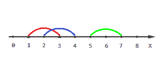

# 找出给定数组中覆盖每个点的线段数

> 原文:[https://www . geesforgeks . org/find-段数-覆盖给定数组中的每个点/](https://www.geeksforgeeks.org/find-number-of-segments-covering-each-point-in-an-given-array/)

给定线段和一些点，为每个点找出覆盖该点的线段数。

> *一个线段 **(l，r)** 覆盖一个点 **x** 当且仅当 **l < = x < = r** 。*

**示例:**

> **输入:**分段= {{0，3}，{1，3}，{3，8}}，
> 点数= {-1，3，8}。
> **输出:** {0，3，1}
> **解释:**
> 
> 
> 
> *   没有线段通过点-1
> *   通过点 3 的所有线段
> *   第三段通过点 8
> 
> **输入:**分段= {{1，3}、{2，4}、{5，7}}、
> 点数= {0，2，5}。
> **输出:** {0，2，1}
> **解释:**
> 
> 
> 
> *   没有线段通过点 0
> *   通过点 2 的第一和第二段
> *   第三段通过点 5

**进场:**

*   我们可以通过使用类似于前缀和的逻辑来做到这一点。
*   让我们用(l，r)来表示一个线段。形成一个对的向量，对于每个片段，在向量中推两个对，值为(l，+1) ans (r + 1，-1)。
*   按升序排列点，但是我们也需要它的位置，所以用它的位置来映射它。
*   按照降序对段向量进行排序，因为我们从后面对其进行迭代。
*   对段进行可变计数，最初为零。
*   然后，我们将迭代该点，并从线段向量中弹出该对，直到它的第一个值小于或等于当前点，并将它的第二个值添加到计数中。
*   最后，将数组中的计数值存储到他各自的位置，并打印该数组。

下面是上述方法的实现。

## C++

```
// C++ program to find the number of
// segments covering each points
#include<bits/stdc++.h>
using namespace std;

// Function to print an array
void PrintArray(int n,int arr[])
{
     for(int i = 0; i < n; i++)
     {
         cout<<arr[i]<<" ";
     }
}

// Function prints number of segments
// covering by each points
void NumberOfSegments(vector<pair<int,int> >segments,
                      vector<int>points, int s, int p)
{
   vector< pair<int, int> >pts, seg;

   // Pushing points and index in
   // vector as a pairs
   for(int i = 0; i < p; i++)
   {
      pts.push_back({points[i], i});;
   }

   for(int i = 0; i < s; i++)
   {
      // (l,+1)
      seg.push_back({segments[i].first, 1});
      // (r+1,-1)
      seg.push_back({segments[i].second+1, -1});
   }

   // Sort the vectors
   sort(seg.begin(), seg.end(),
        greater<pair<int,int>>());
   sort(pts.begin(),pts.end());

   int count = 0;
   int ans[p];

   for(int i = 0; i < p; i++)
   {
        int x = pts[i].first;

        while(!seg.empty() &&
              seg.back().first <= x)
        {
            count+= seg.back().second;
            seg.pop_back();
        }
        ans[pts[i].second] = count;
   }

   // Print the answer
   PrintArray(p, ans);

}

//Driver code
int main()
{
  // Initializing vector of pairs
  vector<pair<int,int>>seg;

  // Push segments
  seg.push_back({0, 3});
  seg.push_back({1, 3});
  seg.push_back({3, 8});

  // Given points
  vector<int>point{-1, 3, 7};

  int s = seg.size();
  int p = point.size();

  NumberOfSegments(seg, point, s, p);

  return 0;
}
```

## Java 语言(一种计算机语言，尤用于创建网站)

```
// Java program to find the number of 
// segments covering each points
import java.util.*;
import java.lang.*;

class GFG{

// Function to print an array
static void PrintArray(int n,int arr[])
{
    for(int i = 0; i < n; i++)
    {
        System.out.print(arr[i] + " ");
    }
}

// Function prints number of segments
// covering by each points
static void NumberOfSegments(ArrayList<int[]> segments,
                         int[] points, int s, int p)
{
    ArrayList<int[]> pts = new ArrayList<>(),
                     seg = new ArrayList<>();

    // Pushing points and index in
    // vector as a pairs
    for(int i = 0; i < p; i++)
    {
        pts.add(new int[]{points[i], i});
    }

    for(int i = 0; i < s; i++)
    {
        // (l,+1)
        seg.add(new int[]{segments.get(i)[0], 1});

        // (r+1,-1)
        seg.add(new int[]{segments.get(i)[1] + 1, -1});
    }

    // Sort the vectors
    Collections.sort(seg, (a, b) -> b[0] - a[0]);
    Collections.sort(pts, (a, b) -> a[0] - b[0]);

    int count = 0;
    int[] ans = new int[p];

    for(int i = 0; i < p; i++)
    {
        int x = pts.get(i)[0];

        while (seg.size() != 0 &&
               seg.get(seg.size() - 1)[0] <= x)
        {
            count += seg.get(seg.size() - 1)[1];
            seg.remove(seg.size() - 1);
        }
        ans[pts.get(i)[1]] = count;
    }

    // Print the answer
    PrintArray(p, ans);
}

// Driver code
public static void main(String[] args)
{

    // Initializing vector of pairs
    ArrayList<int[]>seg = new ArrayList<>();

    // Push segments
    seg.add(new int[]{0, 3});
    seg.add(new int[]{1, 3});
    seg.add(new int[]{3, 8});

    // Given points
    int[] point = {-1, 3, 7};

    int s = seg.size();
    int p = point.length;

    NumberOfSegments(seg, point, s, p);
}
}

// This code is contributed by offbeat
```

## 蟒蛇 3

```
# Python3 program to find the number
# of segments covering each point

# Function to print an array
def PrintArray(n, arr):

    for i in range(n):
        print(arr[i], end = " ")

# Function prints number of segments
# covering by each points
def NumberOfSegments(segments, points, s, p):

    pts = []
    seg = []

    # Pushing points and index in
    # vector as a pairs
    for i in range(p):
        pts.append([points[i], i])

    for i in range(s):

        # (l, +1)
        seg.append([segments[i][0], 1])

        # (r+1, -1)
        seg.append([segments[i][1] + 1, -1])

    # Sort the vectors
    seg.sort(reverse = True)
    pts.sort(reverse = False)

    count = 0
    ans = [0 for i in range(p)]

    for i in range(p):
        x = pts[i][0]

        while(len(seg) != 0 and
          seg[len(seg) - 1][0] <= x):

            count += seg[len(seg) - 1][1]
            seg.remove(seg[len(seg) - 1])

        ans[pts[i][1]] = count

    # Print the answer
    PrintArray(p, ans)

# Driver code
if __name__ == '__main__':

    # Initializing vector of pairs
    seg = []

    # Push segments
    seg.append([ 0, 3 ])
    seg.append([ 1, 3 ])
    seg.append([ 3, 8 ])

    # Given points
    point = [ -1, 3, 7 ]

    s = len(seg)
    p = len(point)

    NumberOfSegments(seg, point, s, p)

# This code is contributed by Bhupendra_Singh
```

**Output:** 

```
0 3 1
```

**时间复杂度:** O(s*log(s) + p*log(p))，**T3【其中 s 为线段数，p 为点数。
**辅助空间:** O(s + p)。**