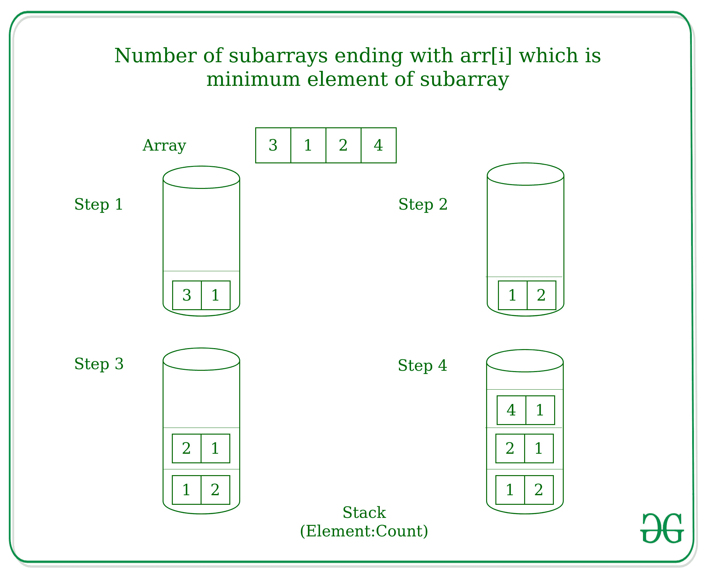

# 找出以 arr[i]结束的子阵列的数量，其中 arr[i]是该子阵列的最小元素

> 原文:[https://www . geeksforgeeks . org/find-子数组数-以-arri-arri-where-arri-是该子数组的最小元素/](https://www.geeksforgeeks.org/find-number-of-subarrays-ending-with-arri-where-arri-is-the-minimum-element-of-that-subarray/)

给定一个大小为 **N** 的数组 **arr[]** ，任务是找出以 **arr[i]** 结束的子数组的数量，并且 **arr[i]** 是该子数组的最小元素。
**举例:**

> **输入:** arr[] = {3，1，2，4}
> **输出:** 1 2 1 1
> **解释:**
> 以 3 结尾的子阵其中 3 是最小元素= {3}
> 以 1 结尾的子阵其中 1 是最小元素= {3，1}，{1}
> 以 2 结尾的子阵其中 2 是最小元素= {2}
> 以 4 结尾的子阵其中 4 是最小元素= { 4 }

****方法:**想法是通过维护[栈](https://www.geeksforgeeks.org/stack-data-structure/)来使用用于找到[下一个更大元素](https://www.geeksforgeeks.org/next-greater-element/)的方法。逐步解决问题的方法是:** 

*   **推入堆栈中计数为 1 的数组的第一个元素(arr[0])，因为第一个元素将是子数组本身，以当前元素 arr[0]和子数组的最小值结束**
*   **那么对于数组中的每个元素 arr[i]

    1.  从堆栈中弹出元素，直到堆栈顶部大于当前元素，并将弹出元素的计数添加到当前元素的计数中。
    2.  将当前元素和计数作为一对推入堆栈。** 

****例如:**为 arr[] = {3，1，2，4}，** 

****

**以下是上述方法的实现:** 

## **C++**

```
// C++ implementation to find the number
// of sub-arrays ending with arr[i] which
// is the minimum element of the subarray

#include <bits/stdc++.h>
using namespace std;

// Function to find the number
// of sub-arrays ending with arr[i] which
// is the minimum element of the subarray
int min_subarray(int a[], int n)
{
    stack<pair<int, int> > st;

    for (int i = 0; i < n; ++i) {

        // There exists a subarray of
        // size 1 for each element
        int count = 1;

        // Remove all greater elements
        while (!st.empty() &&
               st.top().first > a[i]) {

            // Increment the count
            count += st.top().second;

            // Remove the element
            st.pop();
        }

        // Push the current element
        // and it's count
        st.push({ a[i], count });

        cout << count << " ";
    }
}

// Driver Code
int main()
{
    int a[] = {5, 4, 3, 2, 1};
    int n = sizeof(a) / sizeof(a[0]);

    min_subarray(a, n);

    return 0;
}
```

## **Java 语言(一种计算机语言，尤用于创建网站)**

```
// Java implementation to find the number
// of sub-arrays ending with arr[i] which
// is the minimum element of the subarray
import java.util.*;
import java.lang.*;
import java.io.*;

class Main
{
    static class Pair
    {
        int first;
        int second;
        public Pair(int x, int y)
        {
            this.first = x;
            this.second = y;
        }
    }

// Function to find the number
// of sub-arrays ending with arr[i] which
// is the minimum element of the subarray
static void min_subarray(int []a, int n)
{
    Stack<Pair> st = new Stack<Pair>();

    for (int i = 0; i < n; ++i)
    {

        // There exists a subarray of
        // size 1 for each element
        int count = 1;

        // Remove all greater elements
        while (st.empty() == false &&
            st.peek().first > a[i])
        {

            // Increment the count
            count += st.peek().second;

            // Remove the element
            st.pop();
        }

        // Push the current element
        // and it's count
        st.push(new Pair (a[i], count ));

        System.out.print(count + " ");
    }
}

// Driver Code
public static void main(String []args)
{
    int []a = {5, 4, 3, 2, 1};
    int n = a.length;

    min_subarray(a, n);
}
}

// This code is contributed by tufan_gupta2000
```

## **蟒蛇 3**

```
# Python3 implementation to find the number
# of sub-arrays ending with arr[i] which
# is the minimum element of the subarray

# Function to find the number
# of sub-arrays ending with arr[i] which
# is the minimum element of the subarray
def min_subarray(a, n) :

    st = [];

    for i in range(n) :

        # There exists a subarray of
        # size 1 for each element
        count = 1;

        # Remove all greater elements
        while len(st) != 0 and st[-1][0] > a[i] :

            # Increment the count
            count += st[-1][1];

            # Remove the element
            st.pop();

        # Push the current element
        # and it's count
        st.append(( a[i], count ));

        print(count,end= " ");

# Driver Code
if __name__ == "__main__" :

    a = [5, 4, 3, 2, 1];
    n = len(a);

    min_subarray(a, n);

# This code is contributed by AnkitRai01
```

## **C#**

```
// C# implementation to find the number
// of sub-arrays ending with arr[i] which
// is the minimum element of the subarray
using System;
using System.Collections.Generic;

class GFG
{
    class Pair
    {
        public int first;
        public int second;
        public Pair(int x, int y)
        {
            this.first = x;
            this.second = y;
        }
    }

// Function to find the number
// of sub-arrays ending with arr[i] which
// is the minimum element of the subarray
static void min_subarray(int []a, int n)
{
    Stack<Pair> st = new Stack<Pair>();

    for (int i = 0; i < n; ++i)
    {

        // There exists a subarray of
        // size 1 for each element
        int count = 1;

        // Remove all greater elements
        while (st.Count != 0 &&
            st.Peek().first > a[i])
        {

            // Increment the count
            count += st.Peek().second;

            // Remove the element
            st.Pop();
        }

        // Push the current element
        // and it's count
        st.Push(new Pair (a[i], count ));

        Console.Write(count + " ");
    }
}

// Driver Code
public static void Main(String []args)
{
    int []a = {5, 4, 3, 2, 1};
    int n = a.Length;

    min_subarray(a, n);
}
}

// This code is contributed by Rajput-Ji
```

## **java 描述语言**

```
<script>

// Javascript implementation to find the number
// of sub-arrays ending with arr[i] which
// is the minimum element of the subarray

// Function to find the number
// of sub-arrays ending with arr[i] which
// is the minimum element of the subarray
function min_subarray(a, n)
{
    var st = [];

    for (var i = 0; i < n; ++i) {

        // There exists a subarray of
        // size 1 for each element
        var count = 1;

        // Remove all greater elements
        while (st.length!=0 &&
               st[st.length-1][0] > a[i]) {

            // Increment the count
            count += st[st.length-1][1];

            // Remove the element
            st.pop();
        }

        // Push the current element
        // and it's count
        st.push([a[i], count]);

        document.write( count + " ");
    }
}

// Driver Code
var a = [5, 4, 3, 2, 1];
var n = a.length;
min_subarray(a, n);

// This code is contributed by itsok.
</script>
```

****Output:** 

```
1 2 3 4 5
```**