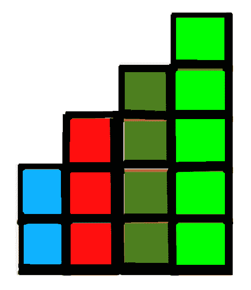
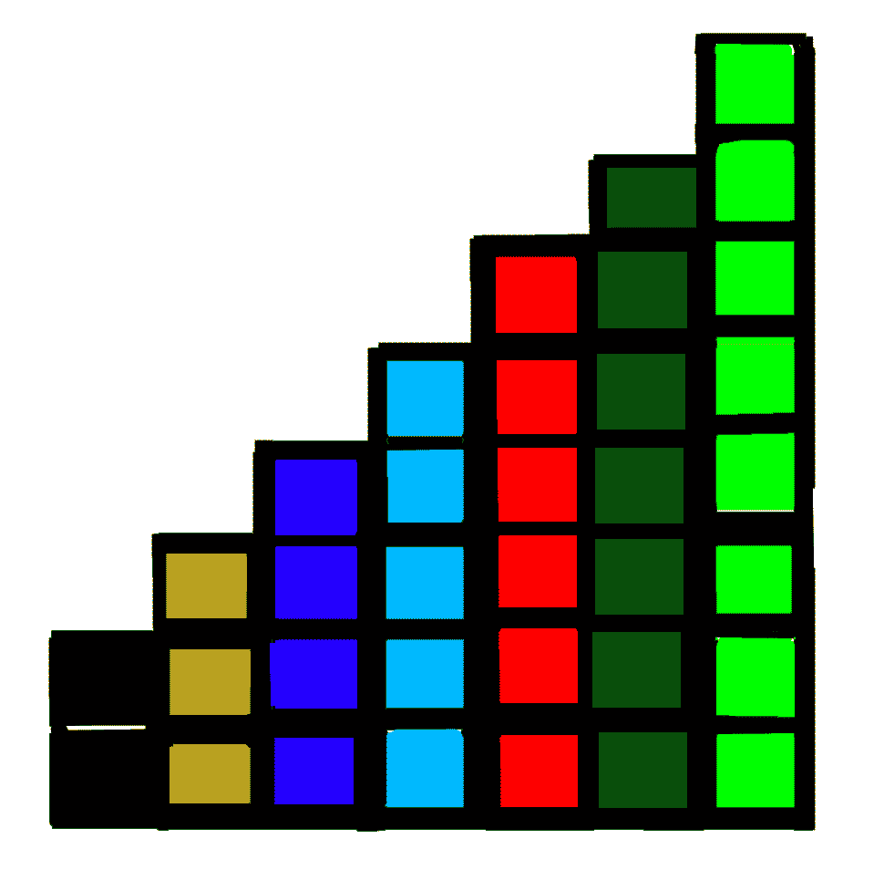

# 求楼梯步数

> 原文:[https://www.geeksforgeeks.org/find-number-stair-steps/](https://www.geeksforgeeks.org/find-number-stair-steps/)

给定砖块总数 T，找出使用给定砖块可以形成的楼梯台阶的数量，这样如果步骤 S 有砖块 B，那么步骤 S+1 应该正好有 B+1 个砖块，并且使用的砖块总数应该小于或等于可用砖块的数量。

**注:**制作楼梯台阶 1 所需的砖块数量为 2，即台阶 S = 1 必须正好有 B = 2 块砖块。

示例:

```
Input  : 15
Output : 4
Bricks should be arranged in this pattern to solve for T = 15:
```



```
Explanation:
Number of bricks at step increases by one.
At Step 1, Number of bricks = 2, Total = 2
At step 2, Number of bricks = 3, Total = 5
At step 3, Number of bricks = 4, Total = 9
At step 4, Number of bricks = 5, Total = 14

If we add 6 more bricks to form new step, 
then the total number of bricks available will surpass. 
Hence, number of steps that can be formed are 4 and
number of bricks used are 14 and we are left with 
1 brick which is useless.

Input  : 40
Output : 7
Bricks should be arranged in this pattern to solve for T = 40:
```



```
Explanation:
At Step 1, Number of bricks = 2, Total = 2
At step 2, Number of bricks = 3, Total = 5
At step 3, Number of bricks = 4, Total = 9
At step 4, Number of bricks = 5, Total = 14
At step 5, Number of bricks = 6, Total = 20
At step 6, Number of bricks = 7, Total = 27
At step 7, Number of bricks = 8, Total = 35

If we add 9 more bricks to form new step,
then the total number of bricks available will surpass.
Hence, number of steps that can be formed are 7 and 
number of bricks used are 35 and we are left with 
5 bricks which are useless.
```

**进场:**
我们对步数很感兴趣，我们知道每一步 Si 用的都正好是 Bi 数的砖块。我们可以将这个问题表示为一个方程:
n * (n + 1) / 2 = T(对于从 1，2，3，4，5 …开始的自然数系列)
n * (n + 1) = 2 * T
n-1 将表示我们的最终解，因为我们的问题系列从 2，3，4，5…开始
现在，我们只需要求解这个方程，为此，我们可以利用二分搜索法来找到这个方程的解。二分搜索法的下限和上限是 1 和 t

下面是上述方法的实现:

## C++

```
// C++ program to find the number of steps
#include <bits/stdc++.h>
using namespace std;

// Modified Binary search function
// to solve the equation
int solve(int low, int high, int T)
{
    while (low <= high) {
        int mid = (low + high) / 2;

        // if mid is solution to equation
        if ((mid * (mid + 1)) == T)
            return mid;

        // if our solution to equation
        // lies between mid and mid-1
        if (mid > 0 && (mid * (mid + 1)) > T &&
                        (mid * (mid - 1)) <= T)
            return mid - 1;

        // if solution to equation is
        // greater than mid
        if ((mid * (mid + 1)) > T)
            high = mid - 1;

        // if solution to equation is less
        // than mid
        else
            low = mid + 1;
    }
    return -1;
}

// driver function
int main()
{
    int T = 15;

    // call binary search method to
    // solve for limits 1 to T
    int ans = solve(1, T, 2 * T);

    // Because our pattern starts from 2, 3, 4, 5...
    // so, we subtract 1 from ans
    if (ans != -1)
        ans--;

    cout << "Number of stair steps = "
         << ans << endl;
    return 0;
}
```

## Java 语言(一种计算机语言，尤用于创建网站)

```
// Java program to find the number of steps
import java.util.*;
import java.lang.*;

public class GfG {

    // Modified Binary search function
    // to solve the equation
    public static int solve(int low, int high, int T)
    {
        while (low <= high) {
            int mid = (low + high) / 2;

            // if mid is solution to equation
            if ((mid * (mid + 1)) == T)
                return mid;

            // if our solution to equation
            // lies between mid and mid-1
            if (mid > 0 && (mid * (mid + 1)) > T &&
                           (mid * (mid - 1)) <= T)
                return mid - 1;

            // if solution to equation is
            // greater than mid
            if ((mid * (mid + 1)) > T)
                high = mid - 1;

            // if solution to equation is less
            // than mid
            else
                low = mid + 1;
        }
        return -1;
    }

    // driver function
    public static void main(String argc[])
    {
        int T = 15;

        // call binary search method to
        // solve for limits 1 to T
        int ans = solve(1, T, 2 * T);

        // Because our pattern starts from 2, 3, 4, 5...
        // so, we subtract 1 from ans
        if (ans != -1)
            ans--;

        System.out.println("Number of stair steps = " + ans);
    }
}

/* This code is Contributed by Sagar Shukla */
```

## 蟒蛇 3

```
# Python3 code to find the number of steps

# Modified Binary search function
# to solve the equation
def solve( low, high, T ):

    while low <= high:
        mid = int((low + high) / 2)

        # if mid is solution to equation
        if (mid * (mid + 1)) == T:
            return mid

        # if our solution to equation
        # lies between mid and mid-1
        if (mid > 0 and (mid * (mid + 1)) > T
                and (mid * (mid - 1)) <= T) :
            return mid - 1

        # if solution to equation is
        # greater than mid
        if (mid * (mid + 1)) > T:
            high = mid - 1;

        # if solution to equation is
        # less than mid
        else:
            low = mid + 1
    return -1

# driver code
T = 15

# call binary search method to
# solve for limits 1 to T
ans = solve(1, T, 2 * T)

# Because our pattern starts from 2, 3, 4, 5...
# so, we subtract 1 from ans
if ans != -1:
    ans-= 1

print("Number of stair steps = ", ans)

# This code is contributed by "Sharad_Bhardwaj".
```

## C#

```
// C# program to find the number of steps
using System;

public class GfG {

    // Modified Binary search function
    // to solve the equation
    public static int solve(int low, int high, int T)
    {
        while (low <= high) {
            int mid = (low + high) / 2;

            // if mid is solution to equation
            if ((mid * (mid + 1)) == T)
                return mid;

            // if our solution to equation
            // lies between mid and mid-1
            if (mid > 0 && (mid * (mid + 1)) > T &&
                           (mid * (mid - 1)) <= T)
                return mid - 1;

            // if solution to equation is
            // greater than mid
            if ((mid * (mid + 1)) > T)
                high = mid - 1;

            // if solution to equation is less
            // than mid
            else
                low = mid + 1;
        }
        return -1;
    }

    // Driver function
    public static void Main()
    {
        int T = 15;

        // call binary search method to
        // solve for limits 1 to T
        int ans = solve(1, T, 2 * T);

        // Because our pattern starts
        //from 2, 3, 4, 5...
        // so, we subtract 1 from ans
        if (ans != -1)
            ans--;
        Console.WriteLine("Number of stair steps = " + ans);
    }
}

/* This code is Contributed by vt_m */
```

## 服务器端编程语言（Professional Hypertext Preprocessor 的缩写）

```
<?php
// PHP program to find the
// number of steps

// Modified Binary search function
// to solve the equation
function solve($low, $high, $T)
{
    while ($low <= $high)
    {
        $mid = ($low + $high) / 2;

        // if mid is solution
        // to equation
        if (($mid * ($mid + 1)) == $T)
            return $mid;

        // if our solution to equation
        // lies between mid and mid-1
        if ($mid > 0 && ($mid * ($mid + 1)) > $T &&
                        ($mid * ($mid - 1)) <= $T )
            return $mid - 1;

        // if solution to equation is
        // greater than mid
        if (($mid * ($mid + 1)) > $T)
            $high = $mid - 1;

        // if solution to
        // equation is less
        // than mid
        else
            $low = $mid + 1;
    }
    return -1;
}

    // Driver Code
    $T = 15;

    // call binary search
    // method to solve
    // for limits 1 to T
    $ans = solve(1, $T, 2 * $T);

    // Because our pattern
    // starts from 2, 3, 4, 5...
    // so, we subtract 1 from ans
    if ($ans != -1)
        $ans--;

    echo "Number of stair steps = ", $ans, "\n";

// This code is contributed by aj_36
?>
```

## java 描述语言

```
<script>

// JavaScript program to find the number of steps

// Modified Binary search function
// to solve the equation
function solve(low, high, T)
{
    while (low <= high)
    {
        let mid = Math.floor((low + high) / 2);

        // If mid is solution to equation
        if ((mid * (mid + 1)) == T)
            return mid;

        // If our solution to equation
        // lies between mid and mid-1
        if (mid > 0 && (mid * (mid + 1)) > T &&
                       (mid * (mid - 1)) <= T)
            return mid - 1;

        // If solution to equation is
        // greater than mid
        if ((mid * (mid + 1)) > T)
            high = mid - 1;

        // If solution to equation is less
        // than mid
        else
            low = mid + 1;
    }
    return -1;
}

// Driver code
let T = 15;

// Call binary search method to
// solve for limits 1 to T
let ans = solve(1, T, 2 * T);

// Because our pattern starts from 2, 3, 4, 5...
// so, we subtract 1 from ans
if (ans != -1)
    ans--;

document.write("Number of stair steps = " + ans);

// This code is contributed by Surbhi Tyagi.

</script>
```

**输出:**

```
Number of stair steps = 4
```

本文由 [**阿布舍克·拉杰普特**](https://auth.geeksforgeeks.org/user/Abhishek%20rajput/articles) 供稿。