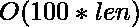

# 求一个数字 X，其位数之和等于 N

> 原文:[https://www . geesforgeks . org/find-number-x-what-sum-digits-equal-n/](https://www.geeksforgeeks.org/find-number-x-whose-sum-digits-equal-n/)

给定一个正数 n。我们需要找到一个数，这样这些数的位数之和等于 n。如果没有这样的数，打印-1。这里 N ![\in [1, 1000000000]  ](img/59e76b168b68a85b6cb9fd0a6282a06c.png "Rendered by QuickLaTeX.com")

**示例:**

```
Input : N = 21
Output : X = 15
Explanation : X + its digit sum 
            = 15 + 1 + 5 
            = 21 

Input  : N = 5
Output : -1

Input : N = 100000001
Output : X = 99999937
         X = 100000000
```

**方法一:(幼稚进场)**
我们这里已经讨论了进场。这种方法可能不适用于像这样大的 N。

**方法二:(高效)**
对于一个数字 X < = 1000000000，位数之和从不超过 100，这是事实。利用这条信息，我们可以在数字的两边迭代 0 到 100 范围内的所有可能性，并检查数字 X 是否等于 N–X 的数字总和。所有可能性都将包含在这个范围内。

## C++

```
// CPP program to find x such that
// X + sumOfDigits(X) = N
#include <cmath>
#include <cstdlib>
#include <iostream>
#include <vector>
using namespace std;

// Computing the sum of digits of x
int sumOfDigits(long int x)
{
    int sum = 0;
    while (x > 0) {
        sum += x % 10;
        x /= 10;
    }
    return sum;
}

// Checks for 100 numbers on both left
// and right side of the given number to
// find such numbers X such that X +
// sumOfDigits(X) = N and updates the answer
// vector accordingly
void compute(vector<long int>& answer, long int n)
{
    // Checking for all possibilities of
    // the answer
    for (int i = 0; i <= 100; i++) {

        // Evaluating the value on the left
        // side of the given number
        long int valueOnLeft = abs(n - i) +
                      sumOfDigits(abs(n - i));

        // Evaluating the value on the right
        // side of the given number
        long int valueOnRight = n + i + sumOfDigits(n + i);

        // Checking the condition of equality
        // on both sides of the given number N
        // and updating the answer vector
        if (valueOnLeft == n)
            answer.push_back(abs(n - i));
        if (valueOnRight == n)
            answer.push_back(n + i);
    }
}

// Driver Function
int main()
{   
    long int N = 100000001;

    vector<long int> answer;
    compute(answer, N);

    // If no solution exists, print -1
    if (answer.size() == 0)
        cout << -1;
    else {

        // If one or more solutions are possible,
        // printing them!
        for (auto it = answer.begin(); it != answer.end(); ++it)
            cout << "X = " << (*it) << endl;
    }
    return 0;
}
```

## Java 语言(一种计算机语言，尤用于创建网站)

```
// Java program to find x such that
// X + sumOfDigits(X) = N
import java.util.*;
import java.lang.*;
import java.io.*;

class GeeksforGeeks {

    // Computing the sum of digits of x
    static int sumOfDigits(long x)
    {
        int sum = 0;
        while (x > 0) {
            sum += (x % 10);
            x /= 10;
        }
        return sum;
    }

    // Checks for 100 numbers on both left
    // and right side of the given number to
    // find such numbers X such that
    // X + sumOfDigits(X) = N and prints solution.
    static void compute(long n)
    {
        long answer[] = new long[100];
        int pos = 0;

        // Checking for all possibilities of the answer
        // in the given range
        for (int i = 0; i <= 100; i++) {

            // Evaluating the value on the left side of the
            // given number
            long valueOnLeft = Math.abs(n - i) +
                               sumOfDigits(Math.abs(n - i));

            // Evaluating the value on the right side of the
            // given number
            long valueOnRight = (n + i) + sumOfDigits(n + i);

            if (valueOnRight == n)
                answer[pos++] = (n + i);
            if (valueOnLeft == n)
                answer[pos++] = Math.abs(n - i);
        }

        if (pos == 0)
            System.out.print(-1);
        else
            for (int i = 0; i < pos; i++)
                System.out.println("X = " + answer[i]);
    }
    // Driver Function
    public static void main(String[] args)
    {
        long N = 100000001;
        compute(N);
    }
}
```

## 蟒蛇 3

```
# Python3 program to find x such that
# X + sumOfDigits(X) = N

# Computing the sum of digits of x
def sumOfDigits(x):

    sum = 0;
    while (x > 0):
        sum += (x % 10);
        x = int(x / 10);
    return sum;

# Checks for 100 numbers on both left
# and right side of the given number
# to find such numbers X such that
# X + sumOfDigits(X) = N and prints
# solution.
def compute(n):

    answer = [];
    pos = 0;

    # Checking for all possibilities
    # of the answer in the given range
    for i in range(101):

        # Evaluating the value on the
        # left side of the given number
        valueOnLeft = (abs(n - i) +
                       sumOfDigits(abs(n - i)));

        # Evaluating the value on the right
        # side of the given number
        valueOnRight = (n + i) + sumOfDigits(n + i);

        if (valueOnRight == n):
            answer.append(n + i);
        if (valueOnLeft == n):
            answer.append(abs(n - i));

    if (len(answer)== 0):
        print(-1);
    else:
        for i in range(len(answer)):
            print("X =", answer[i]);

# Driver Code
N = 100000001;
compute(N);

# This code is contributed
# by mits
```

## C#

```
// C# program to find x such that
// X + sumOfDigits(X) = N

using System;

public class GFG{
    // Computing the sum of digits of x
    static int sumOfDigits(long x)
    {
        int sum = 0;
        while (x > 0) {
            sum += (int)(x % 10);
            x /= 10;
        }
        return sum;
    }

    // Checks for 100 numbers on both left
    // and right side of the given number to
    // find such numbers X such that
    // X + sumOfDigits(X) = N and prints solution.
    static void compute(long n)
    {
        long []answer = new long[100];
        int pos = 0;

        // Checking for all possibilities of the answer
        // in the given range
        for (int i = 0; i <= 100; i++) {

            // Evaluating the value on the left side of the
            // given number
            long valueOnLeft = Math.Abs(n - i) +
                            sumOfDigits(Math.Abs(n - i));

            // Evaluating the value on the right side of the
            // given number
            long valueOnRight = (n + i) + sumOfDigits(n + i);

            if (valueOnRight == n)
                answer[pos++] = (n + i);
            if (valueOnLeft == n)
                answer[pos++] = Math.Abs(n - i);
        }

        if (pos == 0)
            Console.Write(-1);
        else
            for (int i = 0; i < pos; i++)
                Console.WriteLine("X = " + answer[i]);
    }
    // Driver Function

    static public void Main (){
        long N = 100000001;
        compute(N);
    }
}
```

## 服务器端编程语言（Professional Hypertext Preprocessor 的缩写）

```
<?php
// PHP program to find x such that
// X + sumOfDigits(X) = N

// Computing the sum of digits of x
function sumOfDigits($x)
{
    $sum = 0;
    while ($x > 0)
    {
        $sum += ($x % 10);
        $x = (int)$x / 10;
    }
    return $sum;
}

// Checks for 100 numbers on both left
// and right side of the given number
// to find such numbers X such that
// X + sumOfDigits(X) = N and prints
// solution.
function compute($n)
{
    $answer = array(0);
    $pos = 0;

    // Checking for all possibilities
    // of the answer in the given range
    for ($i = 0; $i <= 100; $i++)
    {

        // Evaluating the value on the
        // left side of the given number
        $valueOnLeft = abs($n - $i) +
                        sumOfDigits(abs($n - $i));

        // Evaluating the value on the right
        // side of the given number
        $valueOnRight = ($n + $i) + sumOfDigits($n + $i);

        if ($valueOnRight == $n)
            $answer[$pos++] = ($n + $i);
        if ($valueOnLeft == $n)
            $answer[$pos++] =abs($n - $i);
    }

    if ($pos == 0)
        echo (-1),"\n";
    else
        for ($i = 0; $i < $pos; $i++)
            echo "X = ", $answer[$i], "\n";

}

// Driver Code
$N = 100000001;
compute($N);

// This code is contributed
// by Sach_Code
?>
```

## java 描述语言

```
<script>

// JavaScript program to find x such that
// X + sumOfDigits(X) = N

// Computing the sum of digits of x
function sumOfDigits(x)
{
    let sum = 0;
    while (x > 0)
    {
        sum += (x % 10);
        x = Math.floor(x / 10);
    }
    return sum;
}

// Checks for 100 numbers on both left
// and right side of the given number to
// find such numbers X such that
// X + sumOfDigits(X) = N and prints solution.
function compute(n)
{
    let answer = [];
    let pos = 0;

    // Checking for all possibilities
    // of the answer in the given range
    for(let i = 0; i <= 100; i++)
    {

        // Evaluating the value on the
        // left side of the given number
        let valueOnLeft = Math.abs(n - i) +
              sumOfDigits(Math.abs(n - i));

        // Evaluating the value on the right
        // side of the given number
        let valueOnRight = (n + i) +
                sumOfDigits(n + i);

        // Checking the condition of equality 
        // on both sides of the given number N 
        // and updating the answer vector
        if (valueOnRight == n)
            answer[pos++] = (n + i);
        if (valueOnLeft == n)
            answer[pos++] = Math.abs(n - i);
    }

    if (pos == 0)
        document.write(-1);
    else
        for(let i = 0; i < pos; i++)
            document.write("X = " + answer[i] + "<br/>");
}

// Driver Code
let N = 100000001;

compute(N);

// This code is contributed by susmitakundugoaldanga

</script>
```

**输出:**

```
X = 100000000
X = 99999937
```

这种方法的最大复杂度可以是，其中 len 是数字 max(len) = 9 中的位数。由此可见复杂性几乎可以说是