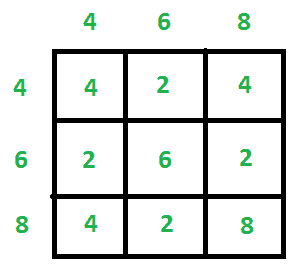

# 从 gcd()中找到每对的原始号码

> 原文:[https://www . geesforgeks . org/find-original-numbers-from-gcd-ever-pair/](https://www.geeksforgeeks.org/find-original-numbers-from-gcd-every-pair/)

给定一个包含另一个数组的每一对可能元素的 GCD 的数组 **arr[]** 。任务是找到用于计算 GCD 数组的原始数字。例如，如果原始数字是 **{4，6，8}** ，那么给定的数组将是{4，2，4，2，6，2，4，2，8}。



**示例:**

> **输入:** arr[] = {5，1，1，12}
> **输出:** 12 5
> gcd(12，12) = 12
> gcd(12，5) = 1
> gcd(5，12) = 1
> gcd(5，5) = 5
> 
> **输入:** arr[] = {1，1，1，1，1，1，1，1，1，1，1，1，1，1，1，1，1，1，1，5，5，7，10，12，2，2}
> **输出:** 12 10 7 5 1

**进场:**

1.  [按降序排列](https://www.geeksforgeeks.org/quick-sort-vs-merge-sort/)数组。
2.  最高元素总是原始数字之一。保留该数字，并将其从数组中移除。
3.  用当前元素从最大值开始计算上一步中获取的元素的 GCD，并丢弃给定数组中的 GCD 值。

下面是上述方法的实现:

## C++

```
// C++ implementation of the approach
#include <bits/stdc++.h>
using namespace std;

// Utility function to print
// the contents of an array
void printArr(int arr[], int n)
{
    for (int i = 0; i < n; i++)
        cout << arr[i] << " ";
}

// Function to find the required numbers
void findNumbers(int arr[], int n)
{

    // Sort array in decreasing order
    sort(arr, arr + n, greater<int>());

    int freq[arr[0] + 1] = { 0 };

    // Count frequency of each element
    for (int i = 0; i < n; i++)
        freq[arr[i]]++;

    // Size of the resultant array
    int size = sqrt(n);
    int brr[size] = { 0 }, x, l = 0;

    for (int i = 0; i < n; i++) {
        if (freq[arr[i]] > 0) {

            // Store the highest element in
            // the resultant array
            brr[l] = arr[i];

            // Decrement the frequency of that element
            freq[brr[l]]--;
            l++;
            for (int j = 0; j < l; j++) {
                if (i != j) {

                    // Compute GCD
                    x = __gcd(arr[i], brr[j]);

                    // Decrement GCD value by 2
                    freq[x] -= 2;
                }
            }
        }
    }

    printArr(brr, size);
}

// Driver code
int main()
{
    int arr[] = { 1, 1, 1, 1, 1, 1, 1, 1, 1, 1, 1, 1, 1, 1,
                  1, 1, 1, 5, 5, 5, 7, 10, 12, 2, 2 };
    int n = sizeof(arr) / sizeof(arr[0]);
    findNumbers(arr, n);

    return 0;
}
```

## Java 语言(一种计算机语言，尤用于创建网站)

```
// Java implementation of the approach
import java.util.Arrays;

class GFG
{

    // Utility function to print
    // the contents of an array
    static void printArr(int arr[], int n)
    {
        for (int i = 0; i < n; i++)
        {
            System.out.print(arr[i] + " ");
        }
    }

    // Function to find the required numbers
    static void findNumbers(int arr[], int n)
    {

        // Sort array in decreasing order
        Arrays.sort(arr);
        reverse(arr);
        int freq[] = new int[arr[0] + 1];

        // Count frequency of each element
        for (int i = 0; i < n; i++)
        {
            freq[arr[i]]++;
        }

        // Size of the resultant array
        int size = (int) Math.sqrt(n);
        int brr[] = new int[size], x, l = 0;

        for (int i = 0; i < n; i++)
        {
            if (freq[arr[i]] > 0 && l < size)
            {

                // Store the highest element in
                // the resultant array
                brr[l] = arr[i];

                // Decrement the frequency of that element
                freq[brr[l]]--;
                l++;
                for (int j = 0; j < l; j++)
                {
                    if (i != j)
                    {

                        // Compute GCD
                        x = __gcd(arr[i], brr[j]);

                        // Decrement GCD value by 2
                        freq[x] -= 2;
                    }
                }
            }
        }

        printArr(brr, size);
    }

    // reverse array
    public static void reverse(int[] input)
    {
        int last = input.length - 1;
        int middle = input.length / 2;
        for (int i = 0; i <= middle; i++)
        {
            int temp = input[i];
            input[i] = input[last - i];
            input[last - i] = temp;
        }
    }

    static int __gcd(int a, int b)
    {
        if (b == 0)
        {
            return a;
        }
        return __gcd(b, a % b);

    }

    // Driver code
    public static void main(String[] args)
    {
        int arr[] = {1, 1, 1, 1, 1, 1, 1, 1, 1, 1, 1, 1, 1, 1,
            1, 1, 1, 5, 5, 5, 7, 10, 12, 2, 2};
        int n = arr.length;
        findNumbers(arr, n);
    }
}

// This code has been contributed by 29AjayKumar
```

## 蟒蛇 3

```
# Python 3 implementation of the approach
from math import sqrt, gcd

# Utility function to print
# the contents of an array
def printArr(arr, n):
    for i in range(n):
        print(arr[i], end = " ")

# Function to find the required numbers
def findNumbers(arr, n):

    # Sort array in decreasing order
    arr.sort(reverse = True)

    freq = [0 for i in range(arr[0] + 1)]

    # Count frequency of each element
    for i in range(n):
        freq[arr[i]] += 1

    # Size of the resultant array
    size = int(sqrt(n))
    brr = [0 for i in range(len(arr))]
    l = 0

    for i in range(n):
        if (freq[arr[i]] > 0):

            # Store the highest element in
            # the resultant array
            brr[l] = arr[i]

            # Decrement the frequency of that element
            freq[brr[l]] -= 1
            l += 1
            for j in range(l):
                if (i != j):

                    # Compute GCD
                    x = gcd(arr[i], brr[j])

                    # Decrement GCD value by 2
                    freq[x] -= 2

    printArr(brr, size)

# Driver code
if __name__ == '__main__':
    arr = [1, 1, 1, 1, 1, 1, 1, 1,
           1, 1, 1, 1, 1, 1, 1, 1,
           1, 5, 5, 5, 7, 10, 12, 2, 2]
    n = len(arr)
    findNumbers(arr, n)

# This code is contributed by
# Surendra_Gangwar
```

## C#

```
// C# implementation for above approach
using System;

class GFG
{

    // Utility function to print
    // the contents of an array
    static void printArr(int []arr, int n)
    {
        for (int i = 0; i < n; i++)
        {
            Console.Write(arr[i] + " ");
        }
    }

    // Function to find the required numbers
    static void findNumbers(int []arr, int n)
    {

        // Sort array in decreasing order
        Array.Sort(arr);
        reverse(arr);
        int []freq = new int[arr[0] + 1];

        // Count frequency of each element
        for (int i = 0; i < n; i++)
        {
            freq[arr[i]]++;
        }

        // Size of the resultant array
        int size = (int) Math.Sqrt(n);
        int []brr = new int[size];int x, l = 0;

        for (int i = 0; i < n; i++)
        {
            if (freq[arr[i]] > 0 && l < size)
            {

                // Store the highest element in
                // the resultant array
                brr[l] = arr[i];

                // Decrement the frequency of that element
                freq[brr[l]]--;
                l++;
                for (int j = 0; j < l; j++)
                {
                    if (i != j)
                    {

                        // Compute GCD
                        x = __gcd(arr[i], brr[j]);

                        // Decrement GCD value by 2
                        freq[x] -= 2;
                    }
                }
            }
        }

        printArr(brr, size);
    }

    // reverse array
    public static void reverse(int []input)
    {
        int last = input.Length - 1;
        int middle = input.Length / 2;
        for (int i = 0; i <= middle; i++)
        {
            int temp = input[i];
            input[i] = input[last - i];
            input[last - i] = temp;
        }
    }

    static int __gcd(int a, int b)
    {
        if (b == 0)
        {
            return a;
        }
        return __gcd(b, a % b);

    }

    // Driver code
    public static void Main(String[] args)
    {
        int []arr = {1, 1, 1, 1, 1, 1, 1, 1, 1, 1, 1, 1, 1, 1,
            1, 1, 1, 5, 5, 5, 7, 10, 12, 2, 2};
        int n = arr.Length;
        findNumbers(arr, n);
    }
}

/* This code contributed by PrinciRaj1992 */
```

## 服务器端编程语言（Professional Hypertext Preprocessor 的缩写）

```
<?php
// PHP implementation of the approach
function gcd($a, $b)
{
    return ($a % $b) ? gcd($b, $a % $b) : $b;
}

// Utility function to print
// the contents of an array
function printArr($arr, $n)
{
    for ($i = 0; $i < $n; $i++)
        echo $arr[$i], " ";
}

// Function to find the required numbers
function findNumbers($arr, $n)
{

    // Sort array in decreasing order
    rsort($arr);

    $freq = array_fill(0, $arr[0] + 1, 0);

    // Count frequency of each element
    for ($i = 0; $i < $n; $i++)
        $freq[$arr[$i]]++;

    // Size of the resultant array
    $size = floor(sqrt($n));
    $brr = array_fill(0, $size, 0);
    $l = 0;

    for ($i = 0; $i < $n; $i++)
    {
        if ($freq[$arr[$i]] > 0)
        {

            // Store the highest element in
            // the resultant array
            $brr[$l] = $arr[$i];

            // Decrement the frequency of that element
            $freq[$brr[$l]]--;
            $l++;
            for ($j = 0; $j < $l; $j++)
            {
                if ($i != $j)
                {

                    // Compute GCD
                    $x = gcd($arr[$i], $brr[$j]);

                    // Decrement GCD value by 2
                    $freq[$x] -= 2;
                }
            }
        }
    }

    printArr($brr, $size);
}

// Driver code
$arr = array(1, 1, 1, 1, 1, 1, 1, 1, 1, 1, 1, 1, 1,  
             1, 1, 1, 1, 5, 5, 5, 7, 10, 12, 2, 2 );
$n = count($arr) ;
findNumbers($arr, $n);

// This code is contributed by Ryuga
?>
```

## java 描述语言

```
<script>

// Javascript implementation for above approach

// Utility function to print
// the contents of an array
function printArr(arr, n)
{
    for(let i = 0; i < n; i++)
    {
        document.write(arr[i] + " ");
    }
}

// Function to find the required numbers
function findNumbers(arr, n)
{

    // Sort array in decreasing order
    arr.sort(function(a, b){return a - b});
    reverse(arr);
    let freq = new Array(arr[0] + 1);
    freq.fill(0);

    // Count frequency of each element
    for(let i = 0; i < n; i++)
    {
        freq[arr[i]]++;
    }

    // Size of the resultant array
    let size = parseInt(Math.sqrt(n), 10);
    let brr = new Array(size);
    brr.fill(0);
    let x, l = 0;

    for(let i = 0; i < n; i++)
    {
        if (freq[arr[i]] > 0 && l < size)
        {

            // Store the highest element in
            // the resultant array
            brr[l] = arr[i];

            // Decrement the frequency of that element
            freq[brr[l]]--;
            l++;

            for(let j = 0; j < l; j++)
            {
                if (i != j)
                {

                    // Compute GCD
                    x = __gcd(arr[i], brr[j]);

                    // Decrement GCD value by 2
                    freq[x] -= 2;
                }
            }
        }
    }

    printArr(brr, size);
}

// Reverse array
function reverse(input)
{
    let last = input.length - 1;
    let middle = parseInt(input.length / 2, 10);
    for(let i = 0; i <= middle; i++)
    {
        let temp = input[i];
        input[i] = input[last - i];
        input[last - i] = temp;
    }
}

function __gcd(a, b)
{
    if (b == 0)
    {
        return a;
    }
    return __gcd(b, a % b);
}

// Driver code
let arr = [ 1, 1, 1, 1, 1, 1, 1, 1,
            1, 1, 1, 1, 1, 1, 1, 1,
            1, 5, 5, 5, 7, 10, 12, 2, 2];
let n = arr.length;
findNumbers(arr, n);

// This code is contributed by divyeshrabadiya07

</script>
```

**Output:** 

```
12 10 7 5 1
```