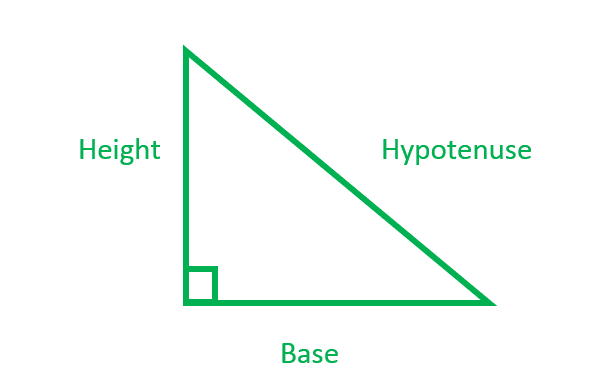

# 求直角三角形的其他两条边和角度

> 原文:[https://www . geeksforgeeks . org/find-other-直角三角形的两边和角度/](https://www.geeksforgeeks.org/find-other-two-sides-and-angles-of-a-right-angle-triangle/)

给定直角三角形的一边，检查是否存在可能与三角形的任何其他两边成直角的三角形。如果可能的话，打印其他两条边的长度和三角形的所有角度。



**例:**

> **输入** : a = 12
> **输出**:边为 a = 12，b = 35，c = 37
> 角为 A = 18.9246，B = 71.0754，C = 90
> **解释** : a = 12，b = 35 和 c = 37 形成直角
> 角三角形因为
> 12*12 + 35*35 = 37*37

**检查三角形是否存在并寻找边的方法** :
要解决这个问题，我们首先观察毕达哥拉斯方程。如果 a 和 b 是直角三角形的边长，c 是斜边的长度，那么边长的平方和等于斜边长度的平方。
这种关系由公式表示:

```
a*a + b*b = c*c
```

**情况 1:** a 是奇数:给定 a，求 b 和 c

```
c2 - b2 = a2
OR
c = (a2 + 1)/2;
b = (a2 - 1)/2;
```

上述解决方案仅适用于 a 为奇数的情况，因为 a2 + 1 只能被 2 整除 a 为奇数.
**情况 2 :** a 为偶数:当 c-b 为 2 时& c+b 为(a2)/2

```
c-b = 2 & c+b = (a2)/2
Hence,
c = (a2)/4 + 1;
b = (a2)/4 - 1;
```

当为偶数时，此方法有效。
**进场找角** :
先找三角形的所有边。然后应用“SSS”规则，这意味着余弦定律:

![\[1.\ cos(a)=\frac{b^2+c^2-a^2}{2bc}\]\ \[2.\ cos(b)=\frac{a^2+c^2-b^2}{2ac}\]\ \[3.\ cos(c)=\frac{a^2+b^2-c^2}{2ab}\] ](img/a1877e111ac1f0a45058fbb9099f2453.png "Rendered by QuickLaTeX.com")

以下是上述方法的实现:

## C++

```
// C++ program to print all sides and angles of right
// angle triangle given one side
#include <bits/stdc++.h>
#include <cmath>
using namespace std;

#define PI 3.1415926535

// Function to find angle A
// Angle in front of side a
double findAnglesA(double a, double b, double c)
{
    // applied cosine rule
    double A = acos((b * b + c * c - a * a) / (2 * b * c));

    // convert into degrees
    return A * 180 / PI;
}

// Function to find angle B
// Angle in front of side b
double findAnglesB(double a, double b, double c)
{
    // applied cosine rule
    double B = acos((a * a + c * c - b * b) / (2 * a * c));

    // convert into degrees and return
    return B * 180 / PI;
}

// Function to print all angles
// of the right angled triangle
void printAngles(int a, int b, int c)
{
    double x = (double)a;
    double y = (double)b;
    double z = (double)c;

    // for calculate angle A
    double A = findAnglesA(x, y, z);

    // for calculate angle B
    double B = findAnglesB(x, y, z);

    cout << "Angles are A = " << A << ", B = " <<
                        B << ", C = " << 90 << endl;
}

// Function to find other two sides of the
// right angled triangle
void printOtherSides(int n)
{  
    int b,c;

    // if n is odd
    if (n & 1)
    {
        // case of n = 1 handled separately
        if (n == 1)
            cout << -1 << endl;
        else
        {
            b = (n*n-1)/2;
            c = (n*n+1)/2;
            cout << "Side b = " << b
                << ", Side c = " << c << endl;
        }
    }
    else
    {
        // case of n = 2 handled separately
        if (n == 2)
            cout << -1 << endl;
        else
        {
            b = n*n/4-1;
            c = n*n/4+1;
            cout << "Side b = " << b
                << ", Side c = " << c << endl;
        }
    }

    // Print angles of the triangle
    printAngles(n,b,c);
}

// Driver Program
int main()
{
    int a = 12;

    printOtherSides(a);

    return 0;
}
```

## Java 语言(一种计算机语言，尤用于创建网站)

```
// Java program to print all sides and angles of right
// angle triangle given one side

import java.io.*;

class GFG {

static double  PI = 3.1415926535;

// Function to find angle A
// Angle in front of side a
static double findAnglesA(double a, double b, double c)
{
    // applied cosine rule
    double A = Math.acos((b * b + c * c - a * a) / (2 * b * c));

    // convert into degrees
    return A * 180 / PI;
}

// Function to find angle B
// Angle in front of side b
static double findAnglesB(double a, double b, double c)
{
    // applied cosine rule
    double B = Math.acos((a * a + c * c - b * b) / (2 * a * c));

    // convert into degrees and return
    return B * 180 / PI;
}

// Function to print all angles
// of the right angled triangle
static void printAngles(int a, int b, int c)
{
    double x = (double)a;
    double y = (double)b;
    double z = (double)c;

    // for calculate angle A
    double A = findAnglesA(x, y, z);

    // for calculate angle B
    double B = findAnglesB(x, y, z);

    System.out.println( "Angles are A = " + A + ", B = " +
                        B + ", C = " + 90);
}

// Function to find other two sides of the
// right angled triangle
static void printOtherSides(int n)
{
    int b=0,c=0;

    // if n is odd
    if ((n & 1)>0)
    {
        // case of n = 1 handled separately
        if (n == 1)
            System.out.println( -1);
        else
        {
            b = (n*n-1)/2;
            c = (n*n+1)/2;
            System.out.println( "Side b = " + b
                + ", Side c = " + c );
        }
    }
    else
    {
        // case of n = 2 handled separately
        if (n == 2)
            System.out.println( -1);
        else
        {
            b = n*n/4-1;
            c = n*n/4+1;
            System.out.println( "Side b = " + b
                + ", Side c = " + c);
        }
    }

    // Print angles of the triangle
    printAngles(n,b,c);
}

// Driver Program

    public static void main (String[] args) {
    int a = 12;

    printOtherSides(a);
    }
}

// This code is contributed
// by inder_verma..
```

## 蟒蛇 3

```
# Python 3 program to print all
# sides and angles of right
# angle triangle given one side
import math

PI = 3.1415926535

# Function to find angle A
# Angle in front of side a
def findAnglesA( a, b, c):

    # applied cosine rule
    A = math.acos((b * b + c * c - a * a) /
                              (2 * b * c))

    # convert into degrees
    return A * 180 / PI

# Function to find angle B
# Angle in front of side b
def findAnglesB(a, b, c):

    # applied cosine rule
    B = math.acos((a * a + c * c - b * b) /
                              (2 * a * c))

    # convert into degrees
    # and return
    return B * 180 / PI

# Function to print all angles
# of the right angled triangle
def printAngles(a, b, c):

    x = a
    y = b
    z = c

    # for calculate angle A
    A = findAnglesA(x, y, z)

    # for calculate angle B
    B = findAnglesB(x, y, z)

    print("Angles are A = ", A,
          ", B = ", B , ", C = ", "90 ")

# Function to find other two sides
# of the right angled triangle
def printOtherSides(n):

    # if n is odd
    if (n & 1) :

        # case of n = 1 handled
        # separately
        if (n == 1):
            print("-1")
        else:

            b = (n * n - 1) // 2
            c = (n * n + 1) // 2
            print("Side b = ", b,
                  " Side c = ", c)

    else:

        # case of n = 2 handled
        # separately
        if (n == 2) :
            print("-1")
        else:
            b = n * n // 4 - 1;
            c = n * n // 4 + 1;
            print("Side b = " , b,
                  ", Side c = " , c)

    # Print angles of the triangle
    printAngles(n, b, c)

# Driver Code
if __name__ == "__main__":
    a = 12

    printOtherSides(a)

# This code is contributed
# by ChitraNayal
```

## C#

```
// C# program to print all sides
// and angles of right angle
// triangle given one side
using System;

class GFG
{
static double PI = 3.1415926535;

// Function to find angle A
// Angle in front of side a
static double findAnglesA(double a,
                          double b, double c)
{
    // applied cosine rule
    double A = Math.Acos((b * b + c *
                          c - a * a) /
                         (2 * b * c));

    // convert into degrees
    return A * 180 / PI;
}

// Function to find angle B
// Angle in front of side b
static double findAnglesB(double a,
                          double b, double c)
{
    // applied cosine rule
    double B = Math.Acos((a * a + c *
                          c - b * b) /
                         (2 * a * c));

    // convert into degrees and return
    return B * 180 / PI;
}

// Function to print all angles
// of the right angled triangle
static void printAngles(int a, int b, int c)
{
    double x = (double)a;
    double y = (double)b;
    double z = (double)c;

    // for calculate angle A
    double A = findAnglesA(x, y, z);

    // for calculate angle B
    double B = findAnglesB(x, y, z);

    Console.WriteLine( "Angles are A = " +
                            A + ", B = " +
                        B + ", C = " + 90);
}

// Function to find other two sides
// of the right angled triangle
static void printOtherSides(int n)
{
    int b = 0, c = 0;

    // if n is odd
    if ((n & 1) > 0)
    {
        // case of n = 1 handled separately
        if (n == 1)
            Console.WriteLine( -1);
        else
        {
            b = (n * n - 1) / 2;
            c = (n * n + 1) / 2;
            Console.WriteLine( "Side b = " + b
                           + ", Side c = " + c);
        }
    }
    else
    {
        // case of n = 2 handled separately
        if (n == 2)
            Console.WriteLine( -1);
        else
        {
            b = n * n / 4 - 1;
            c = n * n / 4 + 1;
            Console.WriteLine( "Side b = " + b +
                             ", Side c = " + c);
        }
    }

    // Print angles of the triangle
    printAngles(n, b, c);
}

// Driver Code
public static void Main ()
{
    int a = 12;

    printOtherSides(a);
}
}

// This code is contributed
// by inder_verma
```

## 服务器端编程语言（Professional Hypertext Preprocessor 的缩写）

```
<?php
// PHP program to print all sides
// and angles of right angle triangle
// given one side
$PI = 3.1415926535;

// Function to find angle A
// Angle in front of side a
function findAnglesA($a, $b, $c)
{
    global $PI;

    // applied cosine rule
    $A = acos(($b * $b + $c *
               $c - $a * $a) / (2 * $b * $c));

    // convert into degrees
    return $A * 180 / $PI;
}

// Function to find angle B
// Angle in front of side b
function findAnglesB($a, $b, $c)
{
    global $PI;
    // applied cosine rule
    $B = acos(($a * $a + $c *
               $c - $b * $b) / (2 * $a * $c));

    // convert into degrees and return
    return $B * 180 / $PI;
}

// Function to print all angles
// of the right angled triangle
function printAngles($a, $b, $c)
{
    $x = (double)$a;
    $y = (double)$b;
    $z = (double)$c;

    // for calculate angle A
    $A = findAnglesA($x, $y, $z);

    // for calculate angle B
    $B = findAnglesB($x, $y, $z);

    echo "Angles are A = " . $A .
         ", B = " . $B . ", C = 90\n";
}

// Function to find other two sides
// of the right angled triangle
function printOtherSides($n)
{

    // if n is odd
    if ($n & 1)
    {
        // case of n = 1 handled separately
        if ($n == 1)
            echo "-1\n";
        else
        {
            $b = ($n * $n - 1) / 2;
            $c = ($n * $n + 1) / 2;
            echo "Side b = " . $b .
                 ", Side c = " . $c . "\n";
        }
    }
    else
    {
        // case of n = 2 handled separately
        if ($n == 2)
            echo "-1\n";
        else
        {
            $b = $n * $n / 4 - 1;
            $c = $n * $n / 4 + 1;
            echo "Side b = " . $b .
                 ", Side c = " . $c . "\n";
        }
    }

    // Print angles of the triangle
    printAngles($n, $b, $c);
}

// Driver Code
$a = 12;

printOtherSides($a);

// This code is contributed by mits
?>
```

## java 描述语言

```
<script>

// Javascript program to print all sides and angles of right
// angle triangle given one side

 let  PI = 3.1415926535;

// Function to find angle A
// Angle in front of side a
function findAnglesA(a, b, c)
{
    // applied cosine rule
    let A = Math.acos((b * b + c * c - a * a) / (2 * b * c));

    // convert into degrees
    return A * 180 / PI;
}

// Function to find angle B
// Angle in front of side b
function findAnglesB(a, b, c)
{
    // applied cosine rule
    let B = Math.acos((a * a + c * c - b * b) / (2 * a * c));

    // convert into degrees and return
    return B * 180 / PI;
}

// Function to print all angles
// of the right angled triangle
function printAngles(a, b, c)
{
    let x = a;
    let y = b;
    let z = c;

    // for calculate angle A
    let A = findAnglesA(x, y, z);

    // for calculate angle B
    let B = findAnglesB(x, y, z);

    document.write( "Angles are A = " + A + ", B = " +
                        B + ", C = " + 90);
}

// Function to find other two sides of the
// right angled triangle
function printOtherSides(n)
{
    let b=0,c=0;

    // if n is odd
    if ((n & 1)>0)
    {
        // case of n = 1 handled separately
        if (n == 1)
            document.write( -1);
        else
        {
            b = (n*n-1)/2;
            c = (n*n+1)/2;
            document.write( "Side b = " + b
                + ", Side c = " + c );
        }
    }
    else
    {
        // case of n = 2 handled separately
        if (n == 2)
            document.write( -1);
        else
        {
            b = n*n/4-1;
            c = n*n/4+1;
            document.write( "Side b = " + b
                + ", Side c = " + c + "<br/>");
        }
    }

    // Print angles of the triangle
    printAngles(n,b,c);
}

// Driver Code

    let a = 12;

    printOtherSides(a);

</script>
```

**Output:** 

```
Side b = 35, Side c = 37
Angles are A = 18.9246, B = 71.0754, C = 90
```