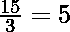
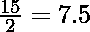
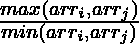

# 在一个数组中寻找比值最大的对

> 原文:[https://www . geesforgeks . org/find-pair-with-max-ratio in a-a-array/](https://www.geeksforgeeks.org/find-pair-with-maximum-ratio-in-an-array/)

给定一个数组 **arr[]** ，任务是找到数组中的最大比值对。
**例:**

> **输入:** arr[] = { 15，10，3 }
> **输出:** 5
> **解释:**
> 最大比值对将为–
> **输入:** arr[] = { 15，10，3，2 }
> **输出:** 7.5
> **解释:**
> 最大比值对将为–

**方法:**想法是使用两个嵌套的[循环](https://www.geeksforgeeks.org/loops-in-c-and-cpp/)迭代数组的每一个可能的对，并找到可能的最大比率对。对于任何一对，使用
可以获得最大比值。下面是上述方法的实现:

## C++

```
// C++ implementation to find
// the maximum pair in the array

#include <bits/stdc++.h>

using namespace std;

// Function to find the maximum pair
// possible for the array
float computeMaxValue(float arr[], int n)
{
    float ans = 0;

    // Loop to iterate over every
    // possible pair in the array
    for (int i = 0; i < n - 1; i++) {
        for (int j = i + 1; j < n; j++) {

            // Check pair (x, y) as well as
            // (y, x) for maximum value
            float val = max(arr[i] / arr[j],
                            arr[j] / arr[i]);

            // Update the answer
            ans = max(ans, val);
        }
    }
    return ans;
}

// Driver Code
int main()
{
    float arr[] = { 15, 10, 3, 2 };
    int n = sizeof(arr) / sizeof(arr[0]);
    cout << computeMaxValue(arr, n);
    return 0;
}
```

## Java 语言(一种计算机语言，尤用于创建网站)

```
// Java implementation to find
// the maximum pair in the array
import java.io.*;
import java.util.*;

class GFG {

// Function to find the maximum pair
// possible for the array
static float computeMaxValue(float arr[], int n)
{
    float ans = 0;

    // Loop to iterate over every
    // possible pair in the array
    for(int i = 0; i < n - 1; i++)
    {
       for(int j = i + 1; j < n; j++)
       {

          // Check pair (x, y) as well as
          // (y, x) for maximum value
          float val = Math.max(arr[i] / arr[j],
                               arr[j] / arr[i]);

          // Update the answer
          ans = Math.max(ans, val);
       }
    }

    return ans;
}

// Driver code
public static void main(String[] args)
{
    float arr[] = { 15, 10, 3, 2 };
    int N = arr.length;

    System.out.println(computeMaxValue(arr, N));
}
}

// This code is contributed by coder001
```

## 蟒蛇 3

```
# Python3 implementation to find
# the maximum pair in the array

# Function to find the maximum pair
# possible for the array
def computeMaxValue(arr, n):

    ans = 0

    # Loop to iterate over every
    # possible pair in the array
    for i in range(n - 1):
        for j in range(i + 1, n):

            # Check pair (x, y) as well as
            # (y, x) for maximum value
            val = max(arr[i] / arr[j],
                      arr[j] / arr[i])

            # Update the answer
            ans = max(ans, val)

    return ans

# Driver Code
if __name__ == "__main__":

    arr = [ 15, 10, 3, 2 ]
    n = len(arr)

    print(computeMaxValue(arr, n))

# This code is contributed by chitranayal
```

## C#

```
// C# implementation to find
// the maximum pair in the array
using System;

class GFG {

// Function to find the maximum pair
// possible for the array
static float computeMaxValue(float []arr, int n)
{
    float ans = 0;

    // Loop to iterate over every
    // possible pair in the array
    for(int i = 0; i < n - 1; i++)
    {
       for(int j = i + 1; j < n; j++)
       {

          // Check pair (x, y) as well as
          // (y, x) for maximum value
          float val = Math.Max(arr[i] / arr[j],
                               arr[j] / arr[i]);

          // Update the answer
          ans = Math.Max(ans, val);
       }
    }
    return ans;
}

// Driver code
public static void Main(String[] args)
{
    float []arr = { 15, 10, 3, 2 };
    int N = arr.Length;

    Console.WriteLine(computeMaxValue(arr, N));
}
}

// This code is contributed by 29AjayKumar
```

## java 描述语言

```
<script>

// Javascript implementation to find
// the maximum pair in the array

// Function to find the maximum pair
// possible for the array
function computeMaxValue(arr, n)
{
    var ans = 0;

    // Loop to iterate over every
    // possible pair in the array
    for (var i = 0; i < n - 1; i++) {
        for (var j = i + 1; j < n; j++) {

            // Check pair (x, y) as well as
            // (y, x) for maximum value
            var val = Math.max(arr[i] / arr[j],
                            arr[j] / arr[i]);

            // Update the answer
            ans = Math.max(ans, val);
        }
    }
    return ans;
}

// Driver Code
var arr = [ 15, 10, 3, 2 ];
var n = arr.length;
document.write( computeMaxValue(arr, n));

</script>
```

**Output:** 

```
7.5
```

***时间复杂度:** O(N <sup>2</sup> )*

***辅助空间:** O(1)*