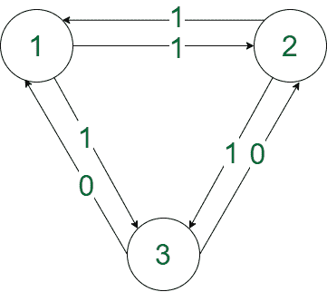

# 在一个完整的二元加权图中找到给定长度 K 的回文路径

> 原文:[https://www . geesforgeks . org/find-回文-给定长度的路径-完整二进制加权图中的 k/](https://www.geeksforgeeks.org/find-palindromic-path-of-given-length-k-in-a-complete-binary-weighted-graph/)

给定一个具有 **N** 顶点的[完全有向图](https://www.geeksforgeeks.org/graph-types-and-applications/)，其边重为‘1’或‘0’，任务是找到一条长度正好为 **K** 的路径，这是一个[回文](https://www.geeksforgeeks.org/number-of-palindromic-paths-in-a-matrix/)。如有可能先打印“**是**”再打印路径，否则打印“**否**”。

**示例:**

> **输入** : N = 3，K = 4
> 边[]= {{1，2}，' 1'}，{ { 1，3}，' 1'}，{{2，1}，' 1'}，{{2，3}，' 1'}，{{3，1}，' 0'}，{{3，2}，' 0 ' }
> **输出** :
> 是
> 2 1 2 1 2
> T9】解释【T10
> 
> 
> 
> 遵循的路径是回文“1111”。
> 
> **输入** : N = 2，K = 6
> 边[] = { { 1，2 }，' 1' }，{ { 2，1 }，' 0 ' }
> T4】输出:否

**逼近**:以上问题可以通过考虑不同的情况，构造各自的答案来解决。按照以下步骤解决问题:

1.  如果 **K 为奇数:**
    *   如果 K 是奇数，在任何情况下都存在一条回文路径。
    *   它可以通过选择任意两个节点并循环 K 次来构造，例如，对于 K = 5:“00000”、“11111”、“10101”、“01010”。
2.  如果 **K 为偶数:**
    *   现在的问题可以分为两种情况:
        *   如果存在两个节点 **(i，j)** ，使得边 **i- > j** 的权重等于边 **j- > i.** 的权重，则可以通过循环它们直到达到路径长度 K 来构造答案。
        *   否则，如果存在三个不同的节点 **(i，j，k)** ，使得边缘 **i- > j** 的权重等于边缘 **j- > k** 的权重。然后这三个节点可以放在路径的中心，就像…I->j->**I->j->k**->j->k…，创建一个偶数长度的回文。
3.  根据以上观察打印答案。

下面是上述方法的实现:

## C++

```
// C++ implementation for the above approach

#include <bits/stdc++.h>
using namespace std;

// Function to print the left path
void printLeftPath(int i, int j, int K)
{
    if (K & 1) {
        // j->i->j->i->j->k->j->k->j
        for (int p = 0; p < K; p++) {
            if (p & 1) {
                cout << i << " ";
            }
            else {
                cout << j << " ";
            }
        }
    }
    else {
        // i->j->i->j->k->j->k
        for (int p = 0; p < K; p++) {
            if (p & 1) {
                cout << j << " ";
            }
            else {
                cout << i << " ";
            }
        }
    }
}

// Function to print the right path
void printRightPath(int j, int k, int K)
{
    if (K & 1) {
        // j->i->j->i->j->k->j->k->j
        for (int p = 0; p < K; p++) {
            if (p & 1) {
                cout << k << " ";
            }
            else {
                cout << j << " ";
            }
        }
    }
    else {
        // i->j->i->j->k->j->k
        for (int p = 0; p < K; p++) {
            if (p & 1) {
                cout << k << " ";
            }
            else {
                cout << j << " ";
            }
        }
    }
}

// Function to check that
// if there exists a palindromic path
// in a binary graph
void constructPalindromicPath(
    vector<pair<pair<int, int>, char> > edges,
    int n, int K)
{
    // Create adjacency matrix
    vector<vector<char> > adj(
        n + 1,
        vector<char>(n + 1));
    for (int i = 0; i < edges.size(); i++) {
        adj[edges[i]
                .first.first][edges[i]
                                  .first.second]
            = edges[i].second;
    }

    // If K is odd then
    // print the path directly by
    // choosing node 1 and 2 repeatedly
    if (K & 1) {
        cout << "YES" << endl;
        for (int i = 1; i <= K + 1; i++) {
            cout << (i & 1) + 1 << " ";
        }
        return;
    }

    // If K is even
    // Try to find an edge such that weight of
    // edge i->j and j->i is equal
    bool found = 0;
    int idx1, idx2;
    for (int i = 1; i <= n; i++) {
        for (int j = 1; j <= n; j++) {
            if (i == j) {
                continue;
            }
            if (adj[i][j] == adj[j][i]) {
                // Same weight edges are found
                found = 1;

                // Store their indexes
                idx1 = i, idx2 = j;
            }
        }
    }
    if (found) {
        // Print the path
        cout << "YES" << endl;
        for (int i = 1; i <= K + 1; i++) {
            if (i & 1) {
                cout << idx1 << " ";
            }
            else {
                cout << idx2 << " ";
            }
        }
        return;
    }

    // If nodes i, j having equal weight
    // on edges i->j and j->i can not
    // be found then try to find
    // three nodes i, j, k such that
    // weights of edges i->j
    // and j->k are equal
    else {

        // To store edges with weight '0'
        vector<int> mp1[n + 1];

        // To store edges with weight '1'
        vector<int> mp2[n + 1];

        for (int i = 1; i <= n; i++) {
            for (int j = 1; j <= n; j++) {
                if (i == j) {
                    continue;
                }
                if (adj[i][j] == '0') {
                    mp1[i].push_back(j);
                }
                else {
                    mp2[i].push_back(j);
                }
            }
        }

        // Try to find edges i->j and
        // j->k having weight 0
        for (int i = 1; i <= n; i++) {
            for (int j = 1; j <= n; j++) {
                if (j == i) {
                    continue;
                }
                if (adj[i][j] == '0') {
                    if (mp1[j].size()) {
                        int k = mp1[j][0];
                        if (k == i || k == j) {
                            continue;
                        }
                        cout << "YES" << endl;
                        K -= 2;
                        K /= 2;

                        // Print left Path
                        printLeftPath(i, j, K);

                        // Print centre
                        cout << i << " "
                             << j << " " << k
                             << " ";

                        // Print right path
                        printRightPath(j, k, K);
                        return;
                    }
                }
            }
        }

        // Try to find edges i->j
        // and j->k which having
        // weight 1
        for (int i = 1; i <= n; i++) {
            for (int j = 1; j <= n; j++) {
                if (j == i) {
                    continue;
                }
                if (adj[i][j] == '1') {
                    if (mp1[j].size()) {
                        int k = mp1[j][0];
                        // cout<<k;
                        if (k == i || k == j) {
                            continue;
                        }
                        cout << "YES" << endl;
                        K -= 2;
                        K /= 2;
                        printLeftPath(i, j, K);
                        cout << i << " "
                             << j << " " << k
                             << " ";
                        printRightPath(j, k, K);
                        return;
                    }
                }
            }
        }
    }
    cout << "NO";
}

// Driver Code
int main()
{
    int N = 3, K = 4;
    vector<pair<pair<int, int>, char> > edges
        = { { { 1, 2 }, '1' },
            { { 1, 3 }, '1' },
            { { 2, 1 }, '1' },
            { { 2, 3 }, '1' },
            { { 3, 1 }, '0' },
            { { 3, 2 }, '0' } };

    constructPalindromicPath(edges, N, K);
}
```

## 蟒蛇 3

```
# Python implementation for the above approach

# Function to print the left path
def printLeftPath(i, j, K):
    if (K & 1):
        # j->i->j->i->j->k->j->k->j
        for p in range(0, K):
            if (p & 1):
                print(i, end=" ")
            else:
                print(j, end=" ")

    else:
        # i->j->i->j->k->j->k
        for p in range(K):
            if (p & 1):
                print(j, end=" ")
            else:
                print(i, end=" ")

# Function to print the right path
def printRightPath(j, k, K):
    if (K & 1):
        # j->i->j->i->j->k->j->k->j
        for p in range(K):
            if (p & 1):
                print(K, end=" ")
            else:
                print(j, end=" ")
    else:
        # i->j->i->j->k->j->k
        for p in range(K):
            if (p & 1):
                print(K, end=" ")
            else:
                print(j, end=" ")

# Function to check that
# if there exists a palindromic path
# in a binary graph
def constructPalindromicPath(edges, n, K):
    # Create adjacency matrix
    adj = [[0 for i in range(n + 1)] for i in range(n + 1)]

    for i in range(len(edges)):
        adj[edges[i][0][0]][edges[i][0][1]] = edges[i][1]

    # If K is odd then
    # print the path directly by
    # choosing node 1 and 2 repeatedly
    if (K & 1):
        print("YES")
        for i in range(1, K + 2):
            print((i & 1) + 1, end=" ")
        return

    # If K is even
    # Try to find an edge such that weight of
    # edge i->j and j->i is equal
    found = 0
    idx1 = None
    idx2 = None

    for i in range(1, n + 1):
        for j in range(1, n + 1):
            if (i == j):
                continue

            if (adj[i][j] == adj[j][i]):
                # Same weight edges are found
                found = 1

                # Store their indexes
                idx1 = i
                idx2 = j

    if (found):
        # Print the path
        print("YES")
        for i in range(1, K + 2):
            if (i & 1):
                print(idx1, end=" ")
            else:
                print(idx2, end=" ")
        return

    # If nodes i, j having equal weight
    # on edges i->j and j->i can not
    # be found then try to find
    # three nodes i, j, k such that
    # weights of edges i->j
    # and j->k are equal
    else:

        # To store edges with weight '0'
        mp1 = [[] for i in range*(n + 1)]

        # To store edges with weight '1'
        mp2 = [[] for i in range(n + 1)]

        for i in range(1, n + 1):
            for j in range(1, n + 1):
                if (i == j):
                    continue

                if (adj[i][j] == '0'):
                    mp1[i].push(j)
                else:
                    mp2[i].push(j)

        # Try to find edges i->j and
        # j->k having weight 0
        for i in range(1, n + 1):
            for j in range(1, n + 1):
                if (j == i):
                    continue

                if (adj[i][j] == '0'):
                    if (len(mp1[j])):
                        k = mp1[j][0]
                        if (k == i or k == j):
                            continue

                        print("YES")
                        K -= 2
                        K = k // 2

                        # Print left Path
                        printLeftPath(i, j, K)

                        # Print centre
                        print(f"{i} {j} {k}")

                        # Print right path
                        printRightPath(j, k, K)
                        return

        # Try to find edges i->j
        # and j->k which having
        # weight 1
        for i in range(1, n + 1):
            for j in range(1, n + 1):
                if (j == i):
                    continue

                if (adj[i][j] == '1'):
                    if (len(mp1[j])):
                        k = mp1[j][0]
                        # cout<<k;
                        if (k == i or k == j):
                            continue

                        print("YES")
                        K -= 2
                        K = k // 2
                        printLeftPath(i, j, K)
                        print(f"{i} {j} {k}")
                        printRightPath(j, k, K)
                        return

    print("NO")

# Driver Code
N = 3
K = 4
edges = [[[1, 2], '1'],
         [[1, 3], '1'],
         [[2, 1], '1'],
         [[2, 3], '1'],
         [[3, 1], '0'],
         [[3, 2], '0']]

constructPalindromicPath(edges, N, K)

# This code is contributed by gfgking.
```

## java 描述语言

```
<script>
    // JavaScript implementation for the above approach

    // Function to print the left path
    const printLeftPath = (i, j, K) => {
        if (K & 1) {
            // j->i->j->i->j->k->j->k->j
            for (let p = 0; p < K; p++) {
                if (p & 1) {
                    document.write(`${i} `);
                }
                else {
                    document.write(`${j} `);
                }
            }
        }
        else {
            // i->j->i->j->k->j->k
            for (let p = 0; p < K; p++) {
                if (p & 1) {
                    document.write(`${j} `);
                }
                else {
                    document.write(`${i} `);
                }
            }
        }
    }

    // Function to print the right path
    const printRightPath = (j, k, K) => {
        if (K & 1) {
            // j->i->j->i->j->k->j->k->j
            for (let p = 0; p < K; p++) {
                if (p & 1) {
                    document.write(`${K} `);
                }
                else {
                    document.write(`${j} `);
                }
            }
        }
        else {
            // i->j->i->j->k->j->k
            for (let p = 0; p < K; p++) {
                if (p & 1) {
                    document.write(`${K} `);
                }
                else {
                    document.write(`${j} `);
                }
            }
        }
    }

    // Function to check that
    // if there exists a palindromic path
    // in a binary graph
    const constructPalindromicPath = (edges, n, K) => {
        // Create adjacency matrix
        let adj = new Array(n + 1).fill(0).map(() => new Array(n + 1).fill(0));
        for (let i = 0; i < edges.length; i++) {
            adj[edges[i][0][0]][edges[i][0][1]] = edges[i][1];
        }

        // If K is odd then
        // print the path directly by
        // choosing node 1 and 2 repeatedly
        if (K & 1) {
            document.write(`YES<br/>`);
            for (let i = 1; i <= K + 1; i++) {
                document.write(`${(i & 1) + 1} `);
            }
            return;
        }

        // If K is even
        // Try to find an edge such that weight of
        // edge i->j and j->i is equal
        let found = 0;
        let idx1, idx2;
        for (let i = 1; i <= n; i++) {
            for (let j = 1; j <= n; j++) {
                if (i == j) {
                    continue;
                }
                if (adj[i][j] == adj[j][i]) {
                    // Same weight edges are found
                    found = 1;

                    // Store their indexes
                    idx1 = i;
                    idx2 = j;
                }
            }
        }
        if (found) {
            // Print the path
            document.write(`YES<br/>`)
            for (let i = 1; i <= K + 1; i++) {
                if (i & 1) {
                    document.write(`${idx1} `);
                }
                else {
                    document.write(`${idx2} `);
                }
            }
            return;
        }

        // If nodes i, j having equal weight
        // on edges i->j and j->i can not
        // be found then try to find
        // three nodes i, j, k such that
        // weights of edges i->j
        // and j->k are equal
        else {

            // To store edges with weight '0'
            let mp1 = new Array(n + 1).fill([]);

            // To store edges with weight '1'
            let mp2 = new Array(n + 1).fill([]);

            for (let i = 1; i <= n; i++) {
                for (let j = 1; j <= n; j++) {
                    if (i == j) {
                        continue;
                    }
                    if (adj[i][j] == '0') {
                        mp1[i].push(j);
                    }
                    else {
                        mp2[i].push(j);
                    }
                }
            }

            // Try to find edges i->j and
            // j->k having weight 0
            for (let i = 1; i <= n; i++) {
                for (let j = 1; j <= n; j++) {
                    if (j == i) {
                        continue;
                    }
                    if (adj[i][j] == '0') {
                        if (mp1[j].size()) {
                            let k = mp1[j][0];
                            if (k == i || k == j) {
                                continue;
                            }
                            document.write(`YES<br/>`);
                            K -= 2;
                            K = parseInt(k / 2);

                            // Print left Path
                            printLeftPath(i, j, K);

                            // Print centre
                            document.write(`${i} ${j} ${k} `);

                            // Print right path
                            printRightPath(j, k, K);
                            return;
                        }
                    }
                }
            }

            // Try to find edges i->j
            // and j->k which having
            // weight 1
            for (let i = 1; i <= n; i++) {
                for (let j = 1; j <= n; j++) {
                    if (j == i) {
                        continue;
                    }
                    if (adj[i][j] == '1') {
                        if (mp1[j].length) {
                            let k = mp1[j][0];
                            // cout<<k;
                            if (k == i || k == j) {
                                continue;
                            }
                            document.write(`YES<br/>`);
                            K -= 2;
                            K = parseInt(k / 2);
                            printLeftPath(i, j, K);
                            document.write(`${i} ${j} ${k} `);
                            printRightPath(j, k, K);
                            return;
                        }
                    }
                }
            }
        }
        document.write("NO");
    }

    // Driver Code
    let N = 3, K = 4;
    let edges = [[[1, 2], '1'],
    [[1, 3], '1'],
    [[2, 1], '1'],
    [[2, 3], '1'],
    [[3, 1], '0'],
    [[3, 2], '0']];

    constructPalindromicPath(edges, N, K);

// This code is contributed by rakeshsahni.
</script>
```

**Output**

```
YES
2 1 2 1 2 
```

**时间复杂度:**O(N * N)
T3】辅助空间: O(N*N)