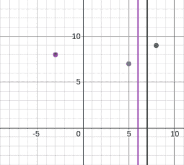

# 找到分割线，使左右两边的值之和相等

> 原文:[https://www . geesforgeks . org/find-partition-line-so-左右值之和等于/](https://www.geeksforgeeks.org/find-partition-line-such-that-sum-of-values-on-left-and-right-is-equal/)

考虑笛卡尔坐标平面上的 **n** 点。让点 **(X <sub>i</sub> ，Y <sub>i</sub> )** 被赋予一个值 **V <sub>i</sub>** 。平行于 **y 轴**的线，如果其左侧点值之和等于其右侧点值之和，则称为好分割线。**注意**如果一个点位于分割线上，则该点不在分割线的两侧。任务是打印**是**如果有好的分割线，则打印**否**。
**例:**

> **输入:** X[] = {-3，5，8}，Y[] = {8，7，9}，V[] = {8，2，10}
> **输出:**是
> 
> 
> 
> x = c，其中 5 < c < 8 is a good partition 
> 线作为两侧值之和为 10。
> **输入:** X[] = {-2，5，8，9}，Y[] = {7，7，9，8}，V[] = {6，2，1，8 }
> T5】输出:是

**进场:**

1.  计算每个 x 坐标的值。这意味着，如果有多个点具有相同的 x 坐标，那么它们将被视为一个点，并且它们的值将被相加。
2.  从最小 X 坐标开始，在**X<sub>I</sub>T3 检查是否满足以下条件之一:**
    *   直到**I–1**的值之和等于从 **i + 1** 到 **n** 的值之和。
    *   直到 **i** 的值之和等于从 **i + 1** 到 **n** 的值之和。
    *   直到**I–1**的值之和等于从 **i** 到 **n** 的值之和。
3.  如果任何给定点满足上述任何条件，则该线存在。

以下是上述方法的实现:

## C++

```
// C++ implementation of the approach
#include <bits/stdc++.h>
using namespace std;

const int MAX = 1000;

// Function that returns true if
// the required line exists
bool lineExists(int x[], int y[],
                int v[], int n)
{

    // To handle negative values from x[]
    int size = (2 * MAX) + 1;
    long arr[size] = { 0 };

    // Update arr[] such that arr[i] contains
    // the sum of all v[j] such that x[j] = i
    // for all valid values of j
    for (int i = 0; i < n; i++) {
        arr[x[i] + MAX] += v[i];
    }

    // Update arr[i] such that arr[i] contains
    // the sum of the subarray arr[0...i]
    // from the original array
    for (int i = 1; i < size; i++)
        arr[i] += arr[i - 1];

    // If all the points add to 0 then
    // the line can be drawn anywhere
    if (arr[size - 1] == 0)
        return true;

    // If the line is drawn touching the
    // leftmost possible points
    if (arr[size - 1] - arr[0] == 0)
        return true;

    for (int i = 1; i < size - 1; i++) {

        // If the line is drawn just before
        // the current point
        if (arr[i - 1] == arr[size - 1] - arr[i - 1])
            return true;

        // If the line is drawn touching
        // the current point
        if (arr[i - 1] == arr[size - 1] - arr[i])
            return true;

        // If the line is drawn just after
        // the current point
        if (arr[i] == arr[size - 1] - arr[i])
            return true;
    }

    // If the line is drawn touching the
    // rightmost possible points
    if (arr[size - 2] == 0)
        return true;

    return false;
}

// Driver code
int main()
{
    int x[] = { -3, 5, 8 };
    int y[] = { 8, 7, 9 };
    int v[] = { 8, 2, 10 };
    int n = sizeof(x) / sizeof(int);

    if (lineExists(x, y, v, n))
        cout << "Yes";
    else
        cout << "No";

    return 0;
}
```

## Java 语言(一种计算机语言，尤用于创建网站)

```
// Java implementation of the approach
class GFG
{
static int MAX = 1000;

// Function that returns true if
// the required line exists
static boolean lineExists(int x[], int y[],
                          int v[], int n)
{

    // To handle negative values from x[]
    int size = (2 * MAX) + 1;
    long []arr = new long[size];

    // Update arr[] such that arr[i] contains
    // the sum of all v[j] such that x[j] = i
    // for all valid values of j
    for (int i = 0; i < n; i++)
    {
        arr[x[i] + MAX] += v[i];
    }

    // Update arr[i] such that arr[i] contains
    // the sum of the subarray arr[0...i]
    // from the original array
    for (int i = 1; i < size; i++)
        arr[i] += arr[i - 1];

    // If all the points add to 0 then
    // the line can be drawn anywhere
    if (arr[size - 1] == 0)
        return true;

    // If the line is drawn touching the
    // leftmost possible points
    if (arr[size - 1] - arr[0] == 0)
        return true;

    for (int i = 1; i < size - 1; i++)
    {

        // If the line is drawn just before
        // the current point
        if (arr[i - 1] == arr[size - 1] - arr[i - 1])
            return true;

        // If the line is drawn touching
        // the current point
        if (arr[i - 1] == arr[size - 1] - arr[i])
            return true;

        // If the line is drawn just after
        // the current point
        if (arr[i] == arr[size - 1] - arr[i])
            return true;
    }

    // If the line is drawn touching the
    // rightmost possible points
    if (arr[size - 2] == 0)
        return true;

    return false;
}

// Driver code
public static void main(String []args)
{
    int x[] = { -3, 5, 8 };
    int y[] = { 8, 7, 9 };
    int v[] = { 8, 2, 10 };
    int n = x.length;

    if (lineExists(x, y, v, n))
        System.out.printf("Yes");
    else
        System.out.printf("No");
}
}

// This code is contributed by 29AjayKumar
```

## 蟒蛇 3

```
# Python3 implementation of the approach
MAX = 1000;

# Function that returns true if
# the required line exists
def lineExists(x, y, v, n) :

    # To handle negative values from x[]
    size = (2 * MAX) + 1;
    arr = [0] * size ;

    # Update arr[] such that arr[i] contains
    # the sum of all v[j] such that x[j] = i
    # for all valid values of j
    for i in range(n) :
        arr[x[i] + MAX] += v[i];

    # Update arr[i] such that arr[i] contains
    # the sum of the subarray arr[0...i]
    # from the original array
    for i in range(1, size) :
        arr[i] += arr[i - 1];

    # If all the points add to 0 then
    # the line can be drawn anywhere
    if (arr[size - 1] == 0) :
        return True;

    # If the line is drawn touching the
    # leftmost possible points
    if (arr[size - 1] - arr[0] == 0) :
        return True;

    for i in range(1, size - 1) :

        # If the line is drawn just before
        # the current point
        if (arr[i - 1] == arr[size - 1] - arr[i - 1]) :
            return True;

        # If the line is drawn touching
        # the current point
        if (arr[i - 1] == arr[size - 1] - arr[i]) :
            return True;

        # If the line is drawn just after
        # the current point
        if (arr[i] == arr[size - 1] - arr[i]) :
            return True;

    # If the line is drawn touching the
    # rightmost possible points
    if (arr[size - 2] == 0) :
        return True;

    return False;

# Driver code
if __name__ == "__main__" :

    x = [ -3, 5, 8 ];
    y = [ 8, 7, 9 ];
    v = [ 8, 2, 10 ];
    n = len(x);

    if (lineExists(x, y, v, n)) :
        print("Yes");
    else :
        print("No");

# This code is contributed by AnkitRai01
```

## C#

```
// C# implementation of the approach
using System;

class GFG
{
static int MAX = 1000;

// Function that returns true if
// the required line exists
static Boolean lineExists(int []x, int []y,
                          int []v, int n)
{

    // To handle negative values from x[]
    int size = (2 * MAX) + 1;
    long []arr = new long[size];

    // Update arr[] such that arr[i] contains
    // the sum of all v[j] such that x[j] = i
    // for all valid values of j
    for (int i = 0; i < n; i++)
    {
        arr[x[i] + MAX] += v[i];
    }

    // Update arr[i] such that arr[i] contains
    // the sum of the subarray arr[0...i]
    // from the original array
    for (int i = 1; i < size; i++)
        arr[i] += arr[i - 1];

    // If all the points add to 0 then
    // the line can be drawn anywhere
    if (arr[size - 1] == 0)
        return true;

    // If the line is drawn touching the
    // leftmost possible points
    if (arr[size - 1] - arr[0] == 0)
        return true;

    for (int i = 1; i < size - 1; i++)
    {

        // If the line is drawn just before
        // the current point
        if (arr[i - 1] == arr[size - 1] - arr[i - 1])
            return true;

        // If the line is drawn touching
        // the current point
        if (arr[i - 1] == arr[size - 1] - arr[i])
            return true;

        // If the line is drawn just after
        // the current point
        if (arr[i] == arr[size - 1] - arr[i])
            return true;
    }

    // If the line is drawn touching the
    // rightmost possible points
    if (arr[size - 2] == 0)
        return true;

    return false;
}

// Driver code
public static void Main(String []args)
{
    int []x = { -3, 5, 8 };
    int []y = { 8, 7, 9 };
    int []v = { 8, 2, 10 };
    int n = x.Length;

    if (lineExists(x, y, v, n))
        Console.WriteLine("Yes");
    else
        Console.WriteLine("No");
}
}

// This code is contributed by Rajput-Ji
```

## java 描述语言

```
<script>
// Javascript implementation of the approach
const MAX = 1000;

// Function that returns true if
// the required line exists
function lineExists(x, y, v, n)
{

    // To handle negative values from x[]
    let size = (2 * MAX) + 1;
    let arr = new Array(size).fill(0);

    // Update arr[] such that arr[i] contains
    // the sum of all v[j] such that x[j] = i
    // for all valid values of j
    for (let i = 0; i < n; i++) {
        arr[x[i] + MAX] += v[i];
    }

    // Update arr[i] such that arr[i] contains
    // the sum of the subarray arr[0...i]
    // from the original array
    for (let i = 1; i < size; i++)
        arr[i] += arr[i - 1];

    // If all the points add to 0 then
    // the line can be drawn anywhere
    if (arr[size - 1] == 0)
        return true;

    // If the line is drawn touching the
    // leftmost possible points
    if (arr[size - 1] - arr[0] == 0)
        return true;

    for (let i = 1; i < size - 1; i++) {

        // If the line is drawn just before
        // the current point
        if (arr[i - 1] == arr[size - 1] - arr[i - 1])
            return true;

        // If the line is drawn touching
        // the current point
        if (arr[i - 1] == arr[size - 1] - arr[i])
            return true;

        // If the line is drawn just after
        // the current point
        if (arr[i] == arr[size - 1] - arr[i])
            return true;
    }

    // If the line is drawn touching the
    // rightmost possible points
    if (arr[size - 2] == 0)
        return true;

    return false;
}

// Driver code
let x = [-3, 5, 8];
let y = [8, 7, 9]
let v = [8, 2, 10];
let n = x.length;

if (lineExists(x, y, v, n))
    document.write("Yes");
else
    document.write("No");

// This code is contributed by _saurabh_jaiswal
</script>
```

**Output:** 

```
Yes
```