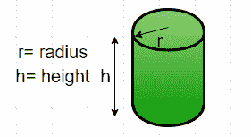
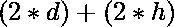

# 找到圆柱体的周长

> 原文:[https://www.geeksforgeeks.org/find-perimeter-cylinder/](https://www.geeksforgeeks.org/find-perimeter-cylinder/)

给定直径和高度，求圆柱体的周长。
周长是二维形状轮廓的长度。圆柱体是三维形状。所以，从技术上讲，我们不能找到圆柱体的周长，但是我们可以找到圆柱体横截面的周长。这可以通过在它的底部创建投影来完成，因此，在它的侧面创建投影，然后形状将被简化为矩形。



**公式:**
圆柱体周长(P ) = 
这里 d 为圆柱体直径
h 为圆柱体高度
例:

```
Input : diameter = 5, height = 10 
Output : Perimeter = 30

Input : diameter = 50, height = 150 
Output : Perimeter = 400
```

## C++

```
// CPP program to find 
// perimeter of cylinder
#include <iostream>
using namespace std;

// Function to calculate perimeter
int perimeter(int diameter, int height)
{
    return 2 * (diameter + height);
}

// Driver function
int main()
{
    int diameter = 5;
    int height = 10;

    cout << "Perimeter = "; 
    cout<< perimeter(diameter, height);
    cout<<" units\n";

    return 0;
}
```

## Java 语言(一种计算机语言，尤用于创建网站)

```
// Java program to find 
// perimeter of cylinder
import java.io.*;

class GFG {

    // Function to calculate perimeter
    static int perimeter(int diameter, int height)
    {
        return 2 * (diameter + height);
    }

    /* Driver program to test above function */
    public static void main(String[] args)
    {
        int diameter = 5;
        int height = 10;
        System.out.println("Perimeter = " +
                         perimeter(diameter, height) 
                                       + " units\n");
    }
}

// This code is contributed by Gitanjali.
```

## 计算机编程语言

```
# Function to calculate 
# the perimeter of a cylinder
def perimeter( diameter, height ) :
    return 2 * ( diameter + height ) 

# Driver function
diameter = 5 ;
height = 10 ;
print ("Perimeter = ",
            perimeter(diameter, height))
```

## C#

```
// C# program to find perimeter of cylinder
using System;

class GFG {

    // Function to calculate perimeter
    static int perimeter(int diameter, int height)
    {
        return 2 * (diameter + height);
    }

    /* Driver program to test above function */
    public static void Main(String[] args)
    {
        int diameter = 5;
        int height = 10;
        Console.Write("Perimeter = " +
                       perimeter(diameter, height) 
                                    + " units\n");
    }
}

// This code is contributed by parashar...
```

## 服务器端编程语言（Professional Hypertext Preprocessor 的缩写）

```
<?php
// PHP program to find 
// perimeter of cylinder

// Function to calculate perimeter
function perimeter($diameter, $height)
{
    return 2 * ($diameter + $height);
}

    // Driver Code
    $diameter = 5;
    $height = 10;

    echo("Perimeter = "); 
    echo(perimeter($diameter, $height));
    echo(" units");

// This code is contributed by vt_m.
?>
```

## java 描述语言

```
<script>

// javascript program to find 
// perimeter of cylinder

// Function to calculate perimeter
    function perimeter(diameter, height)
    {
        return 2 * (diameter + height);
    }

// Driver Function

         let diameter = 5;
        let height = 10;
        document.write("Perimeter = " +
                         perimeter(diameter, height) 
                                       + " units\n");

    // This code is contributed by susmitakundugoaldanga.
</script>
```

输出:

```
Perimeter = 30 units
```