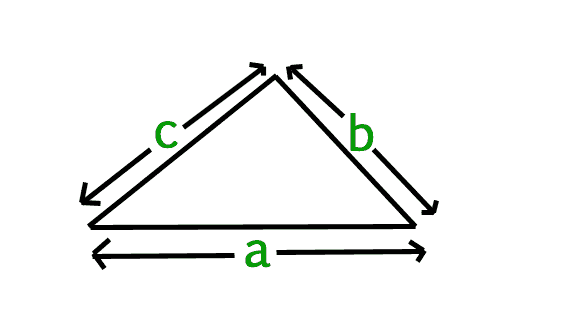
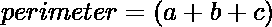

# 求三角形的周长

> 原文:[https://www.geeksforgeeks.org/find-perimeter-triangle/](https://www.geeksforgeeks.org/find-perimeter-triangle/)

给定三角形的边(a，b，c)，我们必须找到三角形的周长。

**周长:**
三角形的周长是三角形边长的总和。



其中 a，b，c 是三角形边长。
三角形的周长可以简单地用以下公式计算:


示例:

```
Input : a = 2.0, b = 3.0, c = 5.0
Output : 10.0

Input : a = 5.0, b = 6.0, c = 7.0 
Output : 18.0
```

## C++

```
// A simple C++ program to find the perimeter
// of triangle
#include <iostream>
using namespace std;

// Function to find perimeter
float findPerimeter(float a, float b, float c)
{

    // Formula for finding a perimeter
    // of triangle
    return (a + b + c);
}

// Driver Code
int main() 
{
    float a = 2.0, b = 3.0, c = 5.0;
    cout << findPerimeter(a, b, c);  
    return 0;
}

// This code is contributed by Ankita saini
```

## C

```
// A simple C program to find the perimeter
// of triangle
#include <stdio.h>

// Function to find perimeter
float findPerimeter(float a, float b, float c)
{
    // Formula for finding a perimeter of triangle
    return (a + b + c);
}

// Driver Code
int main()
{
    float a = 2.0, b = 3.0, c = 5.0;
    printf("%f", findPerimeter(a, b, c));  
    return 0;
}
```

## Java 语言(一种计算机语言，尤用于创建网站)

```
// Java program to find perimeter
// of triangle
class Test {
    static float findPerimeter(float a, float b, float c)
    {
        // Formula for Perimeter of triangle
        return (a + b + c);
    }

    // Driver method
    public static void main(String[] args)
    {
        float a = 2.0, b = 3.0, c = 5.0;
        System.out.println(findPerimeter(a, b, c));
    }
}
```

## 计算机编程语言

```
# Python Program to find a perimeter
# of triangle

# Function to find perimeter
def findPerimeter(a, b, c):

    # Calculate the perimeter
    return (a + b + c)

# Driver Code    
a = 2.0
b = 3.0
c = 5.0
print(findPerimeter(a, b, c))
```

## C#

```
// C# program to find perimeter
// of triangle
using System;

class Test {

    static float findPerimeter(float a, 
                           float b, float c)
    {

        // Formula for Perimeter of triangle
        return (a + b + c);
    }

    // Driver method
    public static void Main()
    {
        float a = 2.0f, b = 3.0f, c = 5.0f;

        Console.WriteLine(findPerimeter(a, b, c));
    }
}

//This code is contributed by vt_m. 
```

## 服务器端编程语言（Professional Hypertext Preprocessor 的缩写）

```
<?php
// A simple PHP program 
// to find the perimeter
// of triangle

// Function to find perimeter
function findPerimeter($a, $b, $c)
{

    // Formula for finding a 
    // perimeter of triangle
    return ($a + $b + $c);
}

    // Driver Code
    $a = 2.0; 
    $b = 3.0;
    $c = 5.0;
    echo findPerimeter($a, $b, $c);

// This code is contributed by anuj_67.
?>
```

## java 描述语言

```
<script>

// JavaScript program to find perimeter
// of triangle
function findPerimeter(a, b, c)
{

    // Formula for Perimeter of triangle
    return (a + b + c);
}

// Driver Code
let a = 2.0, b = 3.0, c = 5.0;

document.write(findPerimeter(a, b, c));

// This code is contributed by code_hunt

</script>
```

输出:

```
10.0
```